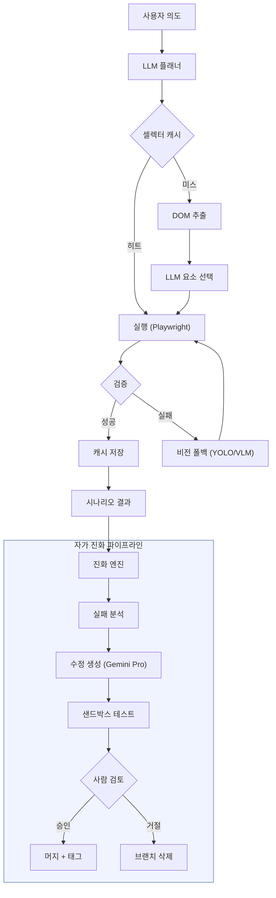
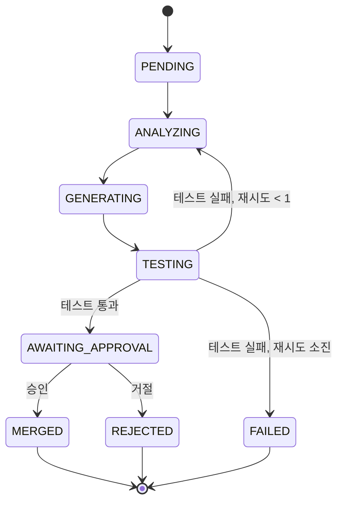

# Web-Agentic — 자가 진화형 적응형 웹 자동화 엔진

> **[English Version](./README.md)**

**LLM이 의사결정의 주체**인 적응형 웹 자동화 엔진입니다. LLM이 사용자 의도를 분석하고, 실행 계획을 수립하며, DOM 요소를 선택합니다. 성공한 셀렉터는 캐시되어 반복 실행 시 비용이 발생하지 않습니다. 자동화가 실패하면 **자가 진화 엔진**이 실패 패턴을 자동으로 분석하고, 코드 수정을 생성한 후, 사람의 승인을 거쳐 머지합니다.

### 핵심 차별점

- **LLM-First**: LLM이 의도 분석, 실행 계획, 요소 선택의 주체입니다. 규칙은 캐시 역할을 하며, 의사결정의 주 경로가 아닙니다.
- **자가 진화**: 자동화 실패 시 시스템이 자동으로 실패 패턴을 분석하고, Gemini Pro를 통해 코드 수정을 생성하며, Git 샌드박스에서 테스트한 후, 사람의 승인을 대기합니다.
- **스마트 캐싱**: 첫 실행은 LLM을 사용(~$0.02/태스크)하고, 반복 실행은 캐시를 히트(~$0.005/태스크)합니다.
- **비전 폴백**: LLM 신뢰도가 0.7 미만이면 YOLO/VLM 시각적 그라운딩이 작동합니다.
- **스텔스 & 휴먼 시뮬레이션**: 봇 탐지 방어 JS 패치 (3단계), 베지어 곡선 마우스 이동, 자연스러운 타이핑 딜레이, 스마트 네비게이션으로 봇 감지를 우회합니다.
- **적응형 재시도**: FallbackRouter 기반 지수 백오프와 에스컬레이션 체인(재시도 → LLM → 비전 → Human Handoff) 및 연속 실패 시 자동 재계획을 지원합니다.
- **인간 참여형**: CAPTCHA, 인증, 진화 승인은 반드시 사람의 개입이 필요합니다.

---

## 시스템 개요



---

## 빠른 시작

### 사전 요구사항

- Python 3.11+
- Node.js 18+ (진화 UI용)
- Google Gemini API 키

### 설치 및 실행

```bash
# 클론
git clone https://github.com/jedikim/web-agentic.git
cd web-agentic

# 백엔드 설치 (모든 선택적 의존성 포함)
pip install -e ".[dev,server,vision,learning]"
python -m playwright install chromium

# API 키 설정
export GEMINI_API_KEY="your-key"

# API 서버 시작
python scripts/start_server.py  # localhost:8000

# 진화 UI 시작 (별도 터미널)
cd evolution-ui
npm install
npm run dev  # localhost:5173
```

### 최소 설치 (자동화만, 진화 엔진 없이)

```bash
pip install -e ".[dev]"
python -m playwright install chromium
```

### SDK 빠른 시작

```python
from src.web_agent import WebAgent

async with WebAgent(headless=True, stealth_level="standard") as agent:
    await agent.goto("https://example.com")
    result = await agent.run("More information 링크 클릭")
    print(f"성공: {result.success}, 비용: ${result.total_cost_usd:.4f}")
```

---

## 세션 API

세션 API는 영구 브라우저 상태, 비용 추적, Human Handoff를 지원하는 멀티턴 자동화 세션을 제공합니다.

| 메서드 | 엔드포인트 | 설명 |
|--------|----------|------|
| `POST` | `/api/sessions/` | 새 세션 생성 |
| `POST` | `/api/sessions/{id}/turn` | 의도 실행 (멀티턴) |
| `GET` | `/api/sessions/{id}/screenshot` | 현재 페이지 스크린샷 조회 |
| `GET` | `/api/sessions/{id}/handoffs` | 대기 중인 Human Handoff 목록 |
| `POST` | `/api/sessions/{id}/handoffs/{rid}/resolve` | Handoff 해결 |
| `DELETE` | `/api/sessions/{id}` | 세션 종료 |
| `POST` | `/api/run` | 원샷 실행 (세션 없이) |

전체 요청/응답 상세는 [API 레퍼런스](./docs/API-REFERENCE.ko.md)를 참조하세요.

---

## 자동화 UI

진화 UI(`evolution-ui/`)에 2개 페이지가 추가되었습니다:

- **Automation** — 원샷 태스크 실행, 실시간 스텝 진행 및 비용 표시
- **Sessions** — 멀티턴 세션 관리, 실시간 스크린샷 및 Handoff 처리

---

## 진화 파이프라인

자가 진화 엔진은 실패를 자동 감지하고, 수정을 생성하며, 사람의 승인을 요청하는 상태 머신으로 동작합니다.



테스트 실패 시 분석과 코드 생성을 거쳐 1회 자동 재시도합니다. 재시도가 소진되면 FAILED 상태로 전환되어 수동 조사가 필요합니다.

---

## 프로젝트 구조

```
web-agentic/
├── src/
│   ├── core/           # 자동화 엔진
│   │   ├── orchestrator.py       # 메인 루프 — LLM-First 에스컬레이션
│   │   ├── llm_orchestrator.py   # LLM-First 오케스트레이터 + 재시도/재계획
│   │   ├── executor.py           # Playwright 래퍼 (스텔스/행동 시뮬레이션)
│   │   ├── executor_pool.py      # 세션 풀 (브라우저 재사용)
│   │   ├── extractor.py          # DOM → 구조화 JSON
│   │   ├── rule_engine.py        # 셀렉터 캐시 (기존 규칙 엔진)
│   │   ├── verifier.py           # 액션 후 검증
│   │   ├── fallback_router.py    # 실패 분류 + 에스컬레이션 체인
│   │   ├── stealth.py            # 브라우저 봇 탐지 방어 패치
│   │   ├── human_behavior.py     # 자연스러운 마우스/타이핑/스크롤
│   │   ├── navigation.py         # 레이트리밋, robots.txt, 워밍
│   │   └── config.py             # YAML → dataclass 설정 로더
│   ├── ai/             # LLM 모듈
│   │   ├── llm_planner.py        # Gemini Flash/Pro 플래너
│   │   ├── prompt_manager.py     # 프롬프트 템플릿 버전 관리
│   │   └── patch_system.py       # 구조화된 패치 생성
│   ├── vision/         # 비전 모듈
│   │   ├── yolo_detector.py      # YOLO 로컬 추론
│   │   ├── vlm_client.py         # VLM API 클라이언트 (Gemini 멀티모달)
│   │   ├── image_batcher.py      # 스크린샷 배칭/리사이즈
│   │   └── coord_mapper.py       # 스크린샷 ↔ 페이지 좌표 매핑
│   ├── learning/       # 학습 모듈
│   │   ├── pattern_db.py         # 셀렉터 캐시 (SQLite, TTL 기반)
│   │   ├── rule_promoter.py      # 캐시 저장 로직
│   │   ├── dspy_optimizer.py     # DSPy 프롬프트 최적화
│   │   └── memory_manager.py     # 4계층 메모리 시스템
│   ├── workflow/       # 워크플로우 DSL
│   │   ├── dsl_parser.py         # YAML 워크플로우 파서
│   │   └── step_queue.py         # FIFO 스텝 큐
│   ├── evolution/      # 자가 진화 엔진
│   │   ├── pipeline.py           # 진화 사이클 상태 머신
│   │   ├── analyzer.py           # 실패 패턴 감지
│   │   ├── code_generator.py     # Gemini Pro 코드 수정 생성
│   │   ├── sandbox.py            # Git 브랜치 격리 + 테스트
│   │   ├── version_manager.py    # 버전 태깅, 머지, 롤백
│   │   ├── db.py                 # 진화 DB (aiosqlite)
│   │   └── notifier.py           # SSE 이벤트 브로드캐스터
│   ├── web_agent.py              # SDK Facade (WebAgent)
│   └── api/            # FastAPI 서버
│       ├── session_db.py         # 세션 데이터베이스 (aiosqlite)
│       ├── session_manager.py    # 세션 매니저 (라이브 세션 관리)
│       ├── routes/
│       │   ├── sessions.py       # 세션 API 라우트
│       │   └── run.py            # 원샷 실행 API 라우트
│       └── ...                   # REST 라우트 + 모델
├── evolution-ui/       # React 19 + Vite + Tailwind CSS 대시보드
│   ├── src/
│   │   ├── pages/                # Dashboard, Evolutions, Scenarios, Versions, Automation, Sessions
│   │   └── components/           # 공유 UI 컴포넌트
│   └── package.json
├── config/             # YAML 규칙, 동의어, 설정
│   ├── rules/                    # 사전 정의 규칙 (캐시 시드)
│   ├── synonyms.yaml             # 한국어/영어 동의어 사전
│   └── settings.yaml             # 엔진 설정
├── tests/              # 968개 테스트 (단위, 통합, E2E)
│   ├── unit/
│   ├── integration/
│   └── e2e/
├── docs/               # 문서
├── scripts/            # 유틸리티 스크립트
├── data/               # 런타임 데이터 (gitignored)
└── pyproject.toml
```

---

## 테스트

| 카테고리 | 테스트 수 | 명령어 |
|---------|----------:|--------|
| 단위 테스트 | 816 | `pytest tests/unit/` |
| 통합 테스트 | 95 | `pytest tests/integration/` |
| E2E 테스트 | 57 | `pytest tests/e2e/` |
| **합계** | **968** | `pytest tests/` |

### 빠른 품질 체크

```bash
ruff check --fix          # 린트
mypy --strict             # 타입 체크
pytest tests/ -q          # 전체 테스트
```

---

## API 엔드포인트

FastAPI 서버(포트 8000)에서 제공하는 엔드포인트:

| 메서드 | 엔드포인트 | 설명 |
|--------|----------|------|
| `POST` | `/api/evolution/trigger` | 진화 사이클 시작 |
| `GET` | `/api/evolution/` | 진화 목록 조회 |
| `POST` | `/api/evolution/{id}/approve` | 진화 승인 → 머지 |
| `POST` | `/api/evolution/{id}/reject` | 진화 거절 → 폐기 |
| `POST` | `/api/scenarios/run` | 시나리오 실행 |
| `GET` | `/api/scenarios/results` | 시나리오 결과 이력 |
| `GET` | `/api/scenarios/trends` | 시나리오 트렌드 |
| `GET` | `/api/versions/` | 버전 목록 |
| `GET` | `/api/progress/stream` | SSE 실시간 이벤트 |

---

## 문서

| 문서 | 설명 |
|------|------|
| [자가 진화 엔진](./docs/EVOLUTION-ENGINE.ko.md) | 자가 진화 시스템 상세 문서 |
| [API 레퍼런스](./docs/API-REFERENCE.ko.md) | REST API 엔드포인트, 모델, curl 예제 |
| [테스트 가이드](./docs/TESTING-GUIDE.ko.md) | 테스트 카테고리, 명령어, 테스트 작성법 |
| [진화 UI](./evolution-ui/README.ko.md) | React 대시보드 설정 및 페이지 |
| [아키텍처](./docs/ARCHITECTURE.md) | 모듈별 아키텍처 상세 |
| [PRD](./docs/PRD.md) | 제품 요구사항 정의서 |
| [기술 기획서](./docs/web-automation-technical-spec-v2.md) | 전체 기술 기획서 (2,268줄) |

---

## 환경 변수

| 변수 | 필수 | 기본값 | 설명 |
|------|------|--------|------|
| `GEMINI_API_KEY` 또는 `GOOGLE_API_KEY` | 예 | — | Google Gemini API 키 |
| `GEMINI_FLASH_MODEL` | 아니오 | `gemini-3-flash-preview` | Tier-1 모델 (자동화, 빠르고 저렴) |
| `GEMINI_PRO_MODEL` | 아니오 | `gemini-3.1-pro-preview` | Tier-2 모델 (코딩, 에스컬레이션) |
| `YOLO_MODEL` | 아니오 | `yolo26l.pt` | YOLO 모델 가중치 파일 |
| `VITE_API_PORT` | 아니오 | `8000` | UI 프록시용 API 포트 |

---

## 라이선스

MIT
