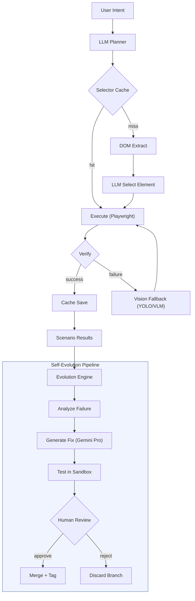
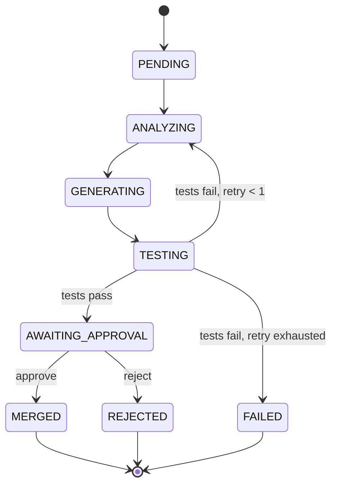

# Web-Agentic — Self-Evolving Adaptive Web Automation Engine

> **[한국어 버전 (Korean)](./README.ko.md)**

An adaptive web automation engine where **the LLM is the decision-maker**. The LLM analyzes user intent, plans execution steps, and selects DOM elements. Successful selectors are cached for zero-cost repeated execution. When automation fails, the **self-evolution engine** automatically analyzes failure patterns, generates code fixes, and awaits human approval before merging.

### Key Differentiators

- **LLM-First**: The LLM analyzes intent, plans execution, and selects elements. Rules serve as a cache, not the primary decision path.
- **Self-Evolving**: When automation fails, the system automatically analyzes failure patterns, generates code fixes via Gemini Pro, tests in a git sandbox, and awaits human approval before merging.
- **Smart Caching**: First execution uses LLM (~$0.02/task), repeated executions hit cache (~$0.005/task).
- **Vision Fallback**: When LLM confidence drops below 0.7, YOLO/VLM visual grounding kicks in.
- **Stealth & Human Simulation**: Anti-detection JS patches (3 levels), Bézier-curve mouse movement, natural typing delays, and smart navigation to bypass bot detection.
- **Adaptive Retry**: FallbackRouter-driven exponential backoff with escalation chains (retry → LLM → Vision → Human Handoff) and automatic replanning on consecutive failures.
- **Human-in-the-Loop**: CAPTCHA, authentication, and evolution approvals always require human intervention.

---

## System Overview



---

## Quick Start

### Prerequisites

- Python 3.11+
- Node.js 18+ (for Evolution UI)
- Google Gemini API key

### Install & Run

```bash
# Clone
git clone https://github.com/jedikim/web-agentic.git
cd web-agentic

# Install backend (with all optional deps)
pip install -e ".[dev,server,vision,learning]"
python -m playwright install chromium

# Set API key
export GEMINI_API_KEY="your-key"

# Start API server
python scripts/start_server.py  # localhost:8000

# Start Evolution UI (separate terminal)
cd evolution-ui
npm install
npm run dev  # localhost:5173
```

### Minimal Install (automation only, no evolution)

```bash
pip install -e ".[dev]"
python -m playwright install chromium
```

### SDK Quick Start

```python
from src.web_agent import WebAgent

# Standard usage (stealth enabled by default)
async with WebAgent(headless=True, stealth_level="standard") as agent:
    await agent.goto("https://example.com")
    result = await agent.run("click the More information link")
    print(f"Success: {result.success}, Cost: ${result.total_cost_usd:.4f}")
```

---

## Session API

The Session API provides multi-turn automation sessions with persistent browser state, cost tracking, and human handoff support.

| Method | Endpoint | Description |
|--------|----------|-------------|
| `POST` | `/api/sessions/` | Create a new session |
| `POST` | `/api/sessions/{id}/turn` | Execute an intent (multi-turn) |
| `GET` | `/api/sessions/{id}/screenshot` | Get current page screenshot |
| `GET` | `/api/sessions/{id}/handoffs` | List pending human handoffs |
| `POST` | `/api/sessions/{id}/handoffs/{rid}/resolve` | Resolve a handoff |
| `DELETE` | `/api/sessions/{id}` | Close session |
| `POST` | `/api/run` | One-shot execution (no session) |

See [API Reference](./docs/API-REFERENCE.md) for full request/response details.

---

## Automation UI

The Evolution UI (`evolution-ui/`) now includes two additional pages:

- **Automation** — One-shot task execution with real-time step progress and cost display
- **Sessions** — Multi-turn session management with live screenshots and handoff handling

---

## Evolution Pipeline

The self-evolution engine follows a state machine that automatically detects failures, generates fixes, and requests human approval.



When tests fail, the engine retries once by looping back through analysis and code generation. After exhausting retries, it moves to the FAILED state for manual investigation.

---

## Project Structure

```
web-agentic/
├── src/
│   ├── core/           # Automation engine
│   │   ├── llm_orchestrator.py   # LLM-First orchestrator + retry/replan
│   │   ├── executor.py           # Playwright wrapper (stealth/behavior)
│   │   ├── executor_pool.py      # Session pool (browser reuse)
│   │   ├── extractor.py          # DOM → structured JSON
│   │   ├── rule_engine.py        # Selector cache (was rule engine)
│   │   ├── verifier.py           # Post-action verification
│   │   ├── fallback_router.py    # Failure classification + escalation
│   │   ├── stealth.py            # Browser anti-detection patches
│   │   ├── human_behavior.py     # Natural mouse/typing/scroll
│   │   ├── navigation.py         # Rate limit, robots.txt, warming
│   │   └── config.py             # YAML → dataclass config loader
│   ├── ai/             # LLM modules
│   │   ├── llm_planner.py        # Gemini Flash/Pro planner
│   │   ├── prompt_manager.py     # Prompt template versioning
│   │   └── patch_system.py       # Structured patch generation
│   ├── vision/         # Vision modules
│   │   ├── yolo_detector.py      # YOLO local inference
│   │   ├── vlm_client.py         # VLM API client (Gemini multimodal)
│   │   ├── image_batcher.py      # Screenshot batching/resizing
│   │   └── coord_mapper.py       # Screenshot ↔ page coordinate mapping
│   ├── learning/       # Learning modules
│   │   ├── pattern_db.py         # Selector cache (SQLite, TTL-based)
│   │   ├── rule_promoter.py      # Cache save logic
│   │   ├── dspy_optimizer.py     # DSPy prompt optimization
│   │   └── memory_manager.py     # 4-tier memory system
│   ├── workflow/       # Workflow DSL
│   │   ├── dsl_parser.py         # YAML workflow parser
│   │   └── step_queue.py         # FIFO step queue
│   ├── evolution/      # Self-evolution engine
│   │   ├── pipeline.py           # Evolution cycle state machine
│   │   ├── analyzer.py           # Failure pattern detection
│   │   ├── code_generator.py     # Gemini Pro code fix generation
│   │   ├── sandbox.py            # Git branch isolation + testing
│   │   ├── version_manager.py    # Version tagging, merge, rollback
│   │   ├── db.py                 # Evolution DB (aiosqlite)
│   │   └── notifier.py           # SSE event broadcaster
│   ├── web_agent.py              # SDK Facade (WebAgent)
│   └── api/            # FastAPI server
│       ├── session_db.py         # Session database (aiosqlite)
│       ├── session_manager.py    # Session manager (live sessions)
│       ├── routes/
│       │   ├── sessions.py       # Session API routes
│       │   └── run.py            # One-shot execution API route
│       └── ...                   # REST routes + models
├── evolution-ui/       # React 19 + Vite + Tailwind CSS dashboard
│   ├── src/
│   │   ├── pages/                # Dashboard, Evolutions, Scenarios, Versions, Automation, Sessions
│   │   └── components/           # Shared UI components
│   └── package.json
├── config/             # YAML rules, synonyms, settings
│   ├── rules/                    # Pre-defined rules (cache seeds)
│   ├── synonyms.yaml             # Korean/English synonym dictionary
│   └── settings.yaml             # Engine configuration
├── tests/              # 968 tests (unit, integration, e2e)
│   ├── unit/
│   ├── integration/
│   └── e2e/
├── docs/               # Documentation
├── scripts/            # Utility scripts
├── data/               # Runtime data (gitignored)
└── pyproject.toml
```

---

## Testing

| Category | Tests | Command |
|----------|------:|---------|
| Unit | 816 | `pytest tests/unit/` |
| Integration | 95 | `pytest tests/integration/` |
| E2E | 57 | `pytest tests/e2e/` |
| **Total** | **968** | `pytest tests/` |

### Quick Quality Check

```bash
ruff check --fix          # Lint
mypy --strict             # Type check
pytest tests/ -q          # All tests
```

---

## API Endpoints

The FastAPI server (port 8000) exposes the following endpoints:

| Method | Endpoint | Description |
|--------|----------|-------------|
| `POST` | `/api/evolution/trigger` | Start an evolution cycle |
| `GET` | `/api/evolution/` | List all evolutions |
| `POST` | `/api/evolution/{id}/approve` | Approve evolution → merge |
| `POST` | `/api/evolution/{id}/reject` | Reject evolution → discard |
| `POST` | `/api/scenarios/run` | Run a scenario |
| `GET` | `/api/scenarios/results` | Scenario result history |
| `GET` | `/api/scenarios/trends` | Scenario trends |
| `GET` | `/api/versions/` | Version list |
| `GET` | `/api/progress/stream` | SSE real-time events |

---

## Documentation

| Document | Description |
|----------|-------------|
| [Evolution Engine](./docs/EVOLUTION-ENGINE.md) | Deep-dive into the self-evolution system |
| [API Reference](./docs/API-REFERENCE.md) | REST API endpoints, models, and curl examples |
| [Testing Guide](./docs/TESTING-GUIDE.md) | Test categories, commands, and writing tests |
| [Evolution UI](./evolution-ui/README.md) | React dashboard setup and pages |
| [Architecture](./docs/ARCHITECTURE.md) | Module-level architecture details |
| [PRD](./docs/PRD.md) | Product requirements document |
| [Technical Spec](./docs/web-automation-technical-spec-v2.md) | Full technical specification (2,268 lines) |

---

## Environment Variables

| Variable | Required | Default | Description |
|----------|----------|---------|-------------|
| `GEMINI_API_KEY` or `GOOGLE_API_KEY` | Yes | — | Google Gemini API key |
| `GEMINI_FLASH_MODEL` | No | `gemini-3-flash-preview` | Tier-1 model (automation, fast/cheap) |
| `GEMINI_PRO_MODEL` | No | `gemini-3.1-pro-preview` | Tier-2 model (coding, escalation) |
| `YOLO_MODEL` | No | `yolo26l.pt` | YOLO model weights file |
| `VITE_API_PORT` | No | `8000` | API port for UI proxy |

---

## License

MIT
