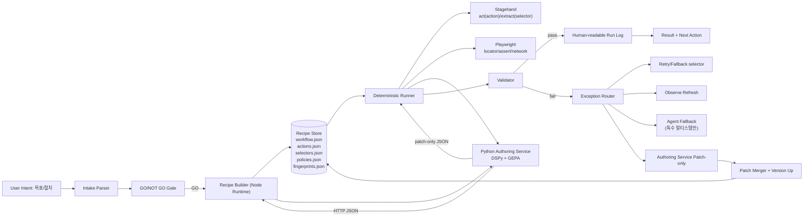
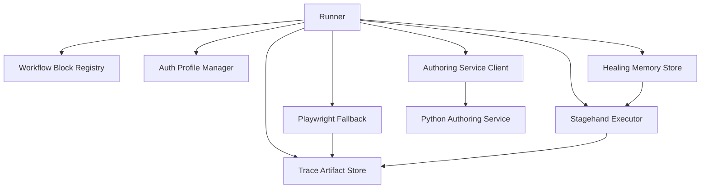
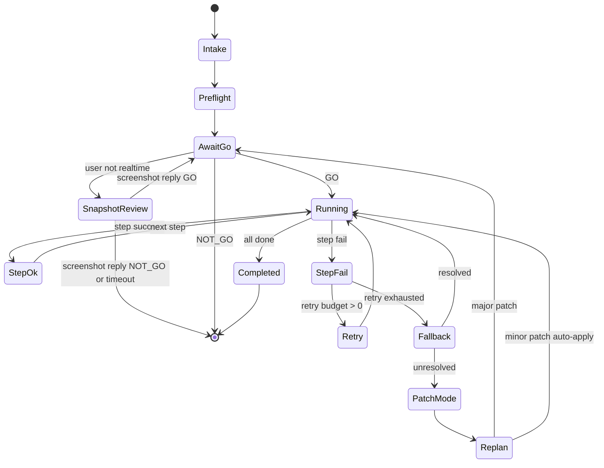
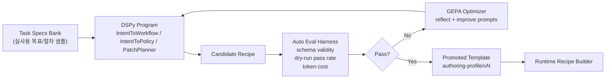
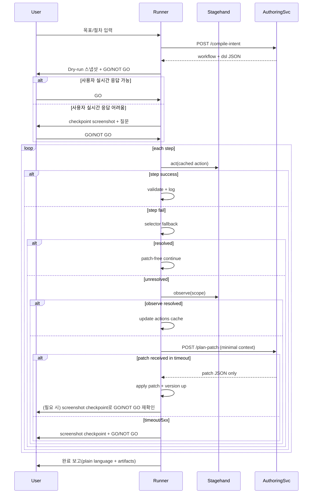
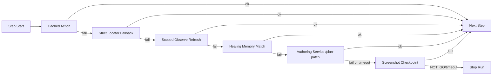

# Stagehand 기반 Chrome 자동화 설계안 (Workflow+DSL 우선, LLM 예외 개입)

작성일: 2026-02-20

## 1) 목표와 운영 원칙

이 설계의 목표는 다음 4개다.

1. 사용자가 처음에 절차/목표를 말하면 시스템이 실행 가능한 `workflow + DSL`로 고정한다.
2. 실행은 기본적으로 결정적(deterministic)이어야 하며, 반복 실행 시 LLM 호출을 거의 0에 가깝게 만든다.
3. 화면 변화/예외/특수 케이스에서만 LLM이 개입하고, 개입 결과는 "코드"가 아니라 "패치 데이터"로만 저장한다.
4. 결과 기록은 사람이 이해 가능한 수준(요약+근거+다음 액션)으로 남긴다.

핵심 정책:

- 기본 실행 엔진: `Stagehand + Playwright`
- 상시 모드: `Workflow + DSL 실행`
- 예외 모드: `Patch-only LLM`
- 생성 최적화 모드: `DSPy + GEPA` (workflow/DSL 품질 자동개선)
- 프로세스 분리: `Node Runtime`과 `Python Authoring Service`를 HTTP로 분리 운영
- 승인 체계: 실행 전/중요 분기점에서 `GO / NOT GO`

---

## 2) Stagehand 분석 요약 (설계에 반영한 사실)

Stagehand v3 기준으로 설계에 직접 반영한 포인트:

- `observe()`는 액션 가능한 요소를 구조화된 `Action[]`로 반환한다.
- `act(action)`은 결정적 실행 경로(문자열 지시 없이 실행)로 사용 가능하다.
- `cacheDir`를 설정하면 재실행에서 캐시 액션을 재사용해 LLM 호출을 줄일 수 있다.
- `extract()`는 스키마 기반 구조화 추출을 지원하고, `selector`로 범위를 줄여 토큰/지연을 절감할 수 있다.
- `metrics`, `history`, 파일 로깅(`BROWSERBASE_CONFIG_DIR`)으로 비용/실행추적/디버깅을 체계화할 수 있다.
- Playwright 쪽은 locator strictness/auto-wait/role·testid 우선 전략이 안정성에 유리하다.

이 특성을 이용해 "탐색(LLM) 1회 + 재실행(N회)" 구조를 만든다.

---

## 3) 전체 아키텍처



### 3.1 오픈소스 반영 확장 컴포넌트

- `Auth Profile Manager`: 로그인 상태를 프로파일/스토리지 상태로 재사용
- `Workflow Block Registry`: 재사용 가능한 블록 단위(Navigation/Action/Extract/Validation)
- `Healing Memory Store`: 과거 성공 locator/action 기준으로만 자동 치유 허용
- `Trace Artifact Store`: 실패 시 trace.zip + step 스크린샷 + DOM snippet 묶음 보관
- `Authoring Service Client`: Python 서비스와 HTTP 통신(`compile-intent`, `plan-patch`, `optimize-profile`)



### 3.2 Node-Python API 계약 (HTTP)

Node Runtime는 아래 API만 호출한다.

1. `POST /compile-intent`
2. `POST /plan-patch`
3. `POST /optimize-profile` (async)
4. `GET /profiles/:id`

요청/응답 규칙:

- payload는 JSON만 허용, schema 검증 실패 시 즉시 reject
- `plan-patch` timeout은 짧게(권장 8~15초)
- timeout/5xx 시 Runtime은 즉시 `screenshot checkpoint`로 degrade
- `optimize-profile`는 런타임 경로에서 동기 호출 금지(백그라운드 큐 전용)

### 3.3 통신 안정성/보안 규칙

- 모든 요청에 `requestId`를 넣고 idempotency를 보장한다.
- `compile-intent`와 `plan-patch`는 동기 API, `optimize-profile`는 큐 기반 비동기 API로 분리한다.
- 서비스 간 인증은 최소 API key, 권장은 mTLS 또는 private network로 제한한다.
- Runtime은 Authoring Service 응답을 무조건 schema validate 후 반영한다.

---

## 4) 실행 상태머신



---

## 5) 데이터 모델 (레시피 저장 구조)

권장 디렉터리:

```text
automation/
  recipes/
    <domain>/<flow>/
      v001/
        workflow.json
        actions.json
        selectors.json
        policies.json
        fingerprints.json
        README.md
      v002/
  runs/
    2026-02-20T23-30-00Z/
      <flow>_v001/
        logs.jsonl
        step_*.png
        dom_*.html
        patch_applied.json
```

### 5.1 workflow.json (절차)

- step은 `op`, `targetKey`, `args`, `expect`, `onFail`로 구성
- 도메인 선택(날짜/좌석)은 `extract -> choose(policy) -> act` 패턴으로 통일

```json
{
  "id": "booking_flow",
  "steps": [
    { "id": "open", "op": "goto", "args": { "url": "{{vars.url}}" } },
    { "id": "login", "op": "act_cached", "targetKey": "login.submit", "expect": [{ "kind": "url_contains", "value": "/dashboard" }] },
    { "id": "extract_candidates", "op": "extract", "targetKey": "seat.candidates", "args": { "into": "seats" } },
    { "id": "choose", "op": "choose", "args": { "from": "seats", "policy": "seat_policy_v1", "into": "chosen" } },
    { "id": "apply", "op": "act_template", "targetKey": "seat.by_id", "args": { "id": "{{chosen.id}}" } },
    { "id": "checkpoint", "op": "checkpoint", "args": { "message": "선택 결과 확인 후 진행할까요?" } }
  ]
}
```

### 5.2 actions.json (Stagehand observe 캐시)

- `observe()` 결과를 step 키 기준으로 저장
- 정상 실행 시 `act(action)`으로 실행 (무추론 경로)

```json
{
  "login.submit": {
    "instruction": "find the login submit button",
    "preferred": {
      "selector": "/html/body/.../button[1]",
      "description": "Login button",
      "method": "click",
      "arguments": []
    },
    "observedAt": "2026-02-20T23:00:00Z"
  }
}
```

### 5.3 selectors.json (fallback)

- Playwright 우선순위: `getByTestId` > `getByRole(name)` > 제한된 CSS
- XPath는 마지막 수단

### 5.4 policies.json (DSL)

- Hard filter + score + tie-break

```json
{
  "seat_policy_v1": {
    "hard": [{ "field": "available", "op": "==", "value": true }],
    "score": [
      { "when": { "field": "zone", "op": "==", "value": "front" }, "add": 30 },
      { "when": { "field": "price", "op": "<=", "value": "{{vars.max_price}}" }, "add": 20 }
    ],
    "tie_break": ["price_asc", "label_asc"],
    "pick": "argmax"
  }
}
```

### 5.5 fingerprints.json (화면 지문)

- 화면 오판 방지용 최소 증거
- `mustText`, `mustSelectors`, `urlContains` 조합

### 5.6 workflow/dsl 생성기 (DSPy + GEPA)

`workflow`와 `policy DSL` 생성 난이도를 줄이기 위해, 생성 자체를 수동 프롬프트가 아니라 `DSPy 프로그램`으로 고정한다.
구현은 `Python Authoring Service`에서 담당하고, Node는 HTTP로 결과 JSON만 수신한다.

핵심 아이디어:

- 온라인 실행 전에 오프라인에서 생성 품질을 먼저 최적화한다.
- 최적화 대상은 "코드"가 아니라 `signature + instruction + few-shot` 조합이다.
- `GEPA`로 self-improving 루프를 돌려서 실패 패턴을 반영한 프롬프트를 자동 갱신한다.

적용 범위:

- `IntentToWorkflow`: 사용자 목표/절차 -> workflow.json 초안
- `IntentToPolicy`: 목표/제약 -> policies.json 초안
- `PatchPlanner`: 실패 컨텍스트 -> patch-only JSON



평가 함수(예시):

```text
score = 0.45 * dry_run_success
      + 0.25 * schema_validity
      + 0.20 * replay_determinism
      - 0.10 * normalized_token_cost
```

운영 규칙:

- 생성 모델 호출은 `Authoring Phase`에서만 허용하고, `Runtime Phase`에서는 금지한다.
- `score`가 기준치(예: 0.82) 미만이면 recipe 승격 금지.
- 실패 샘플은 즉시 `Task Specs Bank`로 환류해 다음 GEPA 라운드에서 반영한다.
- 생성 출력은 항상 `workflow/actions/selectors/policies/fingerprints` 5종 JSON으로 강제한다.
- Runtime은 `authoring-profile`의 pinned 버전만 사용하고 최신 프로파일 자동 추종을 금지한다.

---

## 6) 런타임 알고리즘 (토큰 절약 최적화)

### 6.1 Step 실행 우선순위

1. `act(action)` (actions.json 캐시 사용, LLM 없음)
2. Playwright fallback selector 실행
3. `observe()`로 action 재탐색(국소 범위 selector 지정)
4. 그래도 실패 시 `Authoring Service /plan-patch` 호출
5. Authoring Service 실패/timeout 시 screenshot checkpoint

### 6.2 extract 최적화

- `extract()`는 항상 스키마 사용
- 가능하면 `selector` 스코프를 좁혀 실행
- 큰 페이지는 분할 추출(섹션 단위)

### 6.3 GO / NOT GO 운영

- 사전 승인: 최초 실행 직전
- 고위험 step 승인: 결제, 제출, 삭제
- 대규모 patch 승인: selector 대량 교체, 정책 변경
- 사용자가 실시간 확인이 어려우면 `screenshot checkpoint`로 질의한다.
- `screenshot checkpoint` 기본값: 핵심영역 1장, 필요 시 전체화면 1장 추가
- 승인 응답 timeout 시 기본 동작은 `NOT_GO`로 중단

### 6.4 Token Budget Guard (실행 강제 규칙)

`run` 시작 시 아래 예산을 로드하고 초과 시 즉시 downgrade 한다.

```json
{
  "budget": {
    "maxLlmCallsPerRun": 2,
    "maxPromptChars": 6000,
    "maxDomSnippetChars": 2500,
    "maxScreenshotPerFailure": 1,
    "maxScreenshotPerCheckpoint": 2,
    "maxAuthoringServiceCallsPerRun": 2,
    "authoringServiceTimeoutMs": 12000
  },
  "downgradeOrder": [
    "trim_dom",
    "drop_history",
    "observe_scope_narrow",
    "require_human_checkpoint"
  ]
}
```

실행 의사코드:

```ts
if (usage.llmCalls >= budget.maxLlmCallsPerRun) {
  return checkpoint("LLM 예산 초과: 수동 확인 후 재개");
}

if (usage.authoringCalls >= budget.maxAuthoringServiceCallsPerRun) {
  return checkpoint("Authoring API 예산 초과: 수동 확인 후 재개");
}

const context = buildFailureContext({
  dom: trim(dom, budget.maxDomSnippetChars),
  screenshots: 1,
  history: "last_step_only"
});
```

### 6.5 End-to-End 시퀀스



---

## 7) 예외 라우팅 규칙

에러 분류(최소):

- `TargetNotFound`
- `NotActionable`
- `ExpectationFailed`
- `ExtractionEmpty`
- `CanvasDetected`
- `CaptchaOr2FA`

라우팅:

- `TargetNotFound` -> observe refresh -> actions patch
- `ExpectationFailed` -> extract 재검증 -> expect patch
- `ExtractionEmpty` -> selector scope 재조정 -> policy 확인
- `CanvasDetected` -> network parse -> CV 좌표 -> Authoring Service(LLM, 최후)
- `CaptchaOr2FA` -> 사람 checkpoint 강제
- `AuthoringServiceTimeout` -> screenshot checkpoint 강제

### 7.1 Fallback Ladder (OSS 반영 강화안)

우선순위를 아래처럼 강제하면 비용과 실패율이 같이 내려간다.

1. `act(cached action)` 실행
2. Playwright strict locator fallback (`getByTestId/getByRole`)
3. `observe(scope)`로 국소 재탐색
4. Healing Memory 매칭(과거 성공 selector/action만 허용)
5. `Authoring Service /plan-patch` (patch-only)
6. screenshot checkpoint (응답 없으면 `NOT_GO`)



---

## 8) LLM Patch-only 계약

LLM 출력은 아래 연산만 허용한다.
생성/패치 로직은 Python Authoring Service 내부에서만 실행하고 Node Runtime은 patch JSON만 받는다.

- `actions.replace`
- `actions.add`
- `selectors.add`
- `selectors.replace`
- `workflow.update_expect`
- `policies.update`

예시:

```json
{
  "patch": [
    {
      "op": "actions.replace",
      "key": "login.submit",
      "value": {
        "selector": "/html/body/.../button[2]",
        "description": "Sign in button in account menu",
        "method": "click",
        "arguments": []
      }
    },
    {
      "op": "workflow.update_expect",
      "step": "login",
      "value": [{ "kind": "url_contains", "value": "/home" }]
    }
  ],
  "reason": "로그인 진입 경로와 리다이렉트 변경"
}
```

LLM 입력 최소화 규칙:

- 실패 step 메타
- 마지막 URL/title
- 실패한 selector/action 목록
- 타겟 주변 DOM snippet (짧게)
- screenshot 1장

금지:

- full DOM dump
- 장문 히스토리 전체 전달

---

## 9) 사람이 이해할 수 있는 기록 포맷

실행 종료 시 `runs/.../summary.md` 생성:

- 무엇을 하려 했는지 (목표)
- 실제로 한 단계(성공/실패/우회)
- 왜 우회했는지 (근거)
- 패치가 있었는지 (버전 변경)
- 다음 실행에서 달라지는 점

샘플 템플릿:

```md
# Run Summary
- Goal: 3월 2주차 리포트 다운로드
- Result: Success
- Duration: 03m 12s
- LLM Calls: 1 (selector patch)

## Key Events
1. login.submit action cache miss -> observe refresh로 해결
2. report.download expect mismatch -> workflow expect patch 적용
3. payment step은 screenshot checkpoint 승인 후 진행

## Version
- Input recipe: v001
- Output recipe: v002

## Operator Notes
- 다음 실행부터 login 단계 LLM 호출 없음 예상
- 실시간 부재 시 screenshot checkpoint 응답 없으면 자동 중단됨
```

---

## 10) 구현 모듈 제안 (Node Runtime + Python Service)

```text
node-runtime/
  src/
    authoring-client/
      http-client.ts
      compile-intent.ts
      plan-patch.ts
      profiles.ts
    recipe/
      loader.ts
      template.ts
      versioning.ts
      patch-merger.ts
    runner/
      workflow-runner.ts
      step-executor.ts
      validator.ts
      checkpoint.ts
    engines/
      stagehand-engine.ts
      playwright-fallback.ts
      extractor.ts
      policy-engine.ts
    exception/
      classifier.ts
      router.ts
    logging/
      run-logger.ts
      summary-writer.ts
      trace-bundler.ts
    memory/
      healing-memory.ts
      auth-profile-manager.ts
    blocks/
      block-registry.ts
      builtins/
        navigation.block.ts
        action.block.ts
        extract.block.ts
        validation.block.ts

python-authoring-service/
  app/
    main.py
    api/
      compile_intent.py
      plan_patch.py
      optimize_profile.py
      profiles.py
    dspy_programs/
      intent_to_workflow.py
      intent_to_policy.py
      patch_planner.py
    gepa/
      optimizer.py
      eval_harness.py
    storage/
      profiles_repo.py
      task_specs_repo.py
    schemas/
      recipe_schema.py
      patch_schema.py
```

핵심 인터페이스:

```ts
export type ActionRef = {
  selector: string;
  description: string;
  method: "click" | "fill" | "type" | "press" | string;
  arguments?: string[];
};

export type StepResult = {
  stepId: string;
  ok: boolean;
  data?: Record<string, unknown>;
  errorType?:
    | "TargetNotFound"
    | "NotActionable"
    | "ExpectationFailed"
    | "ExtractionEmpty"
    | "CanvasDetected"
    | "CaptchaOr2FA";
  message?: string;
};
```

---

## 11) MVP 범위 (Phase)

### Phase 1: Deterministic Core

- `workflow/actions/selectors/policies/fingerprints` 스키마 확정
- Runner + Validator + Checkpoint 최소 구현
- `act(cached action)` 우선 실행 + Playwright fallback

### Phase 2: Patch-only Recovery

- 예외 분류기 + 라우터 구현
- `observe(scope)` 재탐색 및 actions cache 갱신
- Authoring Service patch-only + version up(`v001 -> v002`)

### Phase 3: DSL Authoring Auto-Improve

- DSPy 프로그램(`IntentToWorkflow`, `IntentToPolicy`, `PatchPlanner`) 구성
- GEPA self-improving 루프와 자동 평가 하네스 연결
- 합격 프로파일(`authoring-profile/vN`)만 recipe 생성에 사용
- Python Authoring Service를 독립 배포하고 Node Runtime은 HTTP client만 유지

### Phase 4: Special Surface Handling

- canvas/비DOM 화면에 대해 `network parse -> CV -> LLM(최후)` 체인 추가
- 비용/성공률/재실패율 대시보드 집계

### Phase 5: OSS 패턴 하드닝

- Auth profile 재사용과 세션 만료 복구 자동화
- Workflow Block Registry 도입으로 recipe 생성 단순화
- Healing Memory Store 도입(무근거 self-heal 금지)
- trace.zip 기반 실패 재현/회귀 테스트 자동화

---

## 12) 운영 지표 (필수)

- Success rate
- 평균 실행시간
- run당 LLM 호출 횟수
- run당 token usage
- patch 발생률
- patch 후 재실패율
- healing-memory 적중률
- checkpoint 응답 대기시간

권장 SLO:

- 정상 플로우 run당 LLM 호출 <= 0.2
- 동일 플로우 2회차부터 성공률 >= 95%
- patch 적용 후 1회 내 복구율 >= 80%

---

## 13) 리스크와 대응

- 사이트 구조 급변
  - 대응: fingerprint mismatch 시 강제 preflight + GO 재승인
- selector 노이즈/중복 요소
  - 대응: strict locator 원칙 + expect 강화
- 캡차/2FA
  - 대응: 자동화 시도 금지, 사람 checkpoint 강제
- 토큰 비용 급증
  - 대응: extract selector scope, observe 캐시, budget guard

---

## 14) 유사 오픈소스 비교와 설계 반영

| 프로젝트 | 강점 | 설계 반영 |
|---|---|---|
| Stagehand | `observe/act/extract`와 캐시 기반 반복 실행 | 기본 엔진으로 채택, `actions.json` 캐시 중심 운영 |
| browser-use | 도구 확장성과 인증 프로파일 재사용 패턴 | `Auth Profile Manager`와 커스텀 툴 레이어 추가 |
| Skyvern | 블록 기반 워크플로우와 validation 단계 분리 | `Workflow Block Registry`(navigation/action/extract/validation) 도입 |
| Healenium | 기존 locator 기준 self-healing 메커니즘 | `Healing Memory Store`로 "근거 있는 치유"만 허용 |
| Robot Framework Browser | 사람이 읽기 쉬운 키워드 기반 시나리오 | run summary와 checkpoint 질의 문장을 평문 DSL로 유지 |
| Playwright Trace | 실패 재현성과 원인분석 효율 | `trace-bundler.ts`로 아티팩트 표준화 |

채택 기준:

- 런타임 토큰 절감에 직접 기여하는가
- 실패를 재현 가능한 증거로 남기는가
- 사람이 승인/중단을 쉽게 판단할 수 있는가
- 패치가 데이터(JSON)로만 귀결되는가

비채택/후순위:

- 완전 자율 에이전트 단독 실행(승인 없이 진행) 모델은 후순위
- 시각 기반 전면 자동화는 Canvas/특수 화면에서만 제한적으로 사용

---

## 15) 결론

권장 방향은 다음 한 줄로 요약된다.

`Stagehand를 탐색/복구 엔진으로 쓰고, 평시 실행은 workflow+DSL+cached action으로 고정하며, LLM은 patch-only 예외 처리기로 제한한다.`

이 구조면 요구하신 `go/not go`, `토큰 절약`, `사람이 읽을 수 있는 기록`, `코딩 중심 운영`을 동시에 달성할 수 있다.

---

## Sources

- [Stagehand observe() basics](https://docs.stagehand.dev/v3/basics/observe)
- [Stagehand observe() reference](https://docs.stagehand.dev/v3/references/observe)
- [Stagehand act() reference](https://docs.stagehand.dev/v3/references/act)
- [Stagehand extract() basics](https://docs.stagehand.dev/v3/basics/extract)
- [Stagehand extract() reference](https://docs.stagehand.dev/v3/references/extract)
- [Stagehand caching actions](https://docs.stagehand.dev/v3/best-practices/caching)
- [Stagehand speed optimization](https://docs.stagehand.dev/v3/best-practices/speed-optimization)
- [Stagehand cost optimization](https://docs.stagehand.dev/v3/best-practices/cost-optimization)
- [Stagehand deterministic agent](https://docs.stagehand.dev/v3/best-practices/deterministic-agent)
- [Stagehand agent fallbacks](https://docs.stagehand.dev/v3/best-practices/agent-fallbacks)
- [Stagehand logging](https://docs.stagehand.dev/v3/configuration/logging)
- [Stagehand Playwright integration](https://docs.stagehand.dev/v3/integrations/playwright)
- [Stagehand v3 launch blog](https://www.browserbase.com/blog/stagehand-v3)
- [Playwright best practices](https://playwright.dev/docs/best-practices)
- [Playwright locators](https://playwright.dev/docs/locators)
- [Playwright Trace Viewer](https://playwright.dev/python/docs/trace-viewer)
- [DSPy docs](https://dspy.ai/)
- [DSPy GitHub](https://github.com/stanfordnlp/dspy)
- [GEPA reference implementation](https://github.com/gepa-ai/gepa)
- [GEPA paper](https://arxiv.org/abs/2507.19457)
- [browser-use GitHub](https://github.com/browser-use/browser-use)
- [browser-use Custom Tools](https://docs.browser-use.com/customize/tools/add-custom-tools)
- [browser-use Authentication](https://docs.browser-use.com/customize/authentication)
- [Skyvern Workflow Blocks](https://docs.skyvern.com/no-code/workflow-blocks)
- [Skyvern Workflow Management](https://docs.skyvern.com/no-code/manage-workflows)
- [Skyvern GitHub](https://github.com/Skyvern-AI/skyvern)
- [Healenium docs](https://healenium.io/docs)
- [Healenium GitHub](https://github.com/healenium/healenium)
- [Robot Framework Browser](https://github.com/MarketSquare/robotframework-browser)
