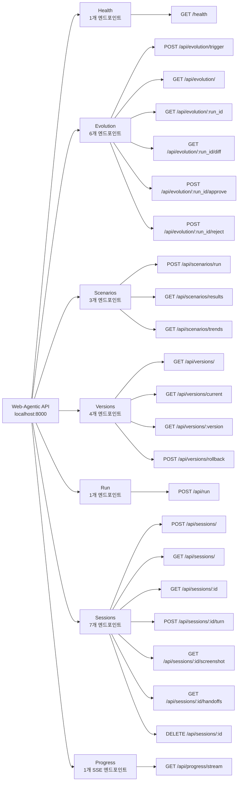

> **[English Version](./API-REFERENCE.md)**

# Web-Agentic Evolution API 레퍼런스

## 1. 개요

Web-Agentic Evolution API는 자가 진화 자동화 엔진을 제공하는 **FastAPI 기반 REST API** 서버입니다. 진화 사이클 트리거, 시나리오 실행, 버전 관리, 실시간 진행 이벤트 스트리밍 등의 기능을 제공합니다.

| 항목 | 값 |
|---|---|
| **기본 URL** | `http://localhost:8000` |
| **인증** | 없음 (로컬 개발 전용) |
| **응답 형식** | JSON (모든 엔드포인트) |
| **CORS 허용 출처** | `http://localhost:5173`, `http://localhost:3000` |
| **OpenAPI 문서** | `http://localhost:8000/docs` (Swagger UI) |

### 빠른 시작

```bash
pip install -e ".[server]"
python scripts/start_server.py        # API 서버 (localhost:8000)
cd evolution-ui && npm run dev         # UI (localhost:5173)
```

---

## 2. 엔드포인트 그룹



---

## 3. 헬스 체크

### `GET /health`

서비스 상태를 반환합니다.

**응답:**

```json
{
  "status": "ok",
  "service": "evolution-api"
}
```

**curl:**

```bash
curl http://localhost:8000/health
```

---

## 4. 진화(Evolution) 엔드포인트

### 4.1 진화 트리거

#### `POST /api/evolution/trigger`

새로운 진화 사이클을 시작합니다. 파이프라인은 백그라운드에서 비동기 실행되며, 상태 머신을 따라 `PENDING -> ANALYZING -> GENERATING -> TESTING -> AWAITING_APPROVAL` 순서로 진행됩니다.

**요청 본문:** `EvolutionTriggerRequest`

| 필드 | 타입 | 필수 | 설명 |
|---|---|---|---|
| `reason` | `str` | 아니오 (기본값: `"manual"`) | 트리거 사유 |
| `scenario_filter` | `str \| null` | 아니오 | 특정 시나리오만 분석하도록 제한 |

**응답:** `StatusResponse`

```json
{
  "status": "accepted",
  "message": "Evolution run abc-123 started",
  "data": {
    "run_id": "abc-123"
  }
}
```

**curl:**

```bash
curl -X POST http://localhost:8000/api/evolution/trigger \
  -H "Content-Type: application/json" \
  -d '{"reason": "manual"}'
```

---

### 4.2 진화 실행 목록 조회

#### `GET /api/evolution/`

진화 실행 목록을 최신 순으로 반환합니다.

**쿼리 파라미터:**

| 파라미터 | 타입 | 필수 | 설명 |
|---|---|---|---|
| `limit` | `int` | 아니오 (기본값: `50`) | 최대 결과 수 |
| `status` | `str` | 아니오 | 상태별 필터링 (예: `awaiting_approval`, `merged`, `rejected`) |

**응답:** `list[EvolutionRunSummary]`

```json
[
  {
    "id": "abc-123",
    "status": "awaiting_approval",
    "trigger_reason": "manual",
    "branch_name": "evo/abc-123",
    "analysis_summary": "로그인 버튼 셀렉터 수정",
    "created_at": "2026-02-24T10:00:00Z",
    "updated_at": "2026-02-24T10:05:00Z",
    "completed_at": null,
    "error_message": null
  }
]
```

**curl:**

```bash
curl "http://localhost:8000/api/evolution/?limit=10"
```

---

### 4.3 진화 상세 조회

#### `GET /api/evolution/{run_id}`

진화 실행의 전체 상세 정보를 파일 변경 내역과 함께 반환합니다.

**경로 파라미터:**

| 파라미터 | 타입 | 설명 |
|---|---|---|
| `run_id` | `str` | 진화 실행 ID |

**응답:** `EvolutionRunDetail`

`EvolutionRunSummary`의 모든 필드에 추가로 다음 필드를 포함합니다:

| 필드 | 타입 | 설명 |
|---|---|---|
| `trigger_data` | `str` | JSON 인코딩된 트리거 파라미터 |
| `base_commit` | `str \| null` | 진화가 분기된 Git 커밋 |
| `changes` | `list[EvolutionChangeItem]` | 파일 변경 목록 |

**오류 응답:**

| 상태 코드 | 설명 |
|---|---|
| `404` | 진화 실행을 찾을 수 없음 |

**curl:**

```bash
curl http://localhost:8000/api/evolution/abc-123
```

---

### 4.4 진화 Diff 조회

#### `GET /api/evolution/{run_id}/diff`

진화 실행의 코드 diff를 반환합니다. 수정, 생성, 삭제된 파일을 확인할 수 있습니다.

**경로 파라미터:**

| 파라미터 | 타입 | 설명 |
|---|---|---|
| `run_id` | `str` | 진화 실행 ID |

**응답:**

```json
{
  "run_id": "abc-123",
  "branch_name": "evo/abc-123",
  "changes": [
    {
      "file_path": "src/core/orchestrator.py",
      "change_type": "modify",
      "diff_content": "--- a/src/core/orchestrator.py\n+++ b/src/core/orchestrator.py\n...",
      "description": "셀렉터 캐시 조회 로직 수정"
    }
  ]
}
```

**오류 응답:**

| 상태 코드 | 설명 |
|---|---|
| `404` | 진화 실행을 찾을 수 없음 |

**curl:**

```bash
curl http://localhost:8000/api/evolution/abc-123/diff
```

---

### 4.5 진화 승인

#### `POST /api/evolution/{run_id}/approve`

진화 실행을 승인합니다. 진화 브랜치를 main에 머지하고 새로운 버전 태그를 생성합니다.

**경로 파라미터:**

| 파라미터 | 타입 | 설명 |
|---|---|---|
| `run_id` | `str` | 진화 실행 ID |

**요청 본문:** `ApproveRejectRequest`

| 필드 | 타입 | 필수 | 설명 |
|---|---|---|---|
| `comment` | `str \| null` | 아니오 | 선택적 승인 코멘트 |

**응답:** `StatusResponse`

```json
{
  "status": "merged",
  "message": "Merged as version 0.1.1",
  "data": {
    "version": "0.1.1",
    "run_id": "abc-123"
  }
}
```

**오류 응답:**

| 상태 코드 | 설명 |
|---|---|
| `400` | 실행 상태가 `awaiting_approval`이 아님 |
| `404` | 진화 실행을 찾을 수 없음 |
| `500` | 머지 실패 |

**curl:**

```bash
curl -X POST http://localhost:8000/api/evolution/abc-123/approve \
  -H "Content-Type: application/json" \
  -d '{"comment": "LGTM"}'
```

---

### 4.6 진화 거절

#### `POST /api/evolution/{run_id}/reject`

진화 실행을 거절합니다. 진화 브랜치를 삭제하고 실행 상태를 rejected로 변경합니다.

**경로 파라미터:**

| 파라미터 | 타입 | 설명 |
|---|---|---|
| `run_id` | `str` | 진화 실행 ID |

**요청 본문:** `ApproveRejectRequest`

| 필드 | 타입 | 필수 | 설명 |
|---|---|---|---|
| `comment` | `str \| null` | 아니오 | 선택적 거절 코멘트 |

**응답:** `StatusResponse`

```json
{
  "status": "rejected",
  "message": "Evolution run abc-123 rejected",
  "data": {
    "run_id": "abc-123"
  }
}
```

**오류 응답:**

| 상태 코드 | 설명 |
|---|---|
| `400` | 실행 상태가 `awaiting_approval`이 아님 |
| `404` | 진화 실행을 찾을 수 없음 |

**curl:**

```bash
curl -X POST http://localhost:8000/api/evolution/abc-123/reject \
  -H "Content-Type: application/json" \
  -d '{"comment": "Needs revision"}'
```

---

## 5. 시나리오 엔드포인트

### 5.1 시나리오 실행

#### `POST /api/scenarios/run`

백그라운드에서 시나리오 실행을 시작합니다. 즉시 accepted 상태를 반환하며, 진행 상황은 SSE 엔드포인트를 통해 실시간으로 스트리밍됩니다.

**요청 본문:** `ScenarioRunRequest`

| 필드 | 타입 | 필수 | 설명 |
|---|---|---|---|
| `headless` | `bool` | 아니오 (기본값: `true`) | 헤드리스 모드로 브라우저 실행 |
| `max_cost` | `float` | 아니오 (기본값: `0.50`) | 최대 비용 예산 (USD) |
| `filter_name` | `str \| null` | 아니오 | 시나리오 이름 부분 문자열로 필터링 |

**응답:** `StatusResponse`

```json
{
  "status": "accepted",
  "message": "Scenario run started in background",
  "data": {
    "headless": true,
    "max_cost": 0.5
  }
}
```

**curl:**

```bash
curl -X POST http://localhost:8000/api/scenarios/run \
  -H "Content-Type: application/json" \
  -d '{"headless": true}'
```

---

### 5.2 시나리오 결과 목록 조회

#### `GET /api/scenarios/results`

시나리오 실행 결과 이력을 반환합니다.

**쿼리 파라미터:**

| 파라미터 | 타입 | 필수 | 설명 |
|---|---|---|---|
| `scenario_name` | `str` | 아니오 | 시나리오 이름으로 필터링 |
| `limit` | `int` | 아니오 (기본값: `100`) | 최대 결과 수 |

**응답:** `list[ScenarioResultItem]`

```json
[
  {
    "id": "result-001",
    "scenario_name": "google_search",
    "version": "0.1.0",
    "overall_success": true,
    "total_steps_ok": 5,
    "total_steps_all": 5,
    "total_cost_usd": 0.012,
    "total_tokens": 1500,
    "wall_time_s": 8.3,
    "error_summary": null,
    "created_at": "2026-02-24T10:30:00Z"
  }
]
```

**curl:**

```bash
curl "http://localhost:8000/api/scenarios/results?limit=10"
```

---

### 5.3 시나리오 트렌드 조회

#### `GET /api/scenarios/trends`

각 시나리오의 집계된 트렌드 데이터를 반환합니다. 성공률, 평균 비용, 평균 실행 시간 등을 포함합니다.

**응답:** `list[ScenarioTrendItem]`

```json
[
  {
    "scenario_name": "google_search",
    "total_runs": 20,
    "successes": 18,
    "avg_cost": 0.011,
    "avg_time": 7.5,
    "success_rate": 90.0
  }
]
```

**curl:**

```bash
curl http://localhost:8000/api/scenarios/trends
```

---

## 6. 버전 엔드포인트

### 6.1 버전 목록 조회

#### `GET /api/versions/`

모든 버전 레코드 목록을 반환합니다.

**쿼리 파라미터:**

| 파라미터 | 타입 | 필수 | 설명 |
|---|---|---|---|
| `limit` | `int` | 아니오 (기본값: `50`) | 최대 결과 수 |

**응답:** `list[VersionRecord]`

```json
[
  {
    "id": "ver-001",
    "version": "0.1.1",
    "previous_version": "0.1.0",
    "evolution_run_id": "abc-123",
    "changelog": "업데이트된 UI에 대한 로그인 셀렉터 수정",
    "test_results": {"passed": 742, "failed": 0},
    "git_tag": "v0.1.1",
    "git_commit": "a1b2c3d",
    "created_at": "2026-02-24T11:00:00Z"
  }
]
```

**curl:**

```bash
curl http://localhost:8000/api/versions/
```

---

### 6.2 현재 버전 조회

#### `GET /api/versions/current`

최신(현재) 버전 문자열을 반환합니다.

**응답:**

```json
{
  "version": "0.1.1"
}
```

**curl:**

```bash
curl http://localhost:8000/api/versions/current
```

---

### 6.3 버전 상세 조회

#### `GET /api/versions/{version}`

특정 버전 레코드의 전체 상세 정보를 반환합니다.

**경로 파라미터:**

| 파라미터 | 타입 | 설명 |
|---|---|---|
| `version` | `str` | 버전 문자열 (예: `0.1.1`) |

**응답:** `VersionRecord`

```json
{
  "id": "ver-001",
  "version": "0.1.1",
  "previous_version": "0.1.0",
  "evolution_run_id": "abc-123",
  "changelog": "업데이트된 UI에 대한 로그인 셀렉터 수정",
  "test_results": {"passed": 742, "failed": 0},
  "git_tag": "v0.1.1",
  "git_commit": "a1b2c3d",
  "created_at": "2026-02-24T11:00:00Z"
}
```

**오류 응답:**

| 상태 코드 | 설명 |
|---|---|
| `404` | 버전을 찾을 수 없음 |

**curl:**

```bash
curl http://localhost:8000/api/versions/0.1.1
```

---

### 6.4 버전 롤백

#### `POST /api/versions/rollback`

이전 버전으로 롤백합니다. 대상 버전의 상태를 가리키는 새로운 버전 레코드가 생성됩니다.

**요청 본문:** `RollbackRequest`

| 필드 | 타입 | 필수 | 설명 |
|---|---|---|---|
| `target_version` | `str` | 예 | 롤백할 대상 버전 |

**응답:** `StatusResponse`

```json
{
  "status": "rolled_back",
  "message": "Rolled back to 0.1.0 as version 0.1.2",
  "data": {
    "new_version": "0.1.2",
    "target_version": "0.1.0"
  }
}
```

**오류 응답:**

| 상태 코드 | 설명 |
|---|---|
| `404` | 대상 버전을 찾을 수 없음 |
| `500` | 롤백 실패 |

**curl:**

```bash
curl -X POST http://localhost:8000/api/versions/rollback \
  -H "Content-Type: application/json" \
  -d '{"target_version": "0.1.0"}'
```

---

## 7. 원샷 실행 엔드포인트

### 7.1 자동화 실행

#### `POST /api/run`

영구 세션 없이 단일 자동화 태스크를 실행합니다. 브라우저를 시작하고, 태스크를 실행한 후, 브라우저를 종료합니다. 간단한 일회성 자동화 태스크에 적합합니다.

**요청 본문:** `OneShotRequest`

| 필드 | 타입 | 필수 | 설명 |
|---|---|---|---|
| `url` | `str` | 예 | 이동할 대상 URL |
| `intent` | `str` | 예 | 실행할 자연어 의도 |
| `headless` | `bool` | 아니오 (기본값: `true`) | 헤드리스 모드로 브라우저 실행 |
| `max_cost_usd` | `float` | 아니오 (기본값: `0.10`) | 최대 비용 예산 |

**응답:** `OneShotResponse`

```json
{
  "success": true,
  "steps": [
    {
      "action": "click",
      "selector": "a[href='https://www.iana.org/domains/example']",
      "description": "'More information...' 링크 클릭",
      "success": true,
      "cost_usd": 0.003
    }
  ],
  "total_cost_usd": 0.012,
  "total_tokens": 1200,
  "wall_time_s": 3.5,
  "error": null
}
```

**오류 응답:**

| 상태 코드 | 설명 |
|---|---|
| `422` | 유효성 검증 오류 (url 또는 intent 누락) |
| `500` | 실행 실패 |

**curl:**

```bash
curl -X POST http://localhost:8000/api/run \
  -H "Content-Type: application/json" \
  -d '{"url": "https://example.com", "intent": "More information 링크 클릭"}'
```

---

## 8. 세션 엔드포인트

### 8.1 세션 생성

#### `POST /api/sessions/`

영구 브라우저 인스턴스를 가진 새로운 멀티턴 자동화 세션을 생성합니다.

**요청 본문:** `CreateSessionRequest`

| 필드 | 타입 | 필수 | 설명 |
|---|---|---|---|
| `url` | `str` | 예 | 초기 이동 URL |
| `headless` | `bool` | 아니오 (기본값: `true`) | 헤드리스 모드로 브라우저 실행 |
| `max_cost_usd` | `float` | 아니오 (기본값: `1.00`) | 세션 최대 비용 예산 |
| `timeout_minutes` | `int` | 아니오 (기본값: `30`) | 세션 유휴 타임아웃 (분) |

**응답:** `CreateSessionResponse`

```json
{
  "session_id": "sess-abc123",
  "status": "active",
  "url": "https://example.com",
  "created_at": "2026-02-24T10:00:00Z"
}
```

**curl:**

```bash
curl -X POST http://localhost:8000/api/sessions/ \
  -H "Content-Type: application/json" \
  -d '{"url": "https://example.com", "headless": true}'
```

---

### 8.2 세션 목록 조회

#### `GET /api/sessions/`

세션 목록을 최신 순으로 반환합니다.

**쿼리 파라미터:**

| 파라미터 | 타입 | 필수 | 설명 |
|---|---|---|---|
| `status` | `str` | 아니오 | 상태별 필터링 (`active`, `closed`, `expired`) |
| `limit` | `int` | 아니오 (기본값: `50`) | 최대 결과 수 |

**응답:** `list[SessionListItem]`

```json
[
  {
    "session_id": "sess-abc123",
    "status": "active",
    "url": "https://example.com",
    "turn_count": 3,
    "total_cost_usd": 0.025,
    "created_at": "2026-02-24T10:00:00Z",
    "last_activity_at": "2026-02-24T10:05:00Z"
  }
]
```

**curl:**

```bash
curl "http://localhost:8000/api/sessions/?status=active&limit=10"
```

---

### 8.3 세션 상세 조회

#### `GET /api/sessions/{session_id}`

턴 이력을 포함한 세션의 전체 상세 정보를 반환합니다.

**경로 파라미터:**

| 파라미터 | 타입 | 설명 |
|---|---|---|
| `session_id` | `str` | 세션 ID |

**응답:** `SessionDetail`

```json
{
  "session_id": "sess-abc123",
  "status": "active",
  "url": "https://example.com",
  "headless": true,
  "max_cost_usd": 1.0,
  "total_cost_usd": 0.025,
  "turn_count": 3,
  "turns": [
    {
      "turn_id": "turn-001",
      "intent": "로그인 버튼 클릭",
      "success": true,
      "steps_ok": 1,
      "steps_all": 1,
      "cost_usd": 0.008,
      "created_at": "2026-02-24T10:01:00Z"
    }
  ],
  "created_at": "2026-02-24T10:00:00Z",
  "last_activity_at": "2026-02-24T10:05:00Z"
}
```

**오류 응답:**

| 상태 코드 | 설명 |
|---|---|
| `404` | 세션을 찾을 수 없음 |

**curl:**

```bash
curl http://localhost:8000/api/sessions/sess-abc123
```

---

### 8.4 턴 실행

#### `POST /api/sessions/{session_id}/turn`

기존 세션 내에서 새로운 의도를 실행합니다. 이전 턴의 브라우저 상태가 유지됩니다.

**경로 파라미터:**

| 파라미터 | 타입 | 설명 |
|---|---|---|
| `session_id` | `str` | 세션 ID |

**요청 본문:** `ExecuteTurnRequest`

| 필드 | 타입 | 필수 | 설명 |
|---|---|---|---|
| `intent` | `str` | 예 | 실행할 자연어 의도 |

**응답:** `ExecuteTurnResponse`

```json
{
  "turn_id": "turn-004",
  "success": true,
  "steps": [
    {
      "action": "fill",
      "selector": "#search-input",
      "description": "검색 필드에 '웹 자동화' 입력",
      "success": true,
      "cost_usd": 0.003
    },
    {
      "action": "click",
      "selector": "button[type='submit']",
      "description": "검색 버튼 클릭",
      "success": true,
      "cost_usd": 0.002
    }
  ],
  "cost_usd": 0.005,
  "total_session_cost_usd": 0.030,
  "error": null
}
```

**오류 응답:**

| 상태 코드 | 설명 |
|---|---|
| `400` | 세션이 활성 상태가 아님 (종료 또는 만료) |
| `404` | 세션을 찾을 수 없음 |
| `429` | 비용 예산 초과 |

**curl:**

```bash
curl -X POST http://localhost:8000/api/sessions/sess-abc123/turn \
  -H "Content-Type: application/json" \
  -d '{"intent": "웹 자동화 검색"}'
```

---

### 8.5 스크린샷 조회

#### `GET /api/sessions/{session_id}/screenshot`

현재 브라우저 페이지 상태의 PNG 스크린샷을 반환합니다.

**경로 파라미터:**

| 파라미터 | 타입 | 설명 |
|---|---|---|
| `session_id` | `str` | 세션 ID |

**응답:** `image/png` (바이너리)

**오류 응답:**

| 상태 코드 | 설명 |
|---|---|
| `400` | 세션이 활성 상태가 아님 |
| `404` | 세션을 찾을 수 없음 |

**curl:**

```bash
curl http://localhost:8000/api/sessions/sess-abc123/screenshot -o screenshot.png
```

---

### 8.6 Handoff 목록 조회

#### `GET /api/sessions/{session_id}/handoffs`

세션의 대기 중인 Human Handoff 요청을 반환합니다 (예: CAPTCHA, 인증).

**경로 파라미터:**

| 파라미터 | 타입 | 설명 |
|---|---|---|
| `session_id` | `str` | 세션 ID |

**응답:** `list[HandoffItem]`

```json
[
  {
    "request_id": "hoff-001",
    "type": "captcha",
    "description": "로그인 페이지에서 CAPTCHA 감지",
    "screenshot_url": "/api/sessions/sess-abc123/screenshot",
    "created_at": "2026-02-24T10:03:00Z"
  }
]
```

**오류 응답:**

| 상태 코드 | 설명 |
|---|---|
| `404` | 세션을 찾을 수 없음 |

**curl:**

```bash
curl http://localhost:8000/api/sessions/sess-abc123/handoffs
```

---

### 8.7 Handoff 해결

#### `POST /api/sessions/{session_id}/handoffs/{request_id}/resolve`

대기 중인 Human Handoff 요청을 해결하여 자동화가 계속 진행될 수 있도록 합니다.

**경로 파라미터:**

| 파라미터 | 타입 | 설명 |
|---|---|---|
| `session_id` | `str` | 세션 ID |
| `request_id` | `str` | Handoff 요청 ID |

**요청 본문:** `ResolveHandoffRequest`

| 필드 | 타입 | 필수 | 설명 |
|---|---|---|---|
| `action` | `str` | 예 | 해결 방법 (`completed`, `skipped`) |
| `data` | `dict` | 아니오 | 추가 데이터 (예: 해결된 CAPTCHA 값) |

**응답:** `StatusResponse`

```json
{
  "status": "resolved",
  "message": "Handoff hoff-001 resolved",
  "data": {
    "request_id": "hoff-001",
    "action": "completed"
  }
}
```

**오류 응답:**

| 상태 코드 | 설명 |
|---|---|
| `404` | 세션 또는 Handoff를 찾을 수 없음 |
| `400` | Handoff가 이미 해결됨 |

**curl:**

```bash
curl -X POST http://localhost:8000/api/sessions/sess-abc123/handoffs/hoff-001/resolve \
  -H "Content-Type: application/json" \
  -d '{"action": "completed"}'
```

---

### 8.8 세션 종료

#### `DELETE /api/sessions/{session_id}`

세션을 종료하고 브라우저 인스턴스를 해제합니다.

**경로 파라미터:**

| 파라미터 | 타입 | 설명 |
|---|---|---|
| `session_id` | `str` | 세션 ID |

**응답:** `StatusResponse`

```json
{
  "status": "closed",
  "message": "Session sess-abc123 closed",
  "data": {
    "session_id": "sess-abc123",
    "total_cost_usd": 0.030,
    "turn_count": 4
  }
}
```

**오류 응답:**

| 상태 코드 | 설명 |
|---|---|
| `404` | 세션을 찾을 수 없음 |

**curl:**

```bash
curl -X DELETE http://localhost:8000/api/sessions/sess-abc123
```

---

## 9. SSE 진행 상황 스트림

### `GET /api/progress/stream`

진화 사이클과 시나리오 실행의 실시간 진행 업데이트를 스트리밍하는 Server-Sent Events (SSE) 엔드포인트입니다. 연결이 유지되며 이벤트가 발생할 때마다 푸시됩니다.

**이벤트 타입:**

| 이벤트 | 설명 | 데이터 필드 |
|---|---|---|
| `evolution_status` | 진화 실행 상태 변경 | `run_id`, `status`, `error` |
| `scenario_progress` | 시나리오 실행 진행 상황 | `scenario_name`, `status`, `success`, `cost_usd` |
| `version_created` | 새 버전 생성 | `version`, `previous_version`, `changelog` |
| `session_created` | 새 세션 생성 | `session_id`, `url` |
| `session_turn_started` | 턴 실행 시작 | `session_id`, `turn_id`, `intent` |
| `session_turn_completed` | 턴 실행 완료 | `session_id`, `turn_id`, `success`, `cost_usd` |
| `session_closed` | 세션 종료 | `session_id`, `total_cost_usd`, `turn_count` |
| `session_expired` | 타임아웃으로 세션 만료 | `session_id` |
| `handoff_requested` | Human Handoff 요청 | `session_id`, `request_id`, `type` |
| `handoff_resolved` | Human Handoff 해결 | `session_id`, `request_id`, `action` |

**이벤트 페이로드 예시:**

```
event: evolution_status
data: {"run_id": "abc-123", "status": "analyzing"}

event: scenario_progress
data: {"scenario_name": "google_search", "status": "completed", "success": true, "cost_usd": 0.012}

event: version_created
data: {"version": "0.1.1", "previous_version": "0.1.0", "changelog": "로그인 셀렉터 수정"}
```

**JavaScript 구독 예시:**

```javascript
const es = new EventSource('http://localhost:8000/api/progress/stream');

es.addEventListener('evolution_status', (e) => {
  const data = JSON.parse(e.data);
  console.log(`진화 ${data.run_id}: ${data.status}`);
});

es.addEventListener('scenario_progress', (e) => {
  const data = JSON.parse(e.data);
  console.log(`시나리오 ${data.scenario_name}: ${data.status}`);
});

es.addEventListener('version_created', (e) => {
  const data = JSON.parse(e.data);
  console.log(`새 버전: ${data.version}`);
});

es.onerror = (e) => {
  console.error('SSE 연결 오류:', e);
};
```

**curl:**

```bash
curl -N http://localhost:8000/api/progress/stream
```

---

## 10. 데이터 모델

모든 요청/응답 모델은 `src/api/models.py`에 Pydantic v2 `BaseModel` 클래스로 정의되어 있습니다.

### StatusResponse

대부분의 변경(mutation) 엔드포인트에서 사용하는 범용 상태 응답 모델입니다.

| 필드 | 타입 | 필수 | 설명 |
|---|---|---|---|
| `status` | `str` | 예 | 상태 코드 (예: `accepted`, `merged`, `rejected`, `rolled_back`) |
| `message` | `str` | 예 | 사람이 읽을 수 있는 상태 메시지 |
| `data` | `dict` | 아니오 (기본값: `{}`) | 추가 데이터 페이로드 |

---

### EvolutionTriggerRequest

새로운 진화 사이클을 트리거하기 위한 요청 본문 모델입니다.

| 필드 | 타입 | 필수 | 설명 |
|---|---|---|---|
| `reason` | `str` | 아니오 (기본값: `"manual"`) | 진화 트리거 사유 |
| `scenario_filter` | `str \| null` | 아니오 | 특정 시나리오로 분석 범위 제한 |

---

### ApproveRejectRequest

진화 실행을 승인 또는 거절하기 위한 요청 본문 모델입니다.

| 필드 | 타입 | 필수 | 설명 |
|---|---|---|---|
| `comment` | `str \| null` | 아니오 | 결정 사유를 설명하는 선택적 코멘트 |

---

### EvolutionRunSummary

진화 실행의 요약 표현입니다.

| 필드 | 타입 | 필수 | 설명 |
|---|---|---|---|
| `id` | `str` | 예 | 고유 진화 실행 식별자 |
| `status` | `str` | 예 | 현재 상태 (`pending`, `analyzing`, `generating`, `testing`, `awaiting_approval`, `approved`, `merged`, `rejected`, `failed`) |
| `trigger_reason` | `str` | 예 | 진화 트리거 사유 |
| `branch_name` | `str \| null` | 아니오 | 이 진화의 Git 브랜치 이름 |
| `analysis_summary` | `str \| null` | 아니오 | 실패 분석 요약 |
| `created_at` | `str` | 예 | ISO 8601 생성 타임스탬프 |
| `updated_at` | `str` | 예 | ISO 8601 최종 업데이트 타임스탬프 |
| `completed_at` | `str \| null` | 아니오 | ISO 8601 완료 타임스탬프 |
| `error_message` | `str \| null` | 아니오 | 실행 실패 시 오류 메시지 |

---

### EvolutionRunDetail

진화 실행의 상세 정보 (`EvolutionRunSummary` 확장).

`EvolutionRunSummary`의 모든 필드를 포함하며, 추가로 다음 필드를 포함합니다:

| 필드 | 타입 | 필수 | 설명 |
|---|---|---|---|
| `trigger_data` | `str` | 아니오 (기본값: `"{}"`) | JSON 인코딩된 트리거 파라미터 |
| `base_commit` | `str \| null` | 아니오 | 진화가 분기된 Git 커밋 SHA |
| `changes` | `list[EvolutionChangeItem]` | 아니오 (기본값: `[]`) | 이 진화의 파일 변경 목록 |

---

### EvolutionChangeItem

진화 실행에서 생성된 단일 파일 변경 항목입니다.

| 필드 | 타입 | 필수 | 설명 |
|---|---|---|---|
| `id` | `str` | 예 | 고유 변경 식별자 |
| `file_path` | `str` | 예 | 변경된 파일 경로 |
| `change_type` | `str` | 예 | 변경 유형: `modify`, `create`, 또는 `delete` |
| `diff_content` | `str \| null` | 아니오 | 유니파이드 diff 내용 |
| `description` | `str` | 예 | 사람이 읽을 수 있는 변경 설명 |
| `created_at` | `str` | 예 | ISO 8601 생성 타임스탬프 |

---

### ScenarioRunRequest

시나리오 실행을 트리거하기 위한 요청 본문 모델입니다.

| 필드 | 타입 | 필수 | 설명 |
|---|---|---|---|
| `headless` | `bool` | 아니오 (기본값: `true`) | 헤드리스 모드로 브라우저 실행 여부 |
| `max_cost` | `float` | 아니오 (기본값: `0.50`) | 최대 총 비용 예산 (USD) |
| `filter_name` | `str \| null` | 아니오 | 시나리오 이름 부분 문자열로 필터링 |

---

### ScenarioResultItem

단일 시나리오 실행 결과 레코드입니다.

| 필드 | 타입 | 필수 | 설명 |
|---|---|---|---|
| `id` | `str` | 예 | 고유 결과 식별자 |
| `scenario_name` | `str` | 예 | 시나리오 이름 |
| `version` | `str \| null` | 아니오 | 실행 시점의 엔진 버전 |
| `overall_success` | `bool` | 예 | 시나리오 통과 여부 |
| `total_steps_ok` | `int` | 아니오 (기본값: `0`) | 성공한 스텝 수 |
| `total_steps_all` | `int` | 아니오 (기본값: `0`) | 전체 스텝 수 |
| `total_cost_usd` | `float` | 아니오 (기본값: `0.0`) | 총 LLM 비용 (USD) |
| `total_tokens` | `int` | 아니오 (기본값: `0`) | 소비된 총 토큰 수 |
| `wall_time_s` | `float` | 아니오 (기본값: `0.0`) | 실제 실행 시간 (초) |
| `error_summary` | `str \| null` | 아니오 | 시나리오 실패 시 오류 요약 |
| `created_at` | `str` | 예 | ISO 8601 생성 타임스탬프 |

---

### ScenarioTrendItem

여러 실행에 걸친 시나리오의 집계 트렌드 데이터입니다.

| 필드 | 타입 | 필수 | 설명 |
|---|---|---|---|
| `scenario_name` | `str` | 예 | 시나리오 이름 |
| `total_runs` | `int` | 예 | 총 실행 횟수 |
| `successes` | `int` | 예 | 성공한 실행 횟수 |
| `avg_cost` | `float` | 예 | 실행당 평균 비용 (USD) |
| `avg_time` | `float` | 예 | 평균 실행 시간 (초) |
| `success_rate` | `float` | 아니오 (기본값: `0.0`) | 성공률 (0--100%) |

---

### VersionRecord

진화가 승인되어 머지될 때 생성되는 버전 레코드입니다.

| 필드 | 타입 | 필수 | 설명 |
|---|---|---|---|
| `id` | `str` | 예 | 고유 버전 레코드 식별자 |
| `version` | `str` | 예 | 시맨틱 버전 문자열 (예: `0.1.1`) |
| `previous_version` | `str \| null` | 아니오 | 이전 버전 |
| `evolution_run_id` | `str \| null` | 아니오 | 이 버전을 생성한 진화 실행 ID |
| `changelog` | `str` | 예 | 이 버전의 변경 사항 설명 |
| `test_results` | `dict` | 아니오 (기본값: `{}`) | 테스트 실행 결과 (예: `{"passed": 742, "failed": 0}`) |
| `git_tag` | `str \| null` | 아니오 | Git 태그 이름 (예: `v0.1.1`) |
| `git_commit` | `str \| null` | 아니오 | Git 커밋 SHA |
| `created_at` | `str` | 예 | ISO 8601 생성 타임스탬프 |

---

### RollbackRequest

이전 버전으로 롤백하기 위한 요청 본문 모델입니다.

| 필드 | 타입 | 필수 | 설명 |
|---|---|---|---|
| `target_version` | `str` | 예 | 롤백할 대상 버전 문자열 |

---

### OneShotRequest

원샷 자동화 실행을 위한 요청 본문 모델입니다.

| 필드 | 타입 | 필수 | 설명 |
|---|---|---|---|
| `url` | `str` | 예 | 이동할 대상 URL |
| `intent` | `str` | 예 | 실행할 자연어 의도 |
| `headless` | `bool` | 아니오 (기본값: `true`) | 헤드리스 모드로 브라우저 실행 여부 |
| `max_cost_usd` | `float` | 아니오 (기본값: `0.10`) | 최대 비용 예산 (USD) |

---

### OneShotResponse

원샷 자동화 실행 응답입니다.

| 필드 | 타입 | 필수 | 설명 |
|---|---|---|---|
| `success` | `bool` | 예 | 태스크 성공 여부 |
| `steps` | `list[StepResult]` | 아니오 (기본값: `[]`) | 실행된 스텝 목록 |
| `total_cost_usd` | `float` | 아니오 (기본값: `0.0`) | 총 LLM 비용 (USD) |
| `total_tokens` | `int` | 아니오 (기본값: `0`) | 소비된 총 토큰 수 |
| `wall_time_s` | `float` | 아니오 (기본값: `0.0`) | 실제 실행 시간 (초) |
| `error` | `str \| null` | 아니오 | 실행 실패 시 오류 메시지 |

---

### CreateSessionRequest

새로운 멀티턴 세션 생성을 위한 요청 본문 모델입니다.

| 필드 | 타입 | 필수 | 설명 |
|---|---|---|---|
| `url` | `str` | 예 | 초기 이동 URL |
| `headless` | `bool` | 아니오 (기본값: `true`) | 헤드리스 모드로 브라우저 실행 여부 |
| `max_cost_usd` | `float` | 아니오 (기본값: `1.00`) | 세션 최대 비용 예산 |
| `timeout_minutes` | `int` | 아니오 (기본값: `30`) | 세션 유휴 타임아웃 (분) |

---

### CreateSessionResponse

새 세션 생성 시 응답입니다.

| 필드 | 타입 | 필수 | 설명 |
|---|---|---|---|
| `session_id` | `str` | 예 | 고유 세션 식별자 |
| `status` | `str` | 예 | 세션 상태 (`active`) |
| `url` | `str` | 예 | 초기 URL |
| `created_at` | `str` | 예 | ISO 8601 생성 타임스탬프 |

---

### SessionListItem

세션의 요약 표현입니다.

| 필드 | 타입 | 필수 | 설명 |
|---|---|---|---|
| `session_id` | `str` | 예 | 고유 세션 식별자 |
| `status` | `str` | 예 | 세션 상태 (`active`, `closed`, `expired`) |
| `url` | `str` | 예 | 세션 URL |
| `turn_count` | `int` | 아니오 (기본값: `0`) | 실행된 턴 수 |
| `total_cost_usd` | `float` | 아니오 (기본값: `0.0`) | 총 세션 비용 (USD) |
| `created_at` | `str` | 예 | ISO 8601 생성 타임스탬프 |
| `last_activity_at` | `str \| null` | 아니오 | ISO 8601 최종 활동 타임스탬프 |

---

### SessionDetail

턴 이력을 포함한 세션의 상세 정보입니다.

`SessionListItem`의 모든 필드를 포함하며, 추가로 다음 필드를 포함합니다:

| 필드 | 타입 | 필수 | 설명 |
|---|---|---|---|
| `headless` | `bool` | 예 | 헤드리스 모드 여부 |
| `max_cost_usd` | `float` | 예 | 세션 비용 예산 |
| `turns` | `list[TurnSummary]` | 아니오 (기본값: `[]`) | 턴 요약 목록 |

---

### ExecuteTurnRequest

세션 내에서 턴 실행을 위한 요청 본문 모델입니다.

| 필드 | 타입 | 필수 | 설명 |
|---|---|---|---|
| `intent` | `str` | 예 | 실행할 자연어 의도 |

---

### ExecuteTurnResponse

턴 실행 응답입니다.

| 필드 | 타입 | 필수 | 설명 |
|---|---|---|---|
| `turn_id` | `str` | 예 | 고유 턴 식별자 |
| `success` | `bool` | 예 | 턴 성공 여부 |
| `steps` | `list[StepResult]` | 아니오 (기본값: `[]`) | 실행된 스텝 목록 |
| `cost_usd` | `float` | 아니오 (기본값: `0.0`) | 이 턴의 비용 (USD) |
| `total_session_cost_usd` | `float` | 아니오 (기본값: `0.0`) | 현재까지 총 세션 비용 |
| `error` | `str \| null` | 아니오 | 턴 실패 시 오류 메시지 |

---

### HandoffItem

대기 중인 Human Handoff 요청입니다.

| 필드 | 타입 | 필수 | 설명 |
|---|---|---|---|
| `request_id` | `str` | 예 | 고유 Handoff 요청 식별자 |
| `type` | `str` | 예 | Handoff 유형 (`captcha`, `auth`, `manual`) |
| `description` | `str` | 예 | 사람이 읽을 수 있는 Handoff 설명 |
| `screenshot_url` | `str \| null` | 아니오 | 페이지 스크린샷 URL |
| `created_at` | `str` | 예 | ISO 8601 생성 타임스탬프 |

---

### ResolveHandoffRequest

Human Handoff 해결을 위한 요청 본문 모델입니다.

| 필드 | 타입 | 필수 | 설명 |
|---|---|---|---|
| `action` | `str` | 예 | 해결 방법 (`completed`, `skipped`) |
| `data` | `dict` | 아니오 (기본값: `{}`) | 추가 해결 데이터 |

---

### StepResult

턴 또는 원샷 실행 내의 단일 스텝 결과입니다.

| 필드 | 타입 | 필수 | 설명 |
|---|---|---|---|
| `action` | `str` | 예 | 액션 유형 (`click`, `fill`, `navigate` 등) |
| `selector` | `str \| null` | 아니오 | CSS 셀렉터 또는 요소 식별자 |
| `description` | `str` | 예 | 사람이 읽을 수 있는 스텝 설명 |
| `success` | `bool` | 예 | 스텝 성공 여부 |
| `cost_usd` | `float` | 아니오 (기본값: `0.0`) | 이 스텝의 LLM 비용 |

---

## 오류 응답

모든 오류 응답은 FastAPI의 표준 오류 형식을 따릅니다:

```json
{
  "detail": "사람이 읽을 수 있는 오류 메시지"
}
```

| HTTP 상태 코드 | 설명 |
|---|---|
| `400` | 잘못된 요청 (예: 유효하지 않은 상태 전환) |
| `404` | 리소스를 찾을 수 없음 |
| `422` | 유효성 검증 오류 (유효하지 않은 요청 본문) |
| `500` | 내부 서버 오류 |

유효성 검증 오류(`422`)는 필드별 상세 정보를 포함합니다:

```json
{
  "detail": [
    {
      "loc": ["body", "target_version"],
      "msg": "Field required",
      "type": "missing"
    }
  ]
}
```
