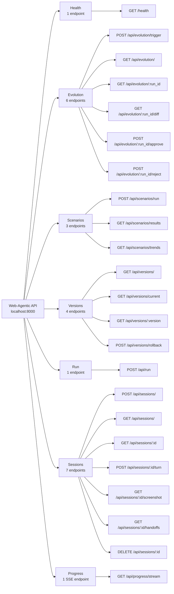

> **[한국어 버전 (Korean)](./API-REFERENCE.ko.md)**

# Web-Agentic Evolution API Reference

## 1. Overview

The Web-Agentic Evolution API is a **FastAPI-based REST API** server that exposes the self-evolving automation engine. It provides endpoints for triggering evolution cycles, running scenarios, managing versions, and streaming real-time progress events.

| Property | Value |
|---|---|
| **Base URL** | `http://localhost:8000` |
| **Authentication** | None (local development only) |
| **Response Format** | JSON (all endpoints) |
| **CORS Origins** | `http://localhost:5173`, `http://localhost:3000` |
| **OpenAPI Docs** | `http://localhost:8000/docs` (Swagger UI) |

### Quick Start

```bash
pip install -e ".[server]"
python scripts/start_server.py        # API server on localhost:8000
cd evolution-ui && npm run dev         # UI on localhost:5173
```

---

## 2. Endpoint Groups



---

## 3. Health Check

### `GET /health`

Returns the service health status.

**Response:**

```json
{
  "status": "ok",
  "service": "evolution-api"
}
```

**curl:**

```bash
curl http://localhost:8000/health
```

---

## 4. Evolution Endpoints

### 4.1 Trigger Evolution

#### `POST /api/evolution/trigger`

Triggers a new evolution cycle. The pipeline runs asynchronously in the background and progresses through the state machine: `PENDING -> ANALYZING -> GENERATING -> TESTING -> AWAITING_APPROVAL`.

**Request Body:** `EvolutionTriggerRequest`

| Field | Type | Required | Description |
|---|---|---|---|
| `reason` | `str` | No (default: `"manual"`) | Trigger reason |
| `scenario_filter` | `str \| null` | No | Only analyze this scenario |

**Response:** `StatusResponse`

```json
{
  "status": "accepted",
  "message": "Evolution run abc-123 started",
  "data": {
    "run_id": "abc-123"
  }
}
```

**curl:**

```bash
curl -X POST http://localhost:8000/api/evolution/trigger \
  -H "Content-Type: application/json" \
  -d '{"reason": "manual"}'
```

---

### 4.2 List Evolution Runs

#### `GET /api/evolution/`

Returns a list of evolution runs, ordered by most recent first.

**Query Parameters:**

| Parameter | Type | Required | Description |
|---|---|---|---|
| `limit` | `int` | No (default: `50`) | Maximum number of results |
| `status` | `str` | No | Filter by status (e.g., `awaiting_approval`, `merged`, `rejected`) |

**Response:** `list[EvolutionRunSummary]`

```json
[
  {
    "id": "abc-123",
    "status": "awaiting_approval",
    "trigger_reason": "manual",
    "branch_name": "evo/abc-123",
    "analysis_summary": "Fixed selector for login button",
    "created_at": "2026-02-24T10:00:00Z",
    "updated_at": "2026-02-24T10:05:00Z",
    "completed_at": null,
    "error_message": null
  }
]
```

**curl:**

```bash
curl "http://localhost:8000/api/evolution/?limit=10"
```

---

### 4.3 Get Evolution Detail

#### `GET /api/evolution/{run_id}`

Returns the full detail of an evolution run, including all file changes.

**Path Parameters:**

| Parameter | Type | Description |
|---|---|---|
| `run_id` | `str` | The evolution run ID |

**Response:** `EvolutionRunDetail`

Returns all fields from `EvolutionRunSummary` plus:

| Field | Type | Description |
|---|---|---|
| `trigger_data` | `str` | JSON-encoded trigger parameters |
| `base_commit` | `str \| null` | Git commit the evolution branched from |
| `changes` | `list[EvolutionChangeItem]` | List of file changes |

**Error Responses:**

| Status | Description |
|---|---|
| `404` | Evolution run not found |

**curl:**

```bash
curl http://localhost:8000/api/evolution/abc-123
```

---

### 4.4 Get Evolution Diff

#### `GET /api/evolution/{run_id}/diff`

Returns the code diff for an evolution run, showing what files were modified, created, or deleted.

**Path Parameters:**

| Parameter | Type | Description |
|---|---|---|
| `run_id` | `str` | The evolution run ID |

**Response:**

```json
{
  "run_id": "abc-123",
  "branch_name": "evo/abc-123",
  "changes": [
    {
      "file_path": "src/core/orchestrator.py",
      "change_type": "modify",
      "diff_content": "--- a/src/core/orchestrator.py\n+++ b/src/core/orchestrator.py\n...",
      "description": "Fixed selector cache lookup"
    }
  ]
}
```

**Error Responses:**

| Status | Description |
|---|---|
| `404` | Evolution run not found |

**curl:**

```bash
curl http://localhost:8000/api/evolution/abc-123/diff
```

---

### 4.5 Approve Evolution

#### `POST /api/evolution/{run_id}/approve`

Approves an evolution run. This merges the evolution branch into main and creates a new version tag.

**Path Parameters:**

| Parameter | Type | Description |
|---|---|---|
| `run_id` | `str` | The evolution run ID |

**Request Body:** `ApproveRejectRequest`

| Field | Type | Required | Description |
|---|---|---|---|
| `comment` | `str \| null` | No | Optional approval comment |

**Response:** `StatusResponse`

```json
{
  "status": "merged",
  "message": "Merged as version 0.1.1",
  "data": {
    "version": "0.1.1",
    "run_id": "abc-123"
  }
}
```

**Error Responses:**

| Status | Description |
|---|---|
| `400` | Run status is not `awaiting_approval` |
| `404` | Evolution run not found |
| `500` | Merge failed |

**curl:**

```bash
curl -X POST http://localhost:8000/api/evolution/abc-123/approve \
  -H "Content-Type: application/json" \
  -d '{"comment": "LGTM"}'
```

---

### 4.6 Reject Evolution

#### `POST /api/evolution/{run_id}/reject`

Rejects an evolution run. This deletes the evolution branch and marks the run as rejected.

**Path Parameters:**

| Parameter | Type | Description |
|---|---|---|
| `run_id` | `str` | The evolution run ID |

**Request Body:** `ApproveRejectRequest`

| Field | Type | Required | Description |
|---|---|---|---|
| `comment` | `str \| null` | No | Optional rejection comment |

**Response:** `StatusResponse`

```json
{
  "status": "rejected",
  "message": "Evolution run abc-123 rejected",
  "data": {
    "run_id": "abc-123"
  }
}
```

**Error Responses:**

| Status | Description |
|---|---|
| `400` | Run status is not `awaiting_approval` |
| `404` | Evolution run not found |

**curl:**

```bash
curl -X POST http://localhost:8000/api/evolution/abc-123/reject \
  -H "Content-Type: application/json" \
  -d '{"comment": "Needs revision"}'
```

---

## 5. Scenario Endpoints

### 5.1 Run Scenarios

#### `POST /api/scenarios/run`

Triggers scenario execution in the background. Returns immediately with an accepted status. Progress is streamed via the SSE endpoint.

**Request Body:** `ScenarioRunRequest`

| Field | Type | Required | Description |
|---|---|---|---|
| `headless` | `bool` | No (default: `true`) | Run browser in headless mode |
| `max_cost` | `float` | No (default: `0.50`) | Maximum cost budget in USD |
| `filter_name` | `str \| null` | No | Filter scenarios by name substring |

**Response:** `StatusResponse`

```json
{
  "status": "accepted",
  "message": "Scenario run started in background",
  "data": {
    "headless": true,
    "max_cost": 0.5
  }
}
```

**curl:**

```bash
curl -X POST http://localhost:8000/api/scenarios/run \
  -H "Content-Type: application/json" \
  -d '{"headless": true}'
```

---

### 5.2 List Scenario Results

#### `GET /api/scenarios/results`

Returns historical scenario execution results.

**Query Parameters:**

| Parameter | Type | Required | Description |
|---|---|---|---|
| `scenario_name` | `str` | No | Filter results by scenario name |
| `limit` | `int` | No (default: `100`) | Maximum number of results |

**Response:** `list[ScenarioResultItem]`

```json
[
  {
    "id": "result-001",
    "scenario_name": "google_search",
    "version": "0.1.0",
    "overall_success": true,
    "total_steps_ok": 5,
    "total_steps_all": 5,
    "total_cost_usd": 0.012,
    "total_tokens": 1500,
    "wall_time_s": 8.3,
    "error_summary": null,
    "created_at": "2026-02-24T10:30:00Z"
  }
]
```

**curl:**

```bash
curl "http://localhost:8000/api/scenarios/results?limit=10"
```

---

### 5.3 Get Scenario Trends

#### `GET /api/scenarios/trends`

Returns aggregated trend data for each scenario, including success rate, average cost, and average execution time.

**Response:** `list[ScenarioTrendItem]`

```json
[
  {
    "scenario_name": "google_search",
    "total_runs": 20,
    "successes": 18,
    "avg_cost": 0.011,
    "avg_time": 7.5,
    "success_rate": 90.0
  }
]
```

**curl:**

```bash
curl http://localhost:8000/api/scenarios/trends
```

---

## 6. Version Endpoints

### 6.1 List Versions

#### `GET /api/versions/`

Returns a list of all version records.

**Query Parameters:**

| Parameter | Type | Required | Description |
|---|---|---|---|
| `limit` | `int` | No (default: `50`) | Maximum number of results |

**Response:** `list[VersionRecord]`

```json
[
  {
    "id": "ver-001",
    "version": "0.1.1",
    "previous_version": "0.1.0",
    "evolution_run_id": "abc-123",
    "changelog": "Fixed login selector for updated UI",
    "test_results": {"passed": 742, "failed": 0},
    "git_tag": "v0.1.1",
    "git_commit": "a1b2c3d",
    "created_at": "2026-02-24T11:00:00Z"
  }
]
```

**curl:**

```bash
curl http://localhost:8000/api/versions/
```

---

### 6.2 Get Current Version

#### `GET /api/versions/current`

Returns the latest (current) version string.

**Response:**

```json
{
  "version": "0.1.1"
}
```

**curl:**

```bash
curl http://localhost:8000/api/versions/current
```

---

### 6.3 Get Version Detail

#### `GET /api/versions/{version}`

Returns the full detail of a specific version record.

**Path Parameters:**

| Parameter | Type | Description |
|---|---|---|
| `version` | `str` | The version string (e.g., `0.1.1`) |

**Response:** `VersionRecord`

```json
{
  "id": "ver-001",
  "version": "0.1.1",
  "previous_version": "0.1.0",
  "evolution_run_id": "abc-123",
  "changelog": "Fixed login selector for updated UI",
  "test_results": {"passed": 742, "failed": 0},
  "git_tag": "v0.1.1",
  "git_commit": "a1b2c3d",
  "created_at": "2026-02-24T11:00:00Z"
}
```

**Error Responses:**

| Status | Description |
|---|---|
| `404` | Version not found |

**curl:**

```bash
curl http://localhost:8000/api/versions/0.1.1
```

---

### 6.4 Rollback Version

#### `POST /api/versions/rollback`

Rolls back to a previous version. This creates a new version record that points to the target version's state.

**Request Body:** `RollbackRequest`

| Field | Type | Required | Description |
|---|---|---|---|
| `target_version` | `str` | Yes | Version to rollback to |

**Response:** `StatusResponse`

```json
{
  "status": "rolled_back",
  "message": "Rolled back to 0.1.0 as version 0.1.2",
  "data": {
    "new_version": "0.1.2",
    "target_version": "0.1.0"
  }
}
```

**Error Responses:**

| Status | Description |
|---|---|
| `404` | Target version not found |
| `500` | Rollback failed |

**curl:**

```bash
curl -X POST http://localhost:8000/api/versions/rollback \
  -H "Content-Type: application/json" \
  -d '{"target_version": "0.1.0"}'
```

---

## 7. One-Shot Run Endpoint

### 7.1 Run Automation

#### `POST /api/run`

Executes a single automation task without creating a persistent session. The browser is launched, the task is executed, and the browser is closed. Suitable for simple, one-off automation tasks.

**Request Body:** `OneShotRequest`

| Field | Type | Required | Description |
|---|---|---|---|
| `url` | `str` | Yes | Target URL to navigate to |
| `intent` | `str` | Yes | Natural language intent to execute |
| `headless` | `bool` | No (default: `true`) | Run browser in headless mode |
| `max_cost_usd` | `float` | No (default: `0.10`) | Maximum cost budget |

**Response:** `OneShotResponse`

```json
{
  "success": true,
  "steps": [
    {
      "action": "click",
      "selector": "a[href='https://www.iana.org/domains/example']",
      "description": "Click 'More information...' link",
      "success": true,
      "cost_usd": 0.003
    }
  ],
  "total_cost_usd": 0.012,
  "total_tokens": 1200,
  "wall_time_s": 3.5,
  "error": null
}
```

**Error Responses:**

| Status | Description |
|---|---|
| `422` | Validation error (missing url or intent) |
| `500` | Execution failed |

**curl:**

```bash
curl -X POST http://localhost:8000/api/run \
  -H "Content-Type: application/json" \
  -d '{"url": "https://example.com", "intent": "click the More information link"}'
```

---

## 8. Session Endpoints

### 8.1 Create Session

#### `POST /api/sessions/`

Creates a new multi-turn automation session with a persistent browser instance.

**Request Body:** `CreateSessionRequest`

| Field | Type | Required | Description |
|---|---|---|---|
| `url` | `str` | Yes | Initial URL to navigate to |
| `headless` | `bool` | No (default: `true`) | Run browser in headless mode |
| `max_cost_usd` | `float` | No (default: `1.00`) | Maximum cost budget for the session |
| `timeout_minutes` | `int` | No (default: `30`) | Session idle timeout in minutes |

**Response:** `CreateSessionResponse`

```json
{
  "session_id": "sess-abc123",
  "status": "active",
  "url": "https://example.com",
  "created_at": "2026-02-24T10:00:00Z"
}
```

**curl:**

```bash
curl -X POST http://localhost:8000/api/sessions/ \
  -H "Content-Type: application/json" \
  -d '{"url": "https://example.com", "headless": true}'
```

---

### 8.2 List Sessions

#### `GET /api/sessions/`

Returns a list of sessions, ordered by most recent first.

**Query Parameters:**

| Parameter | Type | Required | Description |
|---|---|---|---|
| `status` | `str` | No | Filter by status (`active`, `closed`, `expired`) |
| `limit` | `int` | No (default: `50`) | Maximum number of results |

**Response:** `list[SessionListItem]`

```json
[
  {
    "session_id": "sess-abc123",
    "status": "active",
    "url": "https://example.com",
    "turn_count": 3,
    "total_cost_usd": 0.025,
    "created_at": "2026-02-24T10:00:00Z",
    "last_activity_at": "2026-02-24T10:05:00Z"
  }
]
```

**curl:**

```bash
curl "http://localhost:8000/api/sessions/?status=active&limit=10"
```

---

### 8.3 Get Session Detail

#### `GET /api/sessions/{session_id}`

Returns the full detail of a session including turn history.

**Path Parameters:**

| Parameter | Type | Description |
|---|---|---|
| `session_id` | `str` | The session ID |

**Response:** `SessionDetail`

```json
{
  "session_id": "sess-abc123",
  "status": "active",
  "url": "https://example.com",
  "headless": true,
  "max_cost_usd": 1.0,
  "total_cost_usd": 0.025,
  "turn_count": 3,
  "turns": [
    {
      "turn_id": "turn-001",
      "intent": "click the login button",
      "success": true,
      "steps_ok": 1,
      "steps_all": 1,
      "cost_usd": 0.008,
      "created_at": "2026-02-24T10:01:00Z"
    }
  ],
  "created_at": "2026-02-24T10:00:00Z",
  "last_activity_at": "2026-02-24T10:05:00Z"
}
```

**Error Responses:**

| Status | Description |
|---|---|
| `404` | Session not found |

**curl:**

```bash
curl http://localhost:8000/api/sessions/sess-abc123
```

---

### 8.4 Execute Turn

#### `POST /api/sessions/{session_id}/turn`

Executes a new intent within an existing session. The browser state is preserved from previous turns.

**Path Parameters:**

| Parameter | Type | Description |
|---|---|---|
| `session_id` | `str` | The session ID |

**Request Body:** `ExecuteTurnRequest`

| Field | Type | Required | Description |
|---|---|---|---|
| `intent` | `str` | Yes | Natural language intent to execute |

**Response:** `ExecuteTurnResponse`

```json
{
  "turn_id": "turn-004",
  "success": true,
  "steps": [
    {
      "action": "fill",
      "selector": "#search-input",
      "description": "Type 'web automation' into search field",
      "success": true,
      "cost_usd": 0.003
    },
    {
      "action": "click",
      "selector": "button[type='submit']",
      "description": "Click search button",
      "success": true,
      "cost_usd": 0.002
    }
  ],
  "cost_usd": 0.005,
  "total_session_cost_usd": 0.030,
  "error": null
}
```

**Error Responses:**

| Status | Description |
|---|---|
| `400` | Session is not active (closed or expired) |
| `404` | Session not found |
| `429` | Cost budget exceeded |

**curl:**

```bash
curl -X POST http://localhost:8000/api/sessions/sess-abc123/turn \
  -H "Content-Type: application/json" \
  -d '{"intent": "search for web automation"}'
```

---

### 8.5 Get Screenshot

#### `GET /api/sessions/{session_id}/screenshot`

Returns a PNG screenshot of the current browser page state.

**Path Parameters:**

| Parameter | Type | Description |
|---|---|---|
| `session_id` | `str` | The session ID |

**Response:** `image/png` (binary)

**Error Responses:**

| Status | Description |
|---|---|
| `400` | Session is not active |
| `404` | Session not found |

**curl:**

```bash
curl http://localhost:8000/api/sessions/sess-abc123/screenshot -o screenshot.png
```

---

### 8.6 List Handoffs

#### `GET /api/sessions/{session_id}/handoffs`

Returns pending human handoff requests for a session (e.g., CAPTCHA, authentication).

**Path Parameters:**

| Parameter | Type | Description |
|---|---|---|
| `session_id` | `str` | The session ID |

**Response:** `list[HandoffItem]`

```json
[
  {
    "request_id": "hoff-001",
    "type": "captcha",
    "description": "CAPTCHA detected on login page",
    "screenshot_url": "/api/sessions/sess-abc123/screenshot",
    "created_at": "2026-02-24T10:03:00Z"
  }
]
```

**Error Responses:**

| Status | Description |
|---|---|
| `404` | Session not found |

**curl:**

```bash
curl http://localhost:8000/api/sessions/sess-abc123/handoffs
```

---

### 8.7 Resolve Handoff

#### `POST /api/sessions/{session_id}/handoffs/{request_id}/resolve`

Resolves a pending human handoff request, allowing automation to continue.

**Path Parameters:**

| Parameter | Type | Description |
|---|---|---|
| `session_id` | `str` | The session ID |
| `request_id` | `str` | The handoff request ID |

**Request Body:** `ResolveHandoffRequest`

| Field | Type | Required | Description |
|---|---|---|---|
| `action` | `str` | Yes | Resolution action (`completed`, `skipped`) |
| `data` | `dict` | No | Additional data (e.g., solved CAPTCHA value) |

**Response:** `StatusResponse`

```json
{
  "status": "resolved",
  "message": "Handoff hoff-001 resolved",
  "data": {
    "request_id": "hoff-001",
    "action": "completed"
  }
}
```

**Error Responses:**

| Status | Description |
|---|---|
| `404` | Session or handoff not found |
| `400` | Handoff already resolved |

**curl:**

```bash
curl -X POST http://localhost:8000/api/sessions/sess-abc123/handoffs/hoff-001/resolve \
  -H "Content-Type: application/json" \
  -d '{"action": "completed"}'
```

---

### 8.8 Close Session

#### `DELETE /api/sessions/{session_id}`

Closes a session and releases the browser instance.

**Path Parameters:**

| Parameter | Type | Description |
|---|---|---|
| `session_id` | `str` | The session ID |

**Response:** `StatusResponse`

```json
{
  "status": "closed",
  "message": "Session sess-abc123 closed",
  "data": {
    "session_id": "sess-abc123",
    "total_cost_usd": 0.030,
    "turn_count": 4
  }
}
```

**Error Responses:**

| Status | Description |
|---|---|
| `404` | Session not found |

**curl:**

```bash
curl -X DELETE http://localhost:8000/api/sessions/sess-abc123
```

---

## 9. SSE Progress Stream

### `GET /api/progress/stream`

A Server-Sent Events (SSE) endpoint that streams real-time progress updates for evolution cycles and scenario runs. The connection stays open and events are pushed as they occur.

**Event Types:**

| Event | Description | Data Fields |
|---|---|---|
| `evolution_status` | Evolution run status change | `run_id`, `status`, `error` |
| `scenario_progress` | Scenario execution progress | `scenario_name`, `status`, `success`, `cost_usd` |
| `version_created` | New version created | `version`, `previous_version`, `changelog` |
| `session_created` | New session created | `session_id`, `url` |
| `session_turn_started` | Turn execution started | `session_id`, `turn_id`, `intent` |
| `session_turn_completed` | Turn execution completed | `session_id`, `turn_id`, `success`, `cost_usd` |
| `session_closed` | Session closed | `session_id`, `total_cost_usd`, `turn_count` |
| `session_expired` | Session expired due to timeout | `session_id` |
| `handoff_requested` | Human handoff requested | `session_id`, `request_id`, `type` |
| `handoff_resolved` | Human handoff resolved | `session_id`, `request_id`, `action` |

**Example Event Payloads:**

```
event: evolution_status
data: {"run_id": "abc-123", "status": "analyzing"}

event: scenario_progress
data: {"scenario_name": "google_search", "status": "completed", "success": true, "cost_usd": 0.012}

event: version_created
data: {"version": "0.1.1", "previous_version": "0.1.0", "changelog": "Fixed login selector"}
```

**JavaScript Subscription:**

```javascript
const es = new EventSource('http://localhost:8000/api/progress/stream');

es.addEventListener('evolution_status', (e) => {
  const data = JSON.parse(e.data);
  console.log(`Evolution ${data.run_id}: ${data.status}`);
});

es.addEventListener('scenario_progress', (e) => {
  const data = JSON.parse(e.data);
  console.log(`Scenario ${data.scenario_name}: ${data.status}`);
});

es.addEventListener('version_created', (e) => {
  const data = JSON.parse(e.data);
  console.log(`New version: ${data.version}`);
});

es.onerror = (e) => {
  console.error('SSE connection error:', e);
};
```

**curl:**

```bash
curl -N http://localhost:8000/api/progress/stream
```

---

## 10. Data Models

All request and response models are defined as Pydantic v2 `BaseModel` classes in `src/api/models.py`.

### StatusResponse

Generic status response used by most mutation endpoints.

| Field | Type | Required | Description |
|---|---|---|---|
| `status` | `str` | Yes | Status code (e.g., `accepted`, `merged`, `rejected`, `rolled_back`) |
| `message` | `str` | Yes | Human-readable status message |
| `data` | `dict` | No (default: `{}`) | Additional data payload |

---

### EvolutionTriggerRequest

Request body for triggering a new evolution cycle.

| Field | Type | Required | Description |
|---|---|---|---|
| `reason` | `str` | No (default: `"manual"`) | Reason for triggering the evolution |
| `scenario_filter` | `str \| null` | No | Restrict analysis to a specific scenario |

---

### ApproveRejectRequest

Request body for approving or rejecting an evolution run.

| Field | Type | Required | Description |
|---|---|---|---|
| `comment` | `str \| null` | No | Optional comment explaining the decision |

---

### EvolutionRunSummary

Summary representation of an evolution run.

| Field | Type | Required | Description |
|---|---|---|---|
| `id` | `str` | Yes | Unique evolution run identifier |
| `status` | `str` | Yes | Current status (`pending`, `analyzing`, `generating`, `testing`, `awaiting_approval`, `approved`, `merged`, `rejected`, `failed`) |
| `trigger_reason` | `str` | Yes | Why this evolution was triggered |
| `branch_name` | `str \| null` | No | Git branch name for this evolution |
| `analysis_summary` | `str \| null` | No | Summary of failure analysis |
| `created_at` | `str` | Yes | ISO 8601 creation timestamp |
| `updated_at` | `str` | Yes | ISO 8601 last update timestamp |
| `completed_at` | `str \| null` | No | ISO 8601 completion timestamp |
| `error_message` | `str \| null` | No | Error message if the run failed |

---

### EvolutionRunDetail

Detailed evolution run (extends `EvolutionRunSummary`).

Includes all fields from `EvolutionRunSummary` plus:

| Field | Type | Required | Description |
|---|---|---|---|
| `trigger_data` | `str` | No (default: `"{}"`) | JSON-encoded trigger parameters |
| `base_commit` | `str \| null` | No | Git commit SHA the evolution branched from |
| `changes` | `list[EvolutionChangeItem]` | No (default: `[]`) | List of file changes in this evolution |

---

### EvolutionChangeItem

A single file change produced by an evolution run.

| Field | Type | Required | Description |
|---|---|---|---|
| `id` | `str` | Yes | Unique change identifier |
| `file_path` | `str` | Yes | Path of the changed file |
| `change_type` | `str` | Yes | Type of change: `modify`, `create`, or `delete` |
| `diff_content` | `str \| null` | No | Unified diff content |
| `description` | `str` | Yes | Human-readable description of the change |
| `created_at` | `str` | Yes | ISO 8601 creation timestamp |

---

### ScenarioRunRequest

Request body for triggering scenario execution.

| Field | Type | Required | Description |
|---|---|---|---|
| `headless` | `bool` | No (default: `true`) | Whether to run the browser in headless mode |
| `max_cost` | `float` | No (default: `0.50`) | Maximum total cost budget in USD |
| `filter_name` | `str \| null` | No | Filter scenarios by name substring |

---

### ScenarioResultItem

A single scenario execution result record.

| Field | Type | Required | Description |
|---|---|---|---|
| `id` | `str` | Yes | Unique result identifier |
| `scenario_name` | `str` | Yes | Name of the scenario |
| `version` | `str \| null` | No | Engine version at execution time |
| `overall_success` | `bool` | Yes | Whether the scenario passed |
| `total_steps_ok` | `int` | No (default: `0`) | Number of successful steps |
| `total_steps_all` | `int` | No (default: `0`) | Total number of steps |
| `total_cost_usd` | `float` | No (default: `0.0`) | Total LLM cost in USD |
| `total_tokens` | `int` | No (default: `0`) | Total tokens consumed |
| `wall_time_s` | `float` | No (default: `0.0`) | Wall-clock execution time in seconds |
| `error_summary` | `str \| null` | No | Summary of errors if the scenario failed |
| `created_at` | `str` | Yes | ISO 8601 creation timestamp |

---

### ScenarioTrendItem

Aggregated trend data for a scenario across multiple runs.

| Field | Type | Required | Description |
|---|---|---|---|
| `scenario_name` | `str` | Yes | Name of the scenario |
| `total_runs` | `int` | Yes | Total number of executions |
| `successes` | `int` | Yes | Number of successful runs |
| `avg_cost` | `float` | Yes | Average cost per run in USD |
| `avg_time` | `float` | Yes | Average execution time in seconds |
| `success_rate` | `float` | No (default: `0.0`) | Success rate as a percentage (0--100) |

---

### VersionRecord

A version record created when an evolution is approved and merged.

| Field | Type | Required | Description |
|---|---|---|---|
| `id` | `str` | Yes | Unique version record identifier |
| `version` | `str` | Yes | Semantic version string (e.g., `0.1.1`) |
| `previous_version` | `str \| null` | No | The version this was upgraded from |
| `evolution_run_id` | `str \| null` | No | The evolution run that produced this version |
| `changelog` | `str` | Yes | Description of changes in this version |
| `test_results` | `dict` | No (default: `{}`) | Test execution results (e.g., `{"passed": 742, "failed": 0}`) |
| `git_tag` | `str \| null` | No | Git tag name (e.g., `v0.1.1`) |
| `git_commit` | `str \| null` | No | Git commit SHA |
| `created_at` | `str` | Yes | ISO 8601 creation timestamp |

---

### RollbackRequest

Request body for rolling back to a previous version.

| Field | Type | Required | Description |
|---|---|---|---|
| `target_version` | `str` | Yes | The version string to rollback to |

---

### OneShotRequest

Request body for one-shot automation execution.

| Field | Type | Required | Description |
|---|---|---|---|
| `url` | `str` | Yes | Target URL to navigate to |
| `intent` | `str` | Yes | Natural language intent to execute |
| `headless` | `bool` | No (default: `true`) | Whether to run the browser in headless mode |
| `max_cost_usd` | `float` | No (default: `0.10`) | Maximum cost budget in USD |

---

### OneShotResponse

Response from a one-shot automation execution.

| Field | Type | Required | Description |
|---|---|---|---|
| `success` | `bool` | Yes | Whether the task completed successfully |
| `steps` | `list[StepResult]` | No (default: `[]`) | List of executed steps |
| `total_cost_usd` | `float` | No (default: `0.0`) | Total LLM cost in USD |
| `total_tokens` | `int` | No (default: `0`) | Total tokens consumed |
| `wall_time_s` | `float` | No (default: `0.0`) | Wall-clock execution time in seconds |
| `error` | `str \| null` | No | Error message if execution failed |

---

### CreateSessionRequest

Request body for creating a new multi-turn session.

| Field | Type | Required | Description |
|---|---|---|---|
| `url` | `str` | Yes | Initial URL to navigate to |
| `headless` | `bool` | No (default: `true`) | Whether to run the browser in headless mode |
| `max_cost_usd` | `float` | No (default: `1.00`) | Maximum cost budget for the session |
| `timeout_minutes` | `int` | No (default: `30`) | Session idle timeout in minutes |

---

### CreateSessionResponse

Response when a new session is created.

| Field | Type | Required | Description |
|---|---|---|---|
| `session_id` | `str` | Yes | Unique session identifier |
| `status` | `str` | Yes | Session status (`active`) |
| `url` | `str` | Yes | Initial URL |
| `created_at` | `str` | Yes | ISO 8601 creation timestamp |

---

### SessionListItem

Summary representation of a session.

| Field | Type | Required | Description |
|---|---|---|---|
| `session_id` | `str` | Yes | Unique session identifier |
| `status` | `str` | Yes | Session status (`active`, `closed`, `expired`) |
| `url` | `str` | Yes | Session URL |
| `turn_count` | `int` | No (default: `0`) | Number of turns executed |
| `total_cost_usd` | `float` | No (default: `0.0`) | Total session cost in USD |
| `created_at` | `str` | Yes | ISO 8601 creation timestamp |
| `last_activity_at` | `str \| null` | No | ISO 8601 last activity timestamp |

---

### SessionDetail

Detailed session information including turn history.

Includes all fields from `SessionListItem` plus:

| Field | Type | Required | Description |
|---|---|---|---|
| `headless` | `bool` | Yes | Whether browser is headless |
| `max_cost_usd` | `float` | Yes | Cost budget for the session |
| `turns` | `list[TurnSummary]` | No (default: `[]`) | List of turn summaries |

---

### ExecuteTurnRequest

Request body for executing a turn within a session.

| Field | Type | Required | Description |
|---|---|---|---|
| `intent` | `str` | Yes | Natural language intent to execute |

---

### ExecuteTurnResponse

Response from a turn execution.

| Field | Type | Required | Description |
|---|---|---|---|
| `turn_id` | `str` | Yes | Unique turn identifier |
| `success` | `bool` | Yes | Whether the turn completed successfully |
| `steps` | `list[StepResult]` | No (default: `[]`) | List of executed steps |
| `cost_usd` | `float` | No (default: `0.0`) | Cost of this turn in USD |
| `total_session_cost_usd` | `float` | No (default: `0.0`) | Total session cost so far |
| `error` | `str \| null` | No | Error message if the turn failed |

---

### HandoffItem

A pending human handoff request.

| Field | Type | Required | Description |
|---|---|---|---|
| `request_id` | `str` | Yes | Unique handoff request identifier |
| `type` | `str` | Yes | Handoff type (`captcha`, `auth`, `manual`) |
| `description` | `str` | Yes | Human-readable description of the handoff |
| `screenshot_url` | `str \| null` | No | URL to a screenshot of the page |
| `created_at` | `str` | Yes | ISO 8601 creation timestamp |

---

### ResolveHandoffRequest

Request body for resolving a human handoff.

| Field | Type | Required | Description |
|---|---|---|---|
| `action` | `str` | Yes | Resolution action (`completed`, `skipped`) |
| `data` | `dict` | No (default: `{}`) | Additional resolution data |

---

### StepResult

A single step result within a turn or one-shot execution.

| Field | Type | Required | Description |
|---|---|---|---|
| `action` | `str` | Yes | Action type (`click`, `fill`, `navigate`, etc.) |
| `selector` | `str \| null` | No | CSS selector or element identifier |
| `description` | `str` | Yes | Human-readable step description |
| `success` | `bool` | Yes | Whether the step succeeded |
| `cost_usd` | `float` | No (default: `0.0`) | LLM cost for this step |

---

## Error Responses

All error responses follow FastAPI's standard error format:

```json
{
  "detail": "Human-readable error message"
}
```

| HTTP Status | Description |
|---|---|
| `400` | Bad request (e.g., invalid state transition) |
| `404` | Resource not found |
| `422` | Validation error (invalid request body) |
| `500` | Internal server error |

Validation errors (`422`) include detailed field-level information:

```json
{
  "detail": [
    {
      "loc": ["body", "target_version"],
      "msg": "Field required",
      "type": "missing"
    }
  ]
}
```
