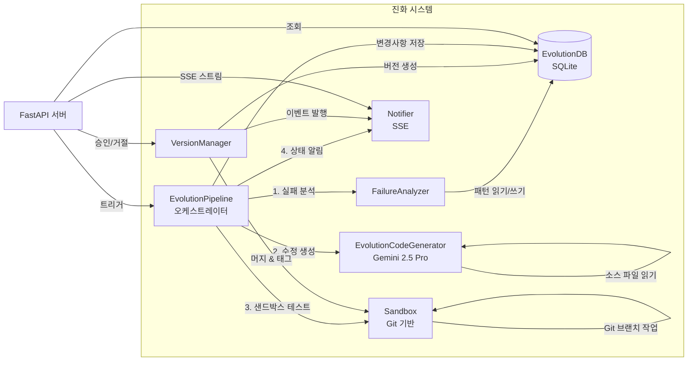
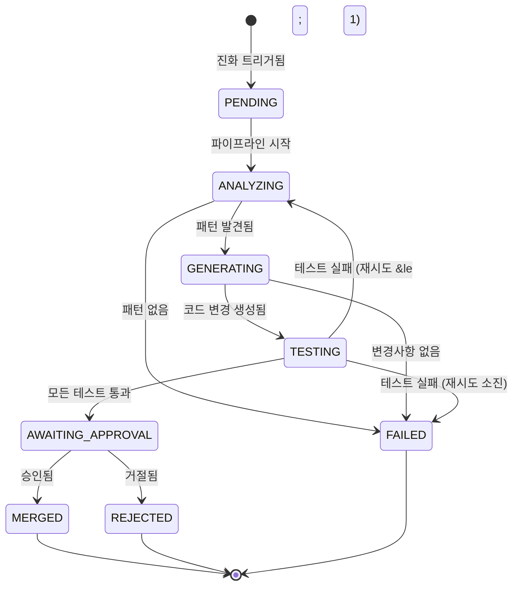
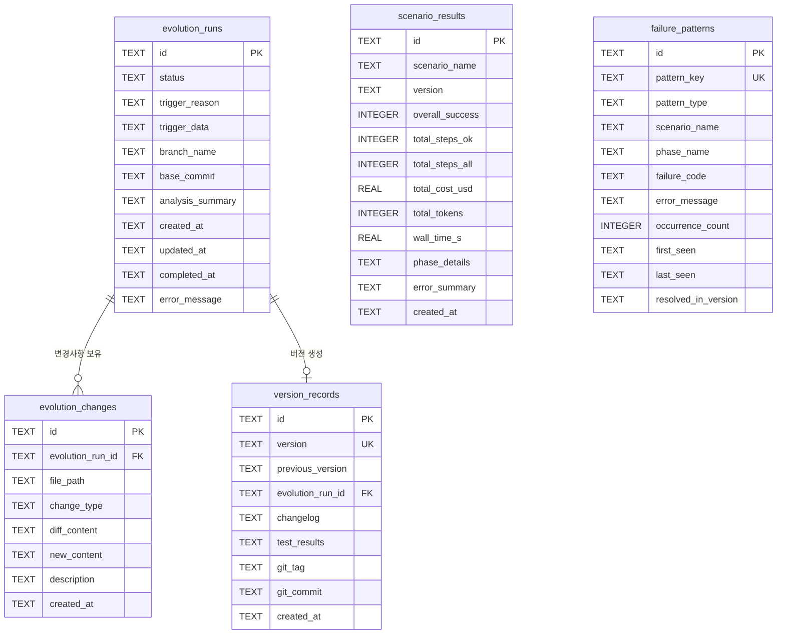
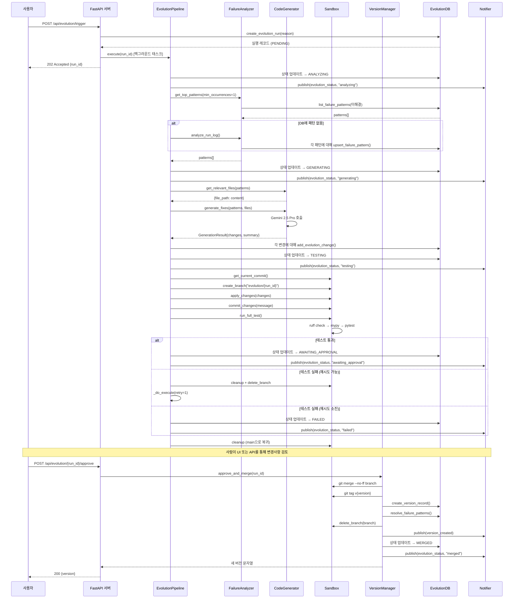

# 자가 진화 엔진

> **[English Version](./EVOLUTION-ENGINE.md)**

## 1. 개요 및 동기

자가 진화 엔진은 자동화 실패와 코드 수정 사이의 피드백 루프를 닫는 자율 개선 시스템입니다. 웹 자동화 엔진이 시나리오 실행 중 실패를 겪으면, 진화 시스템이 다음과 같이 동작합니다:

1. **감지**: 시나리오 결과에서 반복되는 실패 패턴을 탐지
2. **분석**: 실패를 분류하여 조치 가능한 패턴 유형으로 정리
3. **생성**: Gemini 2.5 Pro를 활용해 맞춤형 코드 수정 생성
4. **테스트**: Git 기반 샌드박스에서 변경사항 검증 (린트, 타입 체크, 단위 테스트)
5. **사람의 승인 대기**: 메인 브랜치 머지 전 반드시 사람이 확인
6. **버전 관리**: 머지된 모든 변경에 시맨틱 태그를 부여하여 추적 및 롤백 가능

이를 통해 지속적인 개선 사이클이 만들어집니다. 시스템은 시간이 지남에 따라 웹 자동화 과제를 더 잘 처리하게 되며, 동시에 사람이 승인 루프에 참여하고 Git으로 모든 변경을 추적함으로써 안전성을 보장합니다.

**핵심 설계 원칙:**

- **사람이 루프에 참여 (Human-in-the-loop)**: 명시적 승인 없이는 어떤 코드 변경도 머지되지 않음
- **Git 네이티브 격리**: 모든 변경은 피처 브랜치에서 테스트하며, main에는 직접 적용하지 않음
- **최소 diff**: LLM에게 집중적이고 최소한의 변경만 생성하도록 프롬프팅
- **완전한 관측 가능성**: SSE 실시간 이벤트, DB 감사 로그, 버전 이력 제공

---

## 2. 컴포넌트 아키텍처



**컴포넌트 역할:**

| 컴포넌트 | 모듈 | 역할 |
|---------|------|------|
| **EvolutionPipeline** | `src/evolution/pipeline.py` | 전체 진화 사이클을 관장하는 상태 머신 |
| **FailureAnalyzer** | `src/evolution/analyzer.py` | 실패 패턴 탐지 및 분류 |
| **EvolutionCodeGenerator** | `src/evolution/code_generator.py` | LLM 기반 코드 수정 생성 |
| **Sandbox** | `src/evolution/sandbox.py` | Git 브랜치 격리 및 테스트 실행 |
| **VersionManager** | `src/evolution/version_manager.py` | 머지, 태그, 롤백 관리 |
| **EvolutionDB** | `src/evolution/db.py` | 비동기 SQLite 영속 계층 |
| **Notifier** | `src/evolution/notifier.py` | SSE 이벤트 브로드캐스터 |

---

## 3. 파이프라인 상태 머신



**재시도 로직:** 테스트가 실패하면 파이프라인은 처음부터 다시 분석하고 재생성하는 방식으로 1회 재시도합니다. `MAX_RETRIES = 1` 상수가 이 동작을 제어합니다. 재시도 시 이전 브랜치는 정리되고 새로운 시도가 이루어집니다.

---

## 4. 컴포넌트 상세

### 4.1 FailureAnalyzer

**모듈:** `src/evolution/analyzer.py`

FailureAnalyzer는 시나리오 결과를 검사하여 반복되는 실패 패턴을 탐지합니다. 두 가지 모드로 동작합니다:

- **DB 모드**: `scenario_results` 테이블에서 최근 결과를 읽어 페이즈 수준 실패 분석
- **로그 모드**: `testing/run_log.json`을 직접 파싱하여 스텝 수준 실패 상세 분석

**패턴 분류**는 에러 메시지를 키워드 매칭으로 10가지 유형 중 하나로 분류합니다:

| 패턴 유형 | 키워드 | 설명 |
|----------|--------|------|
| `selector_not_found` | SelectorNotFound, selector, element not found, locator | DOM에서 대상 요소를 찾지 못함 |
| `timeout` | timeout, TimeoutError, timed out | 작업 시간 초과 |
| `parse_error` | parse, JSON, json.decoder | LLM 응답 파싱 실패 |
| `budget_exceeded` | budget, cost, BudgetExceeded | 토큰/비용 예산 초과 |
| `captcha` | captcha, CAPTCHA, CaptchaDetected | CAPTCHA 발견 |
| `network_error` | NetworkError, network, ERR_ | 네트워크 연결 문제 |
| `auth_required` | AuthRequired, login, auth | 인증 필요 |
| `not_interactable` | NotInteractable, not interactable, disabled | 요소 클릭/입력 불가 |
| `state_not_changed` | StateNotChanged, state, unchanged | 액션이 효과 없음 |
| `unknown` | _(기본값)_ | 분류 불가 실패 |

**패턴 키**는 `{scenario_name}|{phase_name}|{pattern_type}`의 SHA-256 해시 결정론적 값으로, 멱등 upsert를 보장합니다. 동일 패턴이 발생할 때마다 `occurrence_count`가 증가합니다.

### 4.2 EvolutionCodeGenerator

**모듈:** `src/evolution/code_generator.py`

코드 생성기는 런타임 `LLMPlanner`와 분리된 전용 LLM 클라이언트입니다. 이렇게 분리하는 이유는:

- 비용 회계를 독립적으로 관리 (진화 작업 vs 런타임 작업)
- 항상 Pro 등급 모델 사용 (런타임은 비용 절감을 위해 Flash 사용)

**설정:**

| 항목 | 값 |
|------|-----|
| 모델 | `gemini-3.1-pro-preview` (`GEMINI_PRO_MODEL` 환경변수로 변경 가능) |
| 비용 추적 | 입력 $2.00/1M, 출력 $12.00/1M 토큰 |
| API 키 | `GEMINI_API_KEY` 또는 `GOOGLE_API_KEY` 환경 변수 |

**LLM 입력:**

1. **실패 패턴** (JSON): 발생 횟수가 포함된 분류된 패턴
2. **관련 소스 파일**: 패턴 유형에 따라 자동 선택 (아래 매핑 참조)
3. **프로젝트 컨벤션**: `CLAUDE.md`의 일부분 (3,000자까지 잘라서 사용)

**패턴-모듈 매핑:**

```python
{
    "selector_not_found": ["src/core/llm_orchestrator.py", "src/ai/llm_planner.py", "src/core/extractor.py"],
    "timeout":           ["src/core/llm_orchestrator.py", "src/core/executor.py"],
    "parse_error":       ["src/ai/llm_planner.py", "src/ai/prompt_manager.py"],
    "budget_exceeded":   ["src/ai/llm_planner.py", "src/core/llm_orchestrator.py"],
    "captcha":           ["src/core/llm_orchestrator.py", "src/vision/vlm_client.py"],
    "not_interactable":  ["src/core/executor.py", "src/core/llm_orchestrator.py"],
}
```

**출력 형식:** `summary`와 `changes` 배열을 포함하는 구조화된 JSON:

```json
{
  "summary": "변경 내용과 이유에 대한 간략한 설명",
  "changes": [
    {
      "file_path": "src/path/to/file.py",
      "change_type": "modify",
      "new_content": "...전체 파일 내용...",
      "description": "이 파일에서 변경된 내용"
    }
  ]
}
```

**변경 유형:** `modify` (기존 파일 수정), `create` (새 파일 생성), `delete` (파일 삭제).

### 4.3 Sandbox

**모듈:** `src/evolution/sandbox.py`

Sandbox는 생성된 코드 변경사항을 안전하게 적용하고 검증할 수 있는 Git 기반 테스트 환경을 제공합니다. main 브랜치에는 영향을 주지 않습니다.

**생명 주기:**

1. main의 커밋되지 않은 변경사항을 **stash**
2. main에서 `evolution/{run_id}` 피처 브랜치 **생성**
3. 코드 변경사항 **적용** (파일 쓰기, 필요 시 디렉토리 생성)
4. 변경사항을 브랜치에 **커밋**
5. 전체 테스트 파이프라인 **실행**
6. **정리** 시 항상 main으로 복귀하고 stash 복원

**테스트 파이프라인** (순차 실행, 심각한 실패 시 중단):

| 단계 | 명령어 | 제한 시간 | 차단 여부 |
|------|--------|----------|----------|
| 린트 | `ruff check src/ --fix` | 60초 | 차단 |
| 타입 체크 | `mypy src/ --strict` | 120초 | 비차단 (정보 제공용) |
| 단위 테스트 | `pytest tests/unit tests/integration -x --tb=short -q` | 300초 | 차단 |

**전체 통과 기준:** 린트 통과 AND 단위 테스트 통과. 타입 체크 실패는 로그에 기록되지만 진행을 차단하지 않습니다.

**안전 보장:**

- `finally` 블록이 항상 main으로 체크아웃하고 stash를 복원
- 모든 서브프로세스 명령은 타임아웃과 함께 `asyncio.create_subprocess_exec` 사용
- 타임아웃을 초과한 프로세스는 강제 종료

### 4.4 VersionManager

**모듈:** `src/evolution/version_manager.py`

사람의 승인 이후 버전 생명 주기를 관리합니다.

**승인 플로우:**

1. 진화 브랜치를 `--no-ff`로 main에 머지 (머지 커밋 보존)
2. Git 태그 `v{version}` 생성 (예: `v0.1.1`)
3. changelog와 함께 DB에 버전 레코드 생성
4. 미해결 실패 패턴을 해당 버전에서 해결됨으로 표시
5. 머지된 브랜치 삭제
6. `version_created` 및 `evolution_status` SSE 이벤트 발행

**버전 체계:** 자동 패치 범프를 적용하는 시맨틱 버전 관리 (`0.1.0` -> `0.1.1` -> `0.1.2`).

**롤백 플로우:**

1. 대상 버전의 Git 태그 조회
2. 해당 태그로 체크아웃
3. 새 버전 레코드 생성 (되돌리기가 아닌 새 패치 버전)
4. 롤백 버전에 태그 부여
5. main으로 복귀
6. `version_created` 이벤트 발행

### 4.5 Notifier

**모듈:** `src/evolution/notifier.py`

`asyncio.Queue`를 사용하여 여러 연결된 클라이언트에 팬아웃하는 SSE (Server-Sent Events) 브로드캐스터입니다.

**아키텍처:**

- 각 SSE 클라이언트는 전용 `asyncio.Queue` 할당 (최대 크기: 256)
- 이벤트 발행 시 모든 구독자 큐에 동시 전달
- 가득 찬 큐(죽은 큐)는 발행 시 자동 정리
- `close()` 호출 시 `None` 센티널을 보내 모든 클라이언트를 정상 종료

**이벤트 유형:**

| 이벤트 | 트리거 | 페이로드 |
|--------|--------|---------|
| `evolution_status` | 파이프라인 상태 전이 | `{run_id, status, error?}` |
| `scenario_progress` | 시나리오 실행 업데이트 | `{scenario_name, status, success?, cost_usd?}` |
| `version_created` | 새 버전 머지 또는 롤백 | `{version, previous_version, evolution_run_id?, changelog?}` |

**SSE 형식:**

```
id: 1
event: evolution_status
data: {"run_id": "abc123", "status": "analyzing"}

```

### 4.6 EvolutionDB

**모듈:** `src/evolution/db.py`

`aiosqlite`를 사용하는 비동기 SQLite 래퍼로, 메인 `PatternDB`와 동일한 패턴을 따릅니다. 데이터베이스 파일은 `data/evolution.db`에 자동 생성됩니다.

**주요 작업:**

- **진화 실행 (Evolution runs)**: 상태 필터링이 가능한 전체 CRUD
- **진화 변경사항 (Evolution changes)**: 실행별 파일 변경 레코드
- **버전 레코드 (Version records)**: changelog와 Git 메타데이터를 포함한 버전 이력
- **시나리오 결과 (Scenario results)**: 페이즈 수준 상세 정보를 포함한 실행 결과
- **실패 패턴 (Failure patterns)**: 발생 횟수 카운팅과 해결 추적이 가능한 upsert

---

## 5. 데이터베이스 스키마



**참고사항:**

- 모든 ID는 16자 16진수 문자열 (UUID4 접두사)
- 타임스탬프는 ISO 8601 UTC 문자열 (예: `2025-05-15T12:00:00+00:00`)
- `phase_details`와 `test_results`는 JSON 인코딩된 TEXT 컬럼
- `overall_success`는 SQLite에 INTEGER (0/1)로 저장되고, Python에서 bool로 변환
- `failure_patterns.pattern_key`는 시나리오/페이즈/유형 조합의 유일성을 보장하는 SHA-256 해시 접두사

---

## 6. 전체 진화 사이클



---

## 7. 시나리오 시스템

시나리오는 사전 정의된 웹 자동화 작업으로, 기능 테스트와 진화 엔진의 실패 신호 소스 두 가지 역할을 합니다.

**시나리오 생명 주기:**

1. `testing/scenarios/definitions.yaml`에 시나리오 정의
2. `POST /api/scenarios/run`으로 실행 (백그라운드 실행)
3. 각 시나리오는 여러 페이즈, 각 페이즈는 여러 스텝으로 구성
4. 결과는 페이즈 수준 상세 정보와 함께 `scenario_results`에 저장
5. 실행 후 `FailureAnalyzer.analyze_latest_results()`가 자동 실행
6. 탐지된 패턴이 진화 파이프라인으로 전달

**API 엔드포인트:**

| 메서드 | 경로 | 설명 |
|--------|------|------|
| `POST` | `/api/scenarios/run` | 시나리오 실행 트리거 (비동기) |
| `GET` | `/api/scenarios/results` | 시나리오 결과 목록 (필터링 가능) |
| `GET` | `/api/scenarios/trends` | 시나리오별 집계된 성공률 |

**트렌드 집계:** SQL 윈도우 함수를 사용하여 시나리오별 최근 10회 실행의 성공률, 평균 비용, 평균 소요 시간을 산출합니다.

---

## 8. 단계별 사용 가이드

### 사전 준비

```bash
# 의존성 설치 (FastAPI, aiosqlite 등 포함)
pip install -e ".[server]"

# Gemini API 키 설정
export GEMINI_API_KEY="your-api-key-here"

# API 서버 시작
python scripts/start_server.py
# 서버가 http://localhost:8000에서 실행됩니다
```

### 전체 워크플로우

**1단계: 진화 사이클 트리거**

```bash
curl -X POST http://localhost:8000/api/evolution/trigger \
  -H "Content-Type: application/json" \
  -d '{"reason": "manual"}'
```

응답:
```json
{
  "status": "accepted",
  "message": "Evolution run abc1234567890def started",
  "data": {"run_id": "abc1234567890def"}
}
```

**2단계: SSE로 진행 상황 모니터링**

```bash
curl -N http://localhost:8000/api/progress/stream
```

출력 (스트리밍):
```
event: evolution_status
data: {"run_id": "abc1234567890def", "status": "analyzing", "error": null}

event: evolution_status
data: {"run_id": "abc1234567890def", "status": "generating", "error": null}

event: evolution_status
data: {"run_id": "abc1234567890def", "status": "testing", "error": null}

event: evolution_status
data: {"run_id": "abc1234567890def", "status": "awaiting_approval", "error": null}
```

**3단계: 진화 실행 목록 조회**

```bash
curl http://localhost:8000/api/evolution/
```

**4단계: 코드 diff 확인**

```bash
curl http://localhost:8000/api/evolution/abc1234567890def/diff
```

응답:
```json
{
  "run_id": "abc1234567890def",
  "branch_name": "evolution/abc1234567890def",
  "changes": [
    {
      "file_path": "src/core/llm_orchestrator.py",
      "change_type": "modify",
      "diff_content": "...",
      "description": "셀렉터 타임아웃에 대한 재시도 로직 추가"
    }
  ]
}
```

**5단계: 승인 및 머지**

```bash
curl -X POST http://localhost:8000/api/evolution/abc1234567890def/approve \
  -H "Content-Type: application/json" \
  -d '{"comment": "LGTM"}'
```

응답:
```json
{
  "status": "merged",
  "message": "Merged as version 0.1.1",
  "data": {"version": "0.1.1", "run_id": "abc1234567890def"}
}
```

**6단계: 현재 버전 확인**

```bash
curl http://localhost:8000/api/versions/current
```

응답:
```json
{"version": "0.1.1"}
```

### 추가 작업

**진화 거절:**

```bash
curl -X POST http://localhost:8000/api/evolution/abc1234567890def/reject \
  -H "Content-Type: application/json" \
  -d '{"comment": "변경 범위가 너무 넓음"}'
```

**시나리오 실행:**

```bash
curl -X POST http://localhost:8000/api/scenarios/run \
  -H "Content-Type: application/json" \
  -d '{"headless": true, "max_cost": 0.50}'
```

**시나리오 트렌드 조회:**

```bash
curl http://localhost:8000/api/scenarios/trends
```

**이전 버전으로 롤백:**

```bash
curl -X POST http://localhost:8000/api/versions/rollback \
  -H "Content-Type: application/json" \
  -d '{"target_version": "0.1.0"}'
```

---

## 9. 설정 및 환경 변수

| 변수 | 필수 여부 | 기본값 | 설명 |
|------|----------|-------|------|
| `GEMINI_API_KEY` | 필수 | - | 코드 생성용 Google Gemini API 키 |
| `GOOGLE_API_KEY` | 대체 | - | Gemini API 키의 대체 환경 변수 |

**데이터베이스:**

- 경로: `data/evolution.db` (SQLite)
- 첫 `EvolutionDB.init()` 호출 시 자동 생성
- `CREATE TABLE IF NOT EXISTS`로 테이블 생성

**서버:**

- 프레임워크: FastAPI + sse-starlette
- 포트: 8000 (기본값)
- 진입점: `python scripts/start_server.py`

**의존성:**

```bash
pip install -e ".[server]"
```

FastAPI, uvicorn, sse-starlette, aiosqlite, google-genai를 포함하는 server 엑스트라 그룹이 설치됩니다.

**UI (선택사항):**

```bash
cd evolution-ui
npm install
npm run dev
# UI가 http://localhost:5173에서 실행됩니다
```

React UI는 4개의 페이지를 제공합니다: 대시보드, 진화 목록, 시나리오, 버전 관리.
