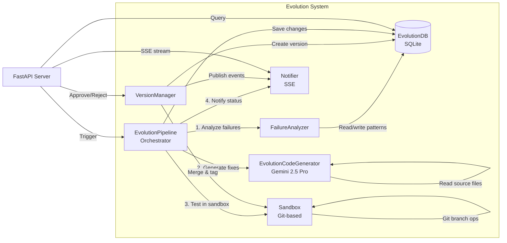
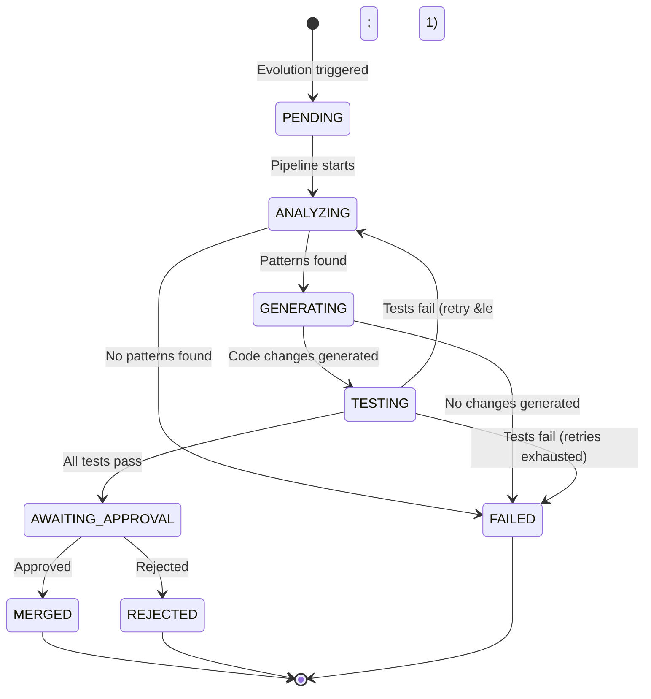
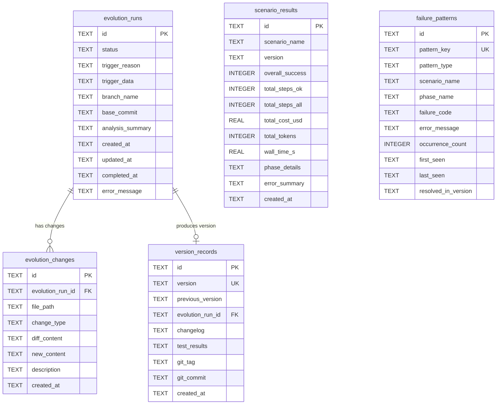
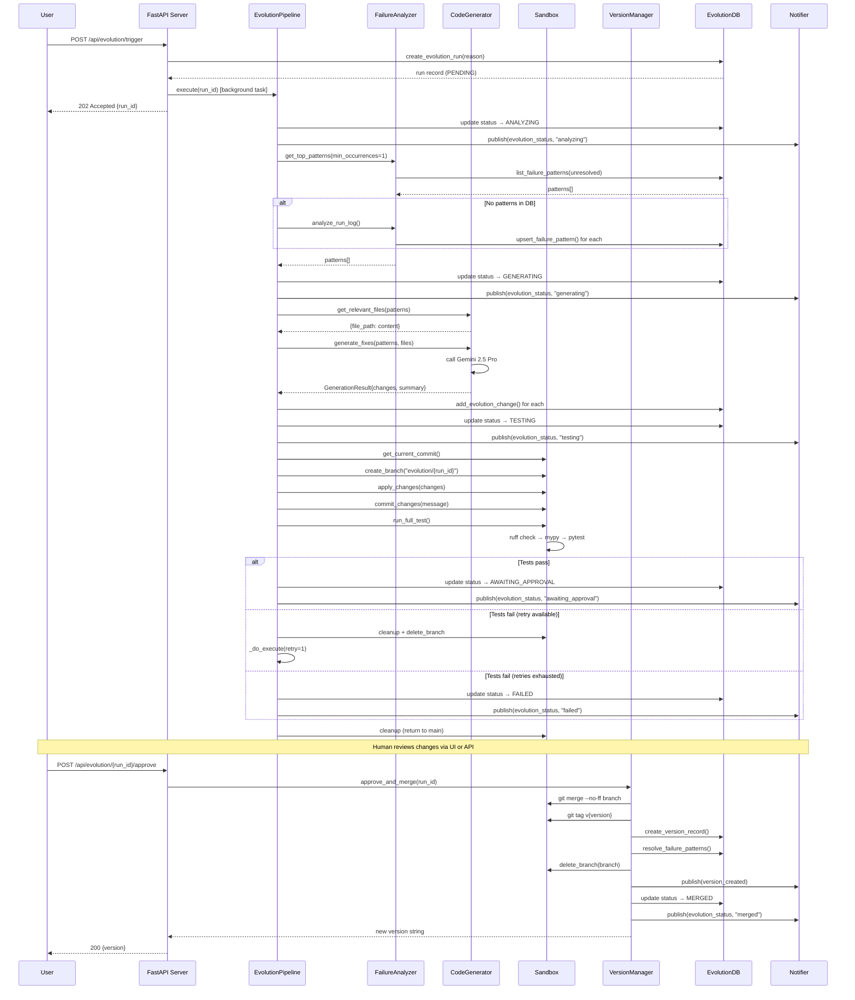

# Self-Evolving Engine

> **[한국어 버전 (Korean)](./EVOLUTION-ENGINE.ko.md)**

## 1. Overview & Motivation

The Self-Evolving Engine is an autonomous improvement system that closes the feedback loop between automation failures and code fixes. When the web automation engine encounters failures during scenario execution, the evolution system:

1. **Detects** recurring failure patterns from scenario results
2. **Analyzes** failures and classifies them into actionable pattern types
3. **Generates** targeted code fixes using Gemini 2.5 Pro
4. **Tests** changes in a Git-based sandbox (lint, type check, unit tests)
5. **Awaits human approval** before merging into the main branch
6. **Versions** every merged change with semantic tags for traceability and rollback

This creates a continuous improvement cycle: the system gets better at handling web automation challenges over time, while maintaining safety through human-in-the-loop approval and full Git traceability.

**Key design decisions:**

- **Human-in-the-loop**: No code changes are merged without explicit approval
- **Git-native isolation**: All changes are tested on feature branches, never on main
- **Minimal diffs**: The LLM is prompted to generate focused, minimal changes
- **Full observability**: SSE real-time events, DB audit trail, version history

---

## 2. Component Architecture



**Component responsibilities:**

| Component | Module | Role |
|-----------|--------|------|
| **EvolutionPipeline** | `src/evolution/pipeline.py` | State machine orchestrating the full cycle |
| **FailureAnalyzer** | `src/evolution/analyzer.py` | Detects and classifies failure patterns |
| **EvolutionCodeGenerator** | `src/evolution/code_generator.py` | LLM-powered code fix generation |
| **Sandbox** | `src/evolution/sandbox.py` | Git branch isolation and test execution |
| **VersionManager** | `src/evolution/version_manager.py` | Merge, tag, and rollback management |
| **EvolutionDB** | `src/evolution/db.py` | Async SQLite persistence layer |
| **Notifier** | `src/evolution/notifier.py` | SSE event broadcaster |

---

## 3. Pipeline State Machine



**Retry logic:** When tests fail, the pipeline retries once by re-analyzing and re-generating from scratch. The constant `MAX_RETRIES = 1` controls this behavior. On retry, the previous branch is cleaned up and a fresh attempt is made.

---

## 4. Components Deep-Dive

### 4.1 FailureAnalyzer

**Module:** `src/evolution/analyzer.py`

The FailureAnalyzer inspects scenario results to detect recurring failure patterns. It operates in two modes:

- **DB mode**: Reads recent scenario results from the `scenario_results` table and analyzes phase-level failures
- **Log mode**: Directly parses `testing/run_log.json` for step-level failure details

**Pattern classification** maps error messages to one of 10 pattern types using keyword matching:

| Pattern Type | Keywords | Description |
|-------------|----------|-------------|
| `selector_not_found` | SelectorNotFound, selector, element not found, locator | Target element missing from DOM |
| `timeout` | timeout, TimeoutError, timed out | Operation exceeded time limit |
| `parse_error` | parse, JSON, json.decoder | LLM response parsing failure |
| `budget_exceeded` | budget, cost, BudgetExceeded | Token/cost budget exceeded |
| `captcha` | captcha, CAPTCHA, CaptchaDetected | CAPTCHA encountered |
| `network_error` | NetworkError, network, ERR_ | Network connectivity issue |
| `auth_required` | AuthRequired, login, auth | Authentication needed |
| `not_interactable` | NotInteractable, not interactable, disabled | Element not clickable/typable |
| `state_not_changed` | StateNotChanged, state, unchanged | Action had no effect |
| `unknown` | _(fallback)_ | Unclassified failure |

**Pattern keys** are deterministic SHA-256 hashes of `{scenario_name}|{phase_name}|{pattern_type}`, ensuring idempotent upserts. Each occurrence increments the `occurrence_count`.

### 4.2 EvolutionCodeGenerator

**Module:** `src/evolution/code_generator.py`

The code generator is a dedicated LLM client isolated from the runtime `LLMPlanner`. This separation enables:

- Independent cost accounting (evolution vs. runtime operations)
- Always using Pro-tier model (runtime uses Flash for cost efficiency)

**Configuration:**

| Setting | Value |
|---------|-------|
| Model | `gemini-3.1-pro-preview` (configurable via `GEMINI_PRO_MODEL` env var) |
| Cost tracking | $2.00/1M input, $12.00/1M output tokens |
| API Key | `GEMINI_API_KEY` or `GOOGLE_API_KEY` env var |

**Input to the LLM:**

1. **Failure patterns** (JSON): Classified patterns with occurrence counts
2. **Relevant source files**: Automatically selected based on pattern type (see mapping below)
3. **Project conventions**: Subset of `CLAUDE.md` (truncated to 3,000 chars)

**Pattern-to-module mapping:**

```python
{
    "selector_not_found": ["src/core/llm_orchestrator.py", "src/ai/llm_planner.py", "src/core/extractor.py"],
    "timeout":           ["src/core/llm_orchestrator.py", "src/core/executor.py"],
    "parse_error":       ["src/ai/llm_planner.py", "src/ai/prompt_manager.py"],
    "budget_exceeded":   ["src/ai/llm_planner.py", "src/core/llm_orchestrator.py"],
    "captcha":           ["src/core/llm_orchestrator.py", "src/vision/vlm_client.py"],
    "not_interactable":  ["src/core/executor.py", "src/core/llm_orchestrator.py"],
}
```

**Output format:** Structured JSON with `summary` and `changes` array:

```json
{
  "summary": "Brief description of what was changed and why",
  "changes": [
    {
      "file_path": "src/path/to/file.py",
      "change_type": "modify",
      "new_content": "...full file content...",
      "description": "What was changed in this file"
    }
  ]
}
```

**Change types:** `modify` (update existing file), `create` (new file), `delete` (remove file).

### 4.3 Sandbox

**Module:** `src/evolution/sandbox.py`

The Sandbox provides a Git-based testing environment where generated code changes can be safely applied and validated without affecting the main branch.

**Lifecycle:**

1. **Stash** uncommitted changes on main
2. **Create** feature branch `evolution/{run_id}` from main
3. **Apply** code changes (write files, create directories as needed)
4. **Commit** changes to the branch
5. **Run** the full test pipeline
6. **Cleanup** always returns to main and restores stash

**Test pipeline** (sequential, stops on first critical failure):

| Step | Command | Timeout | Blocking |
|------|---------|---------|----------|
| Lint | `ruff check src/ --fix` | 60s | Yes |
| Type check | `mypy src/ --strict` | 120s | No (informational) |
| Unit tests | `pytest tests/unit tests/integration -x --tb=short -q` | 300s | Yes |

**Overall pass criteria:** Lint passes AND unit tests pass. Type check failures are logged but do not block.

**Safety guarantees:**

- `finally` block always checks out main and pops stash
- All subprocess commands use `asyncio.create_subprocess_exec` with timeouts
- Processes that exceed timeout are killed

### 4.4 VersionManager

**Module:** `src/evolution/version_manager.py`

Manages the version lifecycle after human approval.

**Approve flow:**

1. Merge the evolution branch into main with `--no-ff` (preserves merge commit)
2. Create Git tag `v{version}` (e.g., `v0.1.1`)
3. Create a version record in DB with changelog
4. Mark all unresolved failure patterns as resolved in this version
5. Delete the merged branch
6. Publish `version_created` and `evolution_status` SSE events

**Versioning scheme:** Semantic versioning with automatic patch bumps (`0.1.0` -> `0.1.1` -> `0.1.2`).

**Rollback flow:**

1. Look up the target version's Git tag
2. Checkout the tag
3. Create a new version record (not a revert -- a new patch version)
4. Tag the rollback version
5. Return to main
6. Publish `version_created` event

### 4.5 Notifier

**Module:** `src/evolution/notifier.py`

SSE (Server-Sent Events) broadcaster using `asyncio.Queue` for fan-out to multiple connected clients.

**Architecture:**

- Each SSE client gets a dedicated `asyncio.Queue` (max size: 256)
- Events are published to all subscriber queues simultaneously
- Dead queues (full) are automatically cleaned up on publish
- `close()` sends `None` sentinel to gracefully disconnect all clients

**Event types:**

| Event | Trigger | Payload |
|-------|---------|---------|
| `evolution_status` | Pipeline state transitions | `{run_id, status, error?}` |
| `scenario_progress` | Scenario execution updates | `{scenario_name, status, success?, cost_usd?}` |
| `version_created` | New version merged or rollback | `{version, previous_version, evolution_run_id?, changelog?}` |

**SSE format:**

```
id: 1
event: evolution_status
data: {"run_id": "abc123", "status": "analyzing"}

```

### 4.6 EvolutionDB

**Module:** `src/evolution/db.py`

Async SQLite wrapper using `aiosqlite`, following the same patterns as the main `PatternDB`. Database file is auto-created at `data/evolution.db`.

**Key operations:**

- **Evolution runs**: Full CRUD with status filtering
- **Evolution changes**: Per-run file change records
- **Version records**: Version history with changelog and Git metadata
- **Scenario results**: Execution results with phase-level details
- **Failure patterns**: Upsert with occurrence counting, resolution tracking

---

## 5. Database Schema



**Notes:**

- All IDs are 16-character hex strings (UUID4 prefix)
- Timestamps are ISO 8601 UTC strings (e.g., `2025-05-15T12:00:00+00:00`)
- `phase_details` and `test_results` are JSON-encoded TEXT columns
- `overall_success` is stored as INTEGER (0/1) in SQLite, converted to bool in Python
- `failure_patterns.pattern_key` is a SHA-256 hash prefix ensuring uniqueness per scenario/phase/type

---

## 6. Full Evolution Cycle



---

## 7. Scenario System

Scenarios are predefined web automation tasks that serve as both functional tests and failure signal sources for the evolution engine.

**Scenario lifecycle:**

1. Scenarios are defined in `testing/scenarios/definitions.yaml`
2. Executed via `POST /api/scenarios/run` (runs in background)
3. Each scenario has multiple phases, each phase has multiple steps
4. Results are stored in `scenario_results` with phase-level detail
5. After execution, `FailureAnalyzer.analyze_latest_results()` runs automatically
6. Detected patterns feed into the evolution pipeline

**API endpoints:**

| Method | Path | Description |
|--------|------|-------------|
| `POST` | `/api/scenarios/run` | Trigger scenario execution (async) |
| `GET` | `/api/scenarios/results` | List scenario results (filterable) |
| `GET` | `/api/scenarios/trends` | Aggregated success rates per scenario |

**Trend aggregation:** Calculates success rate, average cost, and average wall time over the last 10 runs per scenario using SQL window functions.

---

## 8. Step-by-Step Usage Guide

### Prerequisites

```bash
# Install dependencies (includes FastAPI, aiosqlite, etc.)
pip install -e ".[server]"

# Set Gemini API key
export GEMINI_API_KEY="your-api-key-here"

# Start the API server
python scripts/start_server.py
# Server runs on http://localhost:8000
```

### Full Workflow

**Step 1: Trigger an evolution cycle**

```bash
curl -X POST http://localhost:8000/api/evolution/trigger \
  -H "Content-Type: application/json" \
  -d '{"reason": "manual"}'
```

Response:
```json
{
  "status": "accepted",
  "message": "Evolution run abc1234567890def started",
  "data": {"run_id": "abc1234567890def"}
}
```

**Step 2: Monitor progress via SSE**

```bash
curl -N http://localhost:8000/api/progress/stream
```

Output (streaming):
```
event: evolution_status
data: {"run_id": "abc1234567890def", "status": "analyzing", "error": null}

event: evolution_status
data: {"run_id": "abc1234567890def", "status": "generating", "error": null}

event: evolution_status
data: {"run_id": "abc1234567890def", "status": "testing", "error": null}

event: evolution_status
data: {"run_id": "abc1234567890def", "status": "awaiting_approval", "error": null}
```

**Step 3: List evolution runs**

```bash
curl http://localhost:8000/api/evolution/
```

**Step 4: View the code diff**

```bash
curl http://localhost:8000/api/evolution/abc1234567890def/diff
```

Response:
```json
{
  "run_id": "abc1234567890def",
  "branch_name": "evolution/abc1234567890def",
  "changes": [
    {
      "file_path": "src/core/llm_orchestrator.py",
      "change_type": "modify",
      "diff_content": "...",
      "description": "Added retry logic for selector timeout"
    }
  ]
}
```

**Step 5: Approve and merge**

```bash
curl -X POST http://localhost:8000/api/evolution/abc1234567890def/approve \
  -H "Content-Type: application/json" \
  -d '{"comment": "LGTM"}'
```

Response:
```json
{
  "status": "merged",
  "message": "Merged as version 0.1.1",
  "data": {"version": "0.1.1", "run_id": "abc1234567890def"}
}
```

**Step 6: Check current version**

```bash
curl http://localhost:8000/api/versions/current
```

Response:
```json
{"version": "0.1.1"}
```

### Additional Operations

**Reject an evolution:**

```bash
curl -X POST http://localhost:8000/api/evolution/abc1234567890def/reject \
  -H "Content-Type: application/json" \
  -d '{"comment": "Changes too broad"}'
```

**Run scenarios:**

```bash
curl -X POST http://localhost:8000/api/scenarios/run \
  -H "Content-Type: application/json" \
  -d '{"headless": true, "max_cost": 0.50}'
```

**View scenario trends:**

```bash
curl http://localhost:8000/api/scenarios/trends
```

**Rollback to a previous version:**

```bash
curl -X POST http://localhost:8000/api/versions/rollback \
  -H "Content-Type: application/json" \
  -d '{"target_version": "0.1.0"}'
```

---

## 9. Configuration & Environment Variables

| Variable | Required | Default | Description |
|----------|----------|---------|-------------|
| `GEMINI_API_KEY` | Yes | - | Google Gemini API key for code generation |
| `GOOGLE_API_KEY` | Fallback | - | Alternative env var for Gemini API key |

**Database:**

- Path: `data/evolution.db` (SQLite)
- Auto-created on first `EvolutionDB.init()` call
- Tables are created with `CREATE TABLE IF NOT EXISTS`

**Server:**

- Framework: FastAPI with sse-starlette
- Port: 8000 (default)
- Entry point: `python scripts/start_server.py`

**Dependencies:**

```bash
pip install -e ".[server]"
```

This installs the server extras group which includes FastAPI, uvicorn, sse-starlette, aiosqlite, and google-genai.

**UI (optional):**

```bash
cd evolution-ui
npm install
npm run dev
# UI runs on http://localhost:5173
```

The React UI provides 4 pages: Dashboard, Evolutions, Scenarios, and Versions.
