# 아키텍처 v4.3: 정찰 → 실행번들 생성 → 자가 개선 웹 자동화 엔진

> **문서 ID**: RECON_CODEGEN_ARCHITECTURE_v4.3
> **버전**: 4.3 | **작성일**: 2026-03-02
> **v3 대비 변경**: "반응형 실행(시도→실패→복구)"에서 **"정찰 선행 → 사이트별 코드 생성 → 자가 개선"** 패러다임으로 전환.
> **핵심 도구**: LangGraph (워크플로우 상태머신) + LiteLLM (멀티모델 라우팅) + Opik (트레이싱/프롬프트 최적화)

### 0.1 외부 리뷰 반영 원칙 (v4.3)

| 항목 | 판단 | 반영 |
|---|---|---|
| 사이트별 정찰 선행 | 수용 | `SiteProfile` 중심으로 유지 |
| LangGraph + LiteLLM 조합 | 수용 | 상태머신/모델 라우팅 축으로 유지 |
| 정찰 결과 기반 자동 생성 | 수용 | 단, **DSL-first**로 보정 — 자유 코드 대신 검증 가능한 DSL 우선 |
| 자유형 Python 코드 즉시 반영 | 비수용 | 샌드박스 + Replay + Canary 통과 후 승격 |
| 프롬프트 최적화 상시 운영 | 보류 | 실패 데이터 충분 시에만 배치 최적화 (Opik 스케줄러) |
| 비용 수치 단정 | 비수용 | 비용은 환경/호출량 의존 **추정치**로 표기 |

---

## 1. 핵심 아이디어

**한 문장**: 사이트를 먼저 정찰해서 "이 사이트는 이렇게 생겼다"를 **운영에 필요한 수준으로** 파악한 뒤, 그 정보로 자동화 산출물(DSL/코드/프롬프트)을 생성하고, 실행 결과를 피드백으로 계속 개선한다.

```
v3 (반응형):  태스크 받음 → 실행 시도 → 실패 → LLM 복구 → 성공 패턴 캐시
v4 (선행 정찰):  사이트 방문 → 정찰 1회 → SiteProfile 생성
                → SiteProfile 기반 자동화 코드 생성
                → 코드 실행 → 결과 피드백 → 코드/프롬프트 개선
                → 사이트 변경 감지 시 재정찰
```

**왜 정찰이 먼저인가?**

v3는 매 태스크마다 "이 페이지에 뭐가 있지?"를 물었다. DOM 분석, 객체 검출, VLM 호출—매번.
v4는 사이트 단위로 한 번 깊이 분석하고, 그 결과를 **사이트 프로파일**로 저장한다.
이후 태스크는 프로파일을 참조해서 코드를 생성하므로, 런타임 LLM 호출이 극적으로 줄어든다.

**v3 vs v4 비용 비교 (네이버 쇼핑 10태스크 기준, 추정치)**:

| | v3 | v4 |
|---|---|---|
| 첫 태스크 | ~$0.012 (Planner+VLM) | ~$0.05 (정찰 1회, 1회성) |
| 2~10번째 태스크 | ~$0.005~$0.012 × 9 | ~$0~$0.002 × 9 |
| **합계** | **~$0.057~$0.120** | **~$0.050~$0.068** |
| 50태스크 누적 | ~$0.25~$0.60 | **~$0.05~$0.15** |

정찰 비용은 1회성이지만, 사이트 변동률/실패율/모델 라우팅 정책에 따라 누적 비용은 달라진다.

### 1.1 실행 성숙도 3단계 — Cold / Warm / Hot

사이트별로 자동화가 얼마나 성숙했는지에 따라 LLM/VLM 사용량이 극적으로 달라진다.

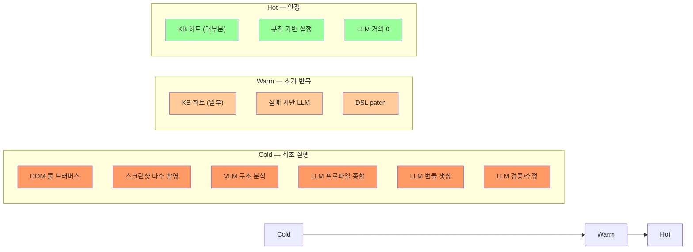

#### Cold (최초 실행) — LLM/VLM 최대 사용

사이트에 대한 지식이 전혀 없는 상태. **가능한 모든 수단을 동원**해서 사이트를 파악한다.

| 동작 | LLM/VLM 호출 | 설명 |
|------|-------------|------|
| DOM 풀 트래버스 | 0 | Playwright + CDP로 전체 DOM 구조 수집 |
| 스크린샷 다수 촬영 | 0 | 메인, 카테고리, 검색결과 등 주요 페이지별 캡처 |
| 로컬 객체 탐지 | 0 | YOLO26(CPU)/RT-DETRv4(GPU)로 UI 요소 검출 |
| VLM 시각 분석 | **Vision 1~3회** | Canvas, 이미지 heavy 페이지 구조 파악 |
| 네비게이션 크롤링 | 0 | ~5페이지 탐색, URL 패턴 수집 |
| SiteProfile 종합 | **Flash 1~2회** | 3단계 정찰 결과를 SiteProfile로 통합 |
| 번들 생성 | **Flash/Codegen 1~3회** | DSL + 매크로 + 프롬프트 생성 |
| 검증 + 수정 | **Flash 0~2회** | Replay 실패 시 재생성 |
| **합계** | **LLM 3~10회** | 사이트당 1회성. 이후 KB에 캐시 |

**핵심**: Cold 단계는 비용이 가장 높지만, 사이트당 **딱 1회**만 발생한다. 이 투자로 이후 수백~수천 회 실행의 LLM 호출을 제거한다.

#### Warm (초기 반복) — LLM 호출 급감

KB에 SiteProfile과 번들이 존재하지만, 아직 엣지 케이스를 만나는 단계.

| 동작 | LLM/VLM 호출 | 설명 |
|------|-------------|------|
| KB 번들 조회 | 0 | 캐시된 DSL/매크로 로드 |
| 번들 실행 | 0 | Playwright로 DSL 실행 |
| 결과 검증 | 0 | URL/DOM/네트워크 규칙 기반 |
| 실패 시 셀렉터 패치 | **Flash 0~1회** | DSL patch로 복구 |
| 전략 변경 | **Flash 0~1회** | dom→objdet→vlm 에스컬레이션 |
| **합계** | **LLM 0~2회** | 대부분 0, 실패 시만 호출 |

#### Hot (안정) — LLM 거의 제로

충분한 반복으로 모든 엣지 케이스가 DSL/규칙에 반영된 상태.

| 동작 | LLM/VLM 호출 | 설명 |
|------|-------------|------|
| KB 번들 조회 + 실행 | 0 | 100% 캐시 히트 |
| 결과 검증 | 0 | 규칙 기반 |
| 주기적 프롬프트 최적화 | **Flash 5~10회/7일** | 배치, 백그라운드 |
| 사이트 변경 감지 | 0 | Selector 생존율 + AX diff (LLM 없음) |
| **합계** | **태스크당 LLM 0회** | 최적화만 주기적 배치 |

#### 성숙도 전이 조건

```python
@dataclass
class MaturityState:
    """사이트별 자동화 성숙도 상태."""

    domain: str
    stage: str                 # "cold" | "warm" | "hot"
    total_runs: int
    recent_success_rate: float  # 최근 20회 성공률
    consecutive_successes: int  # 연속 성공 횟수
    llm_calls_last_10: int      # 최근 10회 실행의 LLM 호출 합계

    def evaluate_stage(self) -> str:
        """성숙도 단계 자동 판정."""
        if self.total_runs == 0:
            return "cold"
        if (self.recent_success_rate >= 0.95
            and self.consecutive_successes >= 10
            and self.llm_calls_last_10 == 0):
            return "hot"
        if self.total_runs >= 3 and self.recent_success_rate >= 0.70:
            return "warm"
        return "cold"   # 성공률 급락 시 Cold로 회귀 (재정찰 트리거)
```

> **"반복 실행할수록 LLM 호출이 줄어드는"** 프로젝트의 핵심 목표가 이 3단계로 실현된다.
> Cold에서 수집한 지식이 Warm→Hot으로 가면서 LLM 의존도를 제로에 수렴시킨다.

---

## 2. 전체 아키텍처

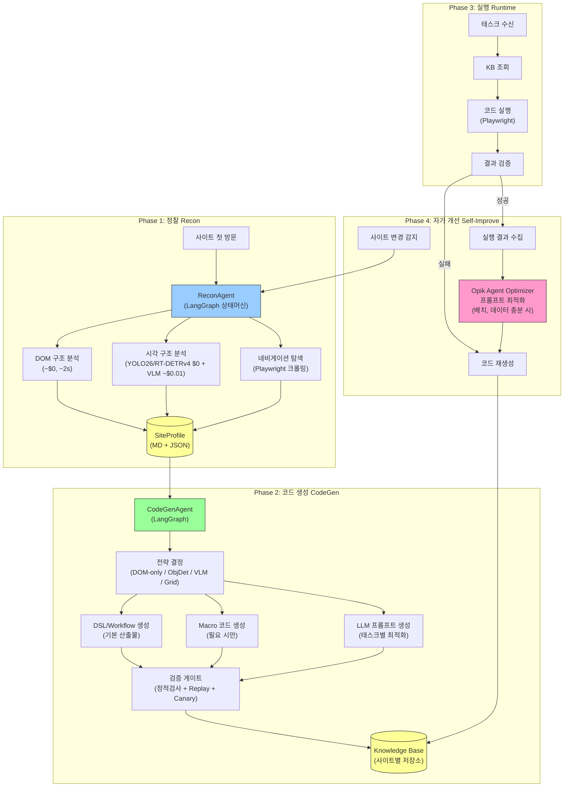

### 2.1 아키텍처 보정 포인트

1. 생성 결과의 기본 단위는 `자유 코드`가 아니라 **검증 가능한 DSL**(workflow_dsl.json)이다.
2. 매크로 코드는 DSL로 표현이 어려운 구간에서만 **선택적으로** 생성하며, 안전 게이트 통과 전 운영 반영하지 않는다.
3. Runtime은 항상 **검증 우선**이며, 실패 시 `DSL patch → 매크로 패치 → 재정찰/재생성 → 롤백` 순으로 처리한다.

---

## 3. Phase 1: 사이트 정찰 시스템 (ReconAgent)

### 3.1 수집 정보 체계 — SiteProfile

사이트 방문 시 한 번의 정찰로 아래 **8대 카테고리**의 정보를 수집한다.

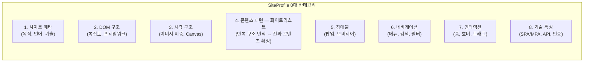

#### 3.1.1 카테고리별 수집 항목

```python
@dataclass
class SiteProfile:
    """사이트 정찰 결과. 한 번 생성 후 Knowledge Base에 영구 저장."""

    # ── 1. 사이트 메타 ──
    domain: str                          # "shopping.naver.com"
    purpose: str                         # "ecommerce" | "news" | "portal" | "community" | "saas"
    language: str                        # "ko" | "en" | "ja" | "zh"
    region: str                          # "KR" | "US" | "JP"
    robots_txt: dict                     # {allow: [...], disallow: [...], crawl_delay: int}
    created_at: datetime
    last_recon_at: datetime
    recon_version: int                   # 정찰 버전 (사이트 변경 시 증가)
    dom_hash: str                        # 구조적 DOM hash (보조 변경 감지용)
    ax_hash: str | None                  # AX 트리 해시 (주요 변경 감지용)

    # ── 2. DOM 구조 ──
    dom_complexity: DOMComplexity
    framework: str | None                # "react" | "vue" | "angular" | "jquery" | "vanilla" | None
    has_shadow_dom: bool
    iframe_count: int
    iframe_purposes: list[str]           # ["ad", "payment", "captcha", "content"]
    is_spa: bool                         # Single Page Application 여부
    url_pattern: str                     # URL 패턴 (SPA는 hash/path 기반)

    # ── 3. 시각 구조 ──
    visual_structure: VisualStructure
    canvas_usage: CanvasUsage
    image_density: str                   # "low" (<20%) | "medium" (20-50%) | "high" (>50%)
    thumbnail_structures: list[ThumbnailGrid]

    # ── 4. 콘텐츠 패턴 (화이트리스트 기반) ──
    content_types: list[ContentPattern]          # 페이지별 콘텐츠 유형
    repeating_patterns: list[RepeatingPattern]   # 반복 구조 화이트리스트 (핵심 콘텐츠 확정)
    list_structures: list[ListStructure]         # 리스트/그리드 구조
    pagination_types: list[str]                  # ["numbered", "infinite_scroll", "load_more"]

    # ── 5. 장애물 ──
    obstacles: list[ObstaclePattern]     # 팝업, 쿠키 동의 등 (광고 판별은 하지 않음)
    obstacle_frequency: str              # "none" | "first_visit" | "every_visit" | "random"
    obstacle_dismiss_strategies: list[DismissStrategy]

    # ── 6. 네비게이션 ──
    navigation: NavigationStructure
    search_functionality: SearchConfig | None
    category_tree: list[CategoryNode]
    breadcrumb_pattern: str | None

    # ── 7. 인터랙션 패턴 ──
    interaction_patterns: list[InteractionPattern]
    form_types: list[FormPattern]
    hover_dependent_menus: bool
    drag_interactions: list[str]         # ["price_slider", "carousel", "map"]
    keyboard_shortcuts: list[str]
    dynamic_loading: list[str]           # ["lazy_image", "infinite_scroll", "ajax_filter"]

    # ── 8. 기술 특성 ──
    api_endpoints: list[APIEndpoint]     # 관찰된 API 엔드포인트
    api_schema_fingerprint: dict[str, str]  # endpoint -> schema hash
    websocket_usage: bool
    auth_flow: str | None                # "login_form" | "oauth" | "sso" | None
    cdn_providers: list[str]
    csp_policy: str | None               # Content-Security-Policy


@dataclass
class DOMComplexity:
    total_elements: int                  # 전체 요소 수
    interactive_elements: int            # 클릭/입력 가능 요소 수
    max_depth: int                       # DOM 트리 최대 깊이
    unique_selectors_ratio: float        # 고유 선택자 비율 (0~1)
    text_node_ratio: float               # 텍스트 노드 비율
    aria_coverage: float                 # ARIA 속성 커버리지


@dataclass
class VisualStructure:
    layout_type: str                     # "fixed" | "fluid" | "responsive"
    breakpoints: list[int]               # [768, 1024, 1440]
    menu_type: str                       # "horizontal_nav" | "hamburger" | "mega_menu" | "sidebar"
    header_height_px: int
    has_sticky_header: bool
    has_footer_nav: bool
    color_scheme: str                    # "light" | "dark" | "auto"


@dataclass
class CanvasUsage:
    has_canvas: bool
    canvas_count: int
    canvas_area_ratio: float             # 전체 뷰포트 대비 Canvas 면적 비율
    canvas_purpose: list[str]            # ["chart", "game", "editor", "map", "animation"]
    requires_vision_only: bool           # DOM으로 내용 접근 불가 → VLM 필수


@dataclass
class ThumbnailGrid:
    page_url_pattern: str                # 이 그리드가 나타나는 URL 패턴
    grid_type: str                       # "product_card" | "news_card" | "image_tile" | "video_thumb"
    columns: int                         # 열 수 (보통 3~5)
    rows_visible: int                    # 뷰포트 내 보이는 행 수
    card_has_text: bool                  # 카드에 텍스트 정보 있는지
    card_has_price: bool                 # 가격 정보 포함 여부
    card_selector: str | None            # 카드 CSS 선택자
    image_selector: str | None           # 썸네일 이미지 선택자


@dataclass
class ContentPattern:
    page_type: str                       # "home" | "category" | "product_detail" | "search_result" | "article"
    url_pattern: str                     # 이 패턴에 매칭되는 URL
    dom_readable: bool                   # DOM 텍스트로 정보 추출 가능한지
    requires_scroll: bool                # 전체 콘텐츠 보려면 스크롤 필요한지
    dynamic_content: bool                # AJAX/SPA로 콘텐츠 로딩하는지
    key_selectors: dict[str, str]        # {"title": "h1.product-name", "price": ".price-value"}


@dataclass
class RepeatingPattern:
    """화이트리스트 기반 콘텐츠 인식.
    동일 부모 아래 구조가 같은 형제 노드가 N개 반복되면 핵심 콘텐츠로 확정.
    광고를 걸러내는 게 아니라, 진짜 콘텐츠를 취하는 접근."""
    parent_selector: str                 # 반복 그룹의 부모 CSS 선택자
    item_tag_hash: str                   # 자식 노드의 태그 시퀀스 해시 (구조 동일성 판별)
    item_count: int                      # 반복 횟수 (≥3이면 콘텐츠 후보)
    has_text: bool                       # 아이템 내 텍스트 존재
    has_link: bool                       # 아이템 내 링크 존재
    has_image: bool                      # 아이템 내 이미지 존재
    is_content: bool                     # True = 핵심 콘텐츠 확정 (text+link 또는 text+image)
    sample_item_selector: str            # 개별 아이템 CSS 선택자 (예: "li.product-item")
    url_pattern: str                     # 이 패턴이 발견된 페이지 URL 패턴


@dataclass
class ListStructure:
    url_pattern: str
    item_selector: str                   # 리스트 아이템 CSS 선택자
    item_count_per_page: int
    has_text_info: bool                  # 텍스트로 아이템 구별 가능
    has_image_only: bool                 # 이미지만으로 구별해야 함
    sort_options: list[str]              # ["price_asc", "price_desc", "popular", "newest"]
    filter_selectors: dict[str, str]     # {"price_range": "#price-filter", "category": ".cat-filter"}


@dataclass
class ObstaclePattern:
    type: str                            # "popup" | "cookie_consent" | "login_wall" | "event_splash"
    trigger: str                         # "page_load" | "scroll" | "time_delay" | "exit_intent"
    selector: str | None                 # 닫기 버튼 선택자
    close_xy: tuple[float, float] | None # 닫기 버튼 뷰포트 좌표
    dismiss_method: str                  # "click_close" | "click_outside" | "press_esc" | "wait"
    frequency: str                       # "once" | "every_visit" | "every_page" | "random"


@dataclass
class DismissStrategy:
    obstacle_type: str
    code: str                            # Python 코드 (dismiss 로직)
    success_rate: float                  # 0~1


@dataclass
class NavigationStructure:
    menu_depth: int                      # 메뉴 최대 깊이
    menu_items: list[dict]               # [{text, href, children: [...]}]
    menu_selector: str                   # 메뉴 컨테이너 선택자
    menu_requires_hover: bool            # 호버로 서브메뉴 열리는지
    menu_requires_click: bool            # 클릭으로 서브메뉴 열리는지
    has_search: bool
    has_breadcrumb: bool


@dataclass
class SearchConfig:
    input_selector: str                  # 검색 입력 필드 선택자
    submit_method: str                   # "enter" | "button_click" | "auto_suggest"
    submit_selector: str | None          # 검색 버튼 선택자
    autocomplete: bool                   # 자동완성 드롭다운 존재
    autocomplete_selector: str | None
    result_page_pattern: str             # 검색 결과 URL 패턴
    result_item_selector: str | None     # 결과 아이템 선택자


@dataclass
class InteractionPattern:
    type: str                            # "hover_menu" | "drag_slider" | "infinite_scroll" |
                                         # "tab_switch" | "accordion" | "modal_form" | "carousel"
    selector: str
    description: str
    recommended_action_type: str         # ActionType 참조
    code_snippet: str | None             # 동작 코드 (있으면)


@dataclass
class FormPattern:
    url_pattern: str
    form_selector: str
    fields: list[dict]                   # [{name, type, selector, required, validation}]
    submit_selector: str
    submit_method: str                   # "click" | "enter" | "ajax"


@dataclass
class APIEndpoint:
    url_pattern: str                     # "/api/v1/products?*"
    method: str                          # "GET" | "POST"
    purpose: str                         # "search" | "filter" | "pagination" | "auth"
    requires_auth: bool
    response_type: str                   # "json" | "html" | "xml"


@dataclass
class CategoryNode:
    name: str
    url: str | None
    selector: str | None
    children: list["CategoryNode"]
    depth: int
```

### 3.2 정찰 방법론 — 3단계 스캔

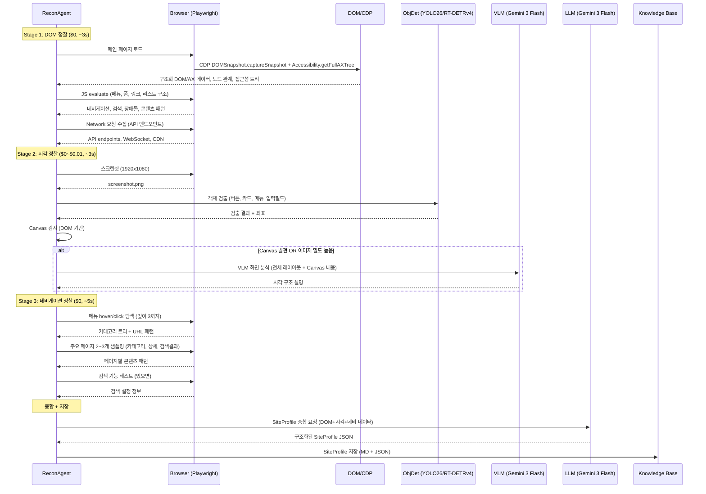

#### Stage 1: DOM 정찰 — $0, ~3초

Stage 1은 **CDP 스냅샷 우선**으로 수집한다. `page.evaluate()`는 보조(메뉴 의도/텍스트 힌트)로만 사용한다. LLM/VLM 호출 없음.

```python
class DOMRecon:
    """DOM만으로 수집 가능한 모든 정보를 추출."""

    async def scan(self, browser: Browser) -> dict:
        # CDP 기반 스냅샷 + 보조 evaluate를 병렬 실행
        results = await asyncio.gather(
            self._scan_snapshot(browser),       # DOMSnapshot + AXTree (기본)
            self._scan_structure(browser),      # 구조 보조 통계(evaluate)
            self._scan_navigation(browser),     # 메뉴, 검색, 브레드크럼
            self._scan_content(browser),        # 콘텐츠 패턴, 리스트 구조
            self._scan_obstacles(browser),      # 팝업, 배너, 쿠키 동의
            self._scan_forms(browser),          # 폼 구조
            self._scan_interactions(browser),   # 호버, 드래그, 동적 로딩
            self._scan_network(browser),        # API 엔드포인트, WebSocket
        )
        return self._merge_results(results)

    async def _scan_snapshot(self, browser: Browser) -> dict:
        """CDP DOMSnapshot + AXTree로 구조를 안정적으로 수집."""
        dom_snapshot = await browser.cdp_send("DOMSnapshot.captureSnapshot", {
            "computedStyles": ["display", "visibility", "pointer-events"],
            "includeDOMRects": True,
            "includePaintOrder": False,
        })
        ax_tree = await browser.cdp_send("Accessibility.getFullAXTree", {})

        node_count = sum(len(doc.get("nodes", {}).get("nodeName", []))
                         for doc in dom_snapshot.get("documents", []))
        layout_count = sum(len(doc.get("layout", {}).get("nodeIndex", []))
                           for doc in dom_snapshot.get("documents", []))
        interactive_roles = {"button", "link", "textbox", "combobox", "menuitem", "checkbox", "radio"}
        ax_interactive = sum(
            1 for node in ax_tree.get("nodes", [])
            if str(node.get("role", {}).get("value", "")).lower() in interactive_roles
        )

        return {
            "snapshot_node_count": node_count,
            "snapshot_layout_count": layout_count,
            "ax_node_count": len(ax_tree.get("nodes", [])),
            "ax_interactive_count": ax_interactive,
        }

    async def _scan_structure(self, browser: Browser) -> dict:
        """구조 보조 분석 — 프레임워크, 복잡도, Shadow DOM."""
        return await browser.evaluate("""(() => {
            const all = document.querySelectorAll('*');
            const interactive = document.querySelectorAll(
                'a, button, input, select, textarea, [role="button"], [onclick], [tabindex]'
            );

            // 프레임워크 감지
            let framework = null;
            if (window.__REACT_DEVTOOLS_GLOBAL_HOOK__) framework = 'react';
            else if (window.__VUE__) framework = 'vue';
            else if (window.ng) framework = 'angular';
            else if (window.jQuery) framework = 'jquery';

            // DOM 깊이
            function maxDepth(el, depth) {
                if (!el.children.length) return depth;
                return Math.max(...[...el.children].map(c => maxDepth(c, depth + 1)));
            }

            // Shadow DOM 감지
            const hasShadow = [...all].some(el => el.shadowRoot);

            // 고유 선택자 비율
            const withId = [...all].filter(el => el.id).length;
            const withClass = [...all].filter(el => el.className).length;

            // ARIA 커버리지
            const withAria = [...interactive].filter(el =>
                el.getAttribute('aria-label') || el.getAttribute('role')
            ).length;

            return {
                total_elements: all.length,
                interactive_elements: interactive.length,
                max_depth: maxDepth(document.body, 0),
                framework,
                has_shadow_dom: hasShadow,
                iframe_count: document.querySelectorAll('iframe').length,
                unique_selectors_ratio: (withId + withClass) / Math.max(all.length, 1),
                text_node_ratio: document.body.innerText.length / Math.max(document.body.innerHTML.length, 1),
                aria_coverage: withAria / Math.max(interactive.length, 1),
                is_spa: !!document.querySelector('[id="app"], [id="root"], [id="__next"]'),
            };
        })()""")

    async def _scan_navigation(self, browser: Browser) -> dict:
        """메뉴, 검색, 카테고리 구조 탐색."""
        return await browser.evaluate("""(() => {
            const nav = document.querySelector('nav, [role="navigation"], header ul, .gnb, .main-menu');
            const menuItems = nav ? [...nav.querySelectorAll('a')].map(a => ({
                text: a.textContent.trim().slice(0, 50),
                href: a.href,
                hasChildren: a.parentElement.querySelector('ul, .sub-menu, .dropdown') !== null,
            })) : [];

            const searchInput = document.querySelector(
                'input[type="search"], input[name="query"], input[name="q"], ' +
                'input[placeholder*="검색"], input[placeholder*="search"], [role="searchbox"]'
            );
            const searchConfig = searchInput ? {
                input_selector: searchInput.id ? '#' + searchInput.id : null,
                has_autocomplete: !!document.querySelector('[role="listbox"], .autocomplete, .suggest'),
                submit_button: !!document.querySelector('button[type="submit"], .search-btn, .btn-search'),
            } : null;

            const hamburger = document.querySelector('.hamburger, .menu-toggle, [class*="burger"]');
            const megaMenu = document.querySelector('.mega-menu, [class*="mega"]');
            const menuType = hamburger ? 'hamburger'
                           : megaMenu ? 'mega_menu'
                           : nav ? 'horizontal_nav' : 'unknown';

            const breadcrumb = document.querySelector(
                '[class*="breadcrumb"], [aria-label="breadcrumb"], .path'
            );

            return {
                menu_type: menuType,
                menu_items: menuItems.slice(0, 30),
                menu_requires_hover: menuType === 'mega_menu' || menuType === 'horizontal_nav',
                search: searchConfig,
                has_breadcrumb: !!breadcrumb,
            };
        })()""")

    async def _scan_content(self, browser: Browser) -> dict:
        """화이트리스트 기반 콘텐츠 패턴 인식.

        핵심 원리: 광고를 찾아서 제거하는 게 아니라,
        반복되는 동일 구조의 형제 노드를 찾아 '진짜 콘텐츠'로 확정한다.
        같은 부모 아래 태그 시퀀스가 동일한 형제가 ≥3개이고
        텍스트+링크 또는 텍스트+이미지가 있으면 핵심 콘텐츠로 판정.
        """
        return await browser.evaluate("""(() => {
            // ── 화이트리스트: 반복 구조 검출 ──
            function getTagHash(el) {
                // 자식 태그 시퀀스를 해시로 변환 (구조 동일성 판별)
                const tags = [...el.children].map(c => c.tagName).join('>');
                let h = 0;
                for (let i = 0; i < tags.length; i++) {
                    h = ((h << 5) - h + tags.charCodeAt(i)) | 0;
                }
                return h.toString(36);
            }

            const repeatingPatterns = [];
            // 자식이 3개 이상인 모든 컨테이너를 후보로
            const containers = [...document.querySelectorAll('*')]
                .filter(el => el.children.length >= 3 && el.children.length <= 200);

            for (const parent of containers.slice(0, 100)) {
                const children = [...parent.children];
                // 태그 해시별로 그룹화
                const hashGroups = {};
                children.forEach(child => {
                    const hash = getTagHash(child);
                    if (!hashGroups[hash]) hashGroups[hash] = [];
                    hashGroups[hash].push(child);
                });

                for (const [hash, group] of Object.entries(hashGroups)) {
                    if (group.length < 3) continue;
                    const sample = group[0];
                    const hasText = sample.innerText?.trim().length > 10;
                    const hasLink = !!sample.querySelector('a[href]');
                    const hasImage = !!sample.querySelector('img');
                    // 핵심 콘텐츠 판정: 텍스트가 있고 (링크 또는 이미지)가 있으면 확정
                    const isContent = hasText && (hasLink || hasImage);

                    if (isContent) {
                        const parentSel = parent.id ? '#' + parent.id
                            : parent.className ? '.' + parent.className.trim().split(/\\s+/)[0]
                            : parent.tagName.toLowerCase();
                        const itemSel = sample.className
                            ? '.' + sample.className.trim().split(/\\s+/)[0]
                            : sample.tagName.toLowerCase();
                        repeatingPatterns.push({
                            parent_selector: parentSel,
                            item_tag_hash: hash,
                            item_count: group.length,
                            has_text: hasText,
                            has_link: hasLink,
                            has_image: hasImage,
                            is_content: true,
                            sample_item_selector: itemSel,
                        });
                    }
                }
            }

            // ── 기존: 리스트/그리드 구조 (화이트리스트 보완용) ──
            const listSelectors = [
                '[class*="product"]', '[class*="item-list"]', '[class*="card-list"]',
                '[class*="listing"]', '[class*="goods"]', '[class*="result"]',
                '[class*="grid"]', '[class*="gallery"]',
            ];
            const lists = listSelectors.flatMap(s => [...document.querySelectorAll(s)])
                .filter(el => el.children.length >= 3);

            const listInfo = lists.slice(0, 5).map(list => {
                const items = [...list.children];
                const firstItem = items[0];
                return {
                    selector: list.className ? '.' + list.className.split(' ')[0] : null,
                    item_count: items.length,
                    has_text: firstItem?.innerText?.trim().length > 10,
                    has_image: !!firstItem?.querySelector('img'),
                    has_price: !!firstItem?.querySelector('[class*="price"], .cost, .won'),
                };
            });

            // ── 페이징 ──
            const paginationTypes = [];
            if (document.querySelector('[class*="pagination"], .paging, nav[aria-label="pagination"]'))
                paginationTypes.push('numbered');
            if (document.querySelector('[class*="infinite"], [data-infinite]'))
                paginationTypes.push('infinite_scroll');
            if (document.querySelector('[class*="load-more"], .more-btn, .btn-more'))
                paginationTypes.push('load_more');

            // ── 이미지/Canvas 밀도 ──
            const images = document.querySelectorAll('img');
            const totalArea = window.innerWidth * window.innerHeight;
            let imgArea = 0;
            images.forEach(img => {
                const rect = img.getBoundingClientRect();
                if (rect.width > 0 && rect.height > 0) imgArea += rect.width * rect.height;
            });
            const imageDensity = imgArea / totalArea;

            const canvases = document.querySelectorAll('canvas');
            let canvasArea = 0;
            canvases.forEach(c => {
                const rect = c.getBoundingClientRect();
                canvasArea += rect.width * rect.height;
            });

            return {
                repeating_patterns: repeatingPatterns,
                lists: listInfo,
                pagination_types: paginationTypes,
                image_density: imageDensity < 0.2 ? 'low' : imageDensity < 0.5 ? 'medium' : 'high',
                canvas_count: canvases.length,
                canvas_area_ratio: canvasArea / totalArea,
                total_images: images.length,
            };
        })()""")

    async def _scan_obstacles(self, browser: Browser) -> dict:
        """팝업, 쿠키 동의 등 인터랙션 차단 장애물만 감지.
        광고 판별은 하지 않음 — 화이트리스트 기반으로 진짜 콘텐츠만 취하는 접근."""
        return await browser.evaluate("""(() => {
            const obstacles = [];
            const modals = document.querySelectorAll(
                '[class*="popup"], [class*="modal"], [class*="overlay"], [class*="dialog"],' +
                '[role="dialog"], [role="alertdialog"]'
            );
            modals.forEach(m => {
                const style = getComputedStyle(m);
                if (style.display !== 'none' && style.visibility !== 'hidden') {
                    const closeBtn = m.querySelector(
                        '[class*="close"], [aria-label="close"], .btn-close, button:has(svg)'
                    );
                    obstacles.push({
                        type: m.className.includes('cookie') ? 'cookie_consent' : 'popup',
                        selector: m.id ? '#' + m.id : null,
                        close_selector: closeBtn ? (closeBtn.id ? '#' + closeBtn.id : null) : null,
                        visible: true,
                    });
                }
            });

            return { obstacles };
        })()""")

    async def _scan_forms(self, browser: Browser) -> dict:
        """폼 구조 분석."""
        return await browser.evaluate("""(() => {
            const forms = [...document.querySelectorAll('form')].slice(0, 10).map(f => ({
                action: f.action,
                method: f.method,
                selector: f.id ? '#' + f.id : null,
                fields: [...f.querySelectorAll('input, select, textarea')].map(e => ({
                    name: e.name,
                    type: e.type,
                    selector: e.id ? '#' + e.id : null,
                    required: e.required,
                    placeholder: e.placeholder || null,
                })),
                submit: f.querySelector('button[type="submit"], input[type="submit"]') ? {
                    selector: f.querySelector('button[type="submit"]')?.id
                        ? '#' + f.querySelector('button[type="submit"]').id : null,
                    text: f.querySelector('button[type="submit"]')?.textContent?.trim() || null,
                } : null,
            }));
            return { forms };
        })()""")

    async def _scan_interactions(self, browser: Browser) -> dict:
        """인터랙션 패턴 감지 — 호버, 드래그, 동적 로딩."""
        return await browser.evaluate("""(() => {
            const patterns = [];
            const hoverMenus = document.querySelectorAll('[class*="dropdown"], [class*="flyout"]');
            if (hoverMenus.length > 0) patterns.push({type: 'hover_menu', count: hoverMenus.length});

            const carousels = document.querySelectorAll(
                '[class*="carousel"], [class*="slider"], [class*="swiper"]'
            );
            if (carousels.length > 0) patterns.push({type: 'carousel', count: carousels.length});

            const tabs = document.querySelectorAll('[role="tab"], [class*="tab-"]');
            if (tabs.length > 0) patterns.push({type: 'tab_switch', count: tabs.length});

            const accordions = document.querySelectorAll(
                '[class*="accordion"], [class*="collapse"], details'
            );
            if (accordions.length > 0) patterns.push({type: 'accordion', count: accordions.length});

            const ranges = document.querySelectorAll('input[type="range"], [class*="range-slider"]');
            if (ranges.length > 0) patterns.push({type: 'drag_slider', count: ranges.length});

            const lazyImages = document.querySelectorAll('img[loading="lazy"], img[data-src]');
            if (lazyImages.length > 5) patterns.push({type: 'lazy_image', count: lazyImages.length});

            return { interaction_patterns: patterns };
        })()""")

    async def _scan_network(self, browser: Browser) -> list[dict]:
        """네트워크 요청에서 API 엔드포인트 수집. (Browser wrapper의 request 이벤트 로깅 활용)"""
        pass
```

#### Stage 2: 시각 정찰 — $0~$0.01, ~3초

DOM 정찰 결과를 기반으로 시각 분석이 필요한지 판단한다.

```python
class VisualRecon:
    """DOM만으로 부족한 정보를 시각적으로 보완."""

    async def scan(
        self,
        browser: Browser,
        dom_result: dict,
        detector: LocalDetector,  # YOLO26(CPU) or RT-DETRv4(GPU)
        vlm: VLMClient,
    ) -> dict:
        screenshot = Image.open(io.BytesIO(await browser.screenshot()))

        # 객체 검출 (항상, $0, CPU:YOLO26 ~50ms / GPU:RT-DETRv4 ~30ms)
        detections = detector.detect(screenshot, threshold=0.3)
        visual_elements = self._classify_detections(detections)

        # VLM 호출 조건: Canvas 존재 OR 이미지 밀도 "high" OR DOM 요소 극히 적음
        needs_vlm = (
            dom_result.get("canvas_count", 0) > 0
            or dom_result.get("image_density") == "high"
            or dom_result.get("total_elements", 0) < 50
        )

        vlm_analysis = None
        if needs_vlm:
            vlm_analysis = await vlm.generate(
                image=screenshot,
                prompt="""이 웹페이지의 시각적 구조를 분석해줘:
1. 전체 레이아웃 (헤더, 사이드바, 메인, 푸터 구분)
2. 메뉴 구조 (위치, 깊이)
3. Canvas나 이미지로만 표현된 콘텐츠 영역
4. 썸네일/카드 그리드 구조 (있으면)
5. 광고나 팝업 위치
JSON으로 응답.""",
            )

        return {
            "obj_detections": visual_elements,
            "vlm_analysis": vlm_analysis,
            "needs_vlm": needs_vlm,
        }
```

#### Stage 3: 네비게이션 정찰 — $0, ~5초

Playwright 크롤링으로 사이트 구조를 탐색한다. LLM 호출 없음.

```python
class NavigationRecon:
    """사이트 내 주요 경로를 탐색하여 URL 패턴과 페이지 유형을 파악."""

    MAX_PAGES = 5
    MAX_MENU_DEPTH = 3

    async def scan(self, browser: Browser, dom_result: dict) -> dict:
        category_tree = []
        page_samples = []
        url_patterns = set()

        menu_items = dom_result.get("menu_items", [])
        for item in menu_items[:10]:
            if item.get("hasChildren"):
                children = await self._explore_submenu(browser, item)
                category_tree.append({
                    "name": item["text"],
                    "url": item["href"],
                    "children": children,
                })

        sample_urls = self._pick_sample_urls(category_tree, dom_result)
        for url in sample_urls[:self.MAX_PAGES]:
            page_info = await self._analyze_page(browser, url)
            page_samples.append(page_info)
            url_patterns.add(self._extract_url_pattern(url))

        return {
            "category_tree": category_tree,
            "page_samples": page_samples,
            "url_patterns": list(url_patterns),
        }

    async def _explore_submenu(self, browser: Browser, item: dict) -> list:
        """호버/클릭으로 서브메뉴 탐색."""
        try:
            el = await browser.page.query_selector(f'a[href="{item["href"]}"]')
            if el:
                await el.hover()
                await browser.wait(500)
                children = await browser.evaluate("""
                    (() => {
                        const subs = document.querySelectorAll(
                            '.sub-menu:not([style*="none"]) a, ' +
                            '.dropdown-menu:not([style*="none"]) a, ' +
                            '[class*="depth2"]:not([style*="none"]) a'
                        );
                        return [...subs].slice(0, 20).map(a => ({
                            text: a.textContent.trim().slice(0, 50),
                            href: a.href,
                        }));
                    })()
                """)
                return children or []
        except Exception:
            pass
        return []

    async def _analyze_page(self, browser: Browser, url: str) -> dict:
        """개별 페이지의 콘텐츠 패턴 분석."""
        await browser.goto(url, wait_until="domcontentloaded", timeout=10000)
        await browser.wait(1000)
        return await browser.evaluate("""(() => {
            const hasProductList = !!document.querySelector(
                '[class*="product"], [class*="goods"], [class*="item-list"]'
            );
            const hasArticle = !!document.querySelector('article, .article, .post-content');
            const hasForm = document.querySelectorAll('form').length > 0;
            let pageType = 'other';
            if (hasProductList) pageType = 'product_list';
            else if (hasArticle) pageType = 'article';
            else if (hasForm) pageType = 'form';
            return {
                url: location.href,
                page_type: pageType,
                title: document.title,
                interactive_count: document.querySelectorAll('a, button, input, select, textarea').length,
                has_scroll_content: document.body.scrollHeight > window.innerHeight * 1.5,
                images_count: document.images.length,
            };
        })()""")
```

### 3.3 ReconAgent — LangGraph 상태머신

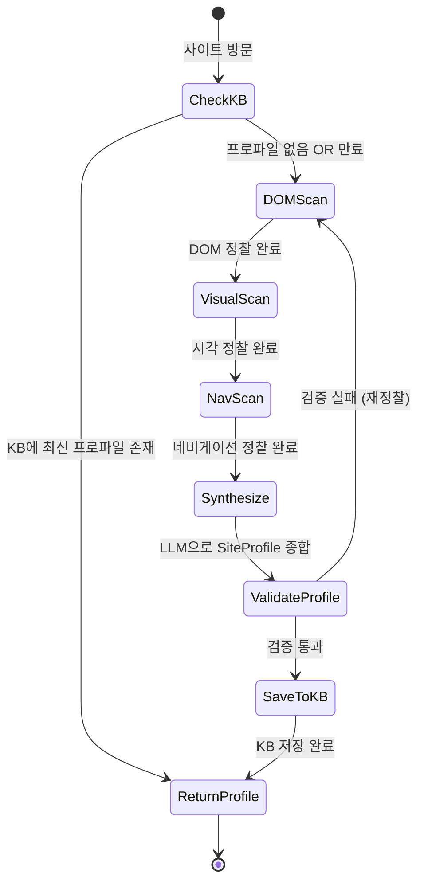

```python
from langgraph.graph import StateGraph, START, END
from typing import TypedDict


class ReconState(TypedDict):
    domain: str
    browser: Browser
    dom_result: dict | None
    visual_result: dict | None
    nav_result: dict | None
    site_profile: SiteProfile | None
    error: str | None
    recon_stage: str          # "check_kb" | "dom" | "visual" | "nav" | "synthesize" | "done"


def check_kb(state: ReconState) -> ReconState:
    """KB에 최신 프로파일이 있으면 바로 반환."""
    profile = kb.load_profile(state["domain"])
    if profile and not _is_expired(profile):
        return {**state, "site_profile": profile, "recon_stage": "done"}
    return {**state, "recon_stage": "dom"}


async def dom_scan(state: ReconState) -> ReconState:
    recon = DOMRecon()
    result = await recon.scan(state["browser"])
    return {**state, "dom_result": result, "recon_stage": "visual"}


async def visual_scan(state: ReconState) -> ReconState:
    recon = VisualRecon()
    result = await recon.scan(state["browser"], state["dom_result"], detector, vlm)
    return {**state, "visual_result": result, "recon_stage": "nav"}


async def nav_scan(state: ReconState) -> ReconState:
    recon = NavigationRecon()
    result = await recon.scan(state["browser"], state["dom_result"])
    return {**state, "nav_result": result, "recon_stage": "synthesize"}


async def synthesize_profile(state: ReconState) -> ReconState:
    """LLM으로 3단계 결과를 종합하여 SiteProfile 생성."""
    profile = await llm.generate(
        prompt=f"""아래 정찰 데이터를 종합하여 SiteProfile JSON을 생성하라.
DOM 정찰: {json.dumps(state['dom_result'], ensure_ascii=False)}
시각 정찰: {json.dumps(state['visual_result'], ensure_ascii=False)}
네비게이션: {json.dumps(state['nav_result'], ensure_ascii=False)}
출력: SiteProfile JSON (위 데이터클래스 스키마 준수)""",
    )
    site_profile = SiteProfile.from_json(profile)
    return {**state, "site_profile": site_profile, "recon_stage": "done"}


def route_stage(state: ReconState) -> str:
    stage = state["recon_stage"]
    if stage == "done":
        return "save_and_return"
    return stage


# LangGraph 구성
recon_graph = StateGraph(ReconState)
recon_graph.add_node("check_kb", check_kb)
recon_graph.add_node("dom", dom_scan)
recon_graph.add_node("visual", visual_scan)
recon_graph.add_node("nav", nav_scan)
recon_graph.add_node("synthesize", synthesize_profile)
recon_graph.add_node("save_and_return", lambda s: s)

recon_graph.add_edge(START, "check_kb")
recon_graph.add_conditional_edges("check_kb", route_stage)
recon_graph.add_edge("dom", "visual")
recon_graph.add_edge("visual", "nav")
recon_graph.add_edge("nav", "synthesize")
recon_graph.add_conditional_edges("synthesize", route_stage)
recon_graph.add_edge("save_and_return", END)

recon_agent = recon_graph.compile()
```

### 3.4 정찰 비용/시간 요약

| Stage | 소요 시간 | LLM 호출 | 비용 (추정) |
|-------|----------|---------|------|
| DOM 정찰 | ~3s | 0 | $0 |
| 시각 정찰 (DOM only 사이트) | ~1s | YOLO26/RT-DETRv4만 | $0 |
| 시각 정찰 (Canvas/이미지 heavy) | ~3s | YOLO26/RT-DETRv4 + VLM 1회 | ~$0.003 |
| 네비게이션 정찰 | ~5s | 0 | $0 |
| 종합 (LLM) | ~2s | Flash 1회 | ~$0.002 |
| **합계 (일반 사이트)** | **~11s** | **Flash 1회** | **~$0.002** |
| **합계 (Canvas 사이트)** | **~14s** | **Flash 1 + VLM 1** | **~$0.005** |

---

## 4. Phase 2: 사이트별 자동화 코드 생성 (CodeGenAgent)

### 4.1 코드 생성 파이프라인

SiteProfile을 입력으로 받아, 사이트에 최적화된 **실행 번들(DSL + 선택적 매크로 + 프롬프트)**을 생성한다.

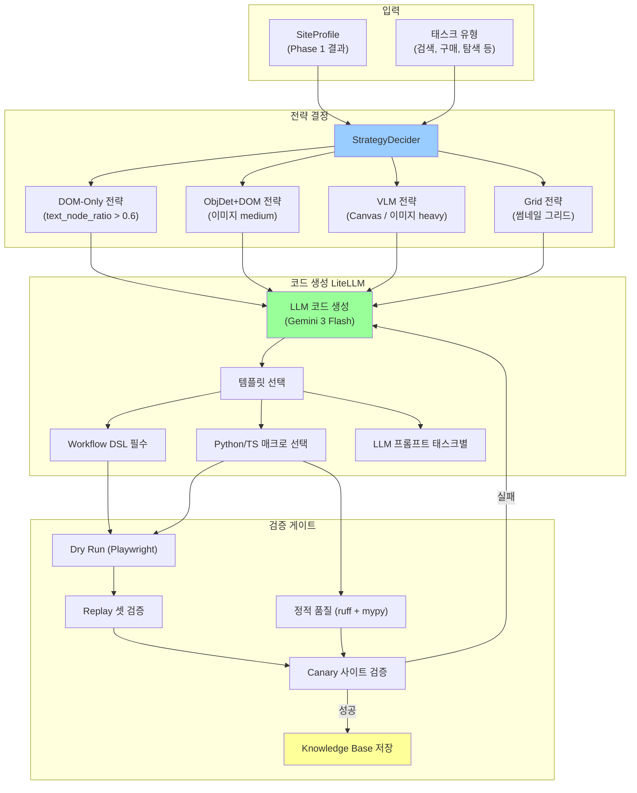

### 4.2 전략 결정 로직

초기에는 SiteProfile 휴리스틱으로 시작하고, 운영 중에는 전략별 성과(`success_rate`, `avg_cost`, `p95_latency_ms`)를 반영해 자동으로 가중치를 조정한다.

```python
class StrategyDecider:
    """SiteProfile + 실행 성과 지표 기반으로 전략을 결정."""

    def decide(
        self,
        profile: SiteProfile,
        task_type: str,
        runtime_stats: dict[str, dict] | None = None,
    ) -> list[StrategyAssignment]:
        assignments = []
        for content in profile.content_types:
            strategy = self._decide_for_page(content, profile, runtime_stats or {})
            assignments.append(StrategyAssignment(
                page_type=content.page_type,
                url_pattern=content.url_pattern,
                strategy=strategy,
                tools_needed=self._required_tools(strategy),
            ))
        return assignments

    def _decide_for_page(
        self,
        content: ContentPattern,
        profile: SiteProfile,
        runtime_stats: dict[str, dict],
    ) -> str:
        """휴리스틱 초기 전략 + 런타임 성과(성공률/비용/지연) 오버라이드."""
        candidates = ["dom_only", "dom_with_objdet_backup", "objdet_dom_hybrid", "grid_vlm", "vlm_only"]

        # 1) 기본 휴리스틱 점수
        base_scores = {c: 0.0 for c in candidates}
        if profile.canvas_usage.requires_vision_only:
            base_scores["vlm_only"] += 2.0
        if (content.dom_readable
            and profile.dom_complexity.text_node_ratio > 0.35
            and profile.dom_complexity.aria_coverage > 0.20):
            base_scores["dom_only"] += 1.5
            base_scores["dom_with_objdet_backup"] += 0.5
        for thumb in profile.thumbnail_structures:
            if thumb.page_url_pattern == content.url_pattern:
                if thumb.card_has_text:
                    base_scores["dom_with_objdet_backup"] += 1.0
                else:
                    base_scores["grid_vlm"] += 1.2
        if profile.image_density == "high":
            base_scores["objdet_dom_hybrid"] += 0.8
            base_scores["grid_vlm"] += 0.4
        if profile.canvas_usage.has_canvas:
            base_scores["objdet_dom_hybrid"] += 0.6
            base_scores["vlm_only"] += 0.4

        # 2) 런타임 성과 오버라이드
        # runtime_stats[strategy] = {"success_rate": 0~1, "avg_cost": float, "p95_latency_ms": int}
        final_scores = {}
        for strategy in candidates:
            perf = runtime_stats.get(strategy, {})
            success = perf.get("success_rate", 0.5)
            cost = perf.get("avg_cost", 0.003)
            latency = perf.get("p95_latency_ms", 3000)

            perf_bonus = (success * 1.5) - (cost * 40.0) - (latency / 10000.0)
            final_scores[strategy] = base_scores[strategy] + perf_bonus

        return max(final_scores.items(), key=lambda x: x[1])[0]

    def _required_tools(self, strategy: str) -> list[str]:
        # obj_detector: YOLO26(CPU) or RT-DETRv4(GPU) — 런타임 자동 선택
        TOOL_MAP = {
            "dom_only":              ["playwright", "cdp"],
            "dom_with_objdet_backup": ["playwright", "cdp", "obj_detector"],
            "objdet_dom_hybrid":     ["playwright", "cdp", "obj_detector"],
            "grid_vlm":              ["playwright", "obj_detector", "vlm", "grid_composer"],
            "vlm_only":              ["playwright", "vlm", "obj_detector"],
        }
        return TOOL_MAP.get(strategy, ["playwright", "cdp"])


@dataclass
class StrategyAssignment:
    page_type: str
    url_pattern: str
    strategy: str
    tools_needed: list[str]
```

### 4.3 코드 생성 — DSL-first 정책 (LiteLLM 기반)

#### 4.3.0 생성 정책

1. 1차 산출물은 항상 **`workflow_dsl.json`**으로 생성한다.
2. 매크로 코드는 DSL로 표현이 어려운 구간에서만 **제한적으로** 생성한다.
3. 생성된 코드는 **샌드박스/정적분석/Replay/Canary** 통과 전 운영 반영 금지.
4. 실패 패치는 가능하면 DSL/selector patch로 우선 반영한다.

```python
from datetime import date
from litellm import Router

# ── 벤더 자동 감지: API 키 하나만 있으면 해당 벤더 모델로 전부 매핑 ──
_VENDOR_MODELS = {
    "gemini": {
        "fast":    "gemini/gemini-3-flash-preview",    # 정찰, 경량 작업
        "strong":  "gemini/gemini-3.1-pro-preview",    # 복잡 추론, 실패 분석
        "codegen": "gemini/gemini-3.1-pro-preview",    # 코드/DSL 생성
        "vision":  "gemini/gemini-3-flash-preview",    # VLM 이미지 입력
    },
    "openai": {
        "fast":    "openai/gpt-5-mini",                # 정찰, 경량 작업
        "strong":  "openai/gpt-5.3-codex",             # 복잡 추론, 실패 분석
        "codegen": "openai/gpt-5.3-codex",             # 코드/DSL 생성 전용
        "vision":  "openai/gpt-5-mini",                # VLM 이미지 입력
    },
}

def _detect_vendor() -> str:
    if os.getenv("GEMINI_API_KEY"):
        return "gemini"
    if os.getenv("OPENAI_API_KEY"):
        return "openai"
    raise RuntimeError("GEMINI_API_KEY 또는 OPENAI_API_KEY 중 하나 필요")

_vendor = _detect_vendor()
MODEL_REGISTRY = {
    alias: os.getenv(f"MODEL_{alias.upper()}", default)
    for alias, default in _VENDOR_MODELS[_vendor].items()
}

# ── 모델 수명주기 가드: 벤더 폐기 공지 반영 ──
MODEL_SUNSET: dict[str, str] = {
    "gemini/gemini-2.0-flash": "2026-06-01",
    "gemini/gemini-2.0-pro":   "2026-06-01",
}

def assert_model_lifecycle(model_name: str) -> None:
    sunset = MODEL_SUNSET.get(model_name)
    if sunset and date.today().isoformat() >= sunset:
        raise RuntimeError(f"Model sunset reached: {model_name} ({sunset})")

for m in MODEL_REGISTRY.values():
    assert_model_lifecycle(m)


_api_key = os.getenv("GEMINI_API_KEY") or os.getenv("OPENAI_API_KEY")

llm_router = Router(
    model_list=[
        {
            "model_name": alias,
            "litellm_params": {"model": model, "api_key": _api_key},
        }
        for alias, model in MODEL_REGISTRY.items()
    ],
    fallbacks=[
        {"fast": ["strong", "codegen"]},
        {"codegen": ["strong"]},
        {"vision": ["fast"]},
    ],
    set_verbose=True,
)


class ModelRouter:
    """태스크 유형별 라우팅 + context window fallback."""

    ROUTING_POLICY: dict[str, tuple[str, list[str], int, float]] = {
        # (기본 alias, fallback 순서, max_tokens, temperature)
        "recon_synthesize":  ("fast",    ["strong"],             4000,  0.1),
        "codegen":           ("codegen", ["strong", "fast"],     8000,  0.1),
        "codegen_complex":   ("codegen", ["strong"],            12000,  0.05),
        "selector_fix":      ("fast",    ["strong"],             2000,  0.0),
        "failure_analysis":  ("strong",  ["fast"],               1500,  0.0),
        "vision_analysis":   ("vision",  ["fast"],               3000,  0.1),
    }

    async def call(self, task_type: str, messages: list[dict], **kwargs) -> str:
        alias, fallbacks, max_tokens, temp = self.ROUTING_POLICY.get(
            task_type, ("fast", ["strong"], 2000, 0.2)
        )
        assert_model_lifecycle(MODEL_REGISTRY[alias])
        try:
            resp = await llm_router.acompletion(
                model=alias, messages=messages,
                max_tokens=max_tokens, temperature=temp, **kwargs,
            )
            return resp.choices[0].message.content
        except Exception as e:
            # context window 초과 → 요약 후 재시도 / fallback
            if "context" in str(e).lower() or "token" in str(e).lower():
                return await self._context_fallback(alias, fallbacks, messages, max_tokens, temp, **kwargs)
            for fb in fallbacks:
                try:
                    assert_model_lifecycle(MODEL_REGISTRY[fb])
                    resp = await llm_router.acompletion(
                        model=fb, messages=messages,
                        max_tokens=max_tokens, temperature=temp, **kwargs,
                    )
                    return resp.choices[0].message.content
                except Exception:
                    continue
            raise

    async def _context_fallback(self, alias, fallbacks, messages, max_tokens, temp, **kwargs) -> str:
        compact = summarize_messages(messages, target_tokens=3500)
        try:
            resp = await llm_router.acompletion(
                model=alias, messages=compact, max_tokens=max_tokens, temperature=temp, **kwargs,
            )
            return resp.choices[0].message.content
        except Exception:
            for fb in fallbacks:
                try:
                    resp = await llm_router.acompletion(
                        model=fb, messages=compact, max_tokens=max_tokens, temperature=temp, **kwargs,
                    )
                    return resp.choices[0].message.content
                except Exception:
                    continue
            raise RuntimeError("No available model for context fallback")


class CodeGenerator:
    """SiteProfile + 전략 → 실행 번들 생성 (DSL 우선)."""

    BUNDLE_SCHEMA = {
        "name": "generated_bundle",
        "schema": {
            "type": "object",
            "properties": {
                "workflow_dsl": {"type": "object"},
                "selector_patches": {"type": "array", "items": {"type": "object"}},
                "macro_required": {"type": "boolean"},
                "python_macro": {"type": ["string", "null"]},
                "ts_macro": {"type": ["string", "null"]},
                "prompts": {"type": "object", "additionalProperties": {"type": "string"}},
                "dependencies": {"type": "array", "items": {"type": "string"}},
            },
            "required": ["workflow_dsl", "selector_patches", "macro_required", "prompts", "dependencies"],
            "additionalProperties": False,
        },
        "strict": True,
    }

    TEMPLATES = {
        "dom_only": "templates/dom_only.py.jinja2",
        "dom_with_objdet_backup": "templates/dom_objdet.py.jinja2",
        "grid_vlm": "templates/grid_vlm.py.jinja2",
        "vlm_only": "templates/vlm_only.py.jinja2",
    }

    async def generate(
        self,
        profile: SiteProfile,
        assignments: list[StrategyAssignment],
        task_type: str,
    ) -> GeneratedBundle:
        """사이트별 실행 번들 생성."""
        context = self._build_context(profile, assignments, task_type)

        response = await llm_router.acompletion(
            model="fast",
            messages=[{
                "role": "system",
                "content": self._system_prompt(profile),
            }, {
                "role": "user",
                "content": f"""아래 SiteProfile과 전략을 기반으로 자동화 실행 번들을 생성하라.

## SiteProfile 요약
{context['profile_summary']}

## 전략 할당
{context['strategy_summary']}

## 태스크 유형: {task_type}

## 생성 규칙
1. Playwright async API 사용
2. 장애물 처리 코드 포함 (SiteProfile의 obstacle 정보 활용)
3. 각 함수는 독립적으로 실행 가능해야 함
4. 셀렉터는 SiteProfile에서 제공된 것 우선 사용
5. fallback 셀렉터 최소 2개 포함
6. 결과 검증 코드 포함 (URL 변화 / DOM assertion)
7. DSL로 표현 가능한 로직은 코드 대신 DSL로 출력

## 출력 형식
반드시 JSON Schema(`generated_bundle`)를 준수한 단일 JSON만 반환.
코드 블록 마크다운 금지.""",
            }],
            response_format={"type": "json_schema", "json_schema": self.BUNDLE_SCHEMA},
            temperature=0.2,
        )

        payload = json.loads(response.choices[0].message.content)
        return self._parse_generated(payload)

    def _system_prompt(self, profile: SiteProfile) -> str:
        return f"""너는 웹 자동화 실행 번들 전문 생성기다.

대상 사이트: {profile.domain}
사이트 유형: {profile.purpose}
프레임워크: {profile.framework or 'vanilla'}
SPA 여부: {profile.is_spa}
DOM 복잡도: 요소 {profile.dom_complexity.total_elements}개, 깊이 {profile.dom_complexity.max_depth}
이미지 밀도: {profile.image_density}
Canvas: {'있음 (VLM 필수)' if profile.canvas_usage.has_canvas else '없음'}

준수 사항:
- Playwright async API (page.goto, page.click, page.fill, page.evaluate)
- 장애물은 SiteProfile의 dismiss_strategies 코드를 그대로 사용
- 셀렉터 실패 시 viewport 좌표 fallback
- 모든 액션 후 저비용 검증 (URL/DOM 변화)
- type hints 필수, Google 스타일 docstring
- DSL로 표현 가능하면 코드 대신 DSL"""


@dataclass
class GeneratedBundle:
    workflow_dsl: dict                   # 기본 실행 산출물
    python_macro: str | None             # 선택적 Python 매크로
    ts_macro: str | None                 # 선택적 TS 매크로
    prompts: dict[str, str]              # 태스크별 LLM 프롬프트
    strategy: str                        # 사용된 전략
    dependencies: list[str]              # 필요한 패키지
```

### 4.4 코드 검증 — 5단계 게이트

Replay 단계는 가능하면 HAR 기반으로 고정 입력을 재생하고, Canary 단계는 Playwright trace(zip) 저장을 필수화한다.

```python
class CodeValidator:
    """생성 코드를 5단계 게이트로 검증. 모두 통과해야 KB에 저장."""

    async def validate(
        self,
        code: GeneratedBundle,
        profile: SiteProfile,
        browser: Browser,
    ) -> ValidationResult:
        # 1. DSL 스키마 검증 (필수)
        dsl_ok = await self._validate_dsl_schema(code.workflow_dsl)

        # 2. 매크로 정적 분석 (있을 때만)
        macro_ok = True
        if code.python_macro:
            macro_ok = await self._lint_check(code.python_macro)

        # 3. 핵심 셀렉터 존재 여부 확인
        selectors = self._extract_selectors_from_dsl(code.workflow_dsl)
        if code.python_macro:
            selectors.extend(self._extract_selectors(code.python_macro))
        selector_ok = True
        for sel in selectors[:20]:
            exists = await browser.evaluate(f"!!document.querySelector('{sel}')")
            if not exists:
                selector_ok = False
                break

        # 4. HAR Replay 검증 (네트워크 변동 제거)
        har_replay_ok = await self._har_replay_check(code, profile)

        # 5. Canary + Trace 아티팩트 저장
        canary_ok, trace_path = await self._canary_with_trace(code, profile)
        trace_ok = bool(trace_path)

        return ValidationResult(
            dsl_ok=dsl_ok,
            macro_ok=macro_ok,
            selector_ok=selector_ok,
            har_replay_ok=har_replay_ok,
            canary_ok=canary_ok,
            trace_ok=trace_ok,
            trace_path=trace_path,
            overall=all([dsl_ok, macro_ok, selector_ok, har_replay_ok, canary_ok, trace_ok]),
        )
```

---

## 5. Phase 3: Knowledge Base — URL 패턴별 지식 저장소

### 5.1 캐싱 계층 구조

KB는 **도메인 → URL 패턴** 2계층으로 캐싱한다. 같은 도메인이라도 URL 패턴이 다르면 별도의 실행 번들과 프롬프트를 관리한다.

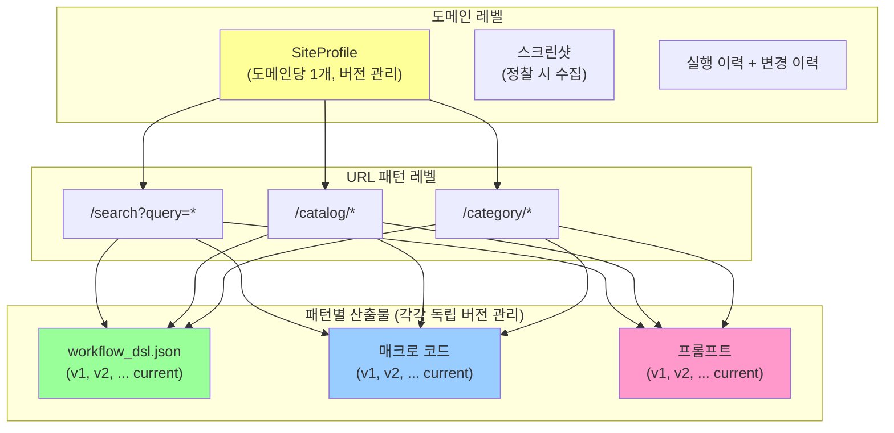

### 5.2 디렉토리 구조

```
knowledge_base/
├── sites/
│   ├── shopping.naver.com/                     # ── 도메인 레벨 ──
│   │   ├── profile.md                          # SiteProfile (사람 + LLM 참조용)
│   │   ├── profile.json                        # SiteProfile (기계 판독용)
│   │   ├── profile_history/                    # 프로파일 버전 이력
│   │   │   ├── v1.json
│   │   │   ├── v2.json
│   │   │   └── v3.json                         # 최신
│   │   │
│   │   ├── url_patterns/                       # ── URL 패턴 레벨 ──
│   │   │   ├── search/                         # /search?query=* 패턴
│   │   │   │   ├── pattern.json                # {"url_pattern": "/search?query=*", "page_type": "product_list"}
│   │   │   │   ├── workflows/
│   │   │   │   │   ├── v1.dsl.json
│   │   │   │   │   ├── v2.dsl.json
│   │   │   │   │   └── current -> v2.dsl.json
│   │   │   │   ├── macros/
│   │   │   │   │   ├── v1/
│   │   │   │   │   │   ├── macro.py
│   │   │   │   │   │   ├── macro.ts
│   │   │   │   │   │   └── metadata.json
│   │   │   │   │   └── current -> v1/
│   │   │   │   └── prompts/                    # ★ 프롬프트 독립 버전 관리
│   │   │   │       ├── v1/
│   │   │   │       │   ├── extract.yaml        # 데이터 추출 프롬프트
│   │   │   │       │   ├── navigate.yaml       # 네비게이션 프롬프트
│   │   │   │       │   ├── verify.yaml         # 검증 프롬프트
│   │   │   │       │   ├── fallback.yaml       # 실패 복구 프롬프트
│   │   │   │       │   └── metadata.json       # {version, trigger, score, created_at}
│   │   │   │       ├── v2/
│   │   │   │       └── current -> v2/
│   │   │   │
│   │   │   ├── catalog/                        # /catalog/* 패턴
│   │   │   │   ├── pattern.json
│   │   │   │   ├── workflows/
│   │   │   │   ├── macros/
│   │   │   │   └── prompts/
│   │   │   │
│   │   │   └── category/                       # /category/* 패턴
│   │   │       └── ...
│   │   │
│   │   ├── screenshots/                        # 정찰 시 수집
│   │   │   ├── recon_main.png
│   │   │   ├── recon_search.png
│   │   │   └── recon_catalog.png
│   │   └── history/
│   │       ├── runs.jsonl                      # 실행 이력 (URL 패턴 + 버전 추적)
│   │       └── changes.jsonl                   # 사이트 변경 이력
│   │
│   ├── coupang.com/
│   └── ...
│
├── shared/
│   ├── templates/                              # 코드 생성 템플릿
│   │   ├── dom_only.py.jinja2
│   │   ├── dom_objdet.py.jinja2
│   │   ├── grid_vlm.py.jinja2
│   │   └── vlm_only.py.jinja2
│   ├── base_prompts/                           # 기본 프롬프트 (사이트 무관 공통)
│   │   ├── planner.yaml
│   │   ├── extractor.yaml
│   │   └── verifier.yaml
│   └── obstacle_patterns/                      # 공통 장애물 패턴
│       ├── cookie_consent.py
│       └── popup_dismiss.py
└── metrics/
    ├── global_stats.json                       # 전체 성공률 통계
    └── optimization_log.jsonl                  # Opik 최적화 이력
```

### 5.3 캐싱 키와 조회 흐름

```python
@dataclass
class CacheKey:
    """KB 조회 키. 도메인 + URL 패턴 + 산출물 종류."""
    domain: str                # "shopping.naver.com"
    url_pattern: str           # "/search?query=*" | "/catalog/*" | "/"
    artifact_type: str         # "profile" | "workflow" | "macro" | "prompt"

    @property
    def pattern_dir(self) -> str:
        """URL 패턴을 디렉토리명으로 변환."""
        # /search?query=* → "search"
        # /catalog/* → "catalog"
        # / → "root"
        clean = self.url_pattern.strip("/").split("?")[0].split("/")[0]
        return clean or "root"


class KBLookup:
    """KB 조회 — Cold/Warm/Hot 판정의 핵심."""

    async def lookup(self, domain: str, url: str) -> CacheLookupResult:
        """현재 URL에 대한 캐시 상태 확인."""
        pattern = self._match_url_pattern(domain, url)
        if not pattern:
            return CacheLookupResult(hit=False, stage="cold", reason="no_pattern")

        workflow = self._load_current(domain, pattern, "workflow")
        prompts = self._load_current(domain, pattern, "prompt")
        profile = self._load_profile(domain)

        if not profile:
            return CacheLookupResult(hit=False, stage="cold", reason="no_profile")
        if not workflow:
            return CacheLookupResult(hit=False, stage="cold", reason="no_workflow")
        if not prompts:
            return CacheLookupResult(
                hit=True, stage="warm", reason="workflow_only",
                workflow=workflow, profile=profile,
            )
        return CacheLookupResult(
            hit=True, stage="hot", reason="full_cache",
            workflow=workflow, prompts=prompts, profile=profile,
        )

    def _match_url_pattern(self, domain: str, url: str) -> str | None:
        """URL을 등록된 패턴에 매칭. 예: /search?query=shoes → /search?query=*"""
        patterns_dir = self.base / domain / "url_patterns"
        if not patterns_dir.exists():
            return None
        for p_dir in patterns_dir.iterdir():
            meta = json.loads((p_dir / "pattern.json").read_text())
            if self._url_matches(url, meta["url_pattern"]):
                return meta["url_pattern"]
        return None
```

### 5.4 SiteProfile MD 형식

사이트별 `profile.md`는 사람이 읽고 LLM이 참조할 수 있는 이중 목적 문서.

```markdown
# shopping.naver.com — SiteProfile v3

> 마지막 정찰: 2026-03-02 14:30 KST
> 정찰 버전: 3 (v2 대비 검색결과 UI 변경 감지)

## 사이트 개요
- **목적**: 쇼핑 가격비교 포털
- **언어**: 한국어
- **프레임워크**: React (SSR + CSR 하이브리드)
- **SPA**: 부분적 (검색결과는 CSR, 상세페이지는 SSR)

## DOM 구조
- 총 요소: ~2,500개
- 인터랙티브 요소: ~180개
- 최대 깊이: 22
- Shadow DOM: 없음
- iframe: 2개
- ARIA 커버리지: 45%

## 시각 구조
- 레이아웃: fluid responsive (breakpoints: 768, 1024, 1440)
- 메뉴: mega_menu (호버로 서브메뉴 펼침)
- 이미지 밀도: medium (35%)
- Canvas: 없음
- 스티키 헤더: 있음 (72px)

## 콘텐츠 패턴 (화이트리스트 기반)

> 광고를 걸러내지 않음. 반복 구조가 동일한 형제 노드를 핵심 콘텐츠로 확정.

### 메인 페이지 (/)
- 검색창 + 인기 키워드 + 카테고리 배너
- 검색: `input#autocomplete` (자동완성 있음)

### 검색 결과 (/search?query=*)
- **화이트리스트 패턴**: `.basicList_list__*` 하위 `.basicList_item__*` × 40개 (태그해시 동일, 텍스트+링크+이미지 모두 존재 → 핵심 콘텐츠 확정)
- 카드 선택자: `.basicList_item__*`
- 텍스트 정보: 상품명, 가격, 쇼핑몰명 (DOM에서 추출 가능)
- 페이징: numbered (`.pagination_page__*`)
- 정렬: 관련도순, 낮은가격순, 높은가격순, 리뷰많은순

### 상품 상세 (/catalog/*)
- 단일 상품 정보
- 이미지 갤러리 (썸네일 클릭)
- 옵션 선택 (select/radio)
- 가격, 배송비, 판매처

## 장애물
1. **쿠키 동의**: 첫 방문 시 하단 배너 — 닫기: `#cookie-consent .btn-close`
2. **이벤트 팝업**: 랜덤 (~30%) — 닫기: `.event-popup .close` 또는 ESC

## 네비게이션
- 메뉴 깊이: 3 (대분류 → 중분류 → 소분류)
- 호버 필요: 예 (mega_menu)
- 카테고리 수: 대 15개, 중 ~120개

## 자동화 전략
- 검색: **dom_only** (텍스트 비율 높음, 셀렉터 안정)
- 카테고리 탐색: **dom_with_objdet_backup** (호버 메뉴)
- 상품 리스트: **dom_only** (카드에 텍스트 정보 충분)
- 상품 상세: **dom_only** (구조화된 정보)
```

### 5.5 버전 관리 시스템 — URL 패턴별 3종 독립 버전

프로파일(MD/JSON), 코드(DSL/매크로), 프롬프트는 각각 **독립적으로** 버전이 올라간다.
같은 사이트에서도 URL 패턴별로 코드 v3 + 프롬프트 v5 처럼 버전이 다를 수 있다.

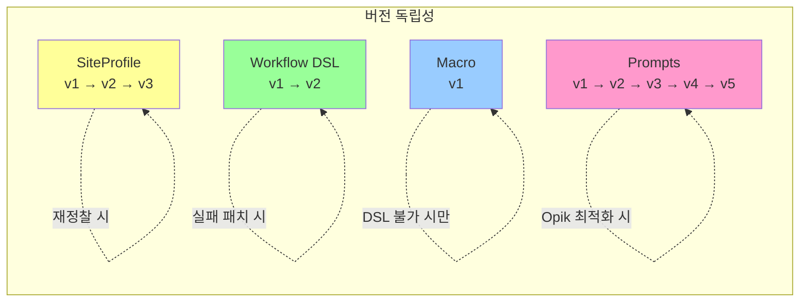

**버전 트리거 매핑:**

| 산출물 | 버전 올라가는 시점 | 트리거 |
|--------|-------------------|--------|
| SiteProfile | 사이트 재정찰 | `site_change`, `manual_recon` |
| Workflow DSL | 셀렉터 패치, 전략 변경, 재생성 | `failure_fix`, `strategy_change`, `regen` |
| Macro | 매크로 수정/재생성 | `failure_fix`, `regen` |
| Prompts | Opik 최적화, 수동 튜닝 | `opik_optimize`, `manual_tune`, `failure_fix` |

```python
class KnowledgeBase:
    """URL 패턴별 실행 번들(DSL/매크로), 프롬프트, 프로파일 독립 버전 관리."""

    BASE_DIR = Path("knowledge_base/sites")

    def _pattern_dir(self, domain: str, url_pattern: str) -> Path:
        """URL 패턴을 디렉토리 경로로 변환."""
        clean = url_pattern.strip("/").split("?")[0].split("/")[0] or "root"
        return self.BASE_DIR / domain / "url_patterns" / clean

    # ── 프로파일: 도메인 레벨 버전 관리 ──

    async def save_profile(self, domain: str, profile: SiteProfile) -> int:
        """SiteProfile 새 버전 저장."""
        history_dir = self.BASE_DIR / domain / "profile_history"
        history_dir.mkdir(parents=True, exist_ok=True)
        version = self._get_latest_version(history_dir) + 1

        # 버전 이력 저장
        (history_dir / f"v{version}.json").write_text(
            json.dumps(asdict(profile), ensure_ascii=False, indent=2)
        )
        # 현재 프로파일 갱신
        (self.BASE_DIR / domain / "profile.json").write_text(
            json.dumps(asdict(profile), ensure_ascii=False, indent=2)
        )
        (self.BASE_DIR / domain / "profile.md").write_text(
            self._render_profile_md(profile, version)
        )
        return version

    # ── 번들: URL 패턴 레벨 버전 관리 ──

    async def save_bundle(
        self, domain: str, url_pattern: str, bundle: GeneratedBundle, trigger: str,
    ) -> int:
        """URL 패턴별 실행 번들 새 버전 저장."""
        p_dir = self._pattern_dir(domain, url_pattern)

        # URL 패턴 메타 저장
        p_dir.mkdir(parents=True, exist_ok=True)
        if not (p_dir / "pattern.json").exists():
            (p_dir / "pattern.json").write_text(json.dumps({
                "url_pattern": url_pattern,
                "page_type": bundle.strategy,
                "created_at": datetime.now().isoformat(),
            }, indent=2))

        # DSL 워크플로우 저장
        wf_dir = p_dir / "workflows"
        wf_dir.mkdir(parents=True, exist_ok=True)
        version = self._get_latest_version(wf_dir) + 1
        (wf_dir / f"v{version}.dsl.json").write_text(
            json.dumps(bundle.workflow_dsl, ensure_ascii=False, indent=2)
        )
        self._update_symlink(wf_dir / "current", f"v{version}.dsl.json")

        # 매크로 저장 (있을 때만, DSL과 동일 버전 번호)
        if bundle.python_macro or bundle.ts_macro:
            macro_dir = p_dir / "macros" / f"v{version}"
            macro_dir.mkdir(parents=True, exist_ok=True)
            if bundle.python_macro:
                (macro_dir / "macro.py").write_text(bundle.python_macro)
            if bundle.ts_macro:
                (macro_dir / "macro.ts").write_text(bundle.ts_macro)
            (macro_dir / "metadata.json").write_text(json.dumps({
                "version": version, "trigger": trigger,
                "strategy": bundle.strategy,
                "created_at": datetime.now().isoformat(),
            }, indent=2))
            self._update_symlink(p_dir / "macros" / "current", f"v{version}")

        # 번들에 포함된 프롬프트도 함께 저장 (코드 안의 프롬프트)
        if bundle.prompts:
            await self.save_prompts(domain, url_pattern, bundle.prompts, trigger)

        return version

    # ── 프롬프트: URL 패턴 레벨 독립 버전 관리 ──

    async def save_prompts(
        self, domain: str, url_pattern: str, prompts: dict[str, str], trigger: str,
    ) -> int:
        """프롬프트 독립 버전 저장. 코드 버전과 무관하게 올라감."""
        prompt_dir = self._pattern_dir(domain, url_pattern) / "prompts"
        version = self._get_latest_version(prompt_dir) + 1
        vdir = prompt_dir / f"v{version}"
        vdir.mkdir(parents=True, exist_ok=True)

        for task_type, text in prompts.items():
            (vdir / f"{task_type}.yaml").write_text(text)

        (vdir / "metadata.json").write_text(json.dumps({
            "version": version,
            "trigger": trigger,
            "prompt_keys": list(prompts.keys()),
            "created_at": datetime.now().isoformat(),
        }, indent=2))
        self._update_symlink(prompt_dir / "current", f"v{version}")
        return version

    # ── 실행 이력: URL 패턴 + 코드 버전 + 프롬프트 버전 추적 ──

    async def record_run(
        self, domain: str, url_pattern: str, task: str, success: bool,
        workflow_version: int, prompt_version: int,
        duration_ms: int, llm_calls: int, error: str | None = None,
    ) -> None:
        history_dir = self.BASE_DIR / domain / "history"
        history_dir.mkdir(parents=True, exist_ok=True)
        record = {
            "timestamp": datetime.now().isoformat(),
            "url_pattern": url_pattern,
            "task": task, "success": success,
            "workflow_version": workflow_version,
            "prompt_version": prompt_version,
            "duration_ms": duration_ms,
            "llm_calls": llm_calls,
            "error": error,
        }
        with open(history_dir / "runs.jsonl", "a") as f:
            f.write(json.dumps(record, ensure_ascii=False) + "\n")

    def _update_symlink(self, link: Path, target: str) -> None:
        if link.is_symlink():
            link.unlink()
        link.symlink_to(target)
```

### 5.6 프롬프트 분류와 버전 관리 — 코드 안의 프롬프트 포함

시스템에 존재하는 프롬프트는 3계층으로 분류되며, **모든 계층이 독립적으로 버전 관리**된다.

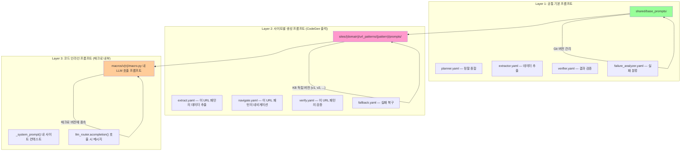

| 계층 | 위치 | 버전 관리 방식 | 최적화 대상 |
|------|------|--------------|-----------|
| **Layer 1**: 공통 기본 | `shared/base_prompts/*.yaml` | **Git** (코드와 함께) | Opik 배치 최적화 가능 (글로벌) |
| **Layer 2**: 사이트별 생성 | `url_patterns/{pattern}/prompts/v{n}/` | **KB 독립 버전** (`current` symlink) | Opik 배치 최적화 (사이트+패턴별) |
| **Layer 3**: 코드 인라인 | `macros/v{n}/macro.py` 내 문자열 | **매크로 버전에 종속** | 매크로 재생성 시 함께 갱신 |

**핵심 규칙:**

1. **Layer 2 프롬프트 분리 원칙**: CodeGen이 번들을 생성할 때, LLM에게 전달할 프롬프트는 코드에 하드코딩하지 않고 `prompts/` 디렉토리에 YAML로 분리한다. 이렇게 해야 코드를 건드리지 않고 프롬프트만 Opik으로 최적화할 수 있다.

2. **Layer 3 최소화 원칙**: 매크로 코드 안에 직접 들어가는 프롬프트는 최소한으로 제한한다. 불가피하게 인라인해야 하는 경우, 매크로 `metadata.json`에 `"inline_prompt_hash"` 필드를 기록하여 프롬프트 변경을 추적한다.

3. **프롬프트 YAML 스키마**:

```yaml
# sites/shopping.naver.com/url_patterns/search/prompts/v2/extract.yaml
meta:
  version: 2
  trigger: "opik_optimize"       # 이 버전이 만들어진 이유
  parent_version: 1               # 이전 버전
  opik_score: 0.92                # 최적화 평가 점수 (있으면)
  created_at: "2026-03-02T14:30:00+09:00"

system: |
  너는 쇼핑 검색결과 페이지에서 상품 정보를 추출하는 전문가다.
  대상 사이트: {domain}
  페이지 유형: 검색결과 ({url_pattern})
  DOM 전략: {strategy}

user_template: |
  아래 DOM 스니펫에서 상품 정보를 추출하라.
  DOM: {dom_snippet}
  추출 대상: 상품명, 가격, 판매처, 배송비
  JSON 배열로 반환.

few_shots:                          # FewShotBayesianOptimizer가 최적화
  - input: "<div class='product'>..."
    output: '[{"name": "에어팟 프로", "price": 149000, ...}]'
```

4. **실행 시 프롬프트 로딩 흐름**:

```python
class PromptResolver:
    """실행 시 프롬프트를 Layer 1 → 2 → 3 순으로 해석."""

    def resolve(self, domain: str, url_pattern: str, task_type: str) -> dict:
        """현재 프롬프트 로드. 사이트별 > 공통 기본 우선."""
        # Layer 2: 사이트별 프롬프트 (있으면 우선)
        site_prompt = self.kb.load_current_prompt(domain, url_pattern, task_type)
        if site_prompt:
            return site_prompt

        # Layer 1: 공통 기본 프롬프트 (fallback)
        base_prompt = self._load_base_prompt(task_type)
        return base_prompt

    def track_inline_prompt(self, macro_path: str) -> str:
        """Layer 3: 매크로 내 인라인 프롬프트 해시 추적."""
        source = Path(macro_path).read_text()
        # LLM 호출 패턴에서 프롬프트 문자열 추출
        prompt_strings = re.findall(
            r'(?:content|prompt)\s*[=:]\s*(?:f?"""(.+?)"""|f?\'\'\'(.+?)\'\'\')',
            source, re.DOTALL,
        )
        combined = "\n".join(s for group in prompt_strings for s in group if s)
        return hashlib.sha256(combined.encode()).hexdigest()[:16]
```

---

## 6. Phase 4: 자가 개선 시스템

### 6.1 개선 루프

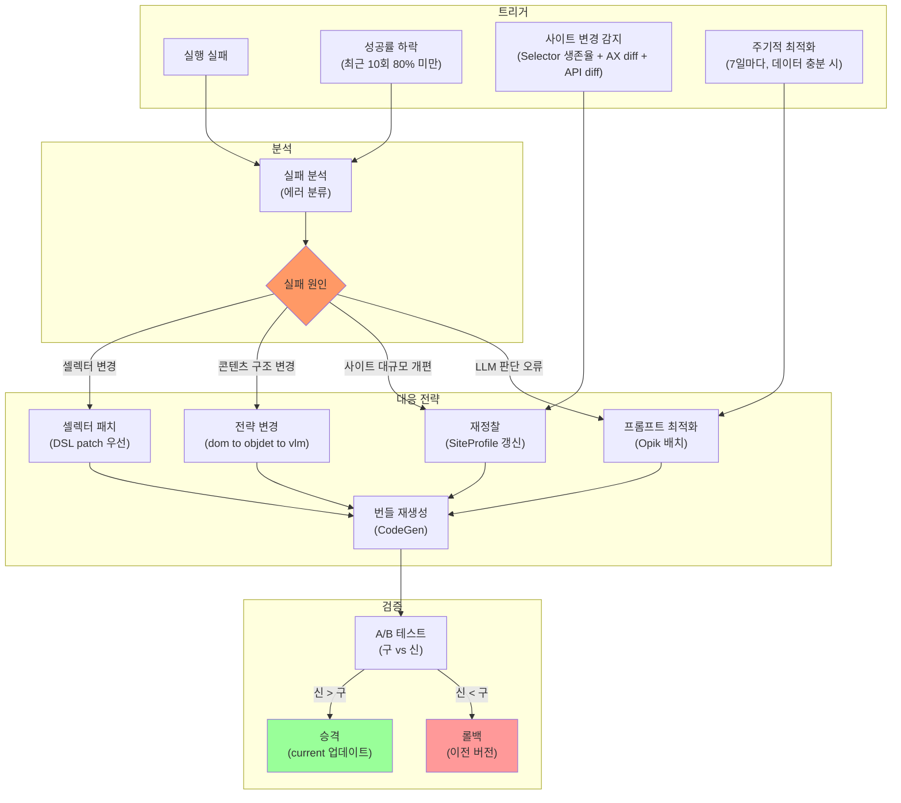

### 6.2 실패 분류 및 자동 대응

문자열 포함 규칙만으로 분류하지 않고, `Playwright 예외 타입 + 검증 실패 코드 + trace evidence`를 우선 사용한다.

```python
@dataclass
class FailureEvidence:
    step_id: str
    action: str
    error_name: str                    # 예: TimeoutError, StrictModeViolationError
    error_code: str | None             # 런타임 표준 코드
    verify_code: str | None            # 예: EXPECT_URL_MISMATCH, EXPECT_SELECTOR_MISSING
    trace_id: str | None
    screenshot_path: str | None
    dom_snippet: dict | None


class FailureAnalyzer:
    """표준화된 실패 증거 기반으로 대응 전략을 결정."""

    class FailureType(Enum):
        SELECTOR_NOT_FOUND = "selector_not_found"
        ELEMENT_NOT_VISIBLE = "element_not_visible"
        NAVIGATION_FAILED = "navigation_failed"
        CONTENT_MISMATCH = "content_mismatch"
        OBSTACLE_BLOCK = "obstacle_block"
        TIMEOUT = "timeout"
        AUTH_REQUIRED = "auth_required"
        SITE_STRUCTURE_CHANGED = "site_structure_changed"

    RESPONSE_MAP = {
        FailureType.SELECTOR_NOT_FOUND: "fix_selector",
        FailureType.ELEMENT_NOT_VISIBLE: "fix_obstacle",
        FailureType.NAVIGATION_FAILED: "change_strategy",
        FailureType.CONTENT_MISMATCH: "change_strategy",
        FailureType.OBSTACLE_BLOCK: "fix_obstacle",
        FailureType.TIMEOUT: "add_wait",
        FailureType.AUTH_REQUIRED: "human_handoff",
        FailureType.SITE_STRUCTURE_CHANGED: "full_recon",
    }

    ERROR_NAME_MAP = {
        "TimeoutError": FailureType.TIMEOUT,
        "TargetClosedError": FailureType.NAVIGATION_FAILED,
        "StrictModeViolationError": FailureType.SELECTOR_NOT_FOUND,
    }
    VERIFY_CODE_MAP = {
        "EXPECT_SELECTOR_MISSING": FailureType.SELECTOR_NOT_FOUND,
        "EXPECT_VISIBLE_FAILED": FailureType.ELEMENT_NOT_VISIBLE,
        "EXPECT_URL_MISMATCH": FailureType.NAVIGATION_FAILED,
        "EXPECT_CONTENT_MISMATCH": FailureType.CONTENT_MISMATCH,
        "EXPECT_AUTH_WALL": FailureType.AUTH_REQUIRED,
    }

    async def analyze(self, evidence: FailureEvidence, context: dict) -> tuple[FailureType, str]:
        # 1차: 런타임 에러 타입 매핑
        if evidence.error_name in self.ERROR_NAME_MAP:
            ft = self.ERROR_NAME_MAP[evidence.error_name]
            return ft, self.RESPONSE_MAP[ft]

        # 2차: 검증 실패 코드 매핑
        if evidence.verify_code in self.VERIFY_CODE_MAP:
            ft = self.VERIFY_CODE_MAP[evidence.verify_code]
            return ft, self.RESPONSE_MAP[ft]

        # 3차: 하위 호환 문자열 규칙 (legacy)
        error = (evidence.error_code or "") + " " + (evidence.error_name or "")
        if "selector" in error.lower() or "not found" in error.lower():
            return self.FailureType.SELECTOR_NOT_FOUND, "fix_selector"
        if "timeout" in error.lower():
            return self.FailureType.TIMEOUT, "add_wait"
        if "navigation" in error.lower() or "url" in error.lower():
            return self.FailureType.NAVIGATION_FAILED, "change_strategy"

        # 4차: 미분류만 LLM 분석 (trace id + dom snippet 최소 전달)
        response = await llm_router.acompletion(
            model="fast",
            messages=[{"role": "user", "content": f"""에러를 분류하라.
증거: {json.dumps(asdict(evidence), ensure_ascii=False)[:2000]}
컨텍스트: {json.dumps(context, ensure_ascii=False)[:1000]}
분류: {[t.value for t in self.FailureType]}
JSON: {{"type": "...", "reason": "..."}}"""}],
        )
        result = json.loads(response.choices[0].message.content)
        ft = self.FailureType(result["type"])
        return ft, self.RESPONSE_MAP[ft]


class SelfImprover:
    """실패 분석 → DSL patch / 매크로 수정 / 재정찰 → 검증 → 승격/롤백."""

    def __init__(self, kb: KnowledgeBase, codegen: CodeGenerator, recon_agent):
        self.kb = kb
        self.codegen = codegen
        self.recon = recon_agent
        self.analyzer = FailureAnalyzer()

    async def handle_failure(
        self,
        domain: str,
        url_pattern: str,
        task: str,
        evidence: FailureEvidence,
        browser: Browser,
    ) -> bool:
        failure_type, response = await self.analyzer.analyze(
            evidence,
            {"domain": domain, "url_pattern": url_pattern,
             "task": task, "trace_id": evidence.trace_id},
        )

        if response == "fix_selector":
            return await self._fix_selector(domain, url_pattern, task, browser)
        elif response == "fix_obstacle":
            return await self._fix_obstacle(domain, browser)
        elif response == "change_strategy":
            return await self._change_strategy(domain, url_pattern, task, browser)
        elif response == "full_recon":
            return await self._full_recon(domain, url_pattern, browser)
        elif response == "add_wait":
            return await self._add_wait(domain, url_pattern, task)
        elif response == "human_handoff":
            return False
        return False

    async def _fix_selector(
        self, domain: str, url_pattern: str, task: str, browser: Browser,
    ) -> bool:
        """셀렉터 수정: DOM 재분석 → DSL patch 우선."""
        dom_recon = DOMRecon()
        dom_result = await dom_recon.scan(browser)
        current = self.kb.load_current_bundle(domain, url_pattern)
        if not current:
            return False

        response = await llm_router.acompletion(
            model="fast",
            messages=[{"role": "user", "content": f"""현재 DSL의 셀렉터가 실패. DOM 정보 기반으로 DSL patch 생성.
현재 DSL: {json.dumps(current.workflow_dsl, ensure_ascii=False)[:2500]}
현재 DOM: {json.dumps(dom_result, ensure_ascii=False)[:3000]}
실패 태스크: {task}
실패 selector에 대해 최소 3개 fallback 포함한 DSL patch를 출력."""}],
        )
        patched = self._apply_dsl_patch(current, response.choices[0].message.content)
        if patched:
            await self.kb.save_bundle(domain, url_pattern, patched, trigger="failure_fix")
            return True
        return False

    async def _full_recon(self, domain: str, url_pattern: str, browser: Browser) -> bool:
        """사이트 재정찰 → 번들 재생성."""
        await self.kb.expire_profile(domain)
        result = await self.recon.ainvoke({"domain": domain, "browser": browser})
        profile = result["site_profile"]
        strategy = StrategyDecider().decide(profile, "general")
        new_bundle = await self.codegen.generate(profile, strategy, "general")
        await self.kb.save_bundle(domain, url_pattern, new_bundle, trigger="site_change")
        return True
```

### 6.3 사이트 변경 감지

단일 DOM hash 대신 다중 신호 합성으로 오탐/미탐을 줄인다.

```python
class ChangeDetector:
    """3개 신호(Selector 생존율 + AX diff + API 스키마 diff)로 변경 감지."""

    CHECK_INTERVAL = 86400  # 24시간마다

    async def check(self, domain: str, browser: Browser) -> ChangeReport:
        profile = self.kb.load_profile(domain)
        if not profile:
            return ChangeReport(changed=True, reason="no_profile")

        await browser.goto(f"https://{domain}", wait_until="domcontentloaded")

        # signal-1: selector 생존율
        dead_selectors = []
        all_selectors = self._all_selectors(profile)
        for sel in all_selectors:
            exists = await browser.evaluate(f"!!document.querySelector('{sel}')")
            if not exists:
                dead_selectors.append(sel)
        selector_survival_rate = 1.0 - (len(dead_selectors) / max(len(all_selectors), 1))

        # signal-2: AX snapshot diff
        current_ax = await browser.cdp_send("Accessibility.getFullAXTree", {})
        current_ax_hash = self._hash_ax_tree(current_ax)
        ax_diff_ratio = self._diff_ratio(getattr(profile, "ax_hash", None), current_ax_hash)

        # signal-3: 핵심 API 스키마 diff
        api_report = await self._capture_api_shape(browser, domain)
        api_schema_diff_ratio = self._api_diff_ratio(
            getattr(profile, "api_schema_fingerprint", {}),
            api_report,
        )

        # 가중 합성 점수
        change_score = (
            (1 - selector_survival_rate) * 0.5 +
            ax_diff_ratio * 0.3 +
            api_schema_diff_ratio * 0.2
        )

        if change_score >= 0.45 or selector_survival_rate < 0.7:
            return ChangeReport(
                changed=True,
                reason="major_restructure",
                dead_selectors=dead_selectors,
                selector_survival_rate=selector_survival_rate,
                ax_diff_ratio=ax_diff_ratio,
                api_schema_diff_ratio=api_schema_diff_ratio,
            )

        if change_score >= 0.20:
            return ChangeReport(
                changed=True,
                reason="content_update",
                dead_selectors=dead_selectors,
                selector_survival_rate=selector_survival_rate,
                ax_diff_ratio=ax_diff_ratio,
                api_schema_diff_ratio=api_schema_diff_ratio,
            )

        return ChangeReport(
            changed=False,
            selector_survival_rate=selector_survival_rate,
            ax_diff_ratio=ax_diff_ratio,
            api_schema_diff_ratio=api_schema_diff_ratio,
        )


@dataclass
class ChangeReport:
    changed: bool
    reason: str | None = None
    dead_selectors: list[str] = field(default_factory=list)
    selector_survival_rate: float = 1.0
    ax_diff_ratio: float = 0.0
    api_schema_diff_ratio: float = 0.0
```

### 6.4 프롬프트 최적화 — opik-optimizer 단독형 (배치, 데이터 충분 시)

`pip install opik-optimizer`만으로 서버 없이 동작. 실행 이력은 KB의 `runs.jsonl`에서 로드.

**운영 모드** (`OPIK_ENABLED` 환경변수로 전환, 코드 변경 없음):

| 모드 | 서버 | 트레이싱 | 최적화 | 용도 |
|------|------|---------|--------|------|
| 개발 (`true`) | Opik Docker Compose | LiteLLM/LangGraph 자동 수집, 대시보드 | 동일 | 디버깅, 프롬프트 튜닝 |
| 개인형 배포 (`false`) | 없음 | KB `runs.jsonl` 자체 관리 | 동일 | 경량 운영 |

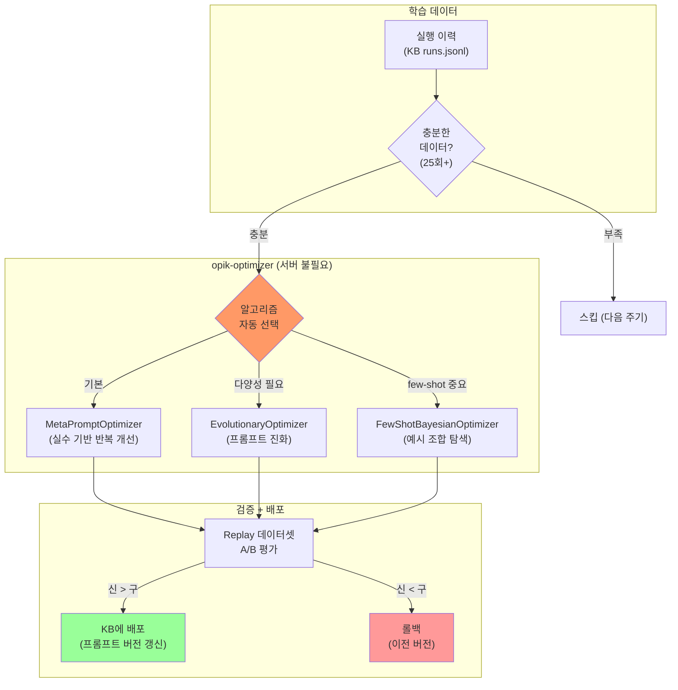

```python
from opik_optimizer import MetaPromptOptimizer, EvolutionaryOptimizer, FewShotBayesianOptimizer


class PromptOptimizer:
    """opik-optimizer 단독형 프롬프트 최적화. 서버 불필요, 배치 실행.

    알고리즘 3종:
    - MetaPromptOptimizer: 실수 기반 반복 개선 (기본)
    - EvolutionaryOptimizer: 진화적 프롬프트 변형 (다양성 확보)
    - FewShotBayesianOptimizer: few-shot 예시 조합 탐색 (토큰 절감)
    """

    MIN_RUNS_FOR_OPTIMIZATION = 25

    def __init__(self, kb: "KnowledgeBase", llm_model: str = "gemini/gemini-3-flash-preview"):
        self.kb = kb
        self.llm_model = llm_model

    async def should_run(self, domain: str) -> bool:
        """최적화 실행 조건 확인."""
        runs = self.kb.load_recent_runs(domain, count=100)
        return len(runs) >= self.MIN_RUNS_FOR_OPTIMIZATION

    def _build_dataset(self, runs: list[dict]) -> list[dict]:
        """실행 이력을 Opik 데이터셋 형식으로 변환."""
        return [
            {
                "input": {
                    "task": r["task"],
                    "site_profile_summary": r["profile_summary"],
                    "dom_candidates": r["dom_candidates"],
                },
                "expected_output": r["expected_action"],
                "metadata": {"success": r["success"], "cost": r["cost"]},
            }
            for r in runs
        ]

    def _accuracy_metric(self, output: str, expected_output: str, **kwargs) -> float:
        """프롬프트 최적화 평가 메트릭."""
        try:
            expected = json.loads(expected_output)
            predicted = json.loads(output)
            if expected[0]["action_type"] == predicted[0]["action_type"]:
                if expected[0].get("selector") == predicted[0].get("selector"):
                    return 1.0
                return 0.5
            return 0.0
        except (json.JSONDecodeError, KeyError, IndexError):
            return 0.0

    async def optimize(
        self,
        domain: str,
        task_type: str,
        algorithm: str = "meta_prompt",
    ) -> dict:
        """프롬프트 최적화 실행.

        Args:
            algorithm: "meta_prompt" | "evolutionary" | "few_shot_bayesian"
        """
        runs = self.kb.load_recent_runs(domain, count=200)
        dataset = self._build_dataset(runs)
        current_prompt = self.kb.load_current_prompt(domain, task_type)

        if algorithm == "meta_prompt":
            optimizer = MetaPromptOptimizer(
                model=self.llm_model,
                max_iterations=8,
                min_improvement=0.02,
            )
        elif algorithm == "evolutionary":
            optimizer = EvolutionaryOptimizer(
                model=self.llm_model,
                population_size=10,
                max_generations=5,
            )
        elif algorithm == "few_shot_bayesian":
            optimizer = FewShotBayesianOptimizer(
                model=self.llm_model,
                max_demos=4,
                num_trials=20,
            )
        else:
            raise ValueError(f"Unknown algorithm: {algorithm}")

        result = optimizer.optimize(
            prompt=current_prompt,
            dataset=dataset,
            metric=self._accuracy_metric,
        )

        return {
            "optimized_prompt": result.best_prompt,
            "score": result.best_score,
            "algorithm": algorithm,
            "iterations": result.num_iterations,
        }
```

### 6.5 최적화 스케줄

```python
class OptimizationScheduler:
    """배치 최적화 스케줄러.

    알고리즘 선택 전략:
    - 기본: MetaPromptOptimizer (안정적, 실수 기반)
    - 성공률 정체 시: EvolutionaryOptimizer (다양성 확보)
    - 비용 과다 시: FewShotBayesianOptimizer (예시 최적화로 토큰 절감)
    """

    async def run_scheduled(self, domain: str) -> None:
        runs = self.kb.load_recent_runs(domain, count=50)
        success_rate = sum(1 for r in runs if r["success"]) / max(len(runs), 1)

        # 1. 실패율 높으면 자동 수정 먼저
        if success_rate < 0.8:
            failures = [r for r in runs if not r["success"]]
            await self.improver.handle_batch_failures(domain, failures)

        # 2. 프롬프트 최적화 (알고리즘 자동 선택)
        if await self.prompt_optimizer.should_run(domain):
            avg_cost = sum(r["cost"] for r in runs) / max(len(runs), 1)

            # 비용 과다 → few-shot 최적화로 토큰 절감
            if avg_cost > 0.005:
                algorithm = "few_shot_bayesian"
            # 성공률 정체 → 진화적 다양성 확보
            elif 0.8 <= success_rate < 0.95:
                algorithm = "evolutionary"
            # 기본 → 실수 기반 반복 개선
            else:
                algorithm = "meta_prompt"

            result = await self.prompt_optimizer.optimize(
                domain, "general", algorithm=algorithm,
            )

            # Replay 데이터셋으로 검증 후 승격/롤백
            if result["score"] > self.kb.load_current_score(domain):
                await self.kb.promote_prompt(domain, result)
            else:
                logger.info(f"[{domain}] 최적화 결과가 기존보다 낮음. 롤백.")

        # 3. 사이트 변경 감지
        report = await self.change_detector.check(domain, self.browser)
        if report.changed:
            if report.reason == "major_restructure":
                await self.improver._full_recon(domain, self.browser)
            else:
                await self.improver._fix_selector(domain, "general", self.browser)
```

---

## 7. 전체 실행 흐름 — LangGraph 메인 워크플로우

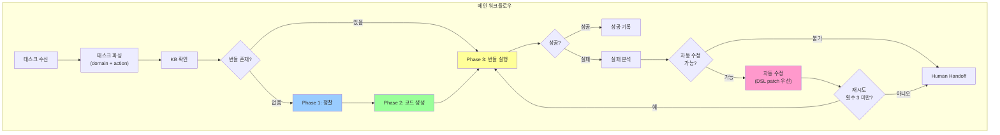

```python
from langgraph.graph import StateGraph, START, END

class MainState(TypedDict):
    task: str
    domain: str
    url_pattern: str               # 현재 URL에 매칭된 패턴
    browser: Browser
    site_profile: SiteProfile | None
    generated_bundle: GeneratedBundle | None
    execution_result: dict | None
    error: str | None
    retry_count: int
    status: str

async def parse_task(state: MainState) -> MainState:
    domain = extract_domain(state["task"])
    url = extract_url(state["task"])
    url_pattern = kb.match_url_pattern(domain, url) or url
    return {**state, "domain": domain, "url_pattern": url_pattern, "status": "check_kb"}

async def check_kb(state: MainState) -> MainState:
    bundle = kb.load_current_bundle(state["domain"], state["url_pattern"])
    if bundle:
        return {**state, "generated_bundle": bundle, "status": "execute"}
    profile = kb.load_profile(state["domain"])
    if profile:
        return {**state, "site_profile": profile, "status": "codegen"}
    return {**state, "status": "recon"}

async def run_recon(state: MainState) -> MainState:
    result = await recon_agent.ainvoke({"domain": state["domain"], "browser": state["browser"]})
    profile = result["site_profile"]
    await kb.save_profile(state["domain"], profile)
    return {**state, "site_profile": profile, "status": "codegen"}

async def run_codegen(state: MainState) -> MainState:
    profile = state["site_profile"]
    strategy = StrategyDecider().decide(profile, "general")
    bundle = await codegen.generate(profile, strategy, "general")
    validator = CodeValidator()
    result = await validator.validate(bundle, profile, state["browser"])
    if not result.overall:
        bundle = await codegen.generate(profile, strategy, "general")  # 1회 재시도
    await kb.save_bundle(state["domain"], state["url_pattern"], bundle, trigger="initial")
    return {**state, "generated_bundle": bundle, "status": "execute"}

async def execute_bundle(state: MainState) -> MainState:
    bundle = state["generated_bundle"]
    try:
        result = await execute_automation(
            bundle.workflow_dsl, state["task"], state["browser"],
            macro_py=bundle.python_macro, macro_ts=bundle.ts_macro,
        )
        return {**state, "execution_result": result, "status": "verify"}
    except Exception as e:
        return {**state, "error": str(e), "status": "fix"}

async def verify_result(state: MainState) -> MainState:
    result = state["execution_result"]
    if result and result.get("success"):
        await kb.record_run(
            state["domain"], state["url_pattern"], state["task"], True,
            workflow_version=result.get("workflow_version", 1),
            prompt_version=result.get("prompt_version", 1),
            duration_ms=result.get("duration_ms", 0),
            llm_calls=result.get("llm_calls", 0),
        )
        return {**state, "status": "done"}
    return {**state, "status": "fix", "error": result.get("error", "unknown")}

async def fix_and_retry(state: MainState) -> MainState:
    if state["retry_count"] >= 3:
        return {**state, "status": "handoff"}
    improved = await self_improver.handle_failure(
        state["domain"], state["url_pattern"], state["task"],
        state["error"], state["browser"],
    )
    if improved:
        bundle = kb.load_current_bundle(state["domain"], state["url_pattern"])
        return {**state, "generated_bundle": bundle,
                "retry_count": state["retry_count"] + 1, "status": "execute"}
    return {**state, "status": "handoff"}

def route(state: MainState) -> str:
    return state["status"]

main_graph = StateGraph(MainState)
main_graph.add_node("parse", parse_task)
main_graph.add_node("check_kb", check_kb)
main_graph.add_node("recon", run_recon)
main_graph.add_node("codegen", run_codegen)
main_graph.add_node("execute", execute_bundle)
main_graph.add_node("verify", verify_result)
main_graph.add_node("fix", fix_and_retry)
main_graph.add_node("done", lambda s: s)
main_graph.add_node("handoff", lambda s: s)

main_graph.add_edge(START, "parse")
main_graph.add_conditional_edges("parse", route)
main_graph.add_conditional_edges("check_kb", route)
main_graph.add_edge("recon", "codegen")
main_graph.add_conditional_edges("codegen", route)
main_graph.add_conditional_edges("execute", route)
main_graph.add_conditional_edges("verify", route)
main_graph.add_conditional_edges("fix", route)
main_graph.add_edge("done", END)
main_graph.add_edge("handoff", END)

main_workflow = main_graph.compile()
```

### 7.2 챗 기반 자동화 — Multi-Turn 필수

UI/챗을 통한 자동화 완성은 **무조건 multi-turn 방식**으로 진행한다. 단일 턴으로 자동화를 완성하지 않는다.

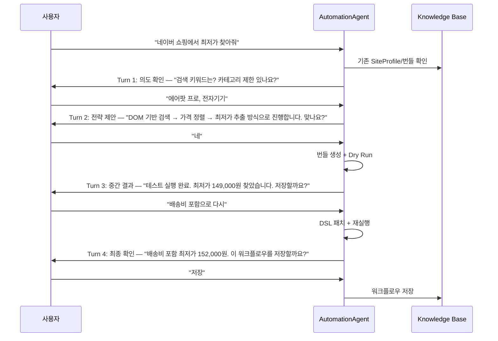

**원칙:**

1. **의도 확인 턴**: 사용자의 자연어 요청을 구체적 태스크 파라미터로 변환. 모호한 채로 실행하지 않음
2. **전략 제안 턴**: SiteProfile 기반으로 어떤 전략/방식을 쓸지 사용자에게 제안하고 승인 받음
3. **중간 결과 턴**: Dry Run 또는 실제 실행 결과를 보여주고, 수정 요청을 받음
4. **최종 확인 턴**: 결과를 확정하고 워크플로우를 KB에 저장할지 결정

**구현:**

```python
class ChatAutomationState(TypedDict):
    conversation_history: list[dict]   # multi-turn 대화 이력
    current_phase: str                 # "clarify" | "propose" | "execute" | "review" | "save"
    task_params: dict                  # 확정된 태스크 파라미터
    dry_run_result: dict | None        # 테스트 실행 결과
    user_approved: bool                # 사용자 승인 여부


def route_chat_phase(state: ChatAutomationState) -> str:
    """사용자 승인 없이 다음 단계로 넘어가지 않는다."""
    phase = state["current_phase"]
    if phase == "clarify" and state["task_params"]:
        return "propose"
    if phase == "propose" and state["user_approved"]:
        return "execute"
    if phase == "execute" and state["dry_run_result"]:
        return "review"
    if phase == "review" and state["user_approved"]:
        return "save"
    return "wait_user_input"  # 항상 사용자 입력 대기
```

---

## 8. LiteLLM 비용 추적 및 모델 라우팅

### 8.1 모델 라우팅 정책

```python
class ModelRouter:
    """태스크 유형별 최적 모델 라우팅."""

    ROUTING_POLICY = {
        "recon_synthesize":  ("fast",   "strong", 4000, 0.1),
        "codegen":           ("fast",   "strong", 8000, 0.2),
        "codegen_complex":   ("strong", None,     8000, 0.1),
        "selector_fix":      ("fast",   None,     2000, 0.1),
        "failure_analysis":  ("fast",   None,     1000, 0.0),
        "vision_analysis":   ("vision", None,     2000, 0.1),
        "prompt_feedback":   ("fast",   None,     2000, 0.3),
    }

    async def call(self, task_type: str, messages: list[dict], **kwargs) -> str:
        policy = self.ROUTING_POLICY.get(task_type, ("fast", None, 2000, 0.2))
        model, fallback, max_tokens, temperature = policy
        response = await llm_router.acompletion(
            model=model, messages=messages,
            max_tokens=max_tokens, temperature=temperature, **kwargs,
        )
        return response.choices[0].message.content
```

### 8.2 비용 모니터링

```python
class CostMonitor:
    """실시간 비용 추적 + 예산 초과 시 자동 다운그레이드."""

    BUDGET_PER_TASK = 0.05
    BUDGET_PER_HOUR = 1.0
    BUDGET_PER_DAY = 10.0

    def __init__(self):
        self.hourly_spend = 0.0
        self.daily_spend = 0.0
        self.task_spend = 0.0

    def check_budget(self, estimated_cost: float) -> str:
        if self.task_spend + estimated_cost > self.BUDGET_PER_TASK:
            return "downgrade"
        if self.hourly_spend + estimated_cost > self.BUDGET_PER_HOUR:
            return "throttle"
        if self.daily_spend + estimated_cost > self.BUDGET_PER_DAY:
            return "stop"
        return "ok"

    def record(self, cost: float) -> None:
        self.task_spend += cost
        self.hourly_spend += cost
        self.daily_spend += cost
```

---

## 9. 비용 분석 (추정치)

### 9.1 단계별 비용

| 단계 | LLM 호출 | 비용 (추정) | 빈도 |
|------|---------|------|------|
| **정찰** (Phase 1) | Flash 1~2회 | ~$0.002~$0.005 | 사이트당 1회 |
| **번들 생성** (Phase 2) | Flash 1~3회 | ~$0.003~$0.010 | 사이트당 1회 |
| **검증 게이트** (Phase 2) | 0 | $0 | 사이트당 1회 |
| **실행** (Phase 3, 번들 히트) | 0 | $0 | 매 태스크 |
| **실행** (Phase 3, 번들 미스) | Flash 1회 | ~$0.002 | 드물게 |
| **자동 수정** (Phase 4) | Flash 1회 | ~$0.002 | 실패 시 |
| **프롬프트 최적화** (Phase 4) | Flash 5~10회 | ~$0.010~$0.020 | 7일마다 (데이터 충분 시) |

### 9.2 누적 비용 시뮬레이션

```
사이트 1개, 태스크 100회 (추정):
  정찰:        ~$0.005 (1회)
  번들 생성:    ~$0.010 (1회 + 수정 2회)
  런타임:      ~$0.000 x 95 + $0.002 x 5 = ~$0.010 (5% 미스)
  최적화:      ~$0.020 (2회)
  합계: ~$0.045
  태스크당: ~$0.00045

사이트 10개, 태스크 1,000회 (추정):
  합계: ~$0.450
  태스크당: ~$0.00045
```

### 9.3 v3 vs v4 비교

| | v3 | v4 |
|---|---|---|
| 첫 태스크 비용 | ~$0.012 | ~$0.020 (정찰+생성 포함) |
| 10번째 태스크 비용 | ~$0.005 | ~$0.000 |
| 100번째 태스크 비용 | ~$0.002 (Skill 히트) | ~$0.000 |
| 사이트 개편 대응 | 태스크 실패 → LLM 복구 | **변경 감지 → 재정찰 → 번들 재생성** |
| 프롬프트 품질 | 수동 관리 | **Opik 배치 자동 개선** |
| 100태스크 누적 | ~$0.12~$0.25 | **~$0.045** |

---

## 10. 구현 순서

```
Phase 1:  Recon MVP
          → SiteProfile 스키마/수집기/저장 파이프라인

Phase 2:  CodeGen MVP (DSL-first)
          → workflow_dsl 생성 + selector patch + 선택적 macro 생성

Phase 3:  Runtime + Verifier
          → LangGraph 실행 루프 + URL/DOM/Network 검증

Phase 4:  Self-Repair
          → 실패 분류 + DSL patch 반영 + 재시도/롤백

Phase 5:  Self-Improve (데이터 충분 시)
          → Opik Agent Optimizer 배치 최적화 + Replay/Canary 승격 게이트

Phase 6:  Production Hardening
          → 비용 모니터링 + 다중 사이트 운영 + 변경 감지 재정찰
```

---

## 11. 기술 스택

| 구성요소 | 도구 | 역할 |
|---------|------|------|
| 워크플로우 오케스트레이션 | **LangGraph** | 상태머신 기반 에이전트 워크플로우 |
| LLM 라우팅/비용 추적 | **LiteLLM** Router | 멀티모델 fallback + 실시간 비용 모니터링 |
| 브라우저 자동화 | **Playwright** (async) | DOM 조작 + 스크린샷 + 네트워크 캡처 |
| DOM 추출 | **CDP** (Chrome DevTools Protocol) | DOM + AX Tree + 네트워크 |
| 객체 탐지 | **YOLO26** (CPU) / **RT-DETRv4** (GPU) | 버튼, 카드, 메뉴 등 UI 요소 검출. CPU 환경은 무조건 YOLO26 |
| LLM | **Gemini 3 Flash / 3.1 Pro** 또는 **GPT-5 mini / 5.3 Codex** (via LiteLLM, API 키 기반 벤더 자동 선택) | 정찰 종합, 코드 생성, 실패 분석 |
| VLM | LLM과 동일 벤더의 Vision 모델 | Canvas 분석, 시각 구조 파악 |
| 프롬프트 최적화 | **opik-optimizer** 단독형 (Apache 2.0, 서버 불필요) | 배치 프롬프트 최적화 (MetaPrompt/Evolutionary/FewShotBayesian). 대규모 운영 시 Opik 서버 추가 가능 |
| 이미지 처리 | **Pillow** | 스크린샷 처리, Grid 합성 |
| 지식 저장 | **파일 시스템** (MD + JSON + DSL + Python/TS) | 사이트별 프로파일, 워크플로우, 매크로, 프롬프트 |
| 버전 관리 | **Git** (코드) + 자체 버전링 (프롬프트/DSL) | 이력 추적 |

---

## 12. 참고 문헌

1. **LangGraph** — Graph API / Persistence / Human-in-the-loop
   - https://docs.langchain.com/oss/python/langgraph/graph-api
   - https://docs.langchain.com/oss/python/langgraph/persistence
   - https://docs.langchain.com/oss/python/langgraph/human-in-the-loop
2. **LiteLLM** — Router / Reliability
   - https://docs.litellm.ai/docs/routing
   - https://docs.litellm.ai/docs/proxy/reliability
3. **Playwright** — Actionability / Locators / CDPSession / Tracing / HAR Replay / ARIA Snapshot
   - https://playwright.dev/docs/actionability
   - https://playwright.dev/docs/locators
   - https://playwright.dev/docs/api/class-cdpsession
   - https://playwright.dev/docs/api/class-tracing
   - https://playwright.dev/docs/api/class-browsercontext
   - https://playwright.dev/docs/aria-snapshots
4. **CDP** — DOMSnapshot / Accessibility / Page
   - https://chromedevtools.github.io/devtools-protocol/tot/DOMSnapshot/
   - https://chromedevtools.github.io/devtools-protocol/tot/Accessibility/
   - https://chromedevtools.github.io/devtools-protocol/tot/Page/
5. **Opik** — Agent Optimizer / Tracing / LiteLLM 연동
   - https://github.com/comet-ml/opik
   - https://www.comet.com/docs/opik/agent_optimization/overview
   - https://pypi.org/project/opik-optimizer/
   - https://docs.litellm.ai/docs/observability/opik_integration
6. **Structured Output**
   - https://ai.google.dev/gemini-api/docs/structured-output
7. **벤치마크/연구**
   - WebArena: https://openreview.net/forum?id=oKn9c6ytLx
   - VisualWebArena: https://arxiv.org/abs/2401.13649
   - Mind2Web: https://arxiv.org/abs/2306.06070
   - WorkArena: https://servicenow.github.io/WorkArena/
   - BrowserGym: https://arxiv.org/abs/2412.05467
   - Agent-E: https://arxiv.org/abs/2407.13032
   - SeeClick: https://arxiv.org/abs/2401.10935
8. **Vision/GUI 도구**
   - YOLO26: https://docs.ultralytics.com/models/yolo26/
   - RT-DETRv4: https://github.com/RT-DETRs/RT-DETRv4
   - OmniParser: https://github.com/microsoft/OmniParser

---

## 13. v3와의 관계

v4는 v3를 대체하는 것이 아니라 **상위 레이어**로 동작한다.

```
v4 (정찰 + 코드 생성 + 자가 개선)
  └── v3 (실행 엔진: Orchestrator, PageAnalyzer, NavigationEngine, ListExplorer)
       └── 기반 모듈 (Playwright, CDP, YOLO26/RT-DETRv4, VLM)
```

v3의 Orchestrator/PageAnalyzer/NavigationEngine은 그대로 유지되며,
v4의 CodeGenerator가 생성하는 실행 번들(DSL + 선택적 매크로)이 v3 실행 엔진 위에서 동작한다.
정찰이 수집한 SiteProfile은 v3의 PageAnalyzer가 어떤 Tier를 먼저 시도할지 결정하는 데도 활용된다.
