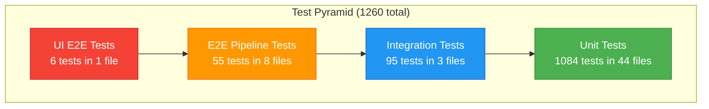

> **[한국어 버전 (Korean)](./TESTING-GUIDE.ko.md)**

# Testing Guide

## 1. Overview

The web-agentic project maintains **1260 total tests across 52 test files**, organized in a 4-tier test pyramid:

| Tier | Tests | Files | Purpose |
|------|------:|------:|---------|
| Unit | 1084 | 44 | Isolated module logic |
| Integration | 95 | 3 | Module wiring and API endpoints |
| E2E Pipeline | 55 | 8 | Browser automation scenarios |
| UI E2E | 6 | 1 | Full-stack UI + API verification |

**Tools:**
- [pytest](https://docs.pytest.org/) -- test runner and assertions
- [pytest-asyncio](https://pytest-asyncio.readthedocs.io/) -- async test support (auto mode)
- [Playwright for Python](https://playwright.dev/python/) -- browser automation in E2E tests

All async tests use `pytest-asyncio` with **auto mode** (`asyncio_mode = "auto"`), so no manual `@pytest.mark.asyncio` decorator is needed.

## 2. Test Pyramid



The pyramid follows the standard testing principle: **more unit tests at the base, fewer but broader tests at the top**. Unit tests run fast and cover individual functions; E2E and UI tests validate the entire system but are slower and more resource-intensive.

## 3. Quick Commands

| Command | Description |
|---------|-------------|
| `pytest tests/` | Run all tests |
| `pytest tests/unit/` | Unit tests only |
| `pytest tests/integration/` | Integration tests only |
| `pytest tests/e2e/` | E2E tests only |
| `pytest tests/unit/test_rule_engine.py` | Single file |
| `pytest tests/ -k "test_match"` | By test name pattern |
| `pytest tests/ -v` | Verbose output |
| `pytest tests/ -x` | Stop on first failure |
| `pytest tests/ --tb=short` | Short tracebacks |
| `pytest tests/ -m "not e2e"` | Exclude E2E |
| `pytest tests/ -m "not live"` | Exclude live site tests |
| `pytest tests/ --co` | List tests without running |

## 4. Test Categories

### 4.1 Unit Tests (1084 tests, 44 files)

Unit tests validate each module's logic in isolation. External dependencies (LLM APIs, browsers, databases) are mocked.

| File | Tests | Description |
|------|------:|-------------|
| `test_verifier.py` | 23 | Verify conditions (URL, element, text) |
| `test_patch_system.py` | 25 | Patch generation and application |
| `test_llm_planner.py` | 41 | LLM planning and element selection |
| `test_coord_mapper.py` | 20 | Screenshot-to-page coordinate mapping |
| `test_executor_pool.py` | 8 | Browser session pool management |
| `test_orchestrator.py` | 38 | Main orchestration loop and escalation |
| `test_rule_promoter.py` | 27 | Pattern-to-rule promotion logic |
| `test_step_queue.py` | 21 | FIFO step queue operations |
| `test_yolo_detector.py` | 21 | YOLO object detection interface |
| `test_selector_cache.py` | 3 | Selector cache lookup/save |
| `test_executor.py` | 32 | Playwright browser actions |
| `test_image_batcher.py` | 20 | Image batching and resizing |
| `test_pattern_db.py` | 32 | Pattern database CRUD |
| `test_vlm_client.py` | 19 | VLM API client |
| `test_exception_rules.py` | 36 | Exception handling rules (67 rules) |
| `test_prompt_manager.py` | 20 | Prompt template versioning |
| `test_extractor.py` | 23 | DOM extraction to JSON |
| `test_handoff.py` | 35 | Human handoff interface |
| `test_memory_manager.py` | 44 | 4-tier memory system |
| `test_fallback_router.py` | 55 | Failure classification and routing |
| `test_dspy_optimizer.py` | 16 | Prompt optimization placeholder (DSPy not integrated) |
| `test_evolution_pipeline.py` | 11 | Evolution pipeline state machine |
| `test_dsl_parser.py` | 20 | YAML DSL parsing |
| `test_llm_orchestrator.py` | 5 | LLM-first orchestrator |
| `test_rule_engine.py` | 26 | Rule matching engine |
| `test_evolution_db.py` | 20 | Evolution database operations |
| `test_element_fingerprint.py` | 12 | Similo multi-attribute fingerprint matching |
| `test_plan_cache.py` | 16 | Keyword extraction and fuzzy plan adaptation |
| `test_cascaded_router.py` | 12 | Flash-first routing and escalation |
| `test_self_healing.py` | 13 | 6-category failure classification and healing |

### 4.2 Integration Tests (95 tests, 3 files)

Integration tests verify that modules work together correctly through their real interfaces, with only external services mocked.

| File | Tests | Description |
|------|------:|-------------|
| `test_engine_wiring.py` | 45 | Module wiring and dependency injection validation |
| `test_api_integration.py` | 26 | API endpoint integration (FastAPI TestClient) |
| `test_poc_script.py` | 24 | PoC script end-to-end flow |

### 4.3 E2E Tests (49 tests, 7+1 files)

E2E tests exercise real browser instances through Playwright. They validate complete user scenarios from browser launch to result verification.

| File | Tests | Description |
|------|------:|-------------|
| `test_executor_e2e.py` | 8 | Browser automation E2E |
| `test_selectors_e2e.py` | 6 | CSS selector strategies |
| `test_verifier_e2e.py` | 9 | Verification with real pages |
| `test_chain_e2e.py` | 5 | Multi-step action chains |
| `test_evolution_e2e.py` | 7 | Evolution pipeline E2E |
| `test_evolution_ui_e2e.py` | 6 | UI + API E2E (Playwright browser tests) |
| `test_extractor_e2e.py` | 8 | DOM extraction from real pages |
| `test_live_sites.py` | 2 | Live website tests (requires internet) |

> **Note:** `test_live_sites.py` hits real external websites and requires an active internet connection. These tests are marked with `@pytest.mark.live` and may be skipped in offline or CI environments.

## 5. Pytest Markers

| Marker | Description | Usage |
|--------|-------------|-------|
| `e2e` | End-to-end tests requiring a browser | `pytest -m e2e` |
| `live` | Tests hitting real websites | `pytest -m live` |

By default, **e2e and live tests are NOT excluded** -- they run when you execute `pytest tests/`. To skip them:

```bash
# Skip E2E tests
pytest tests/ -m "not e2e"

# Skip live-site tests
pytest tests/ -m "not live"

# Skip both
pytest tests/ -m "not e2e and not live"
```

## 6. Fixtures and Conftest

### Shared Configuration

The project's `conftest.py` at the `tests/` root provides shared fixtures used across all test tiers.

### Key Fixtures

- **pytest-asyncio** with `asyncio_mode = "auto"` -- all `async def` test functions are automatically detected and run in an event loop. No need for `@pytest.mark.asyncio`.
- **Playwright fixtures** -- `page`, `context`, and `browser` fixtures for E2E browser tests.
- **Temporary database fixtures** -- in-memory or temp-file SQLite databases for DB tests, automatically cleaned up after each test.
- **Mock fixtures** -- pre-configured mocks for LLM clients, Vision modules, and other external services.

### Fixture Scope

| Fixture Type | Scope | Notes |
|-------------|-------|-------|
| Browser | session | Shared browser instance across E2E tests |
| Context | function | Fresh browser context per test |
| Page | function | Fresh page per test |
| Database | function | Clean database per test |
| Mocks | function | Reset per test |

## 7. Writing New Tests

### File and Function Naming

- **File naming:** `test_<module_name>.py`
- **Test naming:** `test_<behavior>` or `test_<module>_<scenario>`
- Place unit tests in `tests/unit/`, integration tests in `tests/integration/`, and E2E tests in `tests/e2e/`.

### Guidelines

1. Use `async def` for any test involving Playwright or aiosqlite.
2. Mark E2E tests with `@pytest.mark.e2e`.
3. Mark live-site tests with `@pytest.mark.live`.
4. Use fixtures from `conftest.py` rather than creating new ones where possible.
5. Keep unit tests fast -- mock all external dependencies.
6. Each test should be independent and not rely on execution order.

### Example: Async E2E Test

```python
import pytest


@pytest.mark.e2e
async def test_executor_clicks_button(page):
    await page.goto("https://example.com")
    await page.click("button#submit")
    assert await page.title() == "Success"
```

### Example: Unit Test with Mock

```python
from unittest.mock import AsyncMock


async def test_planner_returns_steps():
    mock_llm = AsyncMock()
    mock_llm.generate.return_value = '{"steps": [{"action": "click", "selector": "#btn"}]}'

    planner = LLMPlanner(llm_client=mock_llm)
    result = await planner.plan("Click the submit button")

    assert len(result.steps) == 1
    assert result.steps[0].action == "click"
```

### Example: Database Test

```python
async def test_pattern_db_insert(tmp_path):
    db = PatternDB(db_path=str(tmp_path / "test.db"))
    await db.initialize()

    await db.save_pattern(site="example.com", intent="login", selector="#login-btn")
    pattern = await db.lookup(site="example.com", intent="login")

    assert pattern is not None
    assert pattern.selector == "#login-btn"
```

## 8. CI/CD Testing

A typical CI pipeline should run the following stages in order:

### Stage 1: Static Analysis

```bash
# Lint (auto-fix)
ruff check --fix

# Type checking
mypy --strict
```

### Stage 2: Unit and Integration Tests

```bash
pytest tests/unit tests/integration
```

These tests are fast, require no browser, and catch most regressions.

### Stage 3: Full Suite

```bash
pytest tests/
```

This includes E2E tests and requires Playwright browsers to be installed:

```bash
playwright install chromium
```

### Recommended CI Configuration

```yaml
# Example: GitHub Actions
steps:
  - name: Lint
    run: ruff check --fix

  - name: Type Check
    run: mypy --strict

  - name: Install Playwright
    run: playwright install chromium

  - name: Unit & Integration Tests
    run: pytest tests/unit tests/integration -v

  - name: E2E Tests
    run: pytest tests/e2e -v -m "not live"

  - name: Full Suite (optional)
    run: pytest tests/ -v
```

> **Tip:** In CI, consider using `-m "not live"` to skip tests that depend on external websites, as those can cause flaky failures due to network or site changes.
