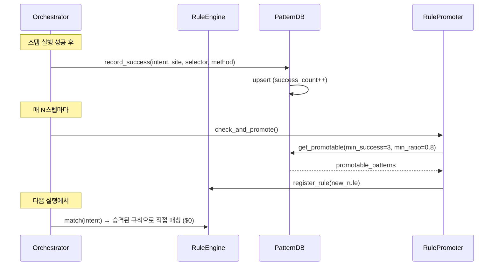
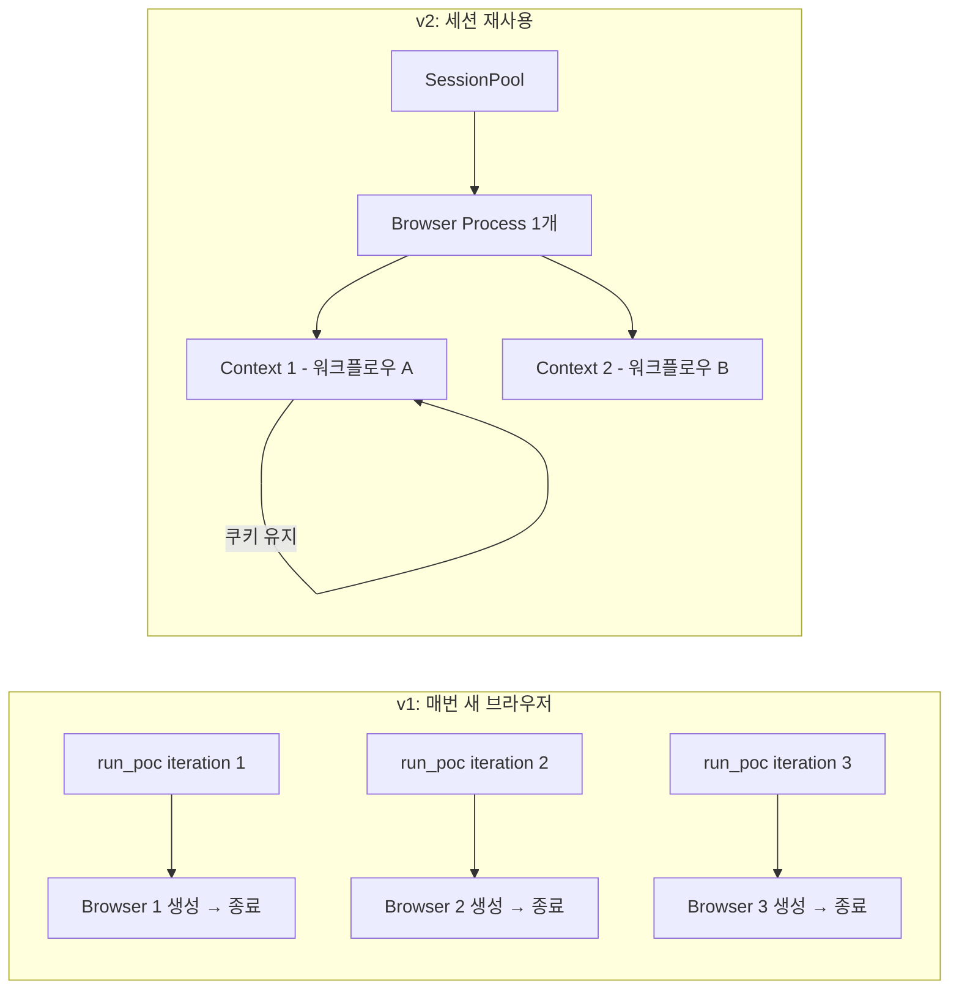
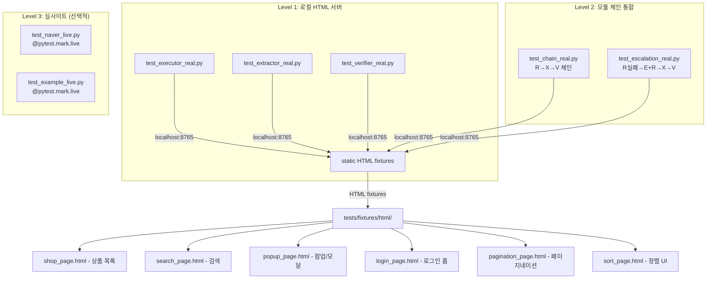
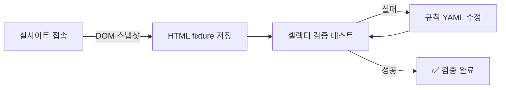
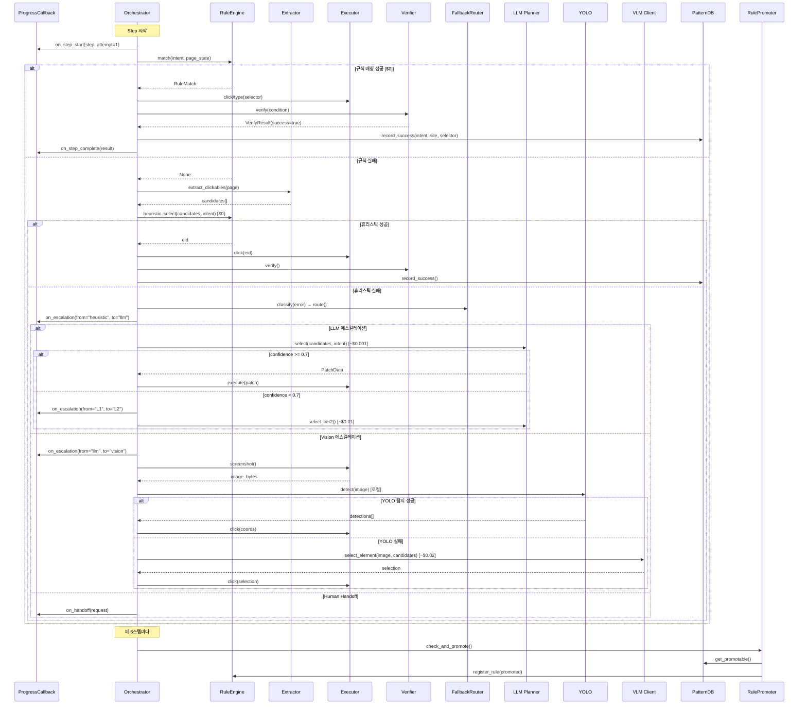

# Web-Agentic v2 로드맵

> v1 (현재): 아키텍처 + 단위 테스트 675개 완성
> v2 (다음): 실전 동작 보강 + E2E 검증 + AI 비서 연결 인터페이스

---

## 1. 현재 상태 분석 (v1 갭)

### 1.1 전체 갭 요약

```mermaid
graph TD
    subgraph "✅ v1 완성"
        A[Executor - Playwright 래퍼]
        B[Extractor - DOM 추출]
        C[RuleEngine - 규칙 매칭]
        D[Verifier - 상태 검증]
        E[FallbackRouter - 실패 분류]
        F[LLM Planner - Gemini 호출]
        G[Memory Manager - 4계층]
        H[PatternDB + RulePromoter]
        I[Vision 모듈 4종]
        J[675 단위 테스트]
    end

    subgraph "❌ v2에서 보강 필요"
        K[Vision 에스컬레이션 미연결]
        L[학습 루프 미연결]
        M[진행 콜백 없음]
        N[브라우저 세션 재사용 없음]
        O[실제 사이트 E2E 테스트 0개]
        P[규칙 셀렉터 실사이트 미검증]
        Q[LLM 응답 파싱 취약]
        R[단일 스텝 실행 API 없음]
    end

    A --> K
    I --> K
    H --> L
    A --> M
    A --> N
    J --> O
    C --> P
    F --> Q
    A --> R

    style K fill:#ff6b6b,color:#fff
    style L fill:#ff6b6b,color:#fff
    style M fill:#ffa94d,color:#fff
    style N fill:#ffa94d,color:#fff
    style O fill:#ff6b6b,color:#fff
    style P fill:#ff6b6b,color:#fff
    style Q fill:#ffa94d,color:#fff
    style R fill:#ffa94d,color:#fff
```



### 1.2 갭 상세

| # | 갭 | 위치 | 심각도 | 설명 |
|---|-----|------|--------|------|
| G1 | Vision 에스컬레이션 미연결 | `orchestrator.py:286-291` | CRITICAL | YOLO/VLM 모듈이 존재하지만 Orchestrator에서 호출 안 함 |
| G2 | 학습 루프 미연결 | `orchestrator.py` 전체 | CRITICAL | PatternDB/RulePromoter가 Orchestrator에 주입되지 않음 |
| G3 | 실제 사이트 E2E 테스트 없음 | `tests/integration/` | HIGH | 675개 테스트 전부 모킹. 실제 브라우저 테스트 0개 |
| G4 | 규칙 셀렉터 실사이트 미검증 | `config/rules/*.yaml` | HIGH | 67개 규칙의 CSS 셀렉터가 실제 사이트 DOM과 매칭되는지 확인 안 됨 |
| G5 | 진행 콜백 메커니즘 없음 | `orchestrator.py` 전체 | MEDIUM | 스텝 시작/완료/에스컬레이션 이벤트를 외부에 알릴 방법 없음 |
| G6 | 브라우저 세션 재사용 없음 | `executor.py:319-340` | MEDIUM | 매 실행마다 새 브라우저. 쿠키/인증 상태 소실 |
| G7 | LLM 응답 파싱 취약 | `llm_planner.py:206-255` | MEDIUM | JSON 추출이 백틱 펜스에만 의존. 유효성 검증 부족 |
| G8 | 단일 스텝 실행 API 없음 | `orchestrator.py` | MEDIUM | 워크플로우 전체 실행만 가능. 스텝별 디버깅 불가 |

---

## 2. v2 개발 계획

### 2.1 Phase 구성

```mermaid
gantt
    title v2 개발 Phase
    dateFormat X
    axisFormat %s

    section Phase A
    Orchestrator 보강 (G1,G2,G5,G8) :a1, 0, 2

    section Phase B
    Executor 보강 (G6) + LLM 파싱 (G7) :b1, 0, 2

    section Phase C
    E2E 테스트 인프라 (G3) :c1, 2, 4

    section Phase D
    실사이트 규칙 검증 (G4) :d1, 4, 6
```



### 2.2 Phase A: Orchestrator 보강

**목표:** Vision/학습 루프 연결, 진행 콜백, 단일 스텝 API

#### A1. Vision 에스컬레이션 연결

**파일:** `src/core/orchestrator.py`

현재 (placeholder):
```python
# orchestrator.py:286-291
if recovery.strategy == "escalate_vision":
    logger.debug("vision escalation not yet implemented")
```

변경 후:
```python
if recovery.strategy == "escalate_vision":
    screenshot = await self._executor.screenshot()
    # YOLO 로컬 탐지 시도
    detections = await self._yolo.detect(screenshot)
    if detections:
        eid = self._coord_mapper.find_closest(detections, candidates)
        if eid:
            await self._dispatch_action_by_eid(eid, step)
            return  # Vision 성공
    # VLM 에스컬레이션
    result = await self._vlm.select_element(screenshot, candidates, intent)
    if result and result.confidence >= 0.5:
        await self._dispatch_action_by_eid(result.target, step)
```

**수정 파일:**
| 파일 | 변경 |
|------|------|
| `src/core/orchestrator.py` | `__init__`에 `yolo`, `vlm`, `coord_mapper` 주입. `_escalate_vision()` 구현 |
| `src/core/types.py` | `IVisionDetector`, `IVLMClient` Protocol 추가 |
| `scripts/run_poc.py` | `create_engine()`에 vision 모듈 와이어링 |
| `tests/unit/test_orchestrator.py` | vision 에스컬레이션 테스트 추가 |

#### A2. 학습 루프 연결

**현재:** PatternDB와 RulePromoter가 Orchestrator에 연결되어 있지 않음



**수정 파일:**
| 파일 | 변경 |
|------|------|
| `src/core/orchestrator.py` | `__init__`에 `pattern_db`, `rule_promoter` 주입. 스텝 성공/실패 후 기록. N스텝마다 승격 체크 |
| `scripts/run_poc.py` | PatternDB, RulePromoter 인스턴스 생성 및 주입 |
| `tests/unit/test_orchestrator.py` | 학습 루프 통합 테스트 추가 |

#### A3. 진행 콜백 메커니즘

**목적:** AI 비서가 사용자에게 중간 상태를 보고할 수 있도록

```python
# 새 Protocol
class ProgressCallback(Protocol):
    async def on_step_start(self, step: StepDefinition, attempt: int) -> None: ...
    async def on_step_complete(self, step: StepDefinition, result: StepResult) -> None: ...
    async def on_escalation(self, step: StepDefinition, from_tier: str, to_tier: str) -> None: ...
    async def on_screenshot(self, step: StepDefinition, screenshot: bytes) -> None: ...
    async def on_handoff(self, request: HandoffRequest) -> None: ...

# 사용 예 (텔레그램 봇 연결)
class TelegramProgressReporter:
    async def on_step_start(self, step, attempt):
        await bot.send_message(chat_id, f"🔄 {step.intent} 진행 중...")

    async def on_step_complete(self, step, result):
        status = "✅" if result.success else "❌"
        await bot.send_message(chat_id, f"{status} {step.intent}")

    async def on_screenshot(self, step, screenshot):
        await bot.send_photo(chat_id, screenshot)
```

**수정 파일:**
| 파일 | 변경 |
|------|------|
| `src/core/types.py` | `ProgressCallback` Protocol 추가 |
| `src/core/orchestrator.py` | `__init__`에 `callbacks: list[ProgressCallback]` 추가. 각 지점에서 호출 |
| `tests/unit/test_orchestrator.py` | 콜백 호출 검증 테스트 |

#### A4. 단일 스텝 실행 API

```python
# orchestrator.py에 public 메서드 추가
async def execute_single_step(
    self, step: StepDefinition
) -> StepResult:
    """외부에서 스텝 하나만 실행. 디버깅/인터랙티브 모드용."""
    page = await self._executor.get_page()
    page_state = await self._extractor.extract_state(page)
    context = StepContext(step=step, page_state=page_state)
    return await self._execute_step(step, context)
```

---

### 2.3 Phase B: Executor 보강 + LLM 파싱

#### B1. 브라우저 세션 재사용



**수정 파일:**
| 파일 | 변경 |
|------|------|
| `src/core/executor.py` | `ExecutorPool` 클래스 추가. `get_or_create(session_id)`, `release(session_id)` |
| `scripts/run_poc.py` | 반복 실행 시 세션 재사용 |
| `tests/unit/test_executor.py` | 세션 풀 테스트 |

#### B2. LLM 응답 파싱 강화

현재 문제:
```python
# llm_planner.py:292-307 — 백틱 펜스에만 의존
match = re.search(r"```(?:json)?\s*\n?(.*?)```", text, re.DOTALL)
```

강화:
```python
def _extract_json(self, text: str) -> dict | list | None:
    # 1. 백틱 펜스 시도
    # 2. raw JSON 추출 시도 ({...} 또는 [...])
    # 3. YAML fallback
    # 4. 구조화된 에러 반환
    ...

def _validate_step_definition(self, raw: dict, idx: int) -> StepDefinition:
    # intent 비어있으면 에러
    # node_type이 유효한 enum인지 검증
    # arguments 타입 검증
    # timeout_ms 범위 검증 [500, 300000]
    ...
```

---

### 2.4 Phase C: E2E 테스트 인프라

**목표:** 실제 브라우저로 동작하는 테스트. 외부 사이트 의존을 최소화.

#### 테스트 전략



#### Level 1: 로컬 HTML 서버 E2E

외부 사이트에 의존하지 않고, **로컬 HTTP 서버 + HTML fixture**로 실제 브라우저 테스트:

```python
# tests/e2e/conftest.py
import pytest
from http.server import HTTPServer, SimpleHTTPRequestHandler
import threading

@pytest.fixture(scope="session")
def local_server():
    """HTML fixture 파일을 서빙하는 로컬 HTTP 서버."""
    server = HTTPServer(("127.0.0.1", 8765), SimpleHTTPRequestHandler)
    thread = threading.Thread(target=server.serve_forever, daemon=True)
    thread.start()
    yield "http://127.0.0.1:8765"
    server.shutdown()

@pytest.fixture
async def real_executor():
    """실제 Playwright 브라우저를 사용하는 Executor."""
    from src.core.executor import create_executor
    executor = await create_executor(headless=True)
    yield executor
    await executor.close()
```

**HTML fixture 예시 (`tests/fixtures/html/shop_page.html`):**
```html
<!-- 네이버 쇼핑과 유사한 구조의 로컬 테스트 페이지 -->
<div class="search-bar">
    <input type="text" id="search-input" placeholder="검색어를 입력하세요">
    <button id="search-btn">검색</button>
</div>
<div class="sort-bar">
    <a href="?sort=popular" class="sort-btn active">인기순</a>
    <a href="?sort=price" class="sort-btn">낮은가격순</a>
    <a href="?sort=latest" class="sort-btn">최신순</a>
</div>
<div class="product-list">
    <div class="product-card" itemscope itemtype="https://schema.org/Product">
        <span itemprop="name">무선 이어폰 A</span>
        <span itemprop="price">29,900원</span>
    </div>
    <!-- ... -->
</div>
<div class="pagination">
    <a href="?page=1" class="page active">1</a>
    <a href="?page=2" class="page">2</a>
    <a href="?page=3" class="page">3</a>
    <a href="?page=2" class="next">다음</a>
</div>
<!-- 팝업 -->
<div class="modal-overlay" id="popup-modal">
    <div class="modal-content">
        <p>쿠키 사용에 동의하시겠습니까?</p>
        <button class="modal-close" onclick="this.closest('.modal-overlay').remove()">닫기</button>
    </div>
</div>
```

**E2E 테스트 예시:**
```python
# tests/e2e/test_executor_real.py
async def test_real_click(real_executor, local_server):
    """실제 브라우저에서 버튼 클릭."""
    await real_executor.goto(f"{local_server}/fixtures/html/shop_page.html")
    await real_executor.click("#search-btn")
    # 클릭 후 상태 확인

async def test_real_type_and_search(real_executor, local_server):
    """실제 브라우저에서 텍스트 입력 + 검색."""
    await real_executor.goto(f"{local_server}/fixtures/html/shop_page.html")
    await real_executor.type_text("#search-input", "무선 이어폰")
    await real_executor.click("#search-btn")

async def test_real_popup_close(real_executor, local_server):
    """실제 브라우저에서 팝업 닫기."""
    await real_executor.goto(f"{local_server}/fixtures/html/popup_page.html")
    await real_executor.click(".modal-close")
    # 팝업이 사라졌는지 확인
```

#### Level 2: 모듈 체인 통합 E2E

```python
# tests/e2e/test_chain_real.py
async def test_rule_execute_verify_chain(real_executor, local_server):
    """R → X → V 체인을 실제 브라우저에서 테스트."""
    rule_engine = RuleEngine()
    verifier = Verifier()
    extractor = DOMExtractor()

    await real_executor.goto(f"{local_server}/fixtures/html/shop_page.html")
    page = await real_executor.get_page()
    state = await extractor.extract_state(page)

    # 규칙 매칭
    match = rule_engine.match("인기순 정렬", state)
    # 실행
    if match:
        await real_executor.click(match.selector)
    # 검증
    cond = VerifyCondition(type="url_contains", value="sort=popular")
    result = await verifier.verify(cond, page)
    assert result.success

async def test_heuristic_fallback_chain(real_executor, local_server):
    """R 실패 → E + R(heuristic) → X 체인."""
    rule_engine = RuleEngine()
    extractor = DOMExtractor()

    await real_executor.goto(f"{local_server}/fixtures/html/shop_page.html")
    page = await real_executor.get_page()

    # 규칙에 없는 intent → 휴리스틱 폴백
    candidates = await extractor.extract_clickables(page)
    eid = rule_engine.heuristic_select(candidates, "검색 버튼 클릭")
    assert eid is not None
```

#### Level 3: 실사이트 테스트 (선택적)

```python
# tests/e2e/test_naver_live.py
@pytest.mark.live  # pytest -m live 로만 실행
@pytest.mark.skipif(not os.environ.get("RUN_LIVE_TESTS"), reason="Live tests disabled")
async def test_naver_shopping_search(real_executor):
    """실제 네이버 쇼핑에서 검색 동작 확인."""
    await real_executor.goto("https://shopping.naver.com")
    await real_executor.type_text("input[name='query']", "무선 이어폰")
    await real_executor.press_key("Enter")

    page = await real_executor.get_page()
    await page.wait_for_load_state("networkidle")
    assert "query=" in page.url
```

#### 테스트 실행 방법

```bash
# Level 1+2: 로컬 E2E (외부 의존 없음, CI에서 실행 가능)
pytest tests/e2e/ -v

# Level 3: 실사이트 테스트 (수동/로컬에서만)
RUN_LIVE_TESTS=1 pytest tests/e2e/ -m live -v

# 전체 (기존 단위 + E2E)
pytest tests/ -v
```

---

### 2.5 Phase D: 실사이트 규칙 검증

**방법:** Playwright로 실제 사이트 DOM을 캡처 → HTML fixture로 저장 → 규칙 셀렉터 검증



```python
# scripts/capture_site_snapshot.py — DOM 스냅샷 캡처 도구
async def capture_snapshot(url: str, output_path: str):
    """실사이트의 DOM을 캡처하여 HTML fixture로 저장."""
    executor = await create_executor(headless=True)
    await executor.goto(url)
    page = await executor.get_page()
    html = await page.content()
    Path(output_path).write_text(html, encoding="utf-8")
    await executor.close()

# 사용: python scripts/capture_site_snapshot.py https://shopping.naver.com
```

```python
# tests/e2e/test_rule_selectors.py — 규칙 셀렉터 일괄 검증
@pytest.mark.parametrize("rule_file", glob.glob("config/rules/*.yaml"))
async def test_rule_selectors_on_fixture(rule_file, real_executor, local_server):
    """각 규칙 파일의 셀렉터가 fixture에서 매칭되는지 확인."""
    rules = load_rules(rule_file)
    for rule in rules:
        if rule.selector and rule.site_pattern == "*":
            # 범용 규칙은 로컬 fixture에서 검증
            page = await real_executor.get_page()
            elements = await page.query_selector_all(rule.selector)
            # 셀렉터가 최소 하나는 매칭되어야 함 (해당 fixture에서)
```

---

## 3. 파일 변경 요약

### 신규 파일

| 파일 | 목적 |
|------|------|
| `tests/e2e/__init__.py` | E2E 테스트 패키지 |
| `tests/e2e/conftest.py` | 로컬 HTTP 서버 + 실제 브라우저 fixture |
| `tests/e2e/test_executor_real.py` | Executor 실브라우저 테스트 |
| `tests/e2e/test_extractor_real.py` | Extractor 실브라우저 테스트 |
| `tests/e2e/test_verifier_real.py` | Verifier 실브라우저 테스트 |
| `tests/e2e/test_chain_real.py` | R→X→V, E+R→X 체인 E2E |
| `tests/e2e/test_orchestrator_real.py` | Orchestrator 풀 파이프라인 E2E |
| `tests/e2e/test_vision_escalation.py` | Vision 에스컬레이션 E2E |
| `tests/e2e/test_learning_loop.py` | 학습 루프 통합 E2E |
| `tests/e2e/test_rule_selectors.py` | 규칙 셀렉터 일괄 검증 |
| `tests/e2e/test_naver_live.py` | 실사이트 테스트 (선택적) |
| `tests/fixtures/html/shop_page.html` | 상품 목록 fixture |
| `tests/fixtures/html/search_page.html` | 검색 fixture |
| `tests/fixtures/html/popup_page.html` | 팝업/모달 fixture |
| `tests/fixtures/html/login_page.html` | 로그인 폼 fixture |
| `tests/fixtures/html/pagination_page.html` | 페이지네이션 fixture |
| `tests/fixtures/html/sort_page.html` | 정렬 UI fixture |
| `scripts/capture_site_snapshot.py` | 실사이트 DOM 캡처 도구 |

### 수정 파일

| 파일 | 변경 내용 |
|------|----------|
| `src/core/types.py` | `ProgressCallback`, `IVisionDetector`, `IVLMClient` Protocol 추가 |
| `src/core/orchestrator.py` | Vision/학습루프 연결, 콜백, `execute_single_step()` 추가 |
| `src/core/executor.py` | `ExecutorPool` 세션 재사용 클래스 추가 |
| `src/ai/llm_planner.py` | JSON 파싱 강화, StepDefinition 유효성 검증 |
| `scripts/run_poc.py` | Vision, PatternDB, RulePromoter 와이어링 추가 |
| `tests/unit/test_orchestrator.py` | Vision/학습/콜백 단위 테스트 추가 |
| `pyproject.toml` | E2E 테스트 마커 설정 추가 |

---

## 4. 에스컬레이션 흐름 (v2 완성 후)



---

## 5. 검증 방법

### v2 완성 기준

| 기준 | 목표 | 검증 방법 |
|------|------|----------|
| E2E 테스트 통과 | 로컬 fixture 기반 E2E 전체 통과 | `pytest tests/e2e/ -v` |
| Vision 에스컬레이션 | 모킹된 Vision 모듈로 에스컬레이션 경로 동작 | 단위 + E2E 테스트 |
| 학습 루프 동작 | 3회 반복 시 규칙 승격 확인 | E2E 학습 루프 테스트 |
| 콜백 동작 | 모든 이벤트가 콜백으로 전달 | 단위 테스트 |
| 세션 재사용 | 연속 실행 시 브라우저 재생성 없음 | E2E 세션 테스트 |
| 기존 테스트 유지 | 675개 기존 테스트 깨지지 않음 | `pytest tests/unit tests/integration -q` |
| 규칙 셀렉터 검증 | fixture에서 67개 규칙 중 범용 규칙 매칭 | 셀렉터 검증 테스트 |

### 테스트 실행 명령

```bash
# 전체 검증 (기존 + E2E)
pytest tests/ -v

# E2E만
pytest tests/e2e/ -v

# 실사이트 포함 (로컬에서만)
RUN_LIVE_TESTS=1 pytest tests/ -v -m "not slow"

# 학습 루프 검증 (반복 실행)
pytest tests/e2e/test_learning_loop.py -v
```
