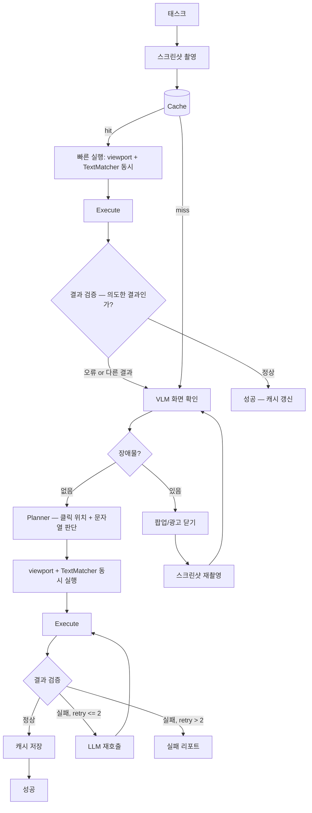
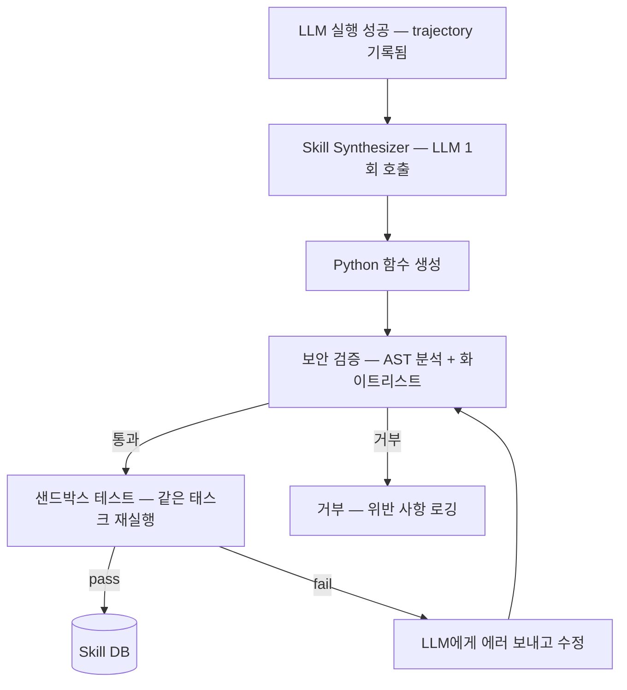

# 아키텍처 v3: 적응형 웹 자동화 엔진

> **버전**: 3.0 | **작성일**: 2026-02-28
> **v2 대비 변경**: 모듈 수 절반 이하로 축소. 핵심 루프만 남기고 최적화 모듈 전부 제거.

---

## 1. 핵심 아이디어

**한 문장**: LLM이 처음에 해결하고, 성공하면 그 판단을 코드로 굳혀서, 다음부터는 코드만 실행한다.

```
1회차:  Screenshot → LLM 계획 → DOM 필터링 → LLM 셀렉터 선택 → 실행 → 성공
        → 성공한 실행을 Python 함수로 합성 (Skill Synthesis)

2회차:  합성된 함수 실행 → 성공? → 끝 (LLM 0회)
        실패? → LLM 재호출 → 함수 업데이트

N회차:  함수만 실행. LLM 완전히 빠짐.
```

**v3의 이전 버전(캐시만 저장)과의 차이**:
캐시는 셀렉터만 저장한다. 사이트가 바뀌면 못 쓴다.
Skill Synthesis는 **판단 로직 자체**를 코드로 만든다. 셀렉터가 바뀌어도 로직이 동작한다.

**Prune4Web이 핵심 가치인 이유**:
일반적인 웹 에이전트는 DOM 전체(수천 개 요소)를 LLM에 넣는다. 비싸고 느리다.
Prune4Web은 LLM이 `{"검색": 0.9, "input": 0.7}` 같은 keyword-weight dict만 만들면,
**고정 수식**으로 DOM을 20개로 줄인다. 이 20개만 LLM에 보내면 된다.

결과: LLM 입력 토큰이 1/10~1/50로 줄어든다.

---

## 2. 전체 구조

모듈 4개 + 캐시 1개. 그게 전부.



### 모듈별 역할

| 모듈 | 하는 일 | LLM 호출 | 의존성 |
|------|--------|---------|--------|
| **Planner** | 스크린샷 보고 장애물 감지 + 클릭 위치/문자열 판단 + 스텝 분해 | VLM 1회 | Gemini Flash VLM |
| **DOM Extractor** | CDP로 DOM + AX Tree 추출 | 0 | Playwright(프레임) + CDP(추출) |
| **Element Filter** | keyword_weights × DOM 텍스트 스코어링 | 0 | TextMatcher (다국어) |
| **Actor** | 후보 중 대상 선택 + selector + viewport_xy 출력 | LLM 1회 | Gemini Flash |
| **Cache** | selector + viewport_xy + 스크린샷 + 기대결과 저장 | 0 | SQLite |
| **ResultVerifier** | 액션 후 결과가 의도한 것인지 검증 | 0 (로컬) / VLM 1회 | SSIM + RF-DETR / VLM |

**캐시 히트: 일단 실행 → 결과 검증 → 오류 시 풀 파이프라인**
**캐시 미스: VLM 화면 확인 → 장애물 제거 → Planner → viewport + TextMatcher 동시 → 실행**

**첫 실행: LLM 2회** (Planner 1 + Actor 1), 장애물 있으면 +α
**재실행 (정상): LLM 0회** (캐시 실행 + 결과 검증 통과)
**재실행 (사이트 변경): LLM 2회** (캐시 실패 → 풀 파이프라인)

---

## 3. 모듈 상세

### 3.0 Browser — Playwright 실행 + CDP 추출 하이브리드

**실행(click, fill, type)은 Playwright**, **추출(DOM, AX Tree, 스크린샷)은 CDP**.
두 계층을 하나의 `Browser` 객체로 감싸서 모든 모듈이 동일한 인터페이스를 사용한다.

```python
from playwright.async_api import Page, CDPSession

class Browser:
    """Playwright(실행) + CDP(추출) 하이브리드 래퍼.

    왜 하이브리드인가:
    - 실행(click/fill/type): Playwright의 actionability 보장이 필수.
      visible, stable, receives-events, enabled 자동 체크.
      CDP Input.dispatch*로 직접 하면 이 보장을 잃어 flaky 증가.
    - 추출(DOM/AX Tree): Playwright가 제공하지 않는 CDP 전용 기능.
      DOM.getDocument(pierce=True), Accessibility.getFullAXTree 등.
    - 스크린샷: CDP Page.captureScreenshot (clip 지원, 더 세밀한 제어).
    """

    def __init__(self, page: Page):
        self._page = page
        self._cdp: CDPSession | None = None

    async def _ensure_cdp(self) -> CDPSession:
        """CDP 세션 lazy 초기화."""
        if self._cdp is None:
            self._cdp = await self._page.context.new_cdp_session(self._page)
        return self._cdp

    # ==================== 실행 계층 (Playwright) ====================
    # Playwright가 actionability를 자동 보장:
    # - 요소가 visible인지
    # - 요소가 stable(애니메이션 완료)인지
    # - 요소가 이벤트를 받을 수 있는지 (다른 요소에 가려지지 않았는지)
    # - 요소가 enabled인지

    async def click_selector(self, selector: str, timeout_ms: int = 3000) -> None:
        """CSS selector 클릭. Playwright actionability 보장."""
        await self._page.click(selector, timeout=timeout_ms)

    async def fill_selector(self, selector: str, value: str) -> None:
        """CSS selector 요소에 텍스트 입력."""
        await self._page.fill(selector, value, timeout=3000)

    async def mouse_click(self, x: int, y: int) -> None:
        """뷰포트 절대 좌표 클릭. 텍스트 없는 요소용."""
        await self._page.mouse.click(x, y)

    async def key_press(self, key: str) -> None:
        await self._page.keyboard.press(key)

    async def type_text(self, text: str) -> None:
        await self._page.keyboard.type(text)

    # ==================== 추출 계층 (CDP) ====================

    async def cdp_send(self, method: str, params: dict | None = None) -> dict:
        """CDP 직접 호출. DOM/AX Tree 추출 등에 사용."""
        cdp = await self._ensure_cdp()
        return await cdp.send(method, params or {})

    async def screenshot(self) -> bytes:
        """스크린샷 (CDP — clip 지원 등 세밀한 제어)."""
        return await self._page.screenshot()

    async def screenshot_clip(self, clip: dict) -> bytes:
        """특정 영역만 캡처. clip: {x, y, width, height}."""
        cdp = await self._ensure_cdp()
        result = await cdp.send("Page.captureScreenshot", {
            "format": "png", "clip": {**clip, "scale": 1},
        })
        import base64
        return base64.b64decode(result["data"])

    async def evaluate(self, expression: str) -> any:
        """JavaScript 실행 (Playwright — 안정적)."""
        return await self._page.evaluate(expression)

    # ==================== 유틸리티 ====================

    async def get_viewport_size(self) -> tuple[int, int]:
        return await self._page.evaluate("[window.innerWidth, window.innerHeight]")

    @property
    def url(self) -> str:
        return self._page.url

    @property
    def frames(self):
        """iframe 접근 — Playwright가 프레임 트리 관리."""
        return self._page.frames

    async def wait(self, ms: int) -> None:
        await self._page.wait_for_timeout(ms)
```

**계층 분리 원칙**:

```
┌─────────────────────────────────────────────┐
│ Browser 래퍼                                 │
│                                              │
│  실행 (Playwright)          추출 (CDP)        │
│  ├─ click_selector()       ├─ cdp_send()     │
│  ├─ fill_selector()        │  └ DOM.get*     │
│  ├─ mouse_click()          │  └ AX.get*      │
│  ├─ key_press()            │  └ Page.get*    │
│  └─ type_text()            └─ screenshot_clip│
│                                              │
│  actionability 보장 ✓      Playwright 미지원 ✓│
└─────────────────────────────────────────────┘
```

**왜 CDP-only가 아닌 하이브리드인가**:

CDP `Input.dispatchMouseEvent`로 직접 클릭하면 Playwright가 제공하는
actionability 보장(visible/stable/receives-events/enabled)을 잃는다.
실사이트에서 광고 오버레이, 애니메이션 중 클릭, disabled 버튼 등에 의한
flaky 실패가 증가한다. Playwright는 클릭 전에 이 조건들을 자동으로 체크하고
조건이 만족될 때까지 대기한다.

반면 DOM 추출(`DOM.getDocument`, `Accessibility.getFullAXTree`)은
Playwright API에 없는 CDP 전용 기능이다. 따라서 하이브리드가 최적.

---

### 3.1 Planner — 시각 확인 먼저, 그 다음 계획

**Planner가 제일 먼저 하는 일은 "화면을 보는 것"**이다. HTML이 아니라 스크린샷을 본다.

왜 시각 확인이 1st인가:
- 광고 팝업, 이벤트 배너, 쿠키 동의창 등이 대상 요소를 가릴 수 있다
- DOM에서는 가려진 요소도 존재하므로, TextMatcher가 찾아도 클릭 불가
- VLM이 먼저 "지금 화면에 뭐가 보이는가"를 판단해야 한다

```python
@dataclass
class ScreenState:
    """VLM이 스크린샷을 보고 판단한 화면 상태."""
    has_obstacle: bool = False
    obstacle_type: str | None = None     # "popup", "ad_banner", "cookie_consent", "event_splash"
    obstacle_close_xy: tuple[float, float] | None = None  # 닫기 버튼 뷰포트 상대 좌표
    obstacle_description: str | None = None

@dataclass
class StepPlan:
    step_index: int
    action_type: str                    # "click", "type"
    target_description: str             # "스포츠/레저 카테고리 메뉴"
    value: str | None = None            # type일 때 입력값

    # --- 항상 둘 다 생성. 사전 분류하지 않음 ---
    keyword_weights: dict[str, float] = field(default_factory=dict)  # 텍스트 매칭용
    target_viewport_xy: tuple[float, float] | None = None            # 좌표 매칭용

    # 액션 후 기대 결과 (결과 검증용 — 우선순위 순)
    # "URL 변경: /category/sports"   → URL assertion (1순위)
    # "DOM 존재: .search-results"    → DOM assertion (2순위)
    # "화면 변화"                     → 비전 비교 fallback (3순위)
    expected_result: str | None = None
```

**핵심: Planner는 매 스텝마다 keyword_weights와 target_viewport_xy를 항상 둘 다 출력한다.**
텍스트가 있는지 없는지는 Planner가 미리 판단하지 않는다.
실행 시 Element Filter 스코어가 임계값 이상이면 텍스트 경로, 이하면 좌표 경로.
이 결정은 **실제 DOM 매칭 결과**가 한다.

Planner 프롬프트 — **시각 확인 + 계획을 1회 호출로 처리**:

```
당신은 웹 자동화 에이전트입니다.
스크린샷을 보고 다음 순서로 답하세요.

## 1단계: 화면 상태 확인
현재 화면에 태스크 실행을 방해하는 요소가 있는가?
(광고 팝업, 이벤트 배너, 쿠키 동의창, 로딩 스플래시 등)
- 있으면: obstacle_type과 닫기 버튼의 위치(뷰포트 비율 0~1)를 알려줘
- 없으면: has_obstacle = false

## 2단계: 태스크 분해
태스크를 실행 스텝으로 분해하세요.
각 스텝마다 반드시 아래 두 가지를 모두 출력:
- keyword_weights: 대상 요소에서 보이는 텍스트 키워드와 가중치
  (텍스트가 안 보여도 추측해서 작성. 예: 돋보기 아이콘 → {"search": 0.8, "검색": 0.8})
- target_viewport_xy: 대상 요소의 뷰포트 상대 좌표 (0~1, 0~1)

그리고:
- expected_result: 이 액션 후 기대하는 변화. 아래 형식 중 택 1:
  - "URL 변경: /category/sports" (페이지 이동 시)
  - "DOM 존재: .search-results" (같은 페이지 내 변화 시)
  - "화면 변화" (위 둘로 표현 못할 때)

[태스크]: {task}
[스크린샷]: (이미지)
```

**장애물 처리 흐름**:

```python
class Orchestrator:
    async def _ensure_clean_screen(self, browser: Browser) -> Image.Image:
        """장애물이 없는 깨끗한 화면을 확보한다. 미캐시 경로에서만 호출."""
        for _ in range(3):  # 최대 3회 시도 (중첩 팝업 대비)
            screenshot = Image.open(io.BytesIO(await browser.screenshot()))
            screen_state = await self.planner.check_screen(screenshot)

            if not screen_state.has_obstacle:
                return screenshot

            # 장애물 닫기 — 뷰포트 좌표로 클릭
            if screen_state.obstacle_close_xy:
                vw, vh = await browser.get_viewport_size()
                x = int(screen_state.obstacle_close_xy[0] * vw)
                y = int(screen_state.obstacle_close_xy[1] * vh)
                await browser.mouse_click(x, y)
                await browser.wait(500)
            else:
                await browser.key_press("Escape")
                await browser.wait(500)

        return screenshot
```

**"등산복 → 스포츠/레저" 문제가 여기서 해결되는 이유**:

Planner(VLM)가 스크린샷에서 메뉴를 보고, 세계 지식으로 판단한다.
"등산복은 스포츠 카테고리 하위" → keyword_weights: `{"스포츠": 0.9, "레저": 0.8}`
이 키워드로 Element Filter가 "스포츠/레저" 메뉴를 높은 점수로 선택한다.

즉, **텍스트 매칭 문제가 아니라 Planner의 판단 문제**다.
TextMatcher는 "스포츠"라는 키워드와 "스포츠/레저"라는 DOM 텍스트를 매칭하는 것만 하면 된다.
"등산복이 스포츠 카테고리다"라는 판단은 Planner가 한다.

### 3.2 DOM Extractor — DOM 가져오기

CDP 2개 호출을 병렬로:

```python
class DOMExtractor:
    async def extract(self, browser: Browser) -> list[DOMNode]:
        dom, ax = await asyncio.gather(
            browser.cdp_send("DOM.getDocument", {"depth": -1, "pierce": True}),
            browser.cdp_send("Accessibility.getFullAXTree"),
        )
        return self._merge(dom, ax)
```

```python
@dataclass
class DOMNode:
    node_id: int
    tag: str
    text: str                           # textContent (truncated 200자)
    attrs: dict[str, str]               # id, class, name, placeholder, aria-label, ...
    ax_role: str | None = None          # AX Tree role
    ax_name: str | None = None          # AX Tree name
```

v2에서는 CDP 3-call(DOM + AX + Snapshot)이었으나, **Snapshot은 제거**.
DOM + AX Tree만으로 충분하고, Snapshot은 거의 활용하지 않았다.

### 3.3 Element Filter — DOM 줄이기 (Prune4Web)

keyword_weights로 DOM을 스코어링하여 상위 N개만 남긴다.
**LLM 호출 없이** 고정 수식으로 계산.

```
Score[node] = Σ( W[keyword] × α[match_type] × β[attr_tier] )

α: exact=1.0, phrase=0.9, word=0.7, synonym=0.6, fuzzy=0.3
β: text=1.0, aria-label=0.95, placeholder=0.85, name/id=0.8, class=0.3
```

```python
class ElementFilter:
    def filter(
        self,
        nodes: list[DOMNode],
        keyword_weights: dict[str, float],
        top_n: int = 20,
    ) -> list[ScoredNode]:

        scored = []
        for node in nodes:
            score = 0.0
            for keyword, weight in keyword_weights.items():
                # 각 속성에서 매칭 시도
                for attr, tier in self.ATTR_TIERS.items():
                    text = self._get_attr(node, attr)
                    if not text:
                        continue
                    match_type, match_score = self._matcher.match(keyword, text)
                    if match_score > 0:
                        score += weight * match_score * tier
            if score > 0:
                scored.append(ScoredNode(node=node, score=score))

        scored.sort(key=lambda x: x.score, reverse=True)
        return scored[:top_n]
```

TextMatcher (다국어: Snowball Stemmer + CJK 형태소 분석):

```python
import snowballstemmer

class TextMatcher:
    """DOM 텍스트와 keyword 매칭. 다국어 지원.

    두 계열의 언어 처리:
    - 유럽어/아랍어 (30개 언어): Snowball Stemmer — 어간 추출 후 비교
    - CJK (한/중/일): 형태소 분석기 — 토큰 분리 후 비교
    - 공통: exact, phrase, synonym, fuzzy는 언어 무관
    """

    # Snowball이 지원하는 언어 → stemmer 이름 매핑
    SNOWBALL_LANGS: dict[str, str] = {
        "en": "english", "de": "german", "fr": "french", "es": "spanish",
        "pt": "portuguese", "it": "italian", "nl": "dutch", "ru": "russian",
        "sv": "swedish", "no": "norwegian", "da": "danish", "fi": "finnish",
        "hu": "hungarian", "ro": "romanian", "tr": "turkish", "ar": "arabic",
        "el": "greek", "ca": "catalan", "eu": "basque", "hi": "hindi",
        "id": "indonesian", "ga": "irish", "lt": "lithuanian",
        "ne": "nepali", "sr": "serbian", "ta": "tamil",
        # ... 총 30개 언어
    }

    def __init__(
        self,
        cjk_tokenizers: dict[str, CJKTokenizer] | None = None,
        synonym_dict: dict[str, list[str]] | None = None,
    ):
        # CJK 형태소 분석기 — 언어별 플러그인
        self._cjk = cjk_tokenizers or {}
        # 예: {"ko": MecabKoTokenizer(), "ja": FugashiTokenizer(), "zh": JiebaTokenizer()}

        # Snowball stemmer 캐시 (lazy init)
        self._stemmers: dict[str, snowballstemmer.stemmer] = {}

        # 동의어 사전
        self._synonyms = synonym_dict or {}

    def match(self, keyword: str, text: str) -> tuple[str, float]:
        """keyword와 text의 매칭 수준을 판단.
        Returns: (match_type, score) — exact/phrase/word/synonym/fuzzy/none
        """
        # 1. exact — 언어 무관
        if keyword == text.strip():
            return ("exact", 1.0)

        # 2. phrase — 언어 무관 (부분 문자열)
        if keyword.lower() in text.lower():
            return ("phrase", 0.9)

        # 3. word — 언어별 분기
        lang = self._detect_lang(text)
        tokens = self._tokenize(text, lang)
        kw_lower = keyword.lower()

        # 3a. 토큰 직접 비교
        token_lowers = [t.lower() for t in tokens]
        if kw_lower in token_lowers:
            return ("word", 0.7)

        # 3b. 어간(stem) 비교 — Snowball 지원 언어만
        if lang in self.SNOWBALL_LANGS:
            stemmer = self._get_stemmer(lang)
            kw_stem = stemmer.stemWord(kw_lower)
            token_stems = [stemmer.stemWord(t) for t in token_lowers]
            if kw_stem in token_stems:
                return ("word", 0.7)

        # 3c. CJK — 형태소 분석 결과의 원형(lemma) 비교
        if lang in self._cjk:
            lemmas = self._cjk[lang].lemmatize(text)
            kw_lemmas = self._cjk[lang].lemmatize(keyword)
            if any(kl in lemmas for kl in kw_lemmas):
                return ("word", 0.7)

        # 4. synonym — 동의어 사전 (다국어)
        for syn in self._synonyms.get(keyword, []):
            if syn.lower() in text.lower() or syn.lower() in token_lowers:
                return ("synonym", 0.6)

        # 5. fuzzy — 편집 거리 기반 (언어 무관)
        ratio = rapidfuzz.fuzz.ratio(kw_lower, text.lower()) / 100
        if ratio > 0.75:
            return ("fuzzy", ratio * 0.5)

        return ("none", 0.0)

    # ---------- 내부 메서드 ----------

    def _detect_lang(self, text: str) -> str:
        """간단한 언어 감지. CJK는 문자 범위, 나머지는 기본 'en'."""
        for ch in text:
            if '\uAC00' <= ch <= '\uD7A3': return "ko"
            if '\u3040' <= ch <= '\u30FF': return "ja"
            if '\u4E00' <= ch <= '\u9FFF': return "zh"
        return "en"  # 기본값 — Snowball이 처리

    def _tokenize(self, text: str, lang: str) -> list[str]:
        """언어에 맞는 토크나이저로 텍스트를 토큰 분리."""
        if lang in self._cjk:
            return self._cjk[lang].tokenize(text)
        # 유럽어 — 공백 + 구두점 분리 (stemming은 match()에서 별도 처리)
        return text.lower().split()

    def _get_stemmer(self, lang: str) -> snowballstemmer.stemmer:
        """Snowball stemmer lazy 생성 + 캐시."""
        if lang not in self._stemmers:
            self._stemmers[lang] = snowballstemmer.stemmer(
                self.SNOWBALL_LANGS[lang]
            )
        return self._stemmers[lang]
```

**CJK 토크나이저 인터페이스**:

```python
from abc import ABC, abstractmethod

class CJKTokenizer(ABC):
    """CJK 언어용 형태소 분석기 인터페이스."""

    @abstractmethod
    def tokenize(self, text: str) -> list[str]:
        """텍스트를 토큰(형태소/단어)으로 분리."""
        ...

    @abstractmethod
    def lemmatize(self, text: str) -> list[str]:
        """텍스트에서 원형(lemma/기본형)을 추출."""
        ...


class MecabKoTokenizer(CJKTokenizer):
    """한국어 — mecab-ko (또는 kiwi 대체 가능)."""
    def __init__(self):
        import mecab
        self._tagger = mecab.MeCab()

    def tokenize(self, text: str) -> list[str]:
        return [node.surface for node in self._tagger.parse(text)]

    def lemmatize(self, text: str) -> list[str]:
        # mecab-ko는 feature[7]에 원형 저장 (없으면 surface 사용)
        result = []
        for node in self._tagger.parse(text):
            feats = node.feature.split(",")
            lemma = feats[7] if len(feats) > 7 and feats[7] != "*" else node.surface
            result.append(lemma)
        return result


class FugashiTokenizer(CJKTokenizer):
    """일본어 — fugashi (mecab-ipadic 래퍼)."""
    def __init__(self):
        import fugashi
        self._tagger = fugashi.Tagger()

    def tokenize(self, text: str) -> list[str]:
        return [word.surface for word in self._tagger(text)]

    def lemmatize(self, text: str) -> list[str]:
        return [
            word.feature.lemma if word.feature.lemma else word.surface
            for word in self._tagger(text)
        ]


class JiebaTokenizer(CJKTokenizer):
    """중국어 — jieba 분사."""
    def __init__(self):
        import jieba

    def tokenize(self, text: str) -> list[str]:
        import jieba
        return list(jieba.cut(text))

    def lemmatize(self, text: str) -> list[str]:
        # 중국어는 형태 변화 없음. tokenize == lemmatize
        return self.tokenize(text)
```

**다국어 처리 구조 요약**:

```
TextMatcher
  ├─ 유럽어/아랍어 (30개 언어) → Snowball Stemmer
  │     어간 추출 후 비교. "running" → "run", "búsqueda" → "busc"
  │     Python: snowballstemmer 패키지 (의존성 0, 순수 Python)
  │
  ├─ 한국어 → mecab-ko (형태소 분석)
  │     "등산복을" → ["등산복", "을"] → 원형: ["등산복", "을"]
  │
  ├─ 일본어 → fugashi / mecab-ipadic (형태소 분석)
  │     "検索する" → ["検索", "する"] → 원형: ["検索", "する"]
  │
  ├─ 중국어 → jieba (분사)
  │     "搜索商品" → ["搜索", "商品"]
  │
  └─ 공통 (언어 무관)
        exact: 완전 일치
        phrase: 부분 문자열 포함
        synonym: 동의어 사전 매칭
        fuzzy: rapidfuzz 편집 거리
```

**왜 Snowball + CJK 형태소 분석을 분리하는가**:

Snowball Stemmer는 어미 변화가 있는 언어(영어 running→run, 독일어 Häuser→Haus)에 적합.
CJK는 어미 변화 패턴이 완전히 다르다 (교착어/고립어). Stemmer로는 처리 불가.
한국어 "검색했습니다"를 Snowball에 넣으면 의미 없는 결과가 나온다.
따라서: Snowball은 유럽어/아랍어 전용, CJK는 형태소 분석기 전용으로 명확히 분리.

### 3.4 Actor — "어떤 요소를, 어떻게" 결정

후보 20개를 YAML로 LLM에 전달. LLM은 **인덱스 + action**만 출력.
Actor는 선택된 요소의 **뷰포트 상대 좌표도 계산**하여 Action에 포함시킨다.

```python
class Actor:
    async def decide(
        self,
        step: StepPlan,
        candidates: list[ScoredNode],
        browser: Browser,
    ) -> Action:

        # 후보를 YAML로 변환 (토큰 효율)
        yaml_candidates = self._to_yaml(candidates)

        response = await self._llm.generate(
            prompt=f"""Task step: {step.action_type} - {step.target_description}
Candidates:
{yaml_candidates}

Output JSON: {{"index": N, "selector": "css_selector", "action": "click" or "type", "value": "..."}}""",
        )

        parsed = self._parse(response)

        # 선택된 요소의 뷰포트 상대 좌표 계산
        viewport_xy, viewport_bbox = await self._get_viewport_coords(
            browser, parsed.selector
        )

        return Action(
            selector=parsed.selector,
            action_type=parsed.action_type,
            value=parsed.value,
            viewport_xy=viewport_xy,
            viewport_bbox=viewport_bbox,
        )

    async def _get_viewport_coords(
        self, browser: Browser, selector: str,
    ) -> tuple[tuple[float, float] | None, tuple[float, float, float, float] | None]:
        """요소의 bounding box를 뷰포트 비율(0.0~1.0)로 변환."""
        result = await browser.evaluate(f"""(() => {{
            const el = document.querySelector('{selector}');
            if (!el) return null;
            const r = el.getBoundingClientRect();
            const vw = window.innerWidth;
            const vh = window.innerHeight;
            return {{
                cx: (r.left + r.right) / 2 / vw,
                cy: (r.top + r.bottom) / 2 / vh,
                x1: r.left / vw, y1: r.top / vh,
                x2: r.right / vw, y2: r.bottom / vh,
            }};
        }})()""")
        if not result:
            return None, None
        return (
            (result["cx"], result["cy"]),
            (result["x1"], result["y1"], result["x2"], result["y2"]),
        )
```

```python
@dataclass
class Action:
    selector: str | None        # "#search-input" — 텍스트 있는 요소용. 없으면 None
    action_type: str            # "click" or "type"
    value: str | None = None    # type일 때만

    # --- 뷰포트 상대 좌표 (모든 요소에 항상 저장) ---
    viewport_xy: tuple[float, float] | None = None   # (0.0~1.0, 0.0~1.0) 요소 중심점
    viewport_bbox: tuple[float, float, float, float] | None = None  # (x1%, y1%, x2%, y2%)

    @property
    def has_selector(self) -> bool:
        return self.selector is not None

    @property
    def click_point(self) -> tuple[float, float] | None:
        """뷰포트 상대 좌표 → 실제 픽셀 좌표로 변환 시 사용."""
        return self.viewport_xy
```

**두 가지 식별 전략**:

```
텍스트 있는 요소 (검색창, 메뉴 텍스트, 버튼 텍스트):
  → selector 우선 사용. viewport_xy는 백업.
  → selector 실패 시 viewport_xy로 클릭.

텍스트 없는 요소 (이미지, 아이콘, Canvas 버튼):
  → selector가 None이거나 불안정.
  → viewport_xy가 주 식별자. RF-DETR 검출 결과와 대조.
```

**viewport_xy가 절대 좌표가 아닌 상대 좌표인 이유**:

절대 픽셀 좌표(예: 350px, 200px)는 화면 크기가 달라지면 틀어진다.
상대 좌표(예: 0.35, 0.25)는 뷰포트 비율 기준이므로 해상도가 바뀌어도 유효하다.
1920×1080에서 저장한 (0.35, 0.25)는 1440×900에서도 같은 위치를 가리킨다.

**왜 Actor를 Planner와 분리하는가?**

Planner는 스크린샷을 보고 "뭘 할지" 결정 — 세계 지식 필요 (등산복 → 스포츠).
Actor는 DOM 후보를 보고 "어떤 요소를" 결정 — 셀렉터 정확도 필요.

이 두 판단은 **입력 데이터가 다르다** (이미지 vs DOM YAML).
합치면 프롬프트가 복잡해지고 둘 다 정확도가 떨어진다.

### 3.5 Cache — 캐시 저장 구조

```python
@dataclass
class CacheEntry:
    domain: str
    url_pattern: str            # regex: "^https://shopping\\.naver\\.com/.*"
    task_type: str              # "click_스포츠_레저_메뉴"
    selector: str | None        # 성공한 셀렉터 (텍스트 없는 요소는 None)
    action_type: str
    value: str | None
    keyword_weights: dict[str, float]  # 재실행 시 TextMatcher에 사용

    # --- 뷰포트 상대 좌표 ---
    viewport_xy: tuple[float, float] | None = None
    viewport_bbox: tuple[float, float, float, float] | None = None

    # --- 결과 검증용 데이터 ---
    expected_result: str | None = None          # "URL 변경: /category/sports"
    post_screenshot_path: str = ""              # 성공 후 스크린샷
    post_screenshot_phash: str = ""             # 성공 후 스크린샷 pHash

    success_count: int = 0
    last_success: datetime | None = None
```

### 3.6 ResultVerifier — 액션 후 결과 검증

캐시 히트 경로의 핵심: **실행 전에 검증하지 않고, 실행 후에 결과를 검증**한다.

왜 이 방식이 맞는가:
- 광고가 있어도 대상 요소가 안 가려져 있으면 캐시 실행이 성공한다. 사전 검증은 낭비.
- 사이트 개편으로 같은 위치에 다른 버튼이 있으면, 클릭은 성공하지만 **결과가 다르다**.
- 사전 검증(pHash/SSIM)은 "클릭해도 되는가?"를 추측하지만, 결과 검증은 **실제 결과가 맞는가?**를 확인.

**검증 우선순위**: URL/DOM assertion → 네트워크 신호 → 비전 비교(fallback).

실사이트는 배너 교체, 추천 영역, 타임스탬프 등으로 화면이 항상 바뀐다.
pHash/SSIM을 1순위로 쓰면 false positive/negative가 많다.
URL이나 DOM 상태 변화가 가장 결정론적이고 신뢰할 수 있는 신호다.

```python
from imagehash import phash
from PIL import Image


class ResultVerifier:
    """액션 실행 후, 결과가 의도한 것인지 확인한다.
    사전 검증이 아닌 사후 검증. 실행 전엔 아무것도 안 하고, 실행 후에 판단.

    검증 우선순위:
      1. URL 변화 (결정론적, 가장 신뢰)
      2. DOM assertion (특정 요소 존재/부재 확인)
      3. 비전 비교 (fallback — URL/DOM으로 판단 못할 때만)
    """

    PHASH_THRESHOLD = 12

    async def verify_result(
        self,
        pre_screenshot: Image.Image,
        post_screenshot: Image.Image,
        action: Action,
        cached: CacheEntry | StepPlan,   # 캐시 경로는 CacheEntry, 미캐시 경로는 StepPlan
        browser: Browser,
        pre_url: str,                    # 액션 실행 전 URL (호출자가 전달)
    ) -> str:
        """
        Returns:
            "ok"     — 결과가 의도한 대로. 캐시 유지.
            "wrong"  — 뭔가 클릭됐지만 결과가 다름. 잘못된 요소 클릭.
            "failed" — 아무 변화 없음. 클릭 자체가 안 됨 (광고 등에 막힘).
        """

        # ===== 1순위: URL 기반 검증 (결정론적) =====
        url_changed = browser.url != pre_url

        if cached.expected_result and "URL" in cached.expected_result:
            expected_url_part = self._extract_url_hint(cached.expected_result)
            if expected_url_part:
                if expected_url_part in browser.url:
                    return "ok"        # 기대한 URL로 이동
                if url_changed:
                    return "wrong"     # 다른 곳으로 이동
                return "failed"        # URL 변경 기대했는데 안 변함

        # ===== 2순위: DOM assertion (특정 요소 존재 확인) =====
        if cached.expected_result and "DOM" in cached.expected_result:
            dom_selector = self._extract_dom_hint(cached.expected_result)
            if dom_selector:
                # 보안: CSS 셀렉터를 JS 문자열 리터럴 안에 안전하게 삽입
                safe_selector = dom_selector.replace("\\", "\\\\").replace("'", "\\'")
                exists = await browser.evaluate(
                    f"!!document.querySelector('{safe_selector}')"
                )
                if exists:
                    return "ok"
                if url_changed:
                    return "wrong"     # 페이지 바뀌었는데 기대 요소 없음
                return "failed"

        # URL이 바뀌었으면 (기대 URL 힌트 없어도) 일단 뭔가 일어난 것
        if url_changed:
            return "ok"

        # ===== 3순위: 비전 비교 (fallback) =====
        # URL/DOM으로 판단 못하는 경우: 같은 페이지 내 드롭다운, 모달 열림 등
        pre_hash = phash(pre_screenshot)
        post_hash = phash(post_screenshot)
        changed = (pre_hash - post_hash) > 3

        if not changed:
            return "failed"  # 아무 변화 없음

        # 이전 성공 스크린샷과 비교 (있을 때만)
        if cached.post_screenshot_phash:
            expected_hash = phash(Image.open(cached.post_screenshot_path))
            distance = post_hash - expected_hash
            if distance > self.PHASH_THRESHOLD:
                return "wrong"  # 변화는 있지만 이전 성공 때와 다른 결과

        return "ok"

    def _extract_url_hint(self, expected_result: str) -> str | None:
        """expected_result에서 URL 힌트 추출.
        예: 'URL 변경: /category/sports' → '/category/sports'
        """
        if "URL" in expected_result and ":" in expected_result:
            return expected_result.split(":", 1)[1].strip()
        return None

    def _extract_dom_hint(self, expected_result: str) -> str | None:
        """expected_result에서 DOM assertion 힌트 추출.
        예: 'DOM 존재: .search-results' → '.search-results'
            'DOM 존재: #dropdown-menu[aria-expanded=true]' → '#dropdown-menu[aria-expanded=true]'
        """
        if "DOM" in expected_result and ":" in expected_result:
            return expected_result.split(":", 1)[1].strip()
        return None
```

**검증 우선순위 요약**:

```
1순위: URL assertion     — "URL이 /category/sports를 포함하는가?"
       결정론적. 배너/추천 변화에 영향 안 받음.
       expected_result 예: "URL 변경: /category/sports"

2순위: DOM assertion     — "특정 요소가 페이지에 존재하는가?"
       드롭다운 열림, 모달 표시 등 같은 페이지 내 변화 감지.
       expected_result 예: "DOM 존재: .search-results"

3순위: 비전 비교 (fallback) — pHash로 화면 변화 감지
       위 두 가지로 판단 못하는 경우에만 사용.
       false positive 위험 있으므로 최후 수단.
```

**캐시 히트 경로 전체 흐름**:

```
캐시 히트
  ↓
viewport + TextMatcher 동시 실행 (광고 있어도 일단 시도)
  ├─ viewport_xy로 클릭 시도
  ├─ selector + TextMatcher로 클릭 시도
  └─ 둘 중 하나라도 성공하면 진행
  ↓
ResultVerifier — 액션 후 결과 검증
  ├─ "ok"     → 캐시 갱신, 완료 (LLM 0회)
  ├─ "failed" → 클릭 자체가 안 됨 → 미캐시 경로로 (VLM 화면 확인부터)
  └─ "wrong"  → 다른 게 클릭됨 → 미캐시 경로로 (VLM 화면 확인부터)
```

### 3.7 Executor — 실행 (selector + viewport 동시 시도)

```python
class Executor:
    """selector 우선 → 실패 시 viewport 좌표 fallback.
    검증과 재시도는 Orchestrator가 담당. Executor는 실행만 한다.
    """

    async def execute_action(self, action: Action, browser: Browser) -> None:
        """실행. 실패하면 예외 발생."""

        if action.action_type == "click":
            if action.has_selector:
                try:
                    await browser.click_selector(action.selector, timeout_ms=3000)
                    return
                except Exception:
                    pass  # selector 실패 → 좌표 fallback

            if action.viewport_xy:
                vw, vh = await browser.get_viewport_size()
                x = int(action.viewport_xy[0] * vw)
                y = int(action.viewport_xy[1] * vh)
                await browser.mouse_click(x, y)
                return

            raise RuntimeError("No selector and no viewport coordinates")

        elif action.action_type == "type":
            if action.has_selector:
                try:
                    await browser.fill_selector(action.selector, action.value)
                    return
                except Exception:
                    pass

            if action.viewport_xy:
                vw, vh = await browser.get_viewport_size()
                x = int(action.viewport_xy[0] * vw)
                y = int(action.viewport_xy[1] * vh)
                await browser.mouse_click(x, y)
                await browser.type_text(action.value)
```

**실행 전략**:

```
selector 있음 → browser.click_selector(selector) 시도 → 실패 시 viewport_xy fallback
selector 없음 → 바로 browser.mouse_click(x, y)
```

Executor는 **실행만** 한다. 결과 검증과 재시도 로직은 Orchestrator에 있다.
이전 버전(v2)의 4-Level 에스컬레이션은 제거. 실패 시 LLM 재호출(최대 2회)이 더 단순하고 효과적.

---

## 4. 웹 사이트 변칙 대응

별도 Site Profiler/에스컬레이션 없이, **Playwright 프레임 관리 + CDP 추출**로 처리.

```python
class DOMExtractor:
    async def extract(self, browser: Browser) -> list[DOMNode]:
        # 메인 프레임 — CDP로 DOM + AX Tree 추출
        # pierce=True로 Shadow DOM도 포함
        dom, ax = await asyncio.gather(
            browser.cdp_send("DOM.getDocument", {"depth": -1, "pierce": True}),
            browser.cdp_send("Accessibility.getFullAXTree"),
        )
        nodes = self._merge(dom, ax)

        # iframe — Playwright가 프레임 트리를 이미 관리하고 있음
        # 각 iframe에 대해 별도 CDP 세션을 열어 DOM 추출
        for frame in browser.frames:
            if frame == browser._page.main_frame:
                continue
            try:
                # Playwright로 iframe의 CDP 세션 획득
                frame_cdp = await browser._page.context.new_cdp_session(frame)
                frame_dom = await frame_cdp.send(
                    "DOM.getDocument", {"depth": -1, "pierce": True},
                )
                frame_nodes = self._parse(frame_dom)
                nodes.extend(frame_nodes)
                await frame_cdp.detach()
            except Exception:
                pass  # cross-origin iframe 등 접근 불가면 스킵

        return nodes
```

**왜 iframe에 Playwright를 쓰는가**:

CDP `DOM.getDocument`에는 `context_id` 파라미터가 없다.
iframe의 DOM을 얻으려면 해당 프레임에 대한 별도 CDP 세션이 필요한데,
Playwright의 `page.context.new_cdp_session(frame)`이 이를 깔끔하게 처리한다.
CDP만으로 하면 `Target.attachToTarget` → 세션 관리 → 정리까지 직접 해야 한다.

| 변칙 유형 | v3 처리 방식 |
|-----------|-------------|
| Shadow DOM | CDP `pierce=True`로 DOM 추출 시 자동 포함 |
| iframe | Playwright `page.frames` + 프레임별 CDP 세션으로 DOM 추출 |
| jQuery 위임 | Actor가 셀렉터 실패하면 재시도에서 AX Tree 기반으로 전환 |
| hover 메뉴 | Planner가 스크린샷에서 감지 → `hover` + `click` 2스텝 계획 |
| Canvas | **비전 전용 경로** — DOM 없음. UI-DETR-1 로컬 검출 + VLM 의미 판단 |

### 4.1 Canvas 사이트 — 비전 전용 경로

Canvas 사이트(복권, 게임, 일부 SPA 등)는 근본적으로 DOM이 없다.
DOM Extractor → TextMatcher → CSS 셀렉터 체계가 작동하지 않으므로,
**전 과정을 비전(스크린샷) 기반**으로 처리한다.

**핵심 원칙**: 매번 VLM을 직접 호출하지 않는다.
UI-DETR-1(RF-DETR fine-tune)이 **요소 검출/위치/분류**를 로컬에서 처리하고,
VLM은 **의미 판단이 필요한 경우에만** 개입한다.

```
Canvas 감지 → UI-DETR-1 요소 검출 → 후보 매칭 → 클릭(좌표) → VLM 결과 검증
                   ↓ (검출 실패/의미 판단 필요)
              VLM 스크린샷 분석 → 좌표 추출 → 클릭 → VLM 결과 검증
```

```python
class CanvasDetector:
    """Canvas 페이지 감지. DOM 요소가 극히 적으면 Canvas로 판단."""

    CANVAS_THRESHOLD = 5  # 클릭 가능 DOM 요소가 이 수 이하면 Canvas 의심

    async def is_canvas_page(self, browser: Browser) -> bool:
        """DOM 요소 수 기반 Canvas 페이지 판별."""
        # 1. <canvas> 태그 존재 확인
        has_canvas = await browser.evaluate(
            "document.querySelectorAll('canvas').length > 0"
        )
        if has_canvas:
            return True

        # 2. 클릭 가능 DOM 요소가 극히 적은 경우
        clickable_count = await browser.evaluate("""
            document.querySelectorAll(
                'a, button, input, select, textarea, [role=button], [onclick]'
            ).length
        """)
        return clickable_count <= self.CANVAS_THRESHOLD


class CanvasExecutor:
    """Canvas 페이지 전용 실행기. 비전 전용 — DOM 셀렉터 사용 안 함."""

    def __init__(
        self,
        local_detector: LocalDetector,   # UI-DETR-1 (Section 8)
        vlm_client: VLMClient,
    ):
        self._detr = local_detector
        self._vlm = vlm_client

    async def find_and_click(
        self, browser: Browser, target_description: str,
    ) -> bool:
        """Canvas 페이지에서 대상 요소를 찾아 클릭.

        1순위: UI-DETR-1 로컬 검출 (LLM 0회)
        2순위: VLM 스크린샷 분석 (LLM 1회)
        """
        screenshot = Image.open(io.BytesIO(await browser.screenshot()))

        # --- 1순위: UI-DETR-1 로컬 검출 ---
        detections = self._detr.detect(screenshot, threshold=0.3)

        if detections:
            # 검출된 요소 중 대상과 가장 가까운 것을 VLM에게 선택시킴
            # (UI-DETR-1은 "버튼", "입력란" 등 타입만 알고 의미는 모름)
            if len(detections) == 1:
                # 후보 1개 → VLM 없이 바로 클릭
                cx, cy = self._center(detections[0].box)
                await browser.mouse_click(cx, cy)
                return True

            # 후보 복수 → VLM에게 선택 요청 (선택 문제 변환)
            grid = self._annotate_candidates(screenshot, detections)
            idx = await self._vlm.choose_element(
                grid, target_description, len(detections),
            )
            if idx is not None and idx < len(detections):
                cx, cy = self._center(detections[idx].box)
                await browser.mouse_click(cx, cy)
                return True

        # --- 2순위: VLM 직접 좌표 추출 (UI-DETR-1 검출 실패 시) ---
        xy = await self._vlm.locate_element(screenshot, target_description)
        if xy:
            await browser.mouse_click(xy[0], xy[1])
            return True

        return False

    def _center(self, box: tuple[float, float, float, float]) -> tuple[int, int]:
        x1, y1, x2, y2 = box
        return int((x1 + x2) / 2), int((y1 + y2) / 2)

    def _annotate_candidates(
        self, screenshot: Image.Image, detections: list[Detection],
    ) -> Image.Image:
        """검출된 요소에 번호를 매긴 annotated 이미지 생성.
        VLM에게 '몇 번이 target_description과 일치하는가?' 선택 문제로 변환.
        """
        from PIL import ImageDraw, ImageFont
        img = screenshot.copy()
        draw = ImageDraw.Draw(img)
        for i, det in enumerate(detections):
            x1, y1, x2, y2 = det.box
            draw.rectangle([x1, y1, x2, y2], outline="red", width=2)
            draw.text((x1, y1 - 12), str(i), fill="red")
        return img
```

**Orchestrator 통합**: `_execute_step`에서 Canvas 감지 시 `CanvasExecutor`로 분기.

```python
# Orchestrator._execute_step 내부 (Canvas 분기 추가)
if await self.canvas_detector.is_canvas_page(browser):
    # Canvas 페이지 → 비전 전용 경로
    success = await self.canvas_executor.find_and_click(
        browser, step.target_description,
    )
    if success:
        # 결과 검증도 비전 전용 (DOM assertion 불가)
        post_screenshot = Image.open(io.BytesIO(await browser.screenshot()))
        result = await self.verifier.verify_result(
            pre_screenshot, post_screenshot, action=None, cached=step,
            browser=browser, pre_url=pre_url,
        )
        return result == "ok"
    return False
```

**비용 구조**:
- 첫 실행: UI-DETR-1 로컬 (0원) + VLM 선택 1회 ($0.003) + VLM 검증 1회 ($0.003) = **$0.006**
- 후보 1개인 경우: UI-DETR-1만 (0원) + VLM 검증 1회 = **$0.003**
- UI-DETR-1 실패 시: VLM 좌표 추출 1회 + VLM 검증 1회 = **$0.006**

> **구현 시점**: v3 마지막 단계. DOM 기반 파이프라인과 UI-DETR-1이 모두 안정화된 후,
> Canvas 감지 + 비전 전용 분기를 추가한다. UI-DETR-1의 UI 요소 분류 정확도가
> Canvas 경로의 품질을 결정하므로, 일반 DOM 사이트에서의 검출 성능이 검증된 후 착수.

---

## 5. Orchestrator — 전체 메인 루프

두 경로: **캐시 히트 경로** (일단 실행 → 결과 검증)와 **미캐시 경로** (VLM 먼저 → 장애물 제거 → 실행).

```python
FILTER_SCORE_THRESHOLD = 0.5  # 이 이상이면 TextMatcher 결과 신뢰

class Orchestrator:
    def __init__(self, planner, extractor, filter, actor, executor, cache, result_verifier):
        self.planner = planner
        self.extractor = extractor
        self.filter = filter
        self.actor = actor
        self.executor = executor
        self.cache = cache
        self.verifier = result_verifier   # ResultVerifier

    MAX_REPLAN = 2  # 최대 재계획 횟수

    async def run(self, task: str, browser: Browser) -> bool:
        screenshot = Image.open(io.BytesIO(await browser.screenshot()))
        steps = await self.planner.plan(task, screenshot)
        replan_count = 0
        consecutive_failures = 0

        i = 0
        while i < len(steps):
            success = await self._execute_step(steps[i], browser)
            if success:
                consecutive_failures = 0
                i += 1
                continue

            consecutive_failures += 1

            # 2회 연속 실패 시 → 현재 화면 기준으로 재계획
            if consecutive_failures >= 2 and replan_count < self.MAX_REPLAN:
                replan_count += 1
                screenshot = Image.open(io.BytesIO(await browser.screenshot()))
                remaining_desc = " → ".join(s.target_description for s in steps[i:])
                steps = await self.planner.plan(
                    f"{task} (남은 작업: {remaining_desc})", screenshot,
                )
                i = 0
                consecutive_failures = 0
                continue

            return False  # 재계획 횟수 초과 or 단일 실패

        return True

    async def _execute_step(self, step: StepPlan, browser: Browser) -> bool:
        domain = self._get_domain(browser.url)
        pre_screenshot = Image.open(io.BytesIO(await browser.screenshot()))

        # ========== 캐시 히트 경로: 일단 시도 ==========
        cached = await self.cache.lookup(domain, browser.url, step.target_description)
        if cached:
            result = await self._try_cached(cached, step, browser, pre_screenshot)
            if result == "ok":
                return True
            # "failed" or "wrong" → 미캐시 경로로 이동

        # ========== 미캐시 경로: VLM 화면 확인 → 장애물 제거 → 실행 ==========
        return await self._full_pipeline(step, browser, domain)

    # ---------- 캐시 히트 경로 ----------

    async def _try_cached(
        self, cached: CacheEntry, step: StepPlan, browser: Browser,
        pre_screenshot: Image.Image,
    ) -> str:
        """캐시된 정보로 viewport + TextMatcher 동시 실행.
        광고가 있어도 일단 시도. 결과를 검증하여 판단.
        """
        # 동시 시도: selector(TextMatcher로 확인) + viewport 좌표
        action = Action(
            selector=cached.selector,
            action_type=cached.action_type,
            value=cached.value,
            viewport_xy=cached.viewport_xy,
            viewport_bbox=cached.viewport_bbox,
        )

        pre_url = browser.url  # 액션 실행 전 URL 기록

        try:
            await self.executor.execute_action(action, browser)
        except Exception:
            return "failed"

        # 결과 검증 — 의도한 결과인가?
        await browser.wait(500)
        post_screenshot = Image.open(io.BytesIO(await browser.screenshot()))

        result = await self.verifier.verify_result(
            pre_screenshot, post_screenshot, action, cached, browser,
            pre_url=pre_url,
        )

        if result == "ok":
            await self.cache.record_success(cached, post_screenshot)

        return result

    # ---------- 미캐시 경로 ----------

    async def _full_pipeline(
        self, step: StepPlan, browser: Browser, domain: str,
    ) -> bool:
        """VLM 화면 확인 → 장애물 제거 → Planner → 동시 실행 → 결과 검증"""

        # 1. 깨끗한 화면 확보
        screenshot = await self._ensure_clean_screen(browser)

        # 2. DOM 추출 + TextMatcher 필터링 + viewport 좌표 — 동시 경로
        nodes = await self.extractor.extract(browser)
        candidates = self.filter.filter(nodes, step.keyword_weights)
        top_score = candidates[0].score if candidates else 0.0

        if top_score >= FILTER_SCORE_THRESHOLD:
            # TextMatcher가 충분히 높은 점수 → Actor에게 후보 전달
            action = await self.actor.decide(step, candidates, browser)
        else:
            # TextMatcher 점수 낮음 → Planner의 viewport 좌표로 실행
            action = Action(
                selector=None,
                action_type=step.action_type,
                value=step.value,
                viewport_xy=step.target_viewport_xy,
            )

        # 3. 실행 + ResultVerifier 기반 결과 검증 + 재시도
        pre_screenshot = Image.open(io.BytesIO(await browser.screenshot()))
        pre_url = browser.url

        for attempt in range(3):
            try:
                await self.executor.execute_action(action, browser)
            except Exception:
                if attempt < 2:
                    action = await self._retry_with_llm(action, browser, step, attempt)
                    continue
                return False

            await browser.wait(500)
            post_screenshot = Image.open(io.BytesIO(await browser.screenshot()))

            # ResultVerifier로 의도한 결과인지 검증 (캐시 경로와 동일한 검증 수준)
            result = await self.verifier.verify_result(
                pre_screenshot, post_screenshot, action, step, browser,
                pre_url=pre_url,
            )

            if result == "ok":
                # 성공 → 캐시 저장
                await self.cache.store(CacheEntry(
                    domain=domain,
                    url_pattern=browser.url,
                    task_type=step.target_description,
                    selector=action.selector,
                    action_type=action.action_type,
                    value=action.value,
                    keyword_weights=step.keyword_weights,
                    viewport_xy=action.viewport_xy,
                    viewport_bbox=action.viewport_bbox,
                    expected_result=step.expected_result,
                    post_screenshot_path=self._save(post_screenshot, domain, "post"),
                    post_screenshot_phash=str(phash(post_screenshot)),
                    success_count=1,
                ))
                return True

            if attempt < 2:
                action = await self._retry_with_llm(action, browser, step, attempt)
                pre_url = browser.url  # retry 전 URL 갱신

        return False

    async def _retry_with_llm(
        self, failed_action: Action, browser: Browser, step: StepPlan, attempt: int,
    ) -> Action:
        """실패 시 LLM에게 상황 설명하고 새 액션 요청."""
        nodes = await self.extractor.extract(browser)
        screenshot = await browser.screenshot()

        response = await self._llm.generate(
            screenshot=screenshot,
            prompt=f"""Previous action failed:
  selector: {failed_action.selector}
  viewport_xy: {failed_action.viewport_xy}
  action: {failed_action.action_type}
  attempt: {attempt + 1}/3

Current page DOM (top interactive elements):
{self._format_nodes(nodes[:30])}

Pick a different target. Provide both selector and viewport coordinates.
Output JSON: {{"selector": "...", "action": "...", "value": "...", "viewport_xy": [x, y]}}""",
        )
        return self._parse(response)
```

**두 경로 요약**:

```
캐시 히트:
  1. selector + viewport_xy 동시 실행 (광고 있어도 일단 시도)
  2. ResultVerifier 결과 검증
     "ok"     → 완료 (LLM 0회)
     "failed" → 클릭 막힘 → 미캐시 경로로
     "wrong"  → 다른 게 클릭됨 → 미캐시 경로로

미캐시:
  1. VLM 화면 확인 → 장애물 있으면 제거 → 다시 확인
  2. Planner: keyword_weights + target_viewport_xy 둘 다 출력
  3. DOM 추출 → TextMatcher 필터링
     점수 ≥ 0.5 → Actor (selector 경로)
     점수 < 0.5 → viewport_xy (좌표 경로)
  4. 실행 → 결과 확인 → 성공 시 캐시 저장
```

---

## 6. 비용

| 경로 | LLM 호출 | 비용/스텝 | 시간 |
|------|---------|----------|------|
| 캐시 히트 (페이지 동일) | 0 | $0 | ~80ms (검증 50ms + 실행 30ms) |
| 캐시 히트 (페이지 변경) | VLM 1회 | ~$0.002 | ~1.5s |
| 풀 파이프라인 | 2 (Planner + Actor) | ~$0.003 | ~2s |
| 재시도 1회 | +1 | +$0.002 | +1.5s |

5스텝 태스크 기준:
- 첫 실행: $0.015 (5×$0.003)
- 재실행 (페이지 동일): $0 (로컬 검증 통과, LLM 0회)
- 재실행 (페이지 일부 변경): $0.002~$0.01 (변경된 스텝만 VLM 1회)

---

## 7. Skill Synthesis — LLM 판단을 코드로 굳히기

캐시는 셀렉터를 저장한다. 하지만 사이트가 업데이트되면 셀렉터가 바뀌고, 캐시는 무효화된다.

Skill Synthesis는 다르다. **LLM이 성공한 실행 과정 전체를 Python 함수로 변환**한다.
함수 안에는 셀렉터 1개가 아니라, 요소를 찾는 로직이 들어간다.
셀렉터가 바뀌어도 로직이 동작하면 함수는 유효하다.

SkillWeaver(arxiv 2504.07079)의 핵심 아이디어를 단순화하여 적용.

### 7.1 캐시 vs Skill 비교

```
캐시 (v3 기본):
  저장: selector="#search-query"
  재실행: browser.click_selector("#search-query")
  셀렉터 변경 시: 실패 → LLM 재호출

Skill (보강):
  저장: Python 함수
    async def naver_search(browser: Browser, query: str):
        # 검색창 찾기 — 여러 전략 (CDP evaluate)
        selector = await browser.evaluate("""(() => {
            const el = document.querySelector('input[name="query"]')
                || document.querySelector('input[placeholder*="검색"]')
                || document.querySelector('[role="searchbox"]');
            return el ? el.getAttribute('name') || el.id || 'input' : null;
        })()""")
        await browser.fill_selector(f'input[name="{selector}"]', query)
        await browser.key_press("Enter")

  재실행: naver_search(browser, "등산복")
  셀렉터 변경 시: 대체 셀렉터가 함수 안에 있으므로 성공 가능
```

### 7.2 Skill 생성 과정



**왜 Python을 유지하고 DSL로 바꾸지 않는가**:

DSL 매크로는 안전하지만 표현력이 급격히 떨어진다.
Skill의 핵심 가치는 "셀렉터가 바뀌어도 로직이 동작하는 것"인데,
이를 위해선 조건 분기, 여러 셀렉터 시도, 결과 체크 등이 필요하다.
제한된 DSL로는 이런 로직을 표현할 수 없다.
대신 **Python을 유지하되 3단계 보안 게이트**를 거치게 한다.

```python
import ast

class SkillSynthesizer:
    """성공한 실행 trajectory를 Python 함수로 변환.
    보안: AST 정적검증 + API 화이트리스트 + 샌드박스 실행.
    """

    # 허용된 Browser API만 사용 가능
    ALLOWED_BROWSER_METHODS = {
        "click_selector", "fill_selector", "mouse_click",
        "key_press", "type_text", "evaluate",
        "screenshot", "get_viewport_size", "wait", "url",
    }

    # 금지된 Python 구문 (보안 위험)
    FORBIDDEN_AST_NODES = {
        ast.Import, ast.ImportFrom,     # 임의 모듈 import 금지
        ast.Global, ast.Nonlocal,       # 전역 상태 변경 금지
    }

    # 금지된 함수 호출
    FORBIDDEN_CALLS = {
        "exec", "eval", "compile", "__import__",
        "open", "os.", "sys.", "subprocess.",
        "shutil.", "pathlib.", "socket.",
    }

    async def synthesize(
        self,
        task: str,
        domain: str,
        trajectory: list[StepResult],
    ) -> Skill | None:
        traj_text = self._format_trajectory(trajectory)

        code = await self._llm.generate(prompt=f"""
아래는 웹 자동화 태스크의 성공한 실행 기록입니다.
이것을 재사용 가능한 async Python 함수로 변환하세요.

규칙:
- Browser 객체를 첫 번째 인자로 받을 것
- 셀렉터는 여러 대안을 or 체인으로 작성할 것 (사이트 변경 대비)
- 하드코딩된 값은 함수 파라미터로 빼낼 것
- 각 액션 후 간단한 성공 체크를 넣을 것
- import 문은 사용 금지 (Browser API만 사용 가능)
- 파일 시스템, 네트워크, OS 접근 금지

태스크: {task}
사이트: {domain}
실행 기록:
{traj_text}
""")

        # ===== 3단계 보안 게이트 =====

        # 1단계: 문법 검증
        if not self._validate_syntax(code):
            return None

        # 2단계: AST 정적 분석 — 금지 구문/호출 탐지
        violations = self._ast_audit(code)
        if violations:
            self._log_rejection(task, domain, violations)
            return None

        # 3단계: 테스트는 샌드박스에서 (test_skill에서 수행)

        return Skill(
            name=self._generate_name(task, domain),
            domain=domain,
            task_pattern=task,
            code=code,
            success_count=0,
        )

    def _ast_audit(self, code: str) -> list[str]:
        """AST를 순회하며 보안 위반 사항을 찾는다."""
        violations = []
        try:
            tree = ast.parse(code)
        except SyntaxError:
            return ["SyntaxError"]

        for node in ast.walk(tree):
            # 금지된 AST 노드 체크
            if type(node) in self.FORBIDDEN_AST_NODES:
                violations.append(f"금지된 구문: {type(node).__name__}")

            # 함수 호출 체크
            if isinstance(node, ast.Call):
                call_name = self._get_call_name(node)
                if call_name and any(call_name.startswith(f) for f in self.FORBIDDEN_CALLS):
                    violations.append(f"금지된 호출: {call_name}")

            # Browser 메서드 화이트리스트 체크
            if isinstance(node, ast.Attribute):
                if isinstance(node.value, ast.Name) and node.value.id == "browser":
                    if node.attr not in self.ALLOWED_BROWSER_METHODS:
                        violations.append(f"허용되지 않은 Browser API: {node.attr}")

        return violations

    async def test_skill(self, skill: Skill, browser: Browser, task: str) -> bool:
        """생성된 함수를 샌드박스 환경에서 실행하여 테스트.
        타임아웃(30초)과 Browser API만 접근 가능한 제한된 환경.
        """
        try:
            fn = self._compile_sandboxed(skill.code)
            await asyncio.wait_for(
                fn(browser, **self._extract_params(task)),
                timeout=30.0,  # 무한 루프 방지
            )
            return True
        except asyncio.TimeoutError:
            return False
        except Exception as e:
            skill.code = await self._fix_code(skill.code, str(e))
            return False

    def _compile_sandboxed(self, code: str):
        """제한된 globals로 컴파일. Browser와 asyncio만 접근 가능."""
        allowed_globals = {
            "__builtins__": {
                "len": len, "range": range, "str": str, "int": int,
                "float": float, "bool": bool, "list": list, "dict": dict,
                "tuple": tuple, "None": None, "True": True, "False": False,
                "print": print, "isinstance": isinstance, "enumerate": enumerate,
            },
            "asyncio": asyncio,
        }
        local_ns = {}
        exec(code, allowed_globals, local_ns)
        # 첫 번째 async 함수를 반환
        for v in local_ns.values():
            if asyncio.iscoroutinefunction(v):
                return v
        raise ValueError("No async function found in generated code")
```

**3단계 보안 게이트 요약**:

```
1단계: 문법 검증 — ast.parse() 통과 여부
       SyntaxError가 있는 코드는 즉시 거부.

2단계: AST 정적 분석 — 금지 구문/호출 탐지
       - import/exec/eval/open 등 금지
       - os/sys/subprocess/socket 등 시스템 접근 금지
       - Browser API 화이트리스트 체크 (click_selector, fill_selector 등만 허용)
       위반 시 거부 + 위반 사항 로깅.

3단계: 샌드박스 실행 — 제한된 환경에서 테스트
       - __builtins__를 최소한으로 제한 (len, range, str 등만)
       - 타임아웃 30초 (무한 루프 방지)
       - Browser 객체만 외부 접근점
```

### 7.3 Skill 실행 우선순위

Orchestrator의 `_execute_step`에서 우선순위:

```
1. Skill 히트 → Python 함수 실행 (LLM 0회, 로직 포함)
2. 캐시 히트 → 셀렉터 직접 실행 (LLM 0회, 셀렉터만)
3. 미스 → 풀 파이프라인 (LLM 2회)
```

```python
async def _execute_step(self, step: StepPlan, browser: Browser) -> bool:
    domain = self._get_domain(browser.url)

    # 1. Skill 체크 — 판단 로직이 코드화된 함수
    skill = await self.skill_db.lookup(domain, step.target_description)
    if skill:
        try:
            fn = self._compile_sandboxed(skill.code)  # 보안: 샌드박스 컴파일 필수
            await asyncio.wait_for(
                fn(browser, **self._extract_params(step)),
                timeout=30.0,  # 무한 루프 방지
            )
            await self.skill_db.record_success(skill)
            return True
        except Exception:
            pass  # Skill 실패 → 캐시로 fallback

    # 2. 캐시 체크 — 셀렉터만 저장된 단순 캐시
    cached = await self.cache.lookup(domain, browser.url, step.target_description)
    if cached:
        # ... (기존 캐시 로직)

    # 3. 풀 파이프라인
    # ... (기존 로직)
    # 성공 시 → Skill 합성 시도
    if success:
        await self._try_synthesize_skill(step, domain, result)
```

### 7.4 Skill이 축적되면 어떻게 되는가

```
사이트: shopping.naver.com

1주차 (Skill 0개):
  "등산복 검색" → LLM 2회 → 성공 → Skill 합성: naver_search(browser, query)
  "운동화 검색" → Skill 히트! naver_search(browser, "운동화") → LLM 0회

2주차 (Skill 3개):
  naver_search(browser, query)       — 검색
  naver_sort_by(browser, sort_type)  — 정렬
  naver_navigate_category(browser, category_keywords) — 카테고리 이동

  "골프화를 가격순으로 검색" → Skill 조합:
    naver_search(browser, "골프화") + naver_sort_by(browser, "price_asc")
    → LLM 0회

1개월차 (Skill 10개):
  이 사이트의 거의 모든 반복 태스크가 Skill로 커버됨.
  LLM은 새로운 유형의 태스크에만 호출됨.
```

---

## 8. 배치 검증 — 그리드 이미지 + 로컬 검출

여러 아이템(상품 목록, 검색 결과 등)을 **하나씩 LLM 호출**하면 비용 폭발.
대신: 여러 아이템을 **하나의 그리드 이미지**로 합쳐서 1회 호출로 판단.

### 8.1 문제: N개 아이템 × LLM 호출

```
기존 방식 (아이템당 LLM 1회):
  상품 20개 검증 → LLM 20회 호출 → $0.04 + 40초

배치 방식 (그리드 1장):
  상품 20개를 4×5 그리드 이미지로 합침 → LLM 1회 호출 → $0.003 + 2초
```

### 8.2 그리드 이미지 생성

```python
from PIL import Image

class GridComposer:
    """여러 요소의 스크린샷을 하나의 그리드 이미지로 합성."""

    def compose(
        self,
        screenshots: list[Image.Image],
        cols: int = 4,
        cell_size: tuple[int, int] = (300, 300),
        labels: list[str] | None = None,
    ) -> Image.Image:
        """
        N개의 스크린샷을 cols 열 그리드로 합친다.
        각 셀에 번호 라벨을 붙여 VLM이 식별할 수 있게 한다.
        """
        rows = (len(screenshots) + cols - 1) // cols
        grid = Image.new("RGB", (cols * cell_size[0], rows * cell_size[1]), "white")

        for i, shot in enumerate(screenshots):
            r, c = divmod(i, cols)
            resized = shot.resize(cell_size)
            grid.paste(resized, (c * cell_size[0], r * cell_size[1]))

            # 번호 라벨 추가
            label = labels[i] if labels else str(i + 1)
            self._draw_label(grid, c * cell_size[0], r * cell_size[1], label)

        return grid
```

### 8.3 두 가지 검증 경로

| 경로 | 도구 | 용도 | 비용 |
|------|------|------|------|
| **A. RF-DETR (로컬)** | UI-DETR-1 fine-tune | 요소 존재/위치 확인, 개수 세기 | $0 (GPU 전기세만) |
| **B. VLM + 그리드** | Gemini Flash | 의미 판단 (맞는 상품인가? 가격이 정렬됐는가?) | $0.003/호출 |

**경로 A — RF-DETR 로컬 검출** (의미 판단 불필요한 경우):

```python
class LocalDetector:
    """RF-DETR 기반 로컬 UI 요소 검출.
    LLM 호출 없이 요소 존재/위치/개수를 확인한다.
    """

    def __init__(self):
        from rfdetr.detr import RFDETRMedium
        self.model = RFDETRMedium(
            pretrain_weights="ui-detr-1.pth",
            resolution=1600,
        )

    def detect(self, screenshot: Image.Image, threshold: float = 0.35) -> list[Detection]:
        """스크린샷에서 클릭 가능한 UI 요소를 검출."""
        import numpy as np
        img = np.array(screenshot)
        detections = self.model.predict(img, threshold=threshold)
        return [
            Detection(box=box, confidence=conf)
            for box, conf in zip(detections.xyxy, detections.confidence)
        ]

    def verify_element_exists(
        self,
        screenshot: Image.Image,
        expected_region: tuple[int, int, int, int],  # x1, y1, x2, y2
        threshold: float = 0.35,
    ) -> bool:
        """특정 영역에 클릭 가능한 요소가 있는지 확인."""
        detections = self.detect(screenshot, threshold)
        for det in detections:
            if self._iou(det.box, expected_region) > 0.3:
                return True
        return False

    def count_items(self, screenshot: Image.Image) -> int:
        """화면에 보이는 아이템(상품 카드 등) 개수."""
        detections = self.detect(screenshot)
        # 유사한 크기의 요소를 그룹화하여 카드 수 추정
        return self._count_similar_sized(detections)
```

**경로 B — VLM + 그리드** (의미 판단 필요한 경우):

```python
class BatchVerifier:
    """여러 아이템을 그리드 이미지로 합쳐서 VLM 1회로 판단."""

    async def verify_items(
        self,
        browser: Browser,
        item_selectors: list[str],
        question: str,  # "이 상품들이 '등산복' 카테고리에 맞는가?"
    ) -> list[bool]:
        """
        N개 아이템을 그리드로 합쳐서 VLM에 한 번에 물어본다.

        예: 20개 상품 → 4x5 그리드 → VLM 1회
        "각 셀의 상품이 등산복인지 판단하세요. [1:Y, 2:Y, 3:N, ...]"
        """
        # 각 아이템의 영역을 CDP로 캡처
        shots = []
        for sel in item_selectors:
            # 요소의 bounding box를 구한 뒤, 해당 영역만 클리핑하여 스크린샷
            clip = await browser.evaluate(f"""(() => {{
                const el = document.querySelector('{sel}');
                if (!el) return null;
                const r = el.getBoundingClientRect();
                return {{x: r.left, y: r.top, width: r.width, height: r.height, scale: 1}};
            }})()""")
            if clip:
                shot_bytes = await browser.screenshot_clip(clip)
                shots.append(Image.open(io.BytesIO(shot_bytes)))

        # 그리드 합성
        grid = self._composer.compose(shots, cols=4)

        # VLM 1회 호출
        response = await self._vlm.generate(
            image=grid,
            prompt=f"""이미지는 {len(shots)}개 아이템의 그리드입니다.
각 셀에 번호가 있습니다.
질문: {question}
각 번호에 대해 Y(예) 또는 N(아니오)로 답하세요.
형식: 1:Y, 2:N, 3:Y, ...""",
        )

        return self._parse_yn(response, len(shots))
```

### 8.4 어디에 쓰이는가

| 상황 | 경로 | 예시 |
|------|------|------|
| "검색 결과가 20개 나왔는지" | A (RF-DETR) | 카드 요소 개수 세기 |
| "정렬이 가격순인지" | B (VLM 그리드) | 가격 텍스트를 그리드로 합쳐서 순서 확인 |
| "이 상품들이 등산복인지" | B (VLM 그리드) | 상품 이미지 그리드로 합쳐서 카테고리 확인 |
| "버튼이 클릭 가능한 상태인지" | A (RF-DETR) | 요소 검출 + 위치 확인 |
| "페이지가 완전히 로드됐는지" | A (RF-DETR) | 주요 요소 존재 확인 |

### 8.5 Orchestrator 통합

```python
# Executor._verify를 확장
async def _verify(self, action: Action, browser: Browser, pre_url: str) -> bool:
    # 기본 검증 (기존)
    basic_ok = await self._basic_verify(action, browser, pre_url)
    if not basic_ok:
        return False

    # 추가 검증이 필요한 경우 (태스크에 따라)
    if self._needs_item_verification(action):
        # 로컬 검출로 빠르게 확인
        screenshot = await browser.screenshot()
        item_count = self._detector.count_items(Image.open(io.BytesIO(screenshot)))
        if item_count < 1:
            return False

    return True
```

---

## 9. 진화 경로 요약 — LLM 의존도 감소

```
Day 1:   모든 판단을 LLM이 한다. (Planner + Actor = 2회/스텝)

Week 1:  캐시 축적. 반복 태스크는 셀렉터 캐시로 LLM 0회.
         검증은 RF-DETR 로컬로 처리 (LLM 0회).

Month 1: Skill 축적. 사이트별 Python 함수 라이브러리 형성.
         새 태스크도 기존 Skill 조합으로 해결 가능해짐.
         LLM은 완전히 새로운 유형의 태스크에만 호출.

Month 3: 주요 사이트 10개에 대해 Skill 50+개 축적.
         일상적 자동화의 90%+가 LLM 0회로 실행.
         비용: 거의 $0 (로컬 GPU 전기세만).
```

---

## 10. 데이터 타입 전체

```python
from dataclasses import dataclass, field
from datetime import datetime


@dataclass
class ScreenState:
    has_obstacle: bool = False
    obstacle_type: str | None = None     # "popup", "ad_banner", "cookie_consent", "event_splash"
    obstacle_close_xy: tuple[float, float] | None = None
    obstacle_description: str | None = None


@dataclass
class StepPlan:
    step_index: int
    action_type: str
    target_description: str
    value: str | None = None
    keyword_weights: dict[str, float] = field(default_factory=dict)  # 항상 생성
    target_viewport_xy: tuple[float, float] | None = None            # 항상 생성
    expected_result: str | None = None   # 결과 검증용


@dataclass
class DOMNode:
    node_id: int
    tag: str
    text: str
    attrs: dict[str, str]
    ax_role: str | None = None
    ax_name: str | None = None


@dataclass
class ScoredNode:
    node: DOMNode
    score: float


@dataclass
class Action:
    selector: str | None
    action_type: str
    value: str | None = None
    viewport_xy: tuple[float, float] | None = None      # 뷰포트 상대 좌표 (0~1)
    viewport_bbox: tuple[float, float, float, float] | None = None


@dataclass
class CacheEntry:
    domain: str
    url_pattern: str
    task_type: str
    selector: str | None
    action_type: str
    value: str | None = None
    keyword_weights: dict[str, float] = field(default_factory=dict)

    # 뷰포트 좌표
    viewport_xy: tuple[float, float] | None = None
    viewport_bbox: tuple[float, float, float, float] | None = None

    # 결과 검증용
    expected_result: str | None = None
    post_screenshot_path: str = ""
    post_screenshot_phash: str = ""

    success_count: int = 0
    last_success: datetime | None = None


@dataclass
class Skill:
    name: str
    domain: str
    task_pattern: str
    code: str                           # Python async function source
    success_count: int = 0
    last_success: datetime | None = None
    created_at: datetime = field(default_factory=datetime.now)


@dataclass
class StepResult:
    step: StepPlan
    action: Action
    success: bool
    pre_url: str
    post_url: str


@dataclass
class Detection:
    box: tuple[float, float, float, float]  # x1, y1, x2, y2
    confidence: float
```

---

## 11. 구현 순서

```
Week 1-2: DOM Extractor + Element Filter + TextMatcher
          → 테스트: 네이버쇼핑에서 "검색창" 요소를 keyword로 찾을 수 있는가

Week 3:   Actor + Executor + 기본 검증
          → 테스트: "검색창에 등산복 입력" 태스크를 LLM이 실행할 수 있는가

Week 4:   Planner (VLM + 스크린샷)
          → 테스트: "등산복 찾기"를 스텝으로 분해하고 keyword_weights 생성하는가

Week 5:   Cache + Orchestrator 통합
          → 테스트: 동일 태스크 2회차에 LLM 0회로 실행되는가

Week 6:   재시도 로직 + 한국 사이트 테스트
          → 테스트: 쿠팡, 11번가 등에서 80%+ 성공률

Week 7:   Skill Synthesis + 테스트
          → 테스트: 성공한 trajectory가 Python 함수로 합성되고 재실행 가능한가

Week 8:   Batch Verification (GridComposer + LocalDetector + BatchVerifier)
          → 테스트: 20개 상품을 그리드 1장으로 합쳐 VLM 1회로 판단 가능한가
          → 테스트: RF-DETR로 UI 요소 존재/개수 확인이 로컬에서 동작하는가

Week 9:   Canvas 비전 전용 경로 (CanvasDetector + CanvasExecutor)
          → 선행 조건: UI-DETR-1 로컬 검출이 일반 DOM 사이트에서 안정화된 상태
          → 테스트: Canvas 페이지 자동 감지 (DOM 요소 수 기반)
          → 테스트: UI-DETR-1 검출 → VLM 선택 → 좌표 클릭이 Canvas 사이트에서 동작하는가
          → 테스트: UI-DETR-1 실패 시 VLM 직접 좌표 추출 fallback이 작동하는가
```

---

## 12. 참고 문헌

| # | 이름 | 출처 | 가져온 것 |
|---|------|------|----------|
| 1 | Prune4Web | arxiv 2511.21398 | keyword-weight DOM 필터링, Planner가 스크린샷만 보는 구조 |
| 2 | Method B | 자체 설계 | LLM이 자유 코드 대신 selector + action 출력 |
| 3 | SkillWeaver | arxiv 2504.07079 | Section 7 — 성공 trajectory → Python 함수 합성 |
| 4 | RF-DETR | arxiv 2511.09554 | Section 8 — DETRs Beat YOLOs 계열, 로컬 UI 요소 검출 |
| 5 | UI-DETR-1 | rf-detr.github.io | Section 8 — RF-DETR-Medium fine-tune for UI, 70.8% WebClick |
| 6 | IG-VLM | arxiv 2403.18406 | Section 8 — 그리드 이미지 합성으로 VLM 배치 호출 아이디어 |
| 7 | AWM | ICML 2025 | 참고 — workflow memory 개념. v3에서는 Skill Synthesis로 단순화 |
| 8 | ReUseIt | arxiv 2510.14308 | 참고 — 실행 재사용 개념. v3 Cache 설계에 영향 |
| 9 | Agent-E | arxiv 2407.13032 | 참고 — Change Observation. v3에서는 단순 URL/value 체크로 대체 |
