# 🔧 적응형 웹 자동화 엔진 — 기술 기획서 (v2.0)

> **문서 목적**: 룰 기반 + LLM + Vision(YOLO/VLM)을 계층적으로 결합한 "실패에서 학습하며 진화하는" 웹 자동화 시스템의 상세 기술 기획서
>
> **핵심 철학**: 토큰 최소 · 비용 최소 · 정확도 최대 — "쉬운 것은 룰로, 어려운 것만 AI로"
>
> **버전**: v2.0 (v0.1 기반 + 외부 리뷰 선별 반영 + 최신 연구 보강)

---

## 목차

 1. [시스템 개요 및 핵심 원칙](#1-시스템-개요-및-핵심-원칙)
 2. [문제 정의](#2-문제-정의)
 3. [핵심 모듈 정의 (X·E·R·L·V·F)](#3-핵심-모듈-정의-xerlvf)
 4. [Workflow/DSL 설계](#4-workflowdsl-설계)
 5. [계층적 에스컬레이션 아키텍처](#5-계층적-에스컬레이션-아키텍처)
 6. [이미지 배칭 및 좌표 역추적 시스템](#6-이미지-배칭-및-좌표-역추적-시스템)
 7. [LLM 티어링 전략](#7-llm-티어링-전략)
 8. [Vision 티어링 전략](#8-vision-티어링-전략)
 9. [자기 개선 프롬프트 시스템 (DSPy + GEPA)](#9-자기-개선-프롬프트-시스템-dspy--gepa)
10. [메모리 및 컨텍스트 관리 전략](#10-메모리-및-컨텍스트-관리-전략)
11. [실행 플로우 상세 설계](#11-실행-플로우-상세-설계)
12. [예외 상황 분류 및 대응 매트릭스](#12-예외-상황-분류-및-대응-매트릭스)
13. [네이버 쇼핑 시나리오 워크스루](#13-네이버-쇼핑-시나리오-워크스루)
14. [데이터 스키마 설계](#14-데이터-스키마-설계)
15. [비용 모델 및 최적화](#15-비용-모델-및-최적화)
16. [보안 및 컴플라이언스](#16-보안-및-컴플라이언스)
17. [운영 대시보드 및 알림](#17-운영-대시보드-및-알림)
18. [품질 게이트 및 KPI](#18-품질-게이트-및-kpi)
19. [개발 로드맵](#19-개발-로드맵)
20. [PoC 범위 및 성공 기준](#20-poc-범위-및-성공-기준)

**부록**:

- [A. 동의어/유사어 사전](#부록-a-동의어유사어-사전-초기-버전)
- [B. Verify 조건 템플릿](#부록-b-verify-조건-템플릿)
- [C. Human Handoff 프로토콜](#부록-c-human-handoff-프로토콜)
- [D. 핵심 설계 결정 요약](#부록-d-핵심-설계-결정-요약)
- [E. 관련 연구 및 오픈소스 참조](#부록-e-관련-연구-및-오픈소스-참조)
- [F. 수용/비수용 판단 근거](#부록-f-외부-리뷰-수용비수용-판단-근거)

---

## 1. 시스템 개요 및 핵심 원칙

### 1.1 What — 무엇을 만드는가

사용자의 자연어 지시를 받아 웹 브라우저를 자율적으로 조작하되, 비용과 정확도를 최적화하기 위해 "룰 → 경량 LLM → 고급 LLM → Vision" 순서로 단계적 에스컬레이션하는 자동화 엔진.

기존 웹 에이전트(Browser-Use, Skyvern 등)가 **매 스텝마다 LLM/VLM을 호출**하는 것과 달리, 본 시스템은 **반복 실행할수록 LLM 호출이 줄어드는** 자기 진화형 구조를 핵심으로 한다. WEBRL(ICLR 2025)이 RL 기반으로 웹 에이전트를 학습시키는 접근이라면, 본 시스템은 **런타임 중 규칙 승격**으로 동일한 수렴 효과를 달성한다.

### 1.2 핵심 설계 원칙

| #   | 원칙  | 설명  |
|-----|-----|-----|
| P1  | **토큰 제로 우선** | 룰·매크로·DSL로 처리할 수 있으면 LLM을 호출하지 않는다 |
| P2  | **선택 문제 변환** | LLM/VLM에게는 "자유 행동"이 아닌 "후보 N개 중 선택"만 시킨다 |
| P3  | **Patch-Only 출력** | LLM 출력은 임의 코드가 아닌 **패치 데이터**(셀렉터 수정, 파라미터 변경, 규칙 추가)만 허용한다 |
| P4  | **Verify-After-Act** | 모든 핵심 액션 뒤에 성공 여부를 검증한다 |
| P5  | **실패에서 학습** | 실패 패턴은 R(룰)로 승격시켜 다음번에는 LLM 없이 처리한다 |
| P6  | **Human Handoff** | CAPTCHA·2FA·결제 등 자동화 불가 구간은 사람에게 넘긴다 |
| P7  | **비용 계단식 상승** | 저비용 모델부터 시도하고, 실패할 때만 다음 티어로 올린다 |

> **P3(Patch-Only)**: 외부 리뷰에서 제안된 원칙으로, LLM이 임의 코드를 생성하면 보안/안정성 위험이 크다. 패치 데이터만 허용함으로써 실행 안전성을 확보한다.

### 1.3 시스템 전체 아키텍처 (개념도)

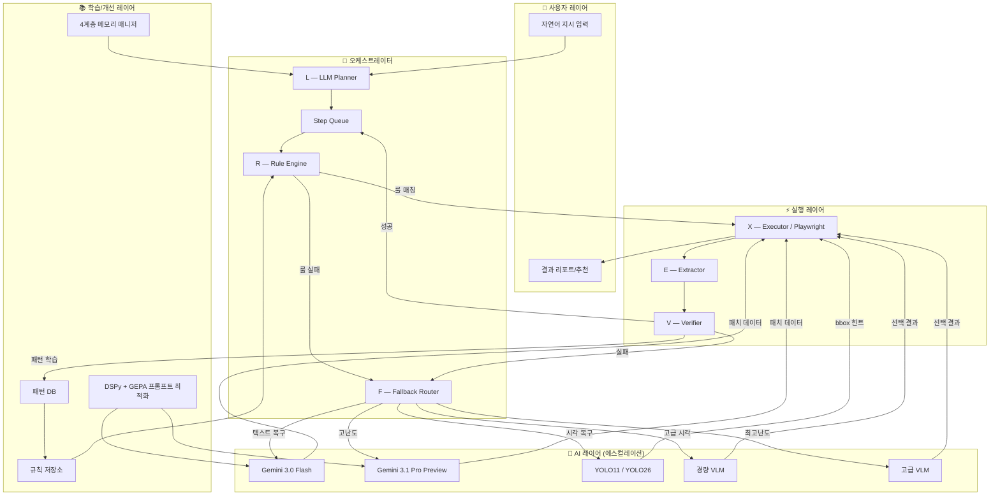
```mermaid
graph TB
    subgraph UserLayer["👤 사용자 레이어"]
        UI[자연어 지시 입력]
        Result[결과 리포트/추천]
    end

    subgraph Orchestrator["🧠 오케스트레이터"]
        Planner[L — LLM Planner]
        RuleEngine[R — Rule Engine]
        FallbackRouter[F — Fallback Router]
        StepQueue[Step Queue]
    end

    subgraph ExecutionLayer["⚡ 실행 레이어"]
        Executor[X — Executor / Playwright]
        Extractor[E — Extractor]
        Verifier[V — Verifier]
    end

    subgraph AILayer["🤖 AI 레이어 (에스컬레이션)"]
        LLM_Low[Gemini 3.0 Flash]
        LLM_High[Gemini 3.1 Pro Preview]
        YOLO[YOLO11 / YOLO26]
        VLM_Low[경량 VLM]
        VLM_High[고급 VLM]
    end

    subgraph LearningLayer["📚 학습/개선 레이어"]
        DSPy[DSPy + GEPA 프롬프트 최적화]
        RuleStore[규칙 저장소]
        PatternDB[패턴 DB]
        ContextMgr[4계층 메모리 매니저]
    end

    UI --> Planner
    Planner --> StepQueue
    StepQueue --> RuleEngine
    RuleEngine -->|룰 매칭| Executor
    RuleEngine -->|룰 실패| FallbackRouter
    FallbackRouter -->|텍스트 복구| LLM_Low
    FallbackRouter -->|시각 복구| YOLO
    FallbackRouter -->|고난도| LLM_High
    FallbackRouter -->|고급 시각| VLM_Low
    FallbackRouter -->|최고난도| VLM_High
    LLM_Low -->|패치 데이터| Executor
    LLM_High -->|패치 데이터| Executor
    YOLO -->|bbox 힌트| Executor
    VLM_Low -->|선택 결과| Executor
    VLM_High -->|선택 결과| Executor
    Executor --> Extractor
    Extractor --> Verifier
    Verifier -->|성공| StepQueue
    Verifier -->|실패| FallbackRouter

    Verifier -->|패턴 학습| PatternDB
    PatternDB --> RuleStore
    RuleStore --> RuleEngine
    DSPy --> LLM_Low
    DSPy --> LLM_High
    ContextMgr --> Planner

    Executor --> Result
```

> **v0.1 대비 변경**: Fallback Router(F)를 독립 모듈로 분리. 실패 유형을 분류하여 최적 복구 경로를 결정하는 라우터 역할.

---

## 2. 문제 정의

### 2.1 웹 자동화가 어려운 3가지 이유

웹 자동화가 어려운 근본 원인은 세 가지가 동시에 발생하기 때문이다:

1. **UI 변화성**: DOM 구조/라벨/위치가 자주 바뀐다. A/B 테스트, 반응형 디자인, SPA 프레임워크 업데이트 등으로 셀렉터가 수시로 깨진다.
2. **상호작용 복잡성**: 드롭다운, 포털 렌더링, 가상 스크롤, Canvas/WebGL, 지도, 드래그, 대기열 등 단순 클릭 이상의 인터랙션이 필요하다.
3. **제약성**: CAPTCHA/봇 탐지, 세션 만료, 비동기 지연, 실시간 경쟁 상태 등 외부 제약이 개입한다.

### 2.2 기존 접근의 한계

| 접근 방식 | 문제점 | 대표 사례 |
|----------|-------|----------|
| **매 스텝 LLM 호출** | 토큰 폭증, 지연 증가, 재현성 낮음, 비용 비예측적 | Browser-Use, 초기 Skyvern |
| **순수 셀렉터 스크립트** | UI 변경에 취약, 예외 처리 수동, 유지보수 부담 | Selenium 스크립트, Playwright 매크로 |
| **VLM 전면 의존** | SeeAct(2024) 연구에서도 grounding 오류가 주요 병목으로 확인됨. 스크린샷 기반은 비용↑ 속도↓ | SeeAct, WebVoyager |

> **OpAgent(2025)**는 Planner-Grounder-Reflector-Summarizer 모듈 분리로 WebArena 71.6% 달성했으나, 여전히 매 스텝 VLM 호출. **Agent-E**는 2-tier(planner+navigator)로 WebVoyager 73.2% 달성했으나 비용 최적화 미흡.

### 2.3 우리의 해결 전략

1. **룰/DSL 기반 실행 엔진**을 중심에 둔다 (Deterministic-first).
2. **LLM/VLM은 실패 복구 전용**으로만 사용한다 (LLM-last).
3. LLM 출력은 **패치 데이터만** 허용한다 (Patch-only).
4. 성공한 패치는 **규칙으로 승격**시켜 다음 실행부터 LLM 없이 처리한다.
5. 최종적으로 대부분의 실행이 **룰+함수 호출만으로** 완료되도록 수렴한다.

---

## 3. 핵심 모듈 정의 (X·E·R·L·V·F)

### 3.1 모듈 역할 매트릭스

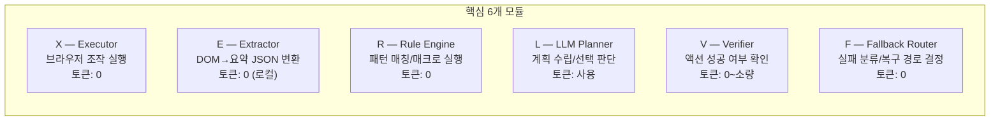
```mermaid
graph LR
    subgraph Modules["핵심 6개 모듈"]
        X["X — Executor<br/>브라우저 조작 실행<br/>토큰: 0"]
        E["E — Extractor<br/>DOM→요약 JSON 변환<br/>토큰: 0 (로컬)"]
        R["R — Rule Engine<br/>패턴 매칭/매크로 실행<br/>토큰: 0"]
        L["L — LLM Planner<br/>계획 수립/선택 판단<br/>토큰: 사용"]
        V["V — Verifier<br/>액션 성공 여부 확인<br/>토큰: 0~소량"]
        F["F — Fallback Router<br/>실패 분류/복구 경로 결정<br/>토큰: 0"]
    end
```

> **v0.1 대비 변경**: F(Fallback Router)를 독립 모듈로 추가. 기존에는 에스컬레이션 로직이 V와 R에 분산되어 있었으나, 실패 유형 분류와 복구 경로 결정을 전담하는 모듈로 분리.

### 3.2 X — Executor (실행기)

**역할**: Playwright를 통한 실제 브라우저 조작. 토큰 소비 없음.

**핵심 기능 목록**:

| 기능  | 메서드 (개념) | 설명  |
|-----|----------|-----|
| 페이지 이동 | `X.goto(url)` | URL 직접 이동 |
| 클릭  | `X.click(selector/eid)` | 요소 클릭 (단일/더블/롱프레스) |
| 텍스트 입력 | `X.type(eid, text)` | 입력창에 문자열 입력 |
| 키 입력 | `X.press(key)` | Enter, Tab, Escape 등 |
| 스크롤 | `X.scroll(direction, amount)` | 상하좌우 스크롤 |
| 대기  | `X.waitFor(condition)` | 요소 출현/사라짐/네비게이션 대기 |
| 스크린샷 | `X.screenshot(region?)` | 전체/부분 스크린샷 캡처 |
| 드래그 | `X.drag(from, to)` | 마우스 드래그 시뮬레이션 |
| 호버  | `X.hover(eid)` | 마우스 올려놓기 |
| 파일 업로드 | `X.upload(eid, filepath)` | 숨겨진 input\[type=file\] 처리 |
| 네트워크 감시 | `X.interceptResponse(pattern)` | API 응답 가로채기 |

**설계 원칙**:

* Executor는 "무엇을 할지"를 모른다. 상위 모듈(R 또는 L)에서 받은 명령만 수행한다.
* 모든 실행은 timeout이 있고, 실패 시 예외를 Verifier에게 전달한다.

### 3.3 E — Extractor (추출기)

**역할**: 현재 페이지의 DOM/네트워크 상태를 "자동화에 필요한 최소 JSON"으로 변환. 토큰 소비 없음(로컬 처리).

> **설계 근거**: LCoW(ICLR 2025) 연구에서 LLM 에이전트는 강한 의사결정 능력을 가지나, 길고 비구조화된 관찰(raw HTML)에 의존하면 성능이 크게 저하됨을 입증했다. Extractor는 이 "컨텍스트화" 역할을 토큰 0으로 수행한다.

**Extractor 유형 4가지**:

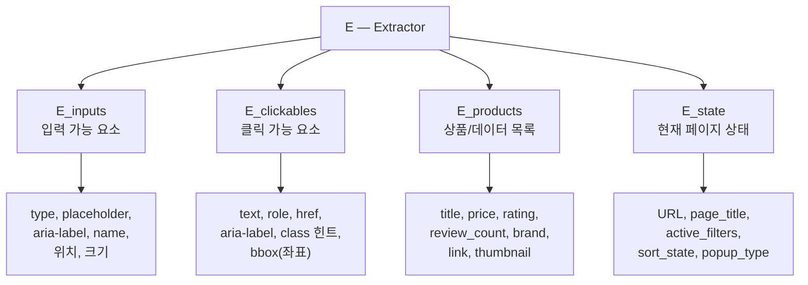
```mermaid
graph TD
    E[E — Extractor] --> E1["E_inputs<br/>입력 가능 요소"]
    E --> E2["E_clickables<br/>클릭 가능 요소"]
    E --> E3["E_products<br/>상품/데이터 목록"]
    E --> E4["E_state<br/>현재 페이지 상태"]

    E1 --> E1D["type, placeholder,<br/>aria-label, name,<br/>위치, 크기"]
    E2 --> E2D["text, role, href,<br/>aria-label, class 힌트,<br/>bbox(좌표)"]
    E3 --> E3D["title, price, rating,<br/>review_count, brand,<br/>link, thumbnail"]
    E4 --> E4D["URL, page_title,<br/>active_filters,<br/>sort_state, popup_type"]
```

**Extractor 설계 핵심**:

1. **DOM 탐색 범위 확장**: 일반 DOM + iframe + Shadow DOM + Portal(body 하위) 모두 커버
2. **요약 JSON만 생성**: HTML 원문이 아니라 구조화된 JSON으로 (토큰 최소화)
3. **eid(element ID) 시스템**: 추출된 각 요소에 고유 eid를 부여 → L이 eid로 지시, X가 eid로 실행
4. **bbox(bounding box) 포함**: Vision fallback을 위해 좌표 정보 항상 포함

> **Set-of-Mark 연동**: WebVoyager 등에서 검증된 Set-of-Mark 프롬프팅과 유사하게, eid를 시각적 마커로도 활용 가능. 스크린샷에 eid 번호를 오버레이하여 VLM에게 "element #7을 선택하라"는 형태로 질문할 수 있다.

**E_inputs 출력 예시**:

```json
{
  "inputs": [
    {
      "eid": "inp_1",
      "type": "search",
      "placeholder": "검색어를 입력해 주세요",
      "aria_label": "검색",
      "position": "top-center",
      "bbox": [320, 45, 680, 75],
      "confidence": 0.95
    }
  ]
}
```

**E_clickables 출력 예시**:

```json
{
  "clickables": [
    {
      "eid": "btn_7",
      "text": "인기순",
      "role": "tab",
      "aria_selected": false,
      "bbox": [150, 220, 210, 245],
      "parent_context": "정렬 탭바"
    },
    {
      "eid": "btn_8",
      "text": "판매순",
      "role": "tab",
      "aria_selected": true,
      "bbox": [220, 220, 280, 245],
      "parent_context": "정렬 탭바"
    }
  ]
}
```

### 3.4 R — Rule Engine (규칙 엔진)

**역할**: 반복되는 패턴을 LLM 없이 결정론적으로 처리. 토큰 소비 없음.

**규칙 카테고리**:

| 카테고리 | 예시 규칙 | 트리거 조건 |
|------|-------|--------|
| **팝업/쿠키** | 쿠키 동의 팝업 닫기 | DOM에 "쿠키", "동의", "agree" 포함 모달 존재 |
| **검색** | 검색창 식별 + 검색어 입력 + 실행 | `input[type=search]`, `aria-label*=검색` |
| **정렬** | 인기순/최신순/가격순 선택 | 동의어 사전 매칭 ("인기"="베스트"="판매많은"="TOP") |
| **필터** | 가격 범위/평점 필터 적용 | 가격 input 존재, 평점 선택 UI 존재 |
| **페이지네이션** | 다음 페이지/무한스크롤 처리 | "다음" 버튼 또는 scroll sentinel 존재 |
| **로그인 감지** | 로그인 페이지 리다이렉트 감지 | URL 패턴, "로그인", "login" DOM |
| **에러 감지** | 404/500/대기열 감지 | HTTP 상태, 특정 DOM 텍스트 |
| **확인 검증** | 정렬 적용 확인, 필터 적용 확인 | aria-selected, URL param, 리스트 갱신 |

**규칙 구조 (DSL 개념)**:

```yaml
# rule_sort_popular.yaml
rule:
  name: "sort_by_popular"
  trigger:
    context: "상품 목록 페이지"
    intent: "인기순 정렬"

  synonyms:
    - "인기순"
    - "인기상품"
    - "베스트"
    - "판매순"
    - "판매많은순"
    - "추천순"
    - "TOP"
    - "popular"
    - "best"

  strategy:
    - step: "find_sort_ui"
      method: "E_clickables에서 synonyms 매칭"
      fallback: "L에게 후보 중 선택 위임"

    - step: "click_sort"
      method: "X.click(matched_eid)"

    - step: "verify"
      checks:
        - "클릭한 요소의 aria-selected=true 또는 active class"
        - "URL 파라미터에 sort 관련 값 변경"
        - "상품 리스트 DOM이 갱신됨(로딩→완료)"
      on_fail: "escalate_to_F"
```

**규칙 학습 루프**:

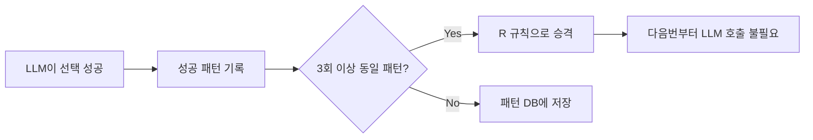
```mermaid
graph LR
    A[LLM이 선택 성공] --> B[성공 패턴 기록]
    B --> C{3회 이상 동일 패턴?}
    C -->|Yes| D[R 규칙으로 승격]
    C -->|No| E[패턴 DB에 저장]
    D --> F[다음번부터 LLM 호출 불필요]
```

### 3.5 L — LLM Planner (LLM 계획기)

**역할**: 사용자 의도를 실행 단계로 분해 + 규칙이 처리 못하는 판단 수행. 토큰을 사용하는 유일한 텍스트 모듈.

**L의 2가지 모드**:

| 모드  | 입력  | 출력  | 토큰 규모 |
|-----|-----|-----|-------|
| **Plan 모드** | 사용자 자연어 지시 | 실행 스텝 리스트 (JSON) | 500~2000 |
| **Select 모드** | E가 뽑은 후보 목록 + 현재 의도 | 선택된 eid 1개 + 이유 | 100~500 |

**Patch-Only 제약**: L의 출력은 항상 아래 형태 중 하나이다. 임의 코드나 스크립트 생성은 허용되지 않는다:

```json
{
  "patch_type": "selector_fix | param_change | rule_add | strategy_switch",
  "target": "대상 규칙/셀렉터 ID",
  "data": { "/* 패치 내용 */" },
  "confidence": 0.85
}
```

**Plan 모드 출력 예시**:

```json
{
  "plan": [
    {"step": 1, "action": "goto", "target": "https://shopping.naver.com", "verify": "url_contains('shopping.naver')"},
    {"step": 2, "action": "search", "query": "핸드백", "verify": "results_container_exists"},
    {"step": 3, "action": "sort", "value": "인기순", "verify": "sort_state_is('popular')"},
    {"step": 4, "action": "filter_price", "max": 500000, "verify": "all_prices_under(500000)"},
    {"step": 5, "action": "extract_products", "fields": ["title","price","rating","brand","link"]},
    {"step": 6, "action": "filter_rating", "min": 4.7, "method": "post_extraction"},
    {"step": 7, "action": "recommend", "criteria": "2030대 취향", "top_n": 5}
  ]
}
```

**Select 모드 프롬프트 템플릿**:

```
현재 의도: {intent}
페이지 상태: {page_state_summary}
후보 요소:
{candidates_json}

위 후보 중 의도에 가장 적합한 요소의 eid를 선택하세요.
응답 형식: {"selected_eid": "...", "reason": "..."}
```

### 3.6 V — Verifier (검증기)

**역할**: 모든 핵심 액션 후 성공 여부를 확인. 대부분 토큰 없이 룰 기반으로 처리.

**검증 유형**:

| 유형  | 방법  | 토큰  | 예시  |
|-----|-----|-----|-----|
| **URL 검증** | URL 패턴/파라미터 체크 | 0   | 검색어가 URL에 있는가 |
| **DOM 검증** | 특정 요소 존재/상태 체크 | 0   | 결과 컨테이너 존재, aria-selected |
| **네트워크 검증** | API 응답 상태/내용 체크 | 0   | 200 OK, 데이터 개수 > 0 |
| **시각 검증** | 스크린샷 비교 (최후) | VLM | 레이아웃이 예상과 일치하는가 |
| **데이터 검증** | 추출 데이터 정합성 체크 | 0   | 가격 범위, 평점 범위, 필드 존재 |

### 3.7 F — Fallback Router (폴백 라우터)

**역할**: V가 실패를 감지했을 때, 실패 유형을 분류하고 최적 복구 경로를 결정하는 독립 모듈.

> **설계 근거**: 기존(v0.1)에서는 실패 시 단순히 다음 티어로 에스컬레이션했다. 그러나 "셀렉터를 못 찾음"과 "시각적 모호성"은 전혀 다른 복구 전략이 필요하다. F는 실패를 분류한 뒤 최적 경로를 선택한다.

**실패 유형 분류 코드**:

| 실패 코드 | 설명 | 복구 경로 |
|-----------|------|----------|
| `SelectorNotFound` | DOM에서 대상 요소를 찾을 수 없음 | 대체 셀렉터 시도 → L(Tier1) 패치 |
| `NotInteractable` | 요소 있으나 클릭/입력 불가 | 스크롤/호버/overlay 제거 → 재시도 |
| `StateNotChanged` | 액션 실행 후 상태 변화 없음 | 다른 전략 시도 → L(Tier1~2) 패치 |
| `VisualAmbiguity` | DOM 정보만으로 판단 불가 | YOLO → VLM(Low) → VLM(High) |
| `NetworkError` | 타임아웃, 4xx/5xx | 대기 → 재시도 → 새로고침 |
| `QueueDetected` | 대기열/트래픽 제한 감지 | 자동 대기 루프 + 타임아웃 |
| `CaptchaDetected` | CAPTCHA/봇 탐지 | 즉시 Human Handoff |
| `AuthRequired` | 로그인/2FA 필요 | 저장 쿠키 시도 → Human Handoff |
| `DynamicLayout` | A/B 테스트 등으로 UI 구조 상이 | 복수 셀렉터 패턴 → L 에스컬레이션 |

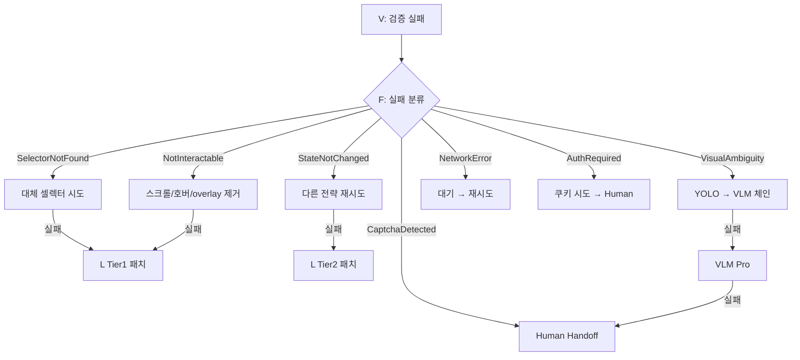
```mermaid
flowchart TD
    Fail[V: 검증 실패] --> F{F: 실패 분류}
    F -->|SelectorNotFound| Alt[대체 셀렉터 시도]
    F -->|NotInteractable| Fix[스크롤/호버/overlay 제거]
    F -->|StateNotChanged| Retry[다른 전략 재시도]
    F -->|VisualAmbiguity| Vision[YOLO → VLM 체인]
    F -->|NetworkError| Wait[대기 → 재시도]
    F -->|CaptchaDetected| Human[Human Handoff]
    F -->|AuthRequired| Auth[쿠키 시도 → Human]
    
    Alt -->|실패| L1[L Tier1 패치]
    Fix -->|실패| L1
    Retry -->|실패| L2[L Tier2 패치]
    Vision -->|실패| VHigh[VLM Pro]
    VHigh -->|실패| Human
```

---

## 4. Workflow/DSL 설계

### 4.1 DSL 노드 타입 (9종)

| 노드 타입 | 역할 | 예시 |
|----------|------|------|
| `action` | 클릭/입력/스크롤/드래그 등 실행 | 검색어 입력, 정렬 버튼 클릭 |
| `extract` | DOM/시각 메타데이터 추출 | 상품 카드 목록 추출 |
| `decide` | 룰 평가, 점수화, 분기 선택 | 가격/평점 필터링 |
| `verify` | 상태 검증 | URL 파라미터 확인, 정렬 상태 확인 |
| `branch` | 조건 분기 | 가격 입력UI 존재 여부에 따라 분기 |
| `loop` | 반복 조건 실행 | 무한스크롤 반복 추출 |
| `wait` | 시간/이벤트 대기 | API 응답 대기, 렌더링 완료 대기 |
| `recover` | 폴백 전략 수행 | 실패 시 F를 통한 복구 |
| `handoff` | 사용자 개입 요청 | CAPTCHA, 결제 |

### 4.2 액션 스펙 (예시)

```yaml
node:
  id: click_popular_sort
  type: action
  action: click
  target:
    selector_key: sort.popular
    fallback:
      - text: "인기순"
      - text: "판매많은순"
      - aria: "인기"
  verify:
    - type: state_contains
      key: selected_sort
      value: popular
  on_fail:
    strategy: recover
    recover_plan:
      - retry_rule
      - llm_tier1
      - vlm_low
  guardrail:
    max_retries: 3
    timeout_ms: 10000
```

### 4.3 Drag/지도/캔버스 대응 노드

```yaml
node:
  id: adjust_price_slider
  type: action
  action: drag
  source:
    selector_key: filter.price.slider_handle
  target:
    method: by_value
    value: 500000
  verify:
    - type: text_contains
      target: filter.price.max_label
      value: "500,000"
  on_fail:
    strategy: recover
    recover_plan:
      - set_input_if_exists
      - llm_tier1
      - vlm_low
```

### 4.4 루프 가드레일

워크플로우의 `loop` 노드에는 반드시 안전 장치를 포함한다:

```yaml
node:
  id: scroll_load_products
  type: loop
  condition: "new_products_loaded == true"
  guardrail:
    max_iterations: 50
    max_duration_sec: 120
    exit_on_no_change: 3  # 3회 연속 변화 없으면 중단
    memory_check: true     # 메모리 압박 시 중단
  body:
    - type: action
      action: scroll
      direction: down
      amount: 800
    - type: wait
      duration_ms: 1500
    - type: extract
      target: new_product_cards
```

### 4.5 선택 로직 (룰 엔진 내 Decide 노드)

1. **하드 제약**: 가격, 평점, 재고, 필수 옵션 — 불만족 시 즉시 탈락
2. **소프트 점수**: 리뷰 수, 브랜드 선호도, 연령대 적합도 — 가중 합산
3. **동점 처리**: 가격 오름차순 → 평점 내림차순 → 리뷰 수 내림차순

---

## 5. 계층적 에스컬레이션 아키텍처

### 5.1 에스컬레이션 계층도

이것이 이 시스템의 **핵심 차별점**이다. 모든 판단은 아래 계층을 순서대로 올라간다:

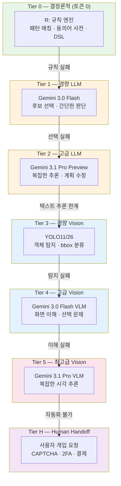
```mermaid
graph TD
    subgraph Tier0["Tier 0 — 결정론적 (토큰 0)"]
        R0[R: 규칙 엔진<br/>패턴 매칭 · 동의어 사전 · DSL]
    end

    subgraph Tier1["Tier 1 — 경량 LLM"]
        L1[Gemini 3.0 Flash<br/>후보 선택 · 간단한 판단]
    end

    subgraph Tier2["Tier 2 — 고급 LLM"]
        L2[Gemini 3.1 Pro Preview<br/>복잡한 추론 · 계획 수정]
    end

    subgraph Tier3["Tier 3 — 경량 Vision"]
        V1[YOLO11/26<br/>객체 탐지 · bbox 분류]
    end

    subgraph Tier4["Tier 4 — 고급 Vision"]
        V2[Gemini 3.0 Flash VLM<br/>화면 이해 · 선택 문제]
    end

    subgraph Tier5["Tier 5 — 최고급 Vision"]
        V3[Gemini 3.1 Pro VLM<br/>복잡한 시각 추론]
    end

    subgraph TierH["Tier H — Human Handoff"]
        H[사용자 개입 요청<br/>CAPTCHA · 2FA · 결제]
    end

    R0 -->|규칙 실패| L1
    L1 -->|선택 실패| L2
    L2 -->|텍스트 추론 한계| V1
    V1 -->|탐지 실패| V2
    V2 -->|이해 실패| V3
    V3 -->|자동화 불가| H

    style Tier0 fill:#e8f5e9
    style Tier1 fill:#fff3e0
    style Tier2 fill:#fff3e0
    style Tier3 fill:#e3f2fd
    style Tier4 fill:#e3f2fd
    style Tier5 fill:#fce4ec
    style TierH fill:#f3e5f5
```

> **참고**: F(Fallback Router)는 반드시 이 순서를 따르지 않는다. `VisualAmbiguity`면 Tier1-2를 건너뛰고 바로 Tier3으로, `CaptchaDetected`면 바로 TierH로 점프할 수 있다. 이것이 F를 독립 모듈로 분리한 이유이다.

### 5.2 에스컬레이션 판단 기준

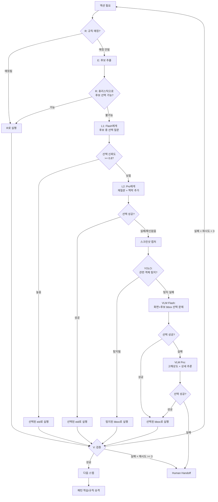
```mermaid
flowchart TD
    Start[액션 필요] --> R{R: 규칙 매칭?}
    R -->|매칭됨| RExec[R로 실행]
    R -->|매칭 안됨| EExtract[E: 후보 추출]

    EExtract --> RHeuristic{R: 휴리스틱으로<br/>후보 선택 가능?}
    RHeuristic -->|가능| RExec
    RHeuristic -->|불가능| L1Ask[L1: Flash에게<br/>후보 중 선택 질문]

    L1Ask --> L1Conf{선택 신뢰도<br/>>= 0.8?}
    L1Conf -->|높음| L1Exec[선택된 eid로 실행]
    L1Conf -->|낮음| L2Ask[L2: Pro에게<br/>재질문 + 맥락 추가]

    L2Ask --> L2Conf{선택 성공?}
    L2Conf -->|성공| L2Exec[선택된 eid로 실행]
    L2Conf -->|실패/확신없음| Screenshot[스크린샷 캡처]

    Screenshot --> YOLO{YOLO:<br/>관련 객체 탐지?}
    YOLO -->|탐지됨| YExec[탐지된 bbox로 실행]
    YOLO -->|탐지 실패| VLM1[VLM Flash:<br/>화면+후보 bbox 선택 문제]

    VLM1 --> VLM1Conf{선택 성공?}
    VLM1Conf -->|성공| VLMExec[선택된 bbox로 실행]
    VLM1Conf -->|실패| VLM2[VLM Pro:<br/>고해상도 + 상세 추론]

    VLM2 --> VLM2Conf{선택 성공?}
    VLM2Conf -->|성공| VLMExec
    VLM2Conf -->|실패| Human[Human Handoff]

    RExec --> Verify{V: 검증}
    L1Exec --> Verify
    L2Exec --> Verify
    YExec --> Verify
    VLMExec --> Verify

    Verify -->|성공| Next[다음 스텝]
    Verify -->|실패 + 재시도 < 3| Start
    Verify -->|실패 + 재시도 >= 3| Human

    Next --> Learn[패턴 학습/규칙 승격]
```

### 5.3 에스컬레이션 비용 비교

| Tier | 모듈  | 호출당 비용 (추정) | 지연 시간 | 성공률 (예상) |
|------|-----|-------------|-------|----------|
| 0    | R (Rule) | $0          | < 10ms | 70~85%  |
| 1    | Gemini 3.0 Flash | ~$0.001    | 200~500ms | 85~95%  |
| 2    | Gemini 3.1 Pro | ~$0.01     | 500ms~2s | 90~98%  |
| 3    | YOLO11/26 | ~$0.0005 (로컬) | 50~200ms | 60~80% (특정 태스크) |
| 4    | VLM Flash | ~$0.005    | 500ms~1.5s | 80~92%  |
| 5    | VLM Pro | ~$0.02     | 1~3s | 88~96%  |
| H    | Human | - (사용자 시간)  | 가변    | 99%+     |

**핵심**: Tier 0에서 70~85%를 처리하면, LLM/VLM 호출 비용이 전체의 15~30%만 차지한다.

### 5.4 규칙 승격 메커니즘 (Rule Promotion)

실패 → LLM 해결 → 패턴 학습 → 규칙 등록의 사이클:

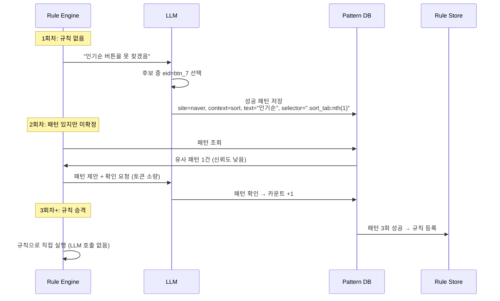
```mermaid
sequenceDiagram
    participant R as Rule Engine
    participant L as LLM
    participant DB as Pattern DB
    participant RS as Rule Store

    Note over R: 1회차: 규칙 없음
    R->>L: "인기순 버튼을 못 찾겠음"
    L->>L: 후보 중 eid=btn_7 선택
    L->>DB: 성공 패턴 저장<br/>site=naver, context=sort, text="인기순", selector=".sort_tab:nth(1)"

    Note over R: 2회차: 패턴 있지만 미확정
    R->>DB: 패턴 조회
    DB->>R: 유사 패턴 1건 (신뢰도 낮음)
    R->>L: 패턴 제안 + 확인 요청 (토큰 소량)
    L->>DB: 패턴 확인 → 카운트 +1

    Note over R: 3회차+: 규칙 승격
    DB->>RS: 패턴 3회 성공 → 규칙 등록
    R->>R: 규칙으로 직접 실행 (LLM 호출 없음)
```

> **WEBRL과의 차이**: WEBRL(ICLR 2025)은 RL로 웹 에이전트를 훈련시켜 성능을 끌어올린다(Llama-3.1-8B: 4.8%→42.4%). 본 시스템은 RL 대신 **런타임 규칙 승격**으로 동일한 "반복할수록 개선" 효과를 달성하되, 추가 학습 인프라 없이 실현한다.


---

## 6. 이미지 배칭 및 좌표 역추적 시스템

### 6.1 핵심 아이디어

VLM이나 YOLO에 이미지를 보낼 때, 개별 스크린샷을 하나씩 보내면 비용이 폭증한다. **관련 이미지들을 하나의 캔버스에 묶어서(타일링/콜라주) 한 번에 보내고**, 결과를 원래 위치로 역추적하는 시스템.

> **CV_POM 참고**: TestDevLab의 CV_POM 프레임워크는 스크린샷을 YOLO로 분석하여 JSON 기반 Page Object Model을 생성한다. 본 시스템의 배칭은 이를 확장하여 **다중 영역을 단일 호출로** 처리한다.

### 6.2 이미지 배칭 플로우

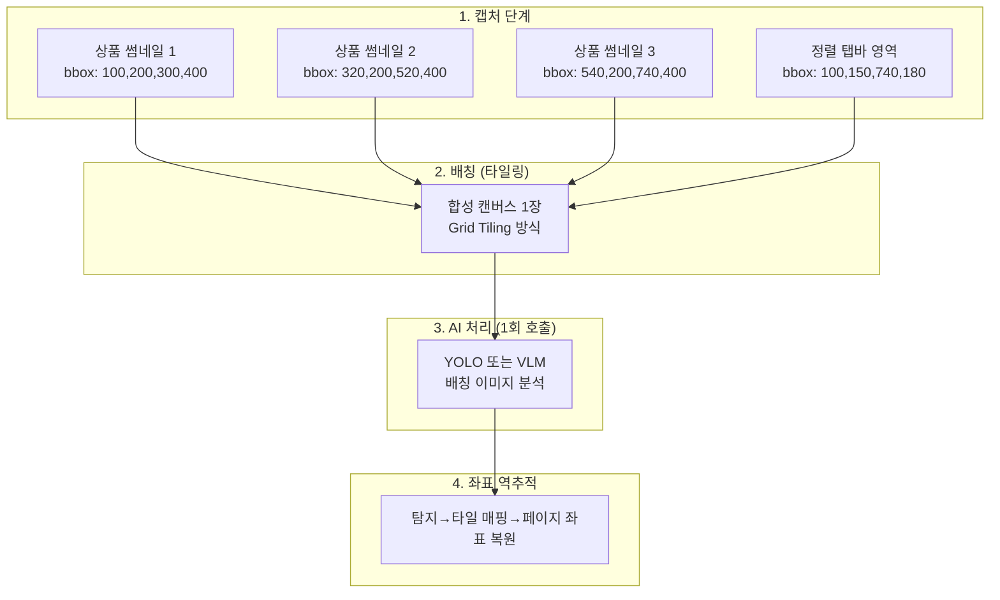
```mermaid
graph TD
    subgraph Capture["1. 캡처 단계"]
        S1[상품 썸네일 1<br/>bbox: 100,200,300,400]
        S2[상품 썸네일 2<br/>bbox: 320,200,520,400]
        S3[상품 썸네일 3<br/>bbox: 540,200,740,400]
        S4[정렬 탭바 영역<br/>bbox: 100,150,740,180]
    end

    subgraph Batch["2. 배칭 (타일링)"]
        Canvas["합성 캔버스 1장<br/>Grid Tiling 방식"]
    end

    subgraph Process["3. AI 처리 (1회 호출)"]
        AI[YOLO 또는 VLM<br/>배칭 이미지 분석]
    end

    subgraph Map["4. 좌표 역추적"]
        M1["탐지→타일 매핑→페이지 좌표 복원"]
    end

    S1 & S2 & S3 & S4 --> Canvas
    Canvas --> AI
    AI --> M1
```

### 6.3 좌표 역추적 로직 상세

**배칭 시 메타데이터를 반드시 저장한다:**

```json
{
  "batch_id": "batch_001",
  "canvas_size": [1200, 600],
  "tiles": [
    {
      "tile_id": "t1",
      "source_eid": "thumb_1",
      "source_bbox_page": [100, 200, 300, 400],
      "tile_bbox_canvas": [0, 0, 200, 200],
      "scale": 1.0
    },
    {
      "tile_id": "t2",
      "source_eid": "thumb_2",
      "source_bbox_page": [320, 200, 520, 400],
      "tile_bbox_canvas": [200, 0, 400, 200],
      "scale": 1.0
    },
    {
      "tile_id": "t3",
      "source_eid": "sort_tabbar",
      "source_bbox_page": [100, 150, 740, 180],
      "tile_bbox_canvas": [0, 200, 640, 230],
      "scale": 1.0
    }
  ]
}
```

**역추적 공식**:

```
# AI가 배칭 캔버스에서 탐지한 좌표: (det_x, det_y)
# 해당 좌표가 속한 tile을 찾고:

page_x = tile.source_bbox_page.x1 + (det_x - tile.tile_bbox_canvas.x1) / tile.scale
page_y = tile.source_bbox_page.y1 + (det_y - tile.tile_bbox_canvas.y1) / tile.scale
```

### 6.4 배칭 전략별 비교

| 전략  | 설명  | 장점  | 단점  | 적합 상황 |
|-----|-----|-----|-----|-------|
| **Grid Tiling** | N개 이미지를 NxM 그리드로 | 단순, 역추적 쉬움 | 크기 불균일 시 낭비 | 상품 썸네일 비교 |
| **Strip Packing** | 가로/세로 한 줄로 | 긴 영역(탭바, 메뉴) 적합 | 세로 영역 낭비 가능 | UI 요소 식별 |
| **Full Page** | 전체 페이지 스크린샷 | 컨텍스트 보존 | 해상도 저하, 토큰 많음 | 레이아웃 이해 |
| **Focus Crop** | 관심 영역만 크게 자름 | 해상도 높음, 토큰 적음 | 주변 맥락 손실 | 특정 요소 판별 |

### 6.5 IoU 기반 역매핑 알고리즘

> **UGround(2025) 참고**: GUI visual grounding 연구에서 사용하는 IoU(Intersection over Union) 매칭을 본 시스템에도 적용한다.

```
1. E가 DOM 요소의 getBoundingClientRect() 수집 → candidate_bboxes[]
2. YOLO/VLM이 선택한 bbox를 candidate_bboxes와 IoU 비교
3. IoU ≥ 0.5인 매칭이 있으면 해당 locator 채택
4. IoU < 0.5이면 가장 가까운 클릭 포인트를 직접 계산하여 좌표 기반 클릭
5. 좌표 기반 클릭 후 V(Verifier)로 반드시 상태 변화 확인
```

### 6.6 비용 절감 효과

```
개별 호출: 10개 이미지 × $0.005/호출 = $0.05
배칭 호출: 1개 합성이미지 × $0.005/호출 = $0.005
→ 비용 10배 절감 (이미지 수에 비례)
```


---

## 7. LLM 티어링 전략

### 7.1 티어 구성

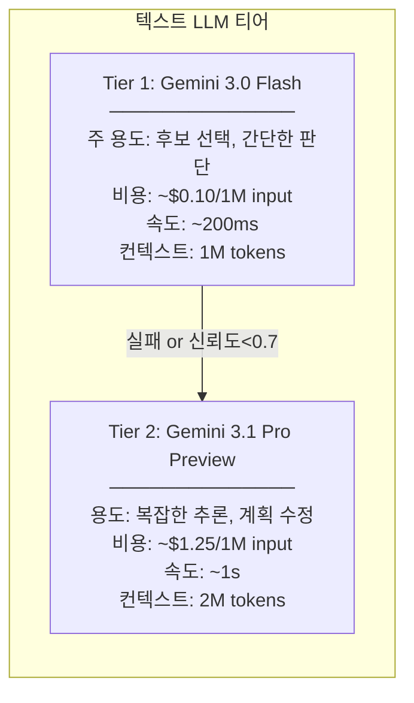
```mermaid
graph LR
    subgraph TextLLM["텍스트 LLM 티어"]
        T1["Tier 1: Gemini 3.0 Flash<br/>──────────────<br/>주 용도: 후보 선택, 간단한 판단<br/>비용: ~$0.10/1M input<br/>속도: ~200ms<br/>컨텍스트: 1M tokens"]
        T2["Tier 2: Gemini 3.1 Pro Preview<br/>──────────────<br/>용도: 복잡한 추론, 계획 수정<br/>비용: ~$1.25/1M input<br/>속도: ~1s<br/>컨텍스트: 2M tokens"]
    end

    T1 -->|"실패 or 신뢰도<0.7"| T2
```

### 7.2 티어 전환 조건

| 조건  | Flash (Tier 1) | Pro (Tier 2) |
|-----|----------------|--------------|
| 후보 중 단일 선택 | ✅ 기본 처리        | —            |
| 동의어/유사어 판단 | ✅ 가능           | —            |
| 다단계 추론 | ⚠️ 시도 후 실패 시   | ✅ 에스컬레이션     |
| 복잡한 필터 조합 | ⚠️             | ✅            |
| 사용자 의도 재해석 | —              | ✅ 기본 처리      |
| 실행 계획 수정 | —              | ✅ 기본 처리      |
| 추천/요약 (최종) | ✅ (단순 추천)      | ✅ (복잡한 기준)   |

### 7.3 프롬프트 차등 설계

**Tier 1 (Flash) — 최소 토큰 프롬프트**:

```
TASK: 후보 중 선택
INTENT: "인기순 정렬"
CANDIDATES:
- btn_7: text="인기순", role=tab
- btn_8: text="최신순", role=tab
- btn_9: text="낮은가격순", role=tab

RESPOND: {"eid":"...", "confidence": 0.0~1.0}
```

**Tier 2 (Pro) — 맥락 포함 프롬프트**:

```
CONTEXT: 네이버 쇼핑에서 핸드백을 검색한 상태.
사용자는 인기순으로 정렬하려 함.
이전 시도에서 Tier 1이 btn_7을 선택했으나 검증 실패.
현재 URL: https://search.shopping.naver.com/search?query=핸드백
정렬 상태: 현재 "관련도순"이 활성화됨

CANDIDATES:
{extended_candidates_with_more_context}

ANALYSIS REQUEST:
1. 왜 이전 선택이 실패했을 가능성이 있는가?
2. 어떤 eid를 선택해야 하는가?
3. 클릭 후 예상되는 변화는?

RESPOND: {"eid":"...", "reason":"...", "expected_change":"..."}
```

### 7.4 예산 기반 모델 라우팅

> **비용 최적화 연구 참고**: 동적 모델 라우팅은 30%+ 비용 절감을 달성할 수 있다. 본 시스템은 태스크 레벨에서 누적 비용을 추적하고, 예산 초과 시 자동으로 저비용 모델로 제한한다.

```yaml
budget_policy:
  per_task_budget: $0.05
  per_step_budget: $0.01
  tier2_monthly_cap: $50
  on_budget_exceeded:
    - downgrade_to_tier1_only
    - increase_rule_retry_count
    - alert_user_if_critical
```


---

## 8. Vision 티어링 전략

### 8.1 티어 구성

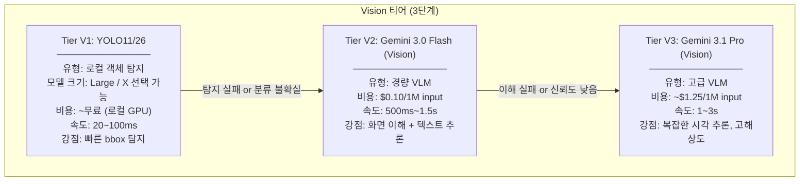
```mermaid
graph TD
    subgraph VisionTier["Vision 티어 (3단계)"]
        V1["Tier V1: YOLO11/26<br/>──────────────<br/>유형: 로컬 객체 탐지<br/>모델 크기: Large / X 선택 가능<br/>비용: ~무료 (로컬 GPU)<br/>속도: 20~100ms<br/>강점: 빠른 bbox 탐지"]

        V2["Tier V2: Gemini 3.0 Flash (Vision)<br/>──────────────<br/>유형: 경량 VLM<br/>비용: $0.10/1M input<br/>속도: 500ms~1.5s<br/>강점: 화면 이해 + 텍스트 추론"]

        V3["Tier V3: Gemini 3.1 Pro (Vision)<br/>──────────────<br/>유형: 고급 VLM<br/>비용: ~$1.25/1M input<br/>속도: 1~3s<br/>강점: 복잡한 시각 추론, 고해상도"]
    end

    V1 -->|"탐지 실패 or 분류 불확실"| V2
    V2 -->|"이해 실패 or 신뢰도 낮음"| V3
```

> **GUI Element Detection 연구**: IEEE(2024)에서 YOLOv8 기반 GUI 요소 탐지 연구가 발표되었으며, VINS 데이터셋으로 21종 UI 요소(버튼, 입력, 체크박스, 드롭다운 등)를 탐지할 수 있음이 검증되었다. 본 시스템은 이를 확장하여 웹 특화 클래스(정렬 탭, 필터 슬라이더, 상품 카드 등)를 커스텀 학습한다.

### 8.2 YOLO vs VLM 역할 분담

| 상황  | YOLO | VLM Flash | VLM Pro |
|-----|--------|-----------|---------|
| 버튼/아이콘 위치 탐지 | ✅ 1순위  | 2순위       | —       |
| "인기순" 텍스트 요소 찾기 | ❌ (의미 이해 불가) | ✅ 1순위     | 2순위     |
| 상품 카드 영역 구분 | ✅ bbox 탐지 | —         | —       |
| 색상 스와치 식별 | ⚠️ 탐지만 | ✅ 색상명 판별  | —       |
| 배송 아이콘 분류 | ⚠️ 탐지만 | ✅ 아이콘→텍스트 | —       |
| 복잡한 레이아웃 이해 | ❌      | ⚠️        | ✅ 1순위   |
| Canvas/지도 요소 | ❌      | ⚠️        | ✅       |
| CAPTCHA 유형 식별 | ❌      | ✅ (유형 판별만) | —       |

### 8.3 YOLO 모델 크기 선택 기준

| 모델  | 파라미터 | 속도 (GPU) | 정확도 (mAP) | 적합 상황 |
|-----|------|----------|-----------|-------|
| YOLO-X | 최대   | ~100ms  | 최고        | 초기 학습/커스텀 클래스 탐지 |
| YOLO-L | 대형   | ~50ms   | 높음        | 범용 웹 UI 요소 탐지 |
| YOLO-M | 중형   | ~30ms   | 중상        | 실시간 반복 작업 |
| YOLO-S | 소형   | ~15ms   | 중         | 빠른 사전 스크리닝 |

**동적 선택 전략**: 첫 시도는 S/M으로, 실패 시 L/X로 에스컬레이션.

### 8.4 VLM 프롬프트 — "선택 문제" 변환 패턴

VLM에게 "화면에서 뭐가 보이냐"가 아니라, **"이 후보 중 어느 것이냐"로 물어야 한다.**

> **SeeAct 연구 교훈**: GPT-4V 기반 SeeAct에서 "자유 형식 응답"은 심각한 grounding 오류를 발생시켰다. "후보 중 선택" 형태(Textual Choices)가 가장 안정적이었다. UGround(2025)는 130만 GUI 스크린샷으로 학습하여 기존 모델 대비 20% 향상을 달성했다.

```
[이미지: 현재 화면 스크린샷]

이 화면에서 "인기순" 정렬 버튼에 해당하는 영역은 다음 후보 중 어느 것입니까?

후보:
A. bbox [150, 220, 210, 245] — 텍스트 추정: "인기순"
B. bbox [220, 220, 280, 245] — 텍스트 추정: "최신순"
C. bbox [290, 220, 370, 245] — 텍스트 추정: "낮은가격순"
D. 해당 없음 (화면에 관련 요소가 보이지 않음)

응답: {"selected": "A"|"B"|"C"|"D", "confidence": 0.0~1.0}
```


---

## 9. 자기 개선 프롬프트 시스템 (DSPy + GEPA)

### 9.1 개요

프롬프트를 수동으로 튜닝하지 않고, 실행 결과(성공/실패)를 기반으로 **프롬프트가 스스로 개선**되는 시스템.

> **DSPy 2025 현황**: Stanford의 DSPy 프레임워크는 2025년 기준으로 MIPROv2, GEPA, SIMBA 등 다양한 옵티마이저를 제공한다. 특히 GEPA는 LLM의 반성(reflection) 능력을 활용하여 도메인 특화 텍스트 피드백으로 프롬프트를 진화시키며, 적은 롤아웃으로도 높은 성능 개선을 달성한다.

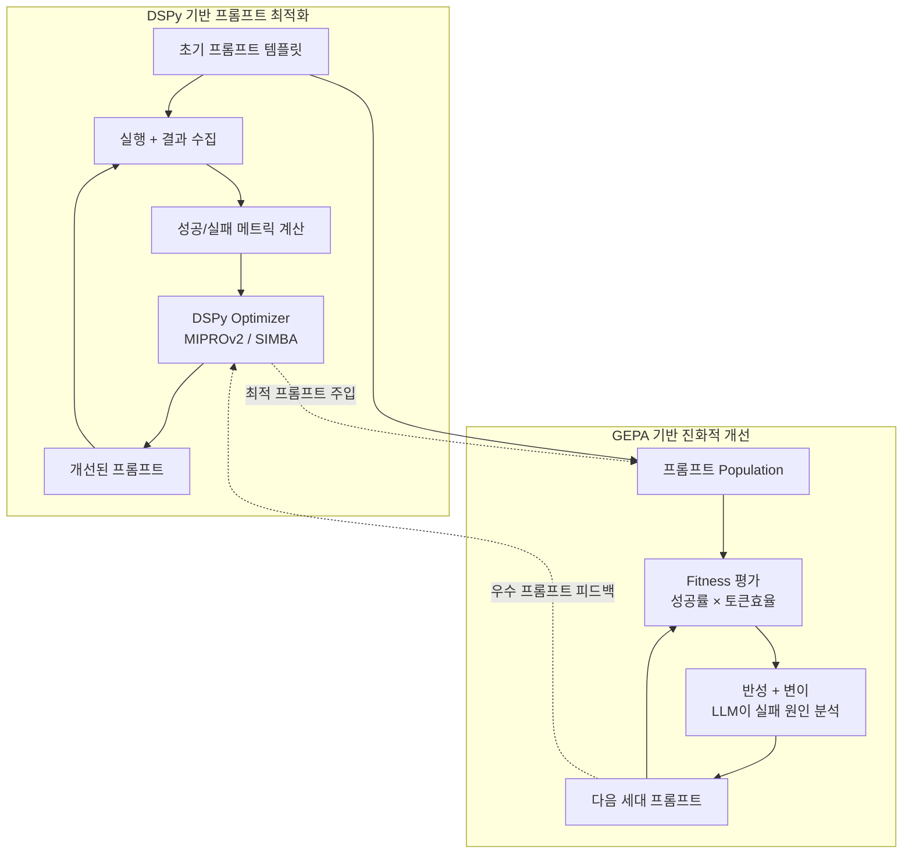
```mermaid
graph TD
    subgraph DSPyLoop["DSPy 기반 프롬프트 최적화"]
        P1[초기 프롬프트 템플릿]
        E1[실행 + 결과 수집]
        M1[성공/실패 메트릭 계산]
        O1[DSPy Optimizer<br/>MIPROv2 / SIMBA]
        P2[개선된 프롬프트]
    end

    subgraph GEPALoop["GEPA 기반 진화적 개선"]
        G1[프롬프트 Population]
        G2[Fitness 평가<br/>성공률 × 토큰효율]
        G3[반성 + 변이<br/>LLM이 실패 원인 분석]
        G4[다음 세대 프롬프트]
    end

    P1 --> E1 --> M1 --> O1 --> P2
    P2 --> E1

    P1 --> G1 --> G2 --> G3 --> G4
    G4 --> G2

    O1 -.->|최적 프롬프트 주입| G1
    G4 -.->|우수 프롬프트 피드백| O1
```

### 9.2 DSPy 적용 설계

**DSPy Signature 정의**:

```python
# 개념 예시 (실제 코드가 아닌 설계 참고)

class SelectElement(dspy.Signature):
    """웹 페이지 요소 후보 중 의도에 맞는 것을 선택"""
    intent = dspy.InputField(desc="사용자 의도 (예: '인기순 정렬')")
    candidates = dspy.InputField(desc="후보 요소 리스트 (JSON)")
    page_context = dspy.InputField(desc="현재 페이지 상태 요약")
    selected_eid = dspy.OutputField(desc="선택된 요소 eid")
    confidence = dspy.OutputField(desc="신뢰도 0.0~1.0")

class PlanSteps(dspy.Signature):
    """사용자 지시를 실행 가능한 스텝으로 분해"""
    user_instruction = dspy.InputField(desc="사용자 자연어 지시")
    available_actions = dspy.InputField(desc="사용 가능한 액션 목록")
    steps = dspy.OutputField(desc="실행 스텝 리스트 (JSON)")
```

**DSPy 최적화 루프**:

1. 초기 프롬프트로 N번 실행 → 성공/실패 기록
2. `MIPROv2`: Bayesian Optimization으로 instruction + few-shot 동시 최적화
3. `SIMBA`: 높은 출력 변동성을 보이는 어려운 사례를 식별, LLM 자기반성으로 개선 규칙 생성
4. 개선된 프롬프트로 다시 N번 실행 → 비교

### 9.3 GEPA (Genetic Evolution of Prompt Agents) 적용

> **GEPA 2025 최신**: GEPA는 스칼라 메트릭만이 아닌 도메인 특화 텍스트 피드백을 활용하여 프롬프트를 진화시킨다. 트리 구조로 프롬프트 후보를 관리하며, 누적 개선을 추적한다. DSPy 공식 튜토리얼에서 AIME 2025 벤치마크에서 GPT-4.1 Mini로 10% 성능 향상을 달성했다.

**GEPA Fitness 함수**:

```
score = Ws × step_success_rate
      - Wc × normalized_token_cost
      - Wl × normalized_elapsed_time
      - Wf × deep_fallback_count

# 가중치 예시:
# Ws = 1.0, Wc = 0.3, Wl = 0.2, Wf = 0.5
# deep_fallback = Tier 3 이상 진입 횟수
```

**프롬프트 진화 예시**:

```
세대 1: 프롬프트 변형 5개 생성
  - P1: "후보 중 가장 적합한 것을 선택하세요"
  - P2: "의도와 텍스트가 일치하는 eid를 반환하세요"
  - P3: "역할: 웹 자동화 봇. 후보를 분석하고 선택하세요"
  - P4: "JSON으로 응답. eid만 반환"
  - P5: "먼저 각 후보를 평가하고, 최적 선택을 JSON으로"

세대 1 평가 (각 50회 실행):
  P1: 성공률 72%, 평균 토큰 180
  P2: 성공률 81%, 평균 토큰 120  ← 우수
  P3: 성공률 78%, 평균 토큰 210
  P4: 성공률 65%, 평균 토큰 80
  P5: 성공률 85%, 평균 토큰 250  ← 우수

GEPA 반성 단계:
  "P2는 간결하지만 평가 과정 부재로 복잡한 케이스에서 실패"
  "P5는 평가 과정이 성공률을 높이지만 토큰이 과다"
  → 교차/변이로 P6 생성

세대 2: P2와 P5를 교차/변이
  - P6: "의도와 텍스트를 비교 평가 후 최적 eid를 JSON 반환"
  - P6: 성공률 86%, 평균 토큰 150 ← 개선!
```

### 9.4 프롬프트 버전 관리

```json
{
  "prompt_id": "select_element_v3.2",
  "signature": "SelectElement",
  "tier": "flash",
  "template": "...",
  "optimizer": "GEPA",
  "generation": 5,
  "metrics": {
    "success_rate": 0.87,
    "avg_tokens": 145,
    "avg_latency_ms": 320,
    "sample_count": 500,
    "last_optimized": "2026-02-20"
  },
  "few_shot_examples": [
    {"intent": "인기순 정렬", "candidates": "...", "selected": "btn_7", "result": "success"},
    {"intent": "검색창 찾기", "candidates": "...", "selected": "inp_1", "result": "success"}
  ]
}
```

### 9.5 운영 반영 게이트

프롬프트 변경이 운영에 미치는 영향을 통제하기 위한 안전장치:

1. **오프라인 리플레이 검증**: 과거 실패 로그로 신규 프롬프트 테스트
2. **A/B 배포**: 신규 프롬프트를 트래픽 10%에 먼저 적용
3. **자동 롤백**: 성공률이 기존 대비 5% 이상 하락 시 즉시 이전 버전으로 복귀
4. **변경 이력**: 모든 프롬프트 버전, 메트릭, 변경 사유를 Git-like으로 관리


---

## 10. 메모리 및 컨텍스트 관리 전략

### 10.1 4계층 메모리 모델

> **Self-Evolving Agents 연구 참고**: 자기 진화형 에이전트 서베이(2025)에서 메모리 증강 에이전트(A-MEM, Memory-R1)가 장기 학습에 핵심임이 확인되었다. 본 시스템은 4계층 메모리 모델로 이를 구현한다.

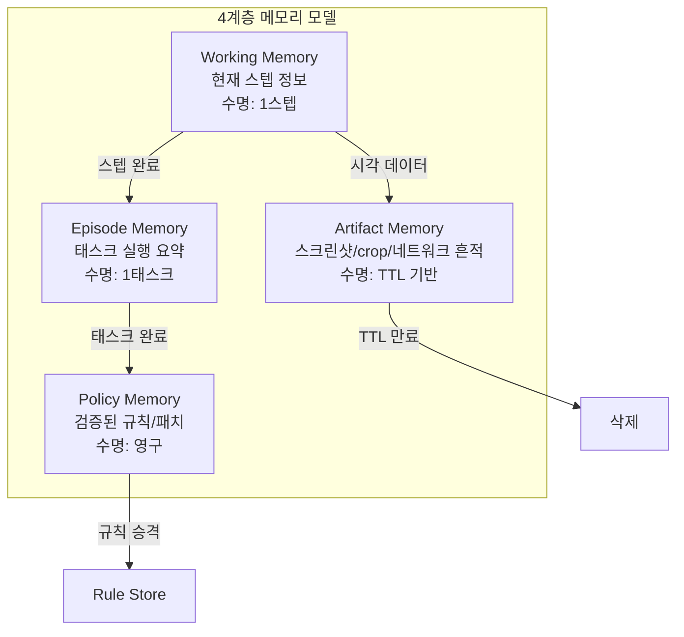
```mermaid
graph TD
    subgraph Memory["4계층 메모리 모델"]
        W["Working Memory<br/>현재 스텝 정보<br/>수명: 1스텝"]
        Ep["Episode Memory<br/>태스크 실행 요약<br/>수명: 1태스크"]
        Po["Policy Memory<br/>검증된 규칙/패치<br/>수명: 영구"]
        Ar["Artifact Memory<br/>스크린샷/crop/네트워크 흔적<br/>수명: TTL 기반"]
    end

    W -->|스텝 완료| Ep
    Ep -->|태스크 완료| Po
    W -->|시각 데이터| Ar
    Ar -->|TTL 만료| Delete[삭제]
    Po -->|규칙 승격| RS[Rule Store]
```

| 계층 | 내용 | 수명 | 크기 제한 |
|------|------|------|----------|
| **Working** | 현재 화면 DOM 요약, 실행 중인 스텝, 후보 목록 | 1 스텝 | ~2K tokens |
| **Episode** | 완료 스텝 요약, 실패 이력, 핵심 발견 | 1 태스크 | ~5K tokens |
| **Policy** | 검증된 규칙, 사이트별 셀렉터 패턴, 학습된 동의어 | 영구 | DB 저장 |
| **Artifact** | 스크린샷, crop 이미지, 네트워크 로그 | TTL 기반 (24h~7d) | 디스크 |

### 10.2 컨텍스트 관리 3단계

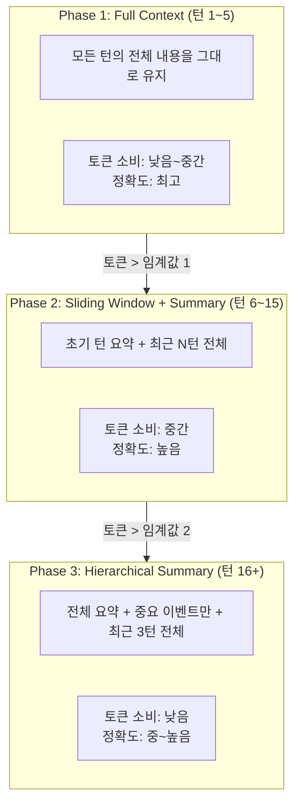
```mermaid
graph TD
    subgraph Phase1["Phase 1: Full Context (턴 1~5)"]
        F1[모든 턴의 전체 내용을 그대로 유지]
        F1Note["토큰 소비: 낮음~중간<br/>정확도: 최고"]
    end

    subgraph Phase2["Phase 2: Sliding Window + Summary (턴 6~15)"]
        F2[초기 턴 요약 + 최근 N턴 전체]
        F2Note["토큰 소비: 중간<br/>정확도: 높음"]
    end

    subgraph Phase3["Phase 3: Hierarchical Summary (턴 16+)"]
        F3[전체 요약 + 중요 이벤트만 + 최근 3턴 전체]
        F3Note["토큰 소비: 낮음<br/>정확도: 중~높음"]
    end

    Phase1 -->|"토큰 > 임계값 1"| Phase2
    Phase2 -->|"토큰 > 임계값 2"| Phase3
```

### 10.3 컨텍스트 구조

```json
{
  "context": {
    "task_summary": "네이버 쇼핑에서 핸드백 검색 → 인기순 정렬 → 50만원 이하 → 평점 4.7+ → 2030대 추천",

    "completed_steps": [
      {"step": 1, "action": "goto shopping.naver.com", "result": "success"},
      {"step": 2, "action": "search '핸드백'", "result": "success", "key_finding": "42,310건 검색됨"},
      {"step": 3, "action": "sort by 인기순", "result": "success", "method": "R_rule_match"}
    ],

    "current_state": {
      "url": "https://search.shopping.naver.com/search?sort=rel&query=핸드백",
      "page_type": "product_list",
      "active_sort": "인기순",
      "active_filters": [],
      "products_loaded": 40
    },

    "recent_turns_full": [
      {"turn": 8, "action": "...", "E_output": "...", "L_decision": "...", "V_result": "..."}
    ],

    "important_events": [
      {"turn": 4, "event": "쿠키 팝업 닫힘 (R 처리)"},
      {"turn": 6, "event": "가격 필터 UI 미존재 → 데이터 후처리로 전환"}
    ],

    "learned_patterns": [
      {"site": "shopping.naver.com", "pattern": "sort_tab_selector", "selector": ".subFilter_sort__..."}
    ]
  }
}
```

### 10.4 요약 전략

| 요약 대상 | 요약 방법 | 보존 항목 |
|-------|-------|-------|
| 완료된 스텝 | 1줄 요약 (액션 + 결과) | 핵심 발견, 실패 이유 |
| Extractor 출력 | 삭제 (이미 소비됨) | — |
| LLM 대화 | 결정 결과만 보존 | 선택된 eid + 이유 |
| 검증 결과 | 성공/실패 + 사유만 | 실패 패턴 |
| 스크린샷 | Artifact Memory로 이관 (TTL 기반) | — |


---

## 11. 실행 플로우 상세 설계

### 11.1 전체 실행 사이클

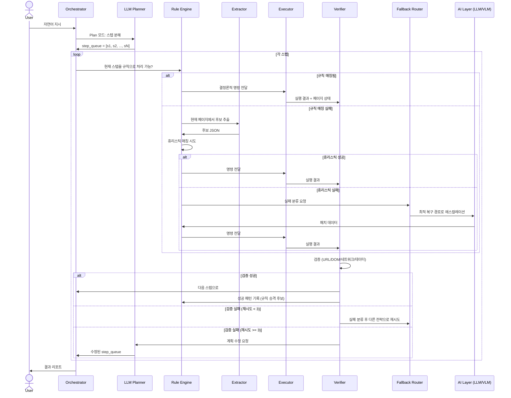
```mermaid
sequenceDiagram
    actor User
    participant Orch as Orchestrator
    participant L as LLM Planner
    participant R as Rule Engine
    participant E as Extractor
    participant X as Executor
    participant V as Verifier
    participant F as Fallback Router
    participant AI as AI Layer (LLM/VLM)

    User->>Orch: 자연어 지시
    Orch->>L: Plan 모드: 스텝 분해
    L->>Orch: step_queue = [s1, s2, ..., sN]

    loop 각 스텝
        Orch->>R: 현재 스텝을 규칙으로 처리 가능?

        alt 규칙 매칭됨
            R->>X: 결정론적 명령 전달
            X->>V: 실행 결과 + 페이지 상태
        else 규칙 매칭 실패
            R->>E: 현재 페이지에서 후보 추출
            E->>R: 후보 JSON
            R->>R: 휴리스틱 매칭 시도

            alt 휴리스틱 성공
                R->>X: 명령 전달
                X->>V: 실행 결과
            else 휴리스틱 실패
                R->>F: 실패 분류 요청
                F->>AI: 최적 복구 경로로 에스컬레이션
                AI->>R: 패치 데이터
                R->>X: 명령 전달
                X->>V: 실행 결과
            end
        end

        V->>V: 검증 (URL/DOM/네트워크/데이터)

        alt 검증 성공
            V->>Orch: 다음 스텝으로
            V->>R: 성공 패턴 기록 (규칙 승격 후보)
        else 검증 실패 (재시도 < 3)
            V->>F: 실패 분류 후 다른 전략으로 재시도
        else 검증 실패 (재시도 >= 3)
            V->>L: 계획 수정 요청
            L->>Orch: 수정된 step_queue
        end
    end

    Orch->>User: 결과 리포트
```

### 11.2 단일 액션의 내부 처리 흐름

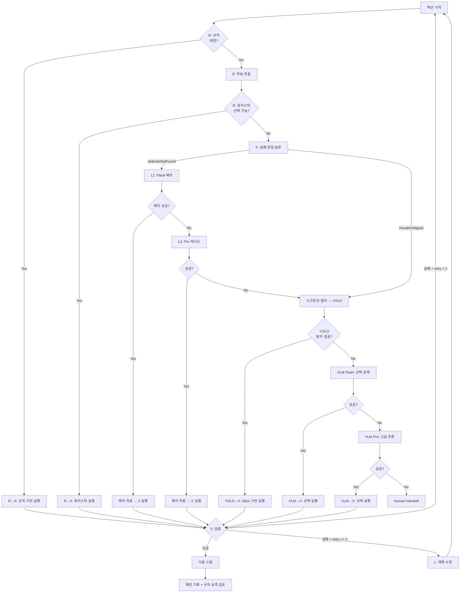
```mermaid
flowchart TD
    Start[액션 시작] --> CheckRule{R: 규칙<br/>매칭?}

    CheckRule -->|Yes| ExecRule[R→X: 규칙 기반 실행]
    CheckRule -->|No| Extract[E: 후보 추출]

    Extract --> Heuristic{R: 휴리스틱<br/>선택 가능?}
    Heuristic -->|Yes| ExecHeur[R→X: 휴리스틱 실행]
    Heuristic -->|No| Classify[F: 실패 유형 분류]

    Classify -->|SelectorNotFound| LLMFlash[L1: Flash 패치]
    Classify -->|VisualAmbiguity| Screenshot[스크린샷 캡처 → YOLO]

    LLMFlash --> FlashConf{패치 성공?}
    FlashConf -->|Yes| ExecFlash[패치 적용 → X 실행]
    FlashConf -->|No| LLMPro[L2: Pro 재시도]

    LLMPro --> ProConf{성공?}
    ProConf -->|Yes| ExecPro[패치 적용 → X 실행]
    ProConf -->|No| Screenshot

    Screenshot --> YoloTry{YOLO<br/>탐지 성공?}
    YoloTry -->|Yes| ExecYolo[YOLO→X: bbox 기반 실행]
    YoloTry -->|No| VLMFlash[VLM Flash: 선택 문제]

    VLMFlash --> VFlashConf{성공?}
    VFlashConf -->|Yes| ExecVFlash[VLM→X: 선택 실행]
    VFlashConf -->|No| VLMPro[VLM Pro: 고급 추론]

    VLMPro --> VProConf{성공?}
    VProConf -->|Yes| ExecVPro[VLM→X: 선택 실행]
    VProConf -->|No| Human[Human Handoff]

    ExecRule & ExecHeur & ExecFlash & ExecPro & ExecYolo & ExecVFlash & ExecVPro --> Verify{V: 검증}

    Verify -->|성공| Done[다음 스텝]
    Verify -->|실패 + retry < 3| Start
    Verify -->|실패 + retry >= 3| Replan[L: 계획 수정]
    Replan --> Start

    Done --> Learn[패턴 기록 + 규칙 승격 검토]
```


---

## 12. 예외 상황 분류 및 대응 매트릭스

### 12.1 대분류 체계

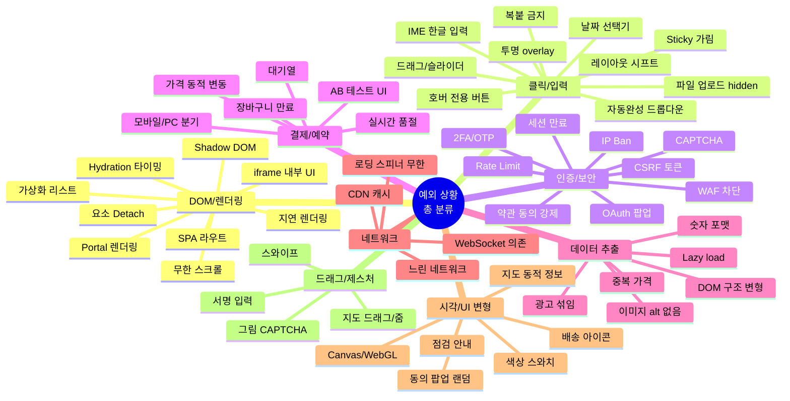
```mermaid
mindmap
  root((예외 상황<br/>총 분류))
    DOM/렌더링
      iframe 내부 UI
      Shadow DOM
      Portal 렌더링
      지연 렌더링
      가상화 리스트
      무한 스크롤
      SPA 라우트
      Hydration 타이밍
      요소 Detach
    클릭/입력
      투명 overlay
      Sticky 가림
      레이아웃 시프트
      호버 전용 버튼
      IME 한글 입력
      자동완성 드롭다운
      파일 업로드 hidden
      드래그/슬라이더
      날짜 선택기
      복붙 금지
    인증/보안
      2FA/OTP
      세션 만료
      CSRF 토큰
      OAuth 팝업
      약관 동의 강제
      Rate Limit
      CAPTCHA
      WAF 차단
      IP Ban
    결제/예약
      실시간 품절
      가격 동적 변동
      장바구니 만료
      대기열
      AB 테스트 UI
      모바일/PC 분기
    데이터 추출
      Lazy load
      숫자 포맷
      중복 가격
      이미지 alt 없음
      광고 섞임
      DOM 구조 변형
    네트워크
      느린 네트워크
      로딩 스피너 무한
      WebSocket 의존
      CDN 캐시
    시각/UI 변형
      Canvas/WebGL
      지도 동적 정보
      색상 스와치
      배송 아이콘
      동의 팝업 랜덤
      점검 안내
    드래그/제스처
      지도 드래그/줌
      스와이프
      그림 CAPTCHA
      서명 입력
```

### 12.2 상세 예외 대응 매트릭스

아래는 총 **95+ 예외 상황**을 8개 카테고리로 정리하고, 각각에 대한 감지 방법과 대응 전략을 포함한다.

#### A. DOM/렌더링/프레임 관련 (15건)

| #   | 예외 상황 | 감지 방법 | 대응 전략 | 처리 모듈 |
|-----|-------|-------|-------|-------|
| A1  | iframe 내부에 핵심 UI | `querySelectorAll('iframe')` + 타겟 미발견 | iframe 내부 DOM 접근 → cross-origin이면 별도 핸들링 | R → X |
| A2  | Cross-origin iframe | `frame.contentDocument` 접근 에러 | Playwright `frame()` API, 불가 시 URL 직접 이동 | X |
| A3  | Shadow DOM 내부 요소 | 일반 selector 미발견 + `shadowRoot` 존재 | `pierce/` selector 또는 `evaluateHandle` | E → X |
| A4  | Portal 렌더링 (body 하위) | 버튼 클릭 후 메뉴가 근처 DOM에 없음 | body 전체 스캔, `[class*=portal]` 탐색 | E |
| A5  | 지연 렌더링 | 요소가 일정 시간 후에야 출현 | `waitForSelector(timeout)` + 점진적 증가 | X |
| A6  | Virtualized List | 보이는 항목 << 전체, 스크롤 시 DOM 교체 | 스크롤 순차 추출 + 중복 제거 | E → X |
| A7  | 무한 스크롤 | 페이지네이션 없음 + 하단에서 새 콘텐츠 | sentinel 감지 + 스크롤 반복 + 충분 조건 도달 시 중단 | R → X |
| A8  | SPA 라우트 변경 | URL 변경 but `navigation` 미발생 | `waitForURL` 또는 DOM 변화 감시 | X |
| A9  | Hydration 타이밍 | SSR HTML 보이지만 클릭 무반응 | hydration 완료 신호 대기 (`__NEXT_DATA__` 등) | X |
| A10 | 요소 Detach | "element detached" 에러 | 재시도: 요소 다시 찾기 → 클릭 (최대 3회) | R → X |
| A11 | `display:none` 전환 | `isVisible()=false` | 트리거 액션 후 `waitForSelector({state:'visible'})` | R → X |
| A12 | `opacity:0` + `pointer-events:none` | 요소 클릭 불가 | 스타일 변경 트리거 대기 | E → X |
| A13 | 오프스크린 위치 | bbox가 뷰포트 밖 | `scrollIntoView` 후 클릭 | X |
| A14 | Back/Forward cache 이상 | 뒤로가기 후 핸들러 미작동 | `page.reload()` 후 재시작 | R → X |
| A15 | CSP 제한 | 인라인 스크립트 차단 | Playwright API만 사용 | X |

#### B. 클릭/입력 인터랙션 (18건)

| #   | 예외 상황 | 감지 방법 | 대응 전략 | 처리 모듈 |
|-----|-------|-------|-------|-------|
| B1  | 투명 overlay 클릭 가로채기 | 클릭 효과 없음 + overlay 감지 | overlay 닫기 또는 `{force:true}` | R → X |
| B2  | Sticky header/footer 가림 | 클릭 대상 불일치 | `scrollIntoView({block:'center'})` + 오프셋 | R → X |
| B3  | Layout Shift (CLS) | 클릭 시점 위치 변경 | 클릭 직전 좌표 재계산 + 안정화 대기 | X |
| B4  | 더블클릭만 동작 | 단일 클릭 무반응 | `dblclick()` 시도 | R → X |
| B5  | 롱프레스만 동작 | 단일 클릭 무반응 | `mouse.down → wait → mouse.up` | R → X |
| B6  | 호버 전용 버튼 | 평소 hidden | `hover()` 후 `waitForSelector` | R → E → X |
| B7  | 우클릭 컨텍스트 메뉴 | 특정 기능 우클릭만 접근 | `click({button:'right'})` | R → X |
| B8  | 키보드 단축키만 가능 | 클릭 대상 없음 | `keyboard.press()` | R → X |
| B9  | React Controlled Input | `type()` 무효 | `fill()` + `dispatchEvent('input')` | X |
| B10 | IME 한글 입력 문제 | 한글 조합 이벤트 누락 | `fill()` 사용 + composition 처리 | X |
| B11 | 자동완성 dropdown 방해 | 타이핑 중 dropdown 출현 | Escape 키로 닫기 후 입력 계속 | R → X |
| B12 | Hidden file upload | `display:none` input | `setInputFiles()` API | X |
| B13 | 드래그 앤 드롭 | 카드 이동/파일 업로드 | `dragTo()` → 실패 시 이벤트 수동 디스패치 | X |
| B14 | 슬라이더 | range input/커스텀 | 입력창 대체 → `aria-valuenow` → 마우스 드래그 | R → X |
| B15 | 캘린더 Date Picker | 월 이동, 비활성 날짜 | 월 이동 화살표 반복 + 날짜 셀 클릭 | R → X |
| B16 | 주소/전화 포맷 마스킹 | 입력 값 자동 변환 | 포맷 맞춰 입력 또는 `fill()` + 이벤트 | R → X |
| B17 | 복사/붙여넣기 금지 | `paste` 이벤트 차단 | `keyboard.type()` 한 글자씩 | X |
| B18 | 자동화 감지 | `navigator.webdriver` 체크 | stealth 플러그인 + 패치 | X(설정) |

#### C. 인증/세션/보안 (14건)

| #   | 예외 상황 | 감지 방법 | 대응 전략 | 처리 모듈 |
|-----|-------|-------|-------|-------|
| C1  | 2FA (SMS/Email OTP) | OTP 입력 화면 감지 | Human Handoff | H |
| C2  | 비정상 로그인 감지 | "새 기기", "위치 확인" 화면 | Human Handoff | H |
| C3  | 세션 만료 리다이렉트 | URL에 "login" + 이전 URL 다름 | 저장 쿠키 재로그인 → 실패 시 Human | R → H |
| C4  | CSRF 토큰 만료 | form submit 시 403/419 | 페이지 새로고침 → 새 토큰 재시도 | R → X |
| C5  | SameSite 쿠키 이슈 | cross-site 인증 깨짐 | 동일 도메인 컨텍스트 유지 | X(설정) |
| C6  | OAuth 팝업 | 새 창 + OAuth URL | `context.waitForEvent('page')` | X |
| C7  | 약관동의/비밀번호변경 강제 | 특정 화면 리다이렉트 | 약관 자동 처리(R) / 비밀번호는 Human | R → H |
| C8  | Rate Limit (429) | HTTP 429 | 지수 백오프 대기 → 재시도 | R |
| C9  | IP Ban | 모든 요청 차단/403 | 프록시 로테이션 또는 중단 | R → H |
| C10 | CAPTCHA | 캡차 위젯 DOM 감지 | Human Handoff + 대기 | H |
| C11 | Cloudflare Turnstile | "Checking your browser" | 대기(자동 해결) → 실패 시 Human | R → H |
| C12 | WAF 차단 | 특정 행동 후 403 | 속도 줄이기 + 행동 다양화 | R |
| C13 | 브라우저 지문 탐지 | headless 패턴 차단 | stealth mode + viewport/UA 설정 | X(설정) |
| C14 | 휴면계정 활성화 요구 | 장기 미접속 특별 화면 | Human Handoff | H |

#### D. 결제/예약/동적 변동 (10건)

| #   | 예외 상황 | 감지 방법 | 대응 전략 | 처리 모듈 |
|-----|-------|-------|-------|-------|
| D1  | 실시간 품절 | "품절", "sold out" | 다음 대안 상품 이동 | R |
| D2  | 가격 동적 변동 | 옵션 선택 시 가격 변경 | 옵션 변경 후 가격 재추출 | E → R |
| D3  | 장바구니→결제 실패 | 결제 단계 에러 | 에러 유형별 대응 | R → H |
| D4  | 예약 좌석 홀드 만료 | 타이머 만료 알림 | 빠른 재시도 / 사용자 알림 | R |
| D5  | 대기열 (트래픽 폭주) | 대기열 UI/텍스트 | 주기적 상태 확인 + 타임아웃 | R |
| D6  | AB 테스트 UI 변형 | 동일 사이트 다른 UI | 복수 셀렉터 → 순차 시도 → L | R → L |
| D7  | 모바일/데스크톱 분기 | viewport 크기별 다른 DOM | 데스크톱 viewport 고정 | X(설정) |
| D8  | 국가/언어/통화 분기 | IP/설정별 다른 라벨 | 다국어 동의어 + locale 고정 | R → X |
| D9  | 쿠폰/할인 모달 | 결제 중 쿠폰 팝업 | 닫기/적용 (사용자 설정) | R |
| D10 | 결제 수단 선택 복잡 | 탭/아코디언/라디오 혼합 | 패턴별 규칙 + L | R → L |

#### E. 데이터 추출 문제 (12건)

| #   | 예외 상황 | 감지 방법 | 대응 전략 | 처리 모듈 |
|-----|-------|-------|-------|-------|
| E1  | Lazy-load | 초기 일부 데이터만 | 스크롤 반복 + 누적 | R → X |
| E2  | 숫자 포맷 다양성 | "1.2만", "12,345", "₩50,000" | 정규식 파서 (다국어) | E |
| E3  | 복수 가격 | 정가/할인가/쿠폰가 | 우선순위: 실결제가 > 할인가 > 정가 | E → R |
| E4  | 이미지 alt 없음 | `alt=""` | 부모/형제 텍스트 → VLM | E → V |
| E5  | 광고 카드 섞임 | "광고", "AD", "스폰서" | 필터링 규칙 | R |
| E6  | DOM 구조 비균일 | 카테고리별 다른 카드 | 복수 selector + 적응형 추출 | E |
| E7  | 가격 정보 없음 | "가격 문의", "견적요청" | 스킵 또는 별도 표기 | R |
| E8  | 평점/리뷰 없음 | 평점 요소 미존재 | null 처리 + 필터 제외/보류 | E → R |
| E9  | 동일 상품 옵션별 중복 | 같은 상품 다른 색상/사이즈 | 상품 ID/URL 중복 제거 | E → R |
| E10 | 로그인 후 가격 노출 | "로그인 후 확인" | 로그인 상태면 진행, 아니면 스킵 | R |
| E11 | 리뷰가 별도 API | 초기 로드 미포함 | 네트워크 감시로 API 캡처 | X → E |
| E12 | 텍스트가 이미지로 렌더링 | 가격/정보가 이미지 | OCR (VLM) | V |

#### F. 네트워크/성능/타이밍 (8건)

| #   | 예외 상황 | 감지 방법 | 대응 전략 | 처리 모듈 |
|-----|-------|-------|-------|-------|
| F1  | 느린 네트워크 timeout | 요청 timeout | timeout 증가 + 재시도 | R |
| F2  | 로딩 스피너 무한 | N초 이상 지속 | 새로고침 → 재시도 | R → X |
| F3  | API OK but 렌더 지연 | 응답 OK, DOM 미갱신 | DOM 변화 대기 | X |
| F4  | WebSocket 의존 | REST 없이 WS 갱신 | WS 감시 또는 DOM polling | X |
| F5  | CDN 캐시 | 예상과 다른 콘텐츠 | 강제 새로고침 | X |
| F6  | 브라우저별 차이 | 동작 차이 | Chromium 고정 | X(설정) |
| F7  | Headless 전용 버그 | headless 다른 동작 | headed 모드 전환 | X(설정) |
| F8  | 메모리 부족 | 브라우저 크래시 | 주기적 탭 정리 + 재시작 | X |

#### G. 시각/UI 특수 요소 (12건)

| #   | 예외 상황 | 감지 방법 | 대응 전략 | 처리 모듈 |
|-----|-------|-------|-------|-------|
| G1  | Canvas/WebGL | DOM 없고 canvas만 | 스크린샷 + VLM 또는 내부 API 인터셉트 | V → E |
| G2  | 지도 동적 정보 | 줌/팬 시 마커 변경 | 리스트 패널 DOM 활용 | E → R |
| G3  | 색상 스와치 | 텍스트 없는 색상 칩 | `aria-label` → hover tooltip → VLM | E → V |
| G4  | 배송 아이콘/뱃지 | sprite/CSS 배경 | `alt`, `sr-only`, 부모 텍스트 → VLM | E → V |
| G5  | 스크롤 시 헤더 변형 | 스크롤별 다른 header | 스크롤 위치별 selector 분기 | R → E |
| G6  | "더보기" 접기/펼치기 | 숨겨진 필터/옵션 | "더보기" 클릭 후 추출 | R → E → X |
| G7  | 툴팁 화면 밖 렌더링 | viewport 밖 | `scrollIntoView` 후 hover 재시도 | X |
| G8  | 랜덤 동의 팝업 | 쿠키/국가/시간별 | 알려진 팝업 selector 목록 + 주기적 감지 | R |
| G9  | 점검/휴무 안내 | "점검 중" 텍스트 | 작업 중단 + 사용자 알림 + 재시도 스케줄 | R → H |
| G10 | 프로모션 전면 배너 | 전체 화면 overlay | 닫기 버튼 탐색 + 클릭 | R |
| G11 | 동영상 자동재생 | 비디오 방해 | 일시정지 또는 무시 | R → X |
| G12 | 다크모드/테마 변형 | 색상/대비 변경 | selector 기반 (시각 의존 최소화) | E |

#### H. 드래그/제스처/특수 입력 (6건)

| #   | 예외 상황 | 감지 방법 | 대응 전략 | 처리 모듈 |
|-----|-------|-------|-------|-------|
| H1  | 지도 드래그/핀치 줌 | 지도 이동/확대 | `mouse.wheel` + `mouse.move` 또는 API 파라미터 | X |
| H2  | 스와이프 (모바일) | 좌우 이미지 변경 | `touchstart/touchmove/touchend` | X |
| H3  | 그림 그리기 CAPTCHA | 패턴/퍼즐 | Human Handoff | H |
| H4  | 서명 입력 (canvas) | 서명란 필기 | canvas 마우스 경로 → Human (품질) | X → H |
| H5  | 키보드 네비게이션 전용 | Tab/Arrow만 접근 | 키보드 시퀀스 네비게이션 | R → X |
| H6  | 음성/생체 인증 | 음성/지문/Face ID | Human Handoff | H |


---

## 13. 네이버 쇼핑 시나리오 워크스루

### 13.1 사용자 요청

> "네이버에서 핸드백을 검색하고, 상품 검색을 눌러서, 인기 있는 것들 중에서 50만원 이하, 평점 4.7 이상인 것 중에서 2030대에 어울릴만한 거 찾아줘"

### 13.2 L(Planner)의 초기 계획

```json
{
  "task_id": "naver_handbag_001",
  "user_intent": {
    "query": "핸드백",
    "sort": "인기순",
    "max_price": 500000,
    "min_rating": 4.7,
    "audience": "2030대",
    "output": "추천 3~5개 + 이유"
  },
  "steps": [
    {"id": "s1", "action": "navigate", "target": "https://shopping.naver.com", "verify": "url_match"},
    {"id": "s2", "action": "search", "query": "핸드백", "verify": "results_exist"},
    {"id": "s3", "action": "sort", "value": "인기순", "verify": "sort_active"},
    {"id": "s4", "action": "filter_price", "max": 500000, "method": "ui_or_post", "verify": "price_range"},
    {"id": "s5", "action": "extract_products", "count": 40, "fields": ["title","price","rating","brand","link","thumbnail"]},
    {"id": "s6", "action": "filter_rating", "min": 4.7, "method": "post_extraction"},
    {"id": "s7", "action": "recommend", "criteria": "2030대 취향", "top_n": 5, "requires_llm": true}
  ]
}
```

### 13.3 스텝별 실행 상세

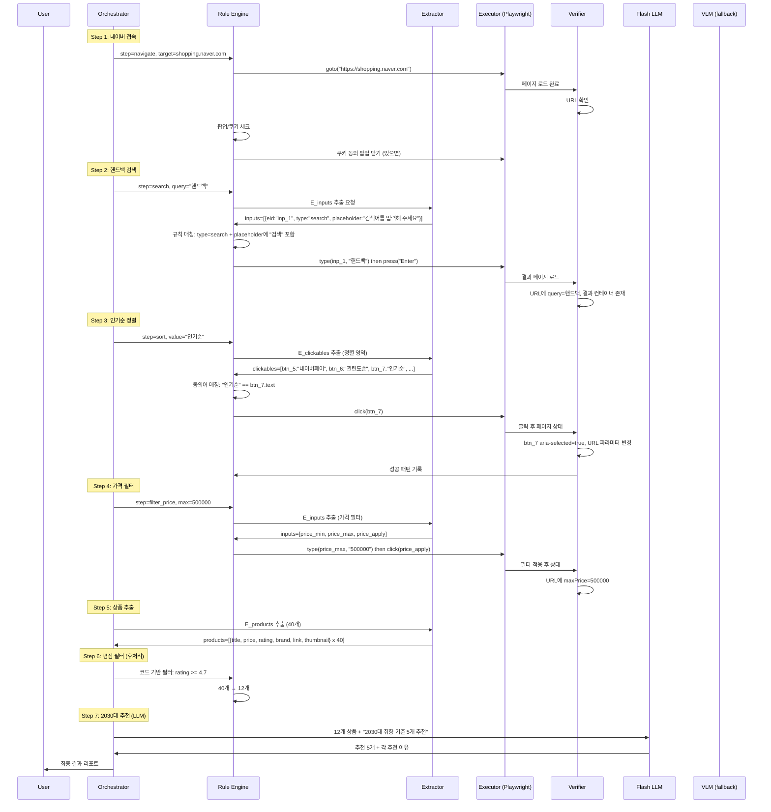
```mermaid
sequenceDiagram
    participant U as User
    participant O as Orchestrator
    participant R as Rule Engine
    participant E as Extractor
    participant X as Executor (Playwright)
    participant V as Verifier
    participant L1 as Flash LLM
    participant VLM as VLM (fallback)

    Note over O: Step 1: 네이버 접속
    O->>R: step=navigate, target=shopping.naver.com
    R->>X: goto("https://shopping.naver.com")
    X->>V: 페이지 로드 완료
    V->>V: URL 확인
    R->>R: 팝업/쿠키 체크
    R->>X: 쿠키 동의 팝업 닫기 (있으면)

    Note over O: Step 2: 핸드백 검색
    O->>R: step=search, query="핸드백"
    R->>E: E_inputs 추출 요청
    E->>R: inputs=[{eid:"inp_1", type:"search", placeholder:"검색어를 입력해 주세요"}]
    R->>R: 규칙 매칭: type=search + placeholder에 "검색" 포함
    R->>X: type(inp_1, "핸드백") then press("Enter")
    X->>V: 결과 페이지 로드
    V->>V: URL에 query=핸드백, 결과 컨테이너 존재

    Note over O: Step 3: 인기순 정렬
    O->>R: step=sort, value="인기순"
    R->>E: E_clickables 추출 (정렬 영역)
    E->>R: clickables=[btn_5:"네이버페이", btn_6:"관련도순", btn_7:"인기순", ...]
    R->>R: 동의어 매칭: "인기순" == btn_7.text
    R->>X: click(btn_7)
    X->>V: 클릭 후 페이지 상태
    V->>V: btn_7 aria-selected=true, URL 파라미터 변경
    V->>R: 성공 패턴 기록

    Note over O: Step 4: 가격 필터
    O->>R: step=filter_price, max=500000
    R->>E: E_inputs 추출 (가격 필터)
    E->>R: inputs=[price_min, price_max, price_apply]
    R->>X: type(price_max, "500000") then click(price_apply)
    X->>V: 필터 적용 후 상태
    V->>V: URL에 maxPrice=500000

    Note over O: Step 5: 상품 추출
    O->>E: E_products 추출 (40개)
    E->>O: products=[{title, price, rating, brand, link, thumbnail} x 40]

    Note over O: Step 6: 평점 필터 (후처리)
    O->>R: 코드 기반 필터: rating >= 4.7
    R->>R: 40개 → 12개

    Note over O: Step 7: 2030대 추천 (LLM)
    O->>L1: 12개 상품 + "2030대 취향 기준 5개 추천"
    L1->>O: 추천 5개 + 각 추천 이유
    O->>U: 최종 결과 리포트
```

### 13.4 만약 Step 3에서 "인기순"을 못 찾았다면?

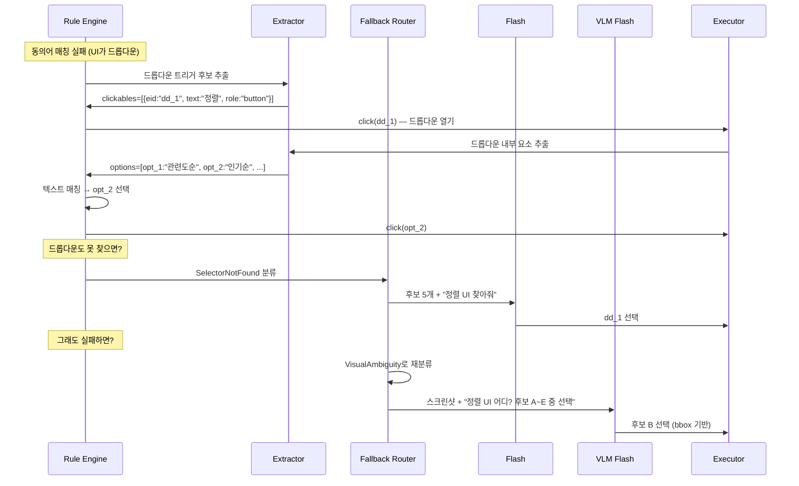
```mermaid
sequenceDiagram
    participant R as Rule Engine
    participant E as Extractor
    participant F as Fallback Router
    participant L1 as Flash
    participant VLM as VLM Flash
    participant X as Executor

    Note over R: 동의어 매칭 실패 (UI가 드롭다운)
    R->>E: 드롭다운 트리거 후보 추출
    E->>R: clickables=[{eid:"dd_1", text:"정렬", role:"button"}]
    R->>X: click(dd_1) — 드롭다운 열기
    X->>E: 드롭다운 내부 요소 추출
    E->>R: options=[opt_1:"관련도순", opt_2:"인기순", ...]
    R->>R: 텍스트 매칭 → opt_2 선택
    R->>X: click(opt_2)

    Note over R: 드롭다운도 못 찾으면?
    R->>F: SelectorNotFound 분류
    F->>L1: 후보 5개 + "정렬 UI 찾아줘"
    L1->>X: dd_1 선택

    Note over R: 그래도 실패하면?
    F->>F: VisualAmbiguity로 재분류
    F->>VLM: 스크린샷 + "정렬 UI 어디? 후보 A~E 중 선택"
    VLM->>X: 후보 B 선택 (bbox 기반)
```


---

## 14. 데이터 스키마 설계

### 14.1 핵심 데이터 모델

```json
// TaskDefinition
{
  "task_id": "string",
  "created_at": "ISO8601",
  "user_instruction": "string",
  "parsed_intent": {
    "query": "string",
    "sort": "string",
    "filters": [{"field": "string", "op": "string", "value": "any"}],
    "output_type": "recommend|extract|action",
    "audience": "string?"
  },
  "steps": ["StepDefinition[]"],
  "status": "planning|running|paused|completed|failed",
  "context": "ContextState",
  "budget": {
    "max_cost": 0.05,
    "current_cost": 0.0,
    "tier2_calls": 0,
    "vision_calls": 0
  }
}

// StepDefinition
{
  "step_id": "string",
  "action": "navigate|search|sort|filter|extract|recommend|click|type|scroll",
  "params": {},
  "verify": "VerifyCondition",
  "status": "pending|running|success|failed|skipped",
  "attempts": 0,
  "max_attempts": 3,
  "escalation_history": ["EscalationRecord[]"],
  "failure_code": "SelectorNotFound|NotInteractable|StateNotChanged|VisualAmbiguity|..."
}

// EscalationRecord
{
  "tier": "R|L1|L2|YOLO|VLM1|VLM2|H",
  "input": {},
  "output": {},
  "patch_type": "selector_fix|param_change|rule_add|strategy_switch",
  "success": true,
  "tokens_used": 0,
  "latency_ms": 0,
  "cost_usd": 0.0,
  "timestamp": "ISO8601"
}

// ExtractedElement
{
  "eid": "string",
  "type": "input|button|link|tab|option|card|icon|image",
  "text": "string?",
  "role": "string?",
  "aria_label": "string?",
  "href": "string?",
  "bbox": [x1, y1, x2, y2],
  "visible": true,
  "parent_context": "string?",
  "attributes": {}
}

// ProductData
{
  "product_id": "string",
  "title": "string",
  "price": {"original": 0, "discounted": 0, "currency": "KRW"},
  "rating": {"score": 0.0, "count": 0},
  "brand": "string?",
  "shop": "string?",
  "url": "string",
  "thumbnail": "string?",
  "delivery": "string?",
  "color_options": ["string[]?"],
  "is_ad": false,
  "rank": 0
}

// RuleDefinition
{
  "rule_id": "string",
  "name": "string",
  "trigger": {
    "site_pattern": "regex",
    "page_context": "string",
    "intent_keywords": ["string[]"]
  },
  "synonyms": ["string[]"],
  "strategy": ["StrategyStep[]"],
  "success_count": 0,
  "last_used": "ISO8601",
  "auto_promoted": false,
  "source": "manual|llm_promoted|gepa_optimized"
}

// ImageBatch
{
  "batch_id": "string",
  "canvas_size": [width, height],
  "tiles": [{
    "tile_id": "string",
    "source_eid": "string",
    "source_bbox_page": [x1, y1, x2, y2],
    "tile_bbox_canvas": [x1, y1, x2, y2],
    "scale": 1.0
  }],
  "purpose": "object_detection|element_selection|layout_understanding"
}
```

### 14.2 패턴 DB 스키마

```json
// PatternRecord — LLM 성공 패턴을 저장하여 규칙 승격 후보로 관리
{
  "pattern_id": "string",
  "site": "string (도메인)",
  "page_type": "search_results|product_detail|cart|checkout|login|...",
  "intent": "string (어떤 의도에서 발생)",
  "selector_used": "string (성공한 CSS selector)",
  "text_matched": "string (매칭된 텍스트)",
  "method": "R|L1|L2|VLM",
  "success_count": 0,
  "fail_count": 0,
  "last_success": "ISO8601",
  "promoted_to_rule": false,
  "promotion_threshold": 3
}
```


---

## 15. 비용 모델 및 최적화

### 15.1 단일 태스크 비용 시뮬레이션 (네이버 쇼핑 예시)

| 스텝  | 처리 모듈 | LLM 호출 수 | 추정 토큰 | 추정 비용 |
|-----|-------|----------|-------|-------|
| 1. 접속 | R+X   | 0        | 0     | $0    |
| 2. 검색 | R+E+X | 0        | 0     | $0    |
| 3. 정렬 | R+E+X | 0 (규칙 매칭) | 0     | $0    |
| 4. 가격 필터 | R+E+X | 0        | 0     | $0    |
| 5. 데이터 추출 | E     | 0        | 0     | $0    |
| 6. 평점 필터 | R (코드) | 0        | 0     | $0    |
| 7. 추천 | L1 (Flash) | 1        | ~800 | ~$0.0001 |
| **합계** |       | **1**    | **~800** | **~$0.0001** |

만약 규칙 없이 **매 스텝마다 LLM을 호출**했다면:

| 스텝  | LLM 호출 수 | 추정 토큰 | 추정 비용 |
|-----|----------|-------|-------|
| 1~6 | 6 (각 스텝) | ~6000 | ~$0.006 |
| 7   | 1        | ~800 | ~$0.0001 |
| **합계** | **7**    | **~6800** | **~$0.007** |

**절감 효과**: 규칙 우선 접근으로 약 **98.6% 비용 절감**.

### 15.2 Vision 호출 비용 (에스컬레이션 발생 시)

| 시나리오 | 추가 호출 | 추가 비용 | 발생 확률 |
|------|-------|-------|-------|
| 정렬 UI가 이미지/아이콘만 | YOLO 1회 | ~$0.0005 | ~10% |
| YOLO 실패 → VLM Flash | +VLM 1회 | +$0.005 | ~5%  |
| VLM Flash 실패 → VLM Pro | +VLM Pro 1회 | +$0.02 | ~1%  |

**기대 비용 (가중 평균)**: $0.0001 + (0.1 × $0.0005) + (0.05 × $0.005) + (0.01 × $0.02) = **~$0.0007/태스크**

### 15.3 이미지 배칭 절감 효과

| 상황  | 개별 호출 | 배칭 호출 | 절감률 |
|-----|-------|-------|-----|
| 상품 10개 썸네일 분석 | 10 × $0.005 = $0.05 | 1 × $0.005 = $0.005 | 90% |
| UI 요소 5개 식별 | 5 × $0.005 = $0.025 | 1 × $0.005 = $0.005 | 80% |
| 색상 스와치 8개 판별 | 8 × $0.005 = $0.04 | 1 × $0.005 = $0.005 | 87.5% |

### 15.4 비용 공식

```
TotalCost = TextTokenCost + VisionInferenceCost + BrowserComputeCost + RetryOverhead

TextTokenCost = Σ (tier_i_input_tokens × tier_i_input_price + tier_i_output_tokens × tier_i_output_price)
VisionInferenceCost = Σ (yolo_local_cost + vlm_calls × vlm_price_per_call)
BrowserComputeCost = session_duration × compute_rate
RetryOverhead = retry_count × avg_retry_cost
```

### 15.5 비용 최적화 규칙

1. LLM 입력은 **최소 JSON만** 전달 (E의 요약 JSON, raw HTML 절대 금지)
2. 전체 스크린샷 대신 **후보 crop + 배칭** 우선
3. 고급 모델은 마지막 단계에서만 호출
4. 동일 실패 패턴은 **캐시된 패치 재사용** (Policy Memory 활용)
5. **예산 기반 라우팅**: 태스크별/월별 예산 초과 시 자동 다운그레이드


---

## 16. 보안 및 컴플라이언스

### 16.1 자격증명 관리

| 항목 | 정책 | 구현 |
|------|------|------|
| 로그인 비밀번호 | 코드/로그에 평문 저장 금지 | vault 또는 환경변수 분리 |
| API 키 | LLM 호출 키 암호화 저장 | 키 로테이션 정책 |
| 쿠키/토큰 | 세션 종료 시 자동 정리 | 브라우저 컨텍스트 격리 |

### 16.2 PII(개인정보) 마스킹

| 데이터 | 마스킹 방식 | 적용 시점 |
|--------|-----------|----------|
| 이름/전화 | `홍***` / `010-****-5678` | 로그 저장 전 |
| 주소 | 시/도만 보존 | 로그 저장 전 |
| 결제 정보 | 완전 마스킹 | 추출/전달 시 |

### 16.3 LLM 데이터 최소화

1. LLM에 전달하는 컨텍스트에 **PII 포함 금지**
2. 상품 데이터 중 개인정보 관련 필드는 마스킹 후 전달
3. 외부 LLM API 호출 시 **최소 필요 데이터만** 전송

### 16.4 법적/윤리적 준수

| 항목 | 정책 |
|------|------|
| CAPTCHA | 우회 자동화 금지, Human Handoff만 허용 |
| robots.txt | 대상 사이트의 robots.txt 준수 |
| 이용약관 | 자동화 금지 약관 사이트는 사전 확인 후 제외 |
| 요청 빈도 | 사이트별 rate limit 준수, 과도한 요청 자제 |
| 데이터 수집 | 수집 목적과 범위를 사전 정의, 불필요한 데이터 수집 금지 |


---

## 17. 운영 대시보드 및 알림

### 17.1 대시보드 메트릭

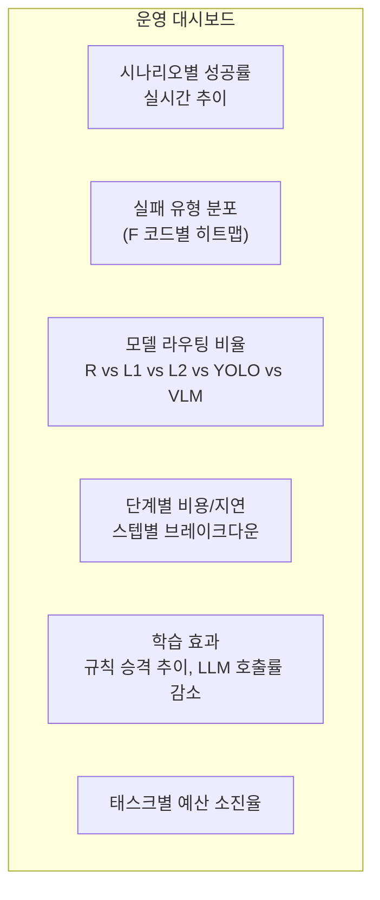
```mermaid
graph TD
    subgraph Dashboard["운영 대시보드"]
        M1["시나리오별 성공률<br/>실시간 추이"]
        M2["실패 유형 분포<br/>(F 코드별 히트맵)"]
        M3["모델 라우팅 비율<br/>R vs L1 vs L2 vs YOLO vs VLM"]
        M4["단계별 비용/지연<br/>스텝별 브레이크다운"]
        M5["학습 효과<br/>규칙 승격 추이, LLM 호출률 감소"]
        M6["태스크별 예산 소진율"]
    end
```

### 17.2 알림 조건

| 알림 | 조건 | 심각도 | 대응 |
|------|------|--------|------|
| CAPTCHA 급증 | 1시간 내 5회 이상 | 🔴 Critical | 요청 빈도 자동 감소 + 운영자 알림 |
| 특정 스텝 실패율 급증 | 실패율 50% 초과 (최근 10회) | 🟠 Warning | 해당 스텝 규칙 재점검 |
| 고비용 모델 사용 급증 | Tier2/VLM Pro 비율 30% 초과 | 🟡 Info | 규칙 커버리지 확인 |
| 대기열 장기화 | 단일 태스크 5분 이상 대기 | 🟠 Warning | 사용자 알림 |
| 월 예산 80% 도달 | 누적 비용 예산 대비 80% | 🟡 Info | 자동 다운그레이드 준비 |
| 규칙 승격 성공 | 새 규칙이 3회 연속 성공 | 🟢 Info | 운영자에게 보고 |


---

## 18. 품질 게이트 및 KPI

### 18.1 핵심 KPI

| KPI | 목표값 | 측정 방법 | 주기 |
|-----|--------|----------|------|
| **스텝 성공률** | ≥ 90% | V 검증 성공 / 전체 스텝 | 실시간 |
| **E2E 성공률** | ≥ 85% | 태스크 완료 / 전체 태스크 | 일간 |
| **LLM 호출률** | ≤ 30% | LLM 호출 스텝 / 전체 스텝 | 일간 |
| **실행당 비용** | ≤ $0.01 | TotalCost / 태스크 | 일간 |
| **Vision 고비용 진입률** | ≤ 10% | VLM Pro 호출 / 전체 Vision 호출 | 주간 |
| **Human Handoff 비율** | ≤ 5% | Handoff 발생 / 전체 태스크 | 주간 |
| **평균 실행 시간** | ≤ 60s | 태스크 시작~종료 | 일간 |
| **규칙 승격률** | 주 5건+ | 신규 규칙 승격 수 | 주간 |

### 18.2 품질 게이트 (릴리즈 기준)

```mermaid
flowchart LR
    Dev[개발] --> Gate1{스텝 성공률<br/>≥ 85%?}
    Gate1 -->|Pass| Staging[스테이징]
    Gate1 -->|Fail| Dev

    Staging --> Gate2{E2E 성공률<br/>≥ 80%?}
    Gate2 -->|Pass| Canary[카나리 배포<br/>10% 트래픽]
    Gate2 -->|Fail| Dev

    Canary --> Gate3{카나리 지표<br/>5% 이내 하락?}
    Gate3 -->|Pass| Prod[프로덕션<br/>100% 배포]
    Gate3 -->|Fail| Rollback[자동 롤백]
```

### 18.3 회귀 감지 및 자동 롤백

1. **프롬프트 회귀**: GEPA 최적화 후 성공률 5% 이상 하락 → 이전 프롬프트 버전으로 복귀
2. **규칙 회귀**: 승격된 규칙의 실패율이 30% 초과 → 해당 규칙 비활성화, LLM 폴백으로 복귀
3. **모델 회귀**: 모델 업데이트 후 전체 지표 하락 → 이전 모델 버전으로 롤백


---

## 19. 개발 로드맵

### 19.1 Phase 기반 개발 전략

```mermaid
gantt
    title 적응형 웹 자동화 엔진 개발 로드맵
    dateFormat  YYYY-MM-DD

    section Phase 1: Deterministic Core
    X(Executor) Playwright 래퍼          :p1a, 2026-03-01, 14d
    E(Extractor) 4종 구현                 :p1b, 2026-03-01, 21d
    R(Rule Engine) 기본 DSL + 규칙셋     :p1c, 2026-03-15, 14d
    V(Verifier) 기본 검증 로직            :p1d, 2026-03-22, 7d
    오케스트레이터 기본 루프               :p1e, 2026-03-29, 7d

    section Phase 2: Adaptive Fallback
    F(Fallback Router) 실패 분류          :p2f, 2026-04-05, 7d
    L(Planner) Flash 연동                 :p2a, 2026-04-05, 14d
    L(Planner) Pro 에스컬레이션           :p2b, 2026-04-12, 7d
    Select 모드 프롬프트 설계              :p2c, 2026-04-05, 14d
    컨텍스트 매니저 (4계층 메모리)          :p2d, 2026-04-19, 7d

    section Phase 3: Vision Integration
    YOLO 로컬 추론 연동                    :p3a, 2026-04-26, 14d
    이미지 배칭 시스템                      :p3b, 2026-04-26, 14d
    좌표 역추적 + IoU 매칭                  :p3c, 2026-05-03, 7d
    VLM Flash/Pro 에스컬레이션             :p3d, 2026-05-10, 7d

    section Phase 4: Self-Improving
    패턴 DB + 규칙 승격 시스템             :p4a, 2026-05-17, 14d
    DSPy MIPROv2 프롬프트 최적화           :p4b, 2026-05-24, 14d
    GEPA 진화적 개선                       :p4c, 2026-06-07, 14d

    section Phase 5: Exception Hardening
    예외 감지 룰셋 (A~H 카테고리)          :p5a, 2026-06-01, 21d
    Human Handoff 인터페이스               :p5b, 2026-06-15, 7d
    보안/컴플라이언스 모듈                  :p5c, 2026-06-15, 7d

    section Phase 6: Integration Test
    네이버 쇼핑 E2E 시나리오               :p6a, 2026-06-22, 14d
    다중 사이트 호환성 테스트               :p6b, 2026-07-01, 14d
    성능/비용 벤치마크                      :p6c, 2026-07-08, 7d
    대시보드 + 알림 시스템                  :p6d, 2026-07-08, 7d
```

### 19.2 Phase별 산출물 및 완료 기준

| Phase | 핵심 산출물 | 완료 기준 |
|-------|--------|-------|
| **Phase 1** | 코어 실행 루프 (R→E→X→V) | 네이버 메인 접속+검색+결과 확인 가능, 기본 시나리오 성공률 85%+ |
| **Phase 2** | LLM 폴백 + F(라우터) + 4계층 메모리 | 미지의 UI에서도 정렬/필터 자동 수행, 실패 복구율 50%+ |
| **Phase 3** | Vision 에스컬레이션 + 이미지 배칭 | DOM 실패 시 스크린샷 기반 요소 식별 |
| **Phase 4** | 자기 학습 루프 (DSPy+GEPA) | 동일 사이트 3회차부터 LLM 호출 감소 |
| **Phase 5** | 예외 대응 95건 커버리지 | 95+ 예외 상황 감지율 80%+ |
| **Phase 6** | E2E 통합 검증 + 대시보드 | 네이버 쇼핑 E2E 성공률 90%+, SLO 충족 |

### 19.3 기술 스택

| 영역  | 기술  | 선택 이유 |
|-----|-----|-------|
| 브라우저 자동화 | Playwright (Python) | 크로스브라우저, async, 네트워크 인터셉트 |
| LLM 호출 | Google AI SDK | Gemini Flash/Pro 직접 호출 |
| 객체 탐지 | Ultralytics YOLO11/26 | 최신 모델, 다양한 크기, 로컬 추론 |
| 프롬프트 최적화 | DSPy (MIPROv2 + GEPA) | 자동 few-shot, 진화적 최적화 |
| 규칙 엔진 | 자체 DSL (YAML 기반) | 사이트별 규칙 관리 용이 |
| 패턴 DB | SQLite → PostgreSQL | 로컬 개발 → 운영 전환 |
| 이미지 처리 | Pillow + OpenCV | 배칭/크롭/리사이즈 |
| 오케스트레이터 | Python asyncio | 비동기 실행, 에스컬레이션 체인 |
| 대시보드 | Grafana + Prometheus | 실시간 메트릭 시각화 |
| 로그 | Structured JSON → ELK | 실패 분석, 리플레이 지원 |


---

## 20. PoC 범위 및 성공 기준

### 20.1 PoC 타깃

**타깃 시나리오**: 네이버 쇼핑 — 검색/정렬/필터/상품 추출

### 20.2 모델 구성

| 역할 | 모델 | 비고 |
|------|------|------|
| 텍스트 LLM Tier 1 | Gemini 3.0 Flash | 후보 선택, 간단한 판단 |
| 텍스트 LLM Tier 2 | Gemini 3.1 Pro Preview | 복잡한 추론, 계획 수정 |
| Vision Tier 1 | YOLO11-L 또는 YOLO26-L | 로컬 객체 탐지 |
| Vision Tier 2 | Gemini 3.0 Flash (VLM) | 경량 VLM |
| Vision Tier 3 | Gemini 3.1 Pro (VLM) | 고급 VLM |

### 20.3 성공 기준

| 지표 | 목표 | 측정 방법 |
|------|------|----------|
| **E2E 성공률** | 20회 반복 중 16회 이상 (≥80%) | 네이버 쇼핑 전체 시나리오 성공 |
| **LLM 호출 감소** | 10회차 이후 호출률 감소 추세 확인 | 규칙 승격으로 인한 LLM 호출 감소 |
| **비용 목표** | 태스크당 평균 $0.01 이하 | 전체 API 비용 합산 |
| **실행 시간** | 태스크당 평균 90초 이내 | 시작~결과 리포트 |
| **규칙 승격** | 5회 반복 후 최소 3개 규칙 승격 | 패턴 DB → Rule Store 이동 수 |

### 20.4 PoC 비포함 항목

- 멀티테넌트/권한 관리
- 프로덕션 수준 보안 강화
- 대규모 병렬 실행
- 결제 자동화 (Human Handoff만)


---

## 부록 A: 동의어/유사어 사전 (초기 버전)

```yaml
sort_synonyms:
  popular: ["인기순", "인기", "인기상품", "베스트", "판매순", "판매많은순", "추천순", "TOP", "popular", "best", "best_selling"]
  latest: ["최신순", "최신", "신상품순", "최근", "newest", "latest", "recent"]
  price_low: ["낮은가격순", "저가순", "가격낮은순", "싼순", "price_asc", "cheapest"]
  price_high: ["높은가격순", "고가순", "가격높은순", "비싼순", "price_desc", "most_expensive"]
  rating: ["평점순", "별점순", "리뷰순", "평가순", "rating", "review"]

filter_synonyms:
  price_range: ["가격", "가격대", "얼마", "~원", "만원", "price", "budget"]
  rating_min: ["평점", "별점", "점 이상", "stars", "rating"]
  delivery: ["배송", "로켓배송", "무료배송", "당일배송", "delivery", "shipping"]
  brand: ["브랜드", "메이커", "제조사", "brand"]

popup_close_synonyms:
  cookie: ["쿠키", "cookie", "동의", "agree", "수락", "accept"]
  newsletter: ["뉴스레터", "구독", "알림", "newsletter", "subscribe"]
  promotion: ["프로모션", "이벤트", "할인", "광고", "promotion", "event"]
  app_download: ["앱 다운로드", "앱에서 보기", "app", "download"]
```


---

## 부록 B: Verify 조건 템플릿

```yaml
verify_templates:
  url_contains:
    type: "url"
    check: "url.includes(expected)"

  url_param_exists:
    type: "url"
    check: "URLSearchParams.has(key) && URLSearchParams.get(key) === expected"

  element_visible:
    type: "dom"
    check: "page.locator(selector).isVisible()"

  element_selected:
    type: "dom"
    check: "element.getAttribute('aria-selected') === 'true' || element.classList.contains('active')"

  results_container_exists:
    type: "dom"
    check: "page.locator('.productList, .search-results, [class*=product]').count() > 0"

  products_count_gt:
    type: "data"
    check: "extracted_products.length > threshold"

  all_prices_under:
    type: "data"
    check: "extracted_products.every(p => p.price.discounted <= max_price)"

  sort_state_is:
    type: "dom"
    check: "active_sort_element.textContent.includes(expected_sort)"

  network_response_ok:
    type: "network"
    check: "intercepted_response.status === 200 && response.body.items.length > 0"

  page_loaded:
    type: "dom"
    check: "loading_spinner.isHidden() && content_container.isVisible()"
```


---

## 부록 C: Human Handoff 프로토콜

```mermaid
sequenceDiagram
    participant Bot as 자동화 엔진
    participant UI as 사용자 인터페이스
    participant Human as 사용자

    Bot->>Bot: 자동 처리 불가 상황 감지
    Bot->>UI: Handoff 요청 전송

    Note over UI: 알림: "CAPTCHA가 감지되었습니다.<br/>직접 해결해 주세요."

    UI->>Human: 알림 표시 + 브라우저 포커스
    Human->>Human: CAPTCHA 해결 / 2FA 입력 / 결제 진행
    Human->>UI: "완료" 버튼 클릭
    UI->>Bot: 재개 신호
    Bot->>Bot: 현재 상태 재확인 (V)
    Bot->>Bot: 다음 스텝 계속
```

**Handoff 유형별 처리**:

| 유형  | 사용자에게 보여줄 메시지 | 타임아웃 | 재개 방법 |
|-----|---------------|------|-------|
| CAPTCHA | "보안 인증이 필요합니다. 직접 해결해 주세요." | 5분   | 사용자 클릭 |
| 2FA/OTP | "추가 인증이 필요합니다. 코드를 입력해 주세요." | 3분   | 사용자 입력 완료 |
| 결제  | "결제 정보 입력이 필요합니다." | 10분  | 사용자 결제 완료 |
| 로그인 | "로그인이 필요합니다." | 5분   | 사용자 로그인 완료 |
| 기타 차단 | "자동 처리가 불가한 상황입니다. 확인해 주세요." | 10분  | 사용자 "완료" 클릭 |


---

## 부록 D: 핵심 설계 결정 요약

| 결정  | 선택  | 대안  | 선택 이유 |
|-----|-----|-----|-------|
| LLM 출력 형식 | **Patch-Only** (패치 데이터) | 자유 코드 생성 | 보안/안정성, 실행 범위 통제 |
| LLM에게 자유 행동 vs 선택 문제 | **선택 문제** | 자유 행동 | 환각/오류 감소, 토큰 절감 |
| 규칙 우선 vs LLM 우선 | **규칙 우선** | LLM 우선 | 비용 98%+ 절감, 속도 향상 |
| 이미지 개별 전송 vs 배칭 | **배칭** | 개별  | VLM 호출 90%+ 절감 |
| 에스컬레이션 분기 | **F(Fallback Router) 독립** | V에 내장 | 실패 유형별 최적 경로 선택 |
| 메모리 구조 | **4계층 (W/Ep/Po/Ar)** | 단일 컨텍스트 | 장기 학습 + 비용 통제 |
| 프롬프트 최적화 | **DSPy + GEPA 병용** | 수동 튜닝 | 자동 개선, 도메인 적응 |
| Vision grounding | **IoU 매칭 + 선택 문제 변환** | 자유 형식 VLM | SeeAct 연구 교훈 반영 |


---

## 부록 E: 관련 연구 및 오픈소스 참조

### 학술 논문

| 논문/프로젝트 | 연도 | 핵심 기여 | 본 시스템과의 관계 |
|-------------|------|----------|-----------------|
| **WEBRL** (ICLR 2025) | 2025 | Self-evolving curriculum RL로 웹 에이전트 학습 (Llama-3.1-8B: 4.8%→42.4%) | 유사 목표(반복→개선), 본 시스템은 RL 대신 규칙 승격 |
| **LCoW** (ICLR 2025) | 2025 | 웹 관찰의 컨텍스트화가 LLM 에이전트 성능에 미치는 영향 | E(Extractor)의 설계 근거 |
| **SeeAct** | 2024 | GPT-4V 기반 웹 에이전트, grounding 병목 식별 | VLM "선택 문제 변환" 패턴의 근거 |
| **UGround** | 2025 | 130만 GUI 스크린샷 학습, 시각 grounding 20% 향상 | 향후 Vision 모듈 강화 참조 |
| **OpAgent** | 2025 | Planner-Grounder-Reflector-Summarizer, WebArena 71.6% | 모듈 분리 설계 참조 |
| **Agent-E** | 2025 | 2-tier (planner+navigator), WebVoyager 73.2% | 비용 최적화 차별점 확인 |
| **EXIF** | 2026 | Exploration-first 자기진화 에이전트 프레임워크 | Self-evolving 아키텍처 참조 |
| **DSPy GEPA Tutorial** | 2025 | GEPA로 AIME 2025에서 GPT-4.1 Mini 10% 향상 | 프롬프트 최적화 설계 근거 |
| **GUI Element Detection** (IEEE) | 2024 | YOLOv8 기반 GUI 요소 21종 탐지 | YOLO 웹 UI 탐지의 실현 가능성 |

### 오픈소스 프로젝트

| 프로젝트 | 설명 | 참고 포인트 |
|---------|------|-----------|
| **Skyvern** | VLM 기반 브라우저 자동화, WebVoyager 85.8% | 스크린샷→VLM 패턴, anti-bot |
| **Browser-Use** | LLM 기반 브라우저 제어, LangChain 통합 | 에이전트 루프 설계 참조 |
| **CV_POM** (TestDevLab) | YOLO로 스크린샷→Page Object Model JSON | 이미지 기반 요소 추출 참조 |
| **DSPy** (Stanford) | 프롬프트 프로그래밍 프레임워크, MIPROv2/GEPA/SIMBA | 프롬프트 최적화 핵심 도구 |
| **Playwright** (Microsoft) | 크로스브라우저 자동화, async, 네트워크 인터셉트 | X(Executor) 기반 |
| **Ultralytics YOLO** | 최신 객체 탐지, 다양한 크기 모델 | V(Vision) 기반 |


---

## 부록 F: 외부 리뷰 수용/비수용 판단 근거

외부 AI 리뷰(adaptive-web-automation-prd.md)에서 제안된 항목에 대한 수용/비수용 판단:

### 수용 항목

| 항목 | 수용 이유 |
|------|----------|
| **P3 Patch-Only 원칙** | LLM이 임의 코드를 생성하면 보안/안정성 위험. 패치 데이터만 허용이 타당 |
| **F(Fallback Router) 독립 모듈** | 실패 유형별 최적 경로 분기가 V 내부보다 독립 모듈이 깔끔 |
| **실패 분류 코드** (SelectorNotFound 등) | 명명된 실패 유형이 디버깅과 메트릭 추적에 필수 |
| **Workflow/DSL 9종 노드 타입** | 기존 규칙 DSL보다 체계적, recover/handoff 노드 유용 |
| **GEPA Fitness 공식** | 가중치 기반 다목적 최적화 공식이 단순 성공률보다 우수 |
| **4계층 메모리** (Working/Episode/Policy/Artifact) | 기존 3단계 컨텍스트보다 정교한 생명주기 관리 |
| **보안/컴플라이언스 섹션** | 운영 필수, 원본에서 누락된 중요 항목 |
| **대시보드/알림 섹션** | 운영 가시성 확보에 필요 |
| **품질 게이트/KPI** | 릴리즈 기준 및 회귀 감지에 필수 |
| **PoC 범위 명확화** | 초기 검증 범위를 명시적으로 정의 |

### 비수용 항목

| 항목 | 비수용 이유 |
|------|----------|
| **간소화된 아키텍처 다이어그램** | 원본의 상세 계층도(Tier 0~5+H)가 더 명확. 간소화하면 핵심 차별점 희석 |
| **축소된 예외 목록** | 원본 95건 vs 리뷰 ~40건. 실전에서는 상세 커버리지가 필수 |
| **짧은 시나리오 워크스루** | 원본의 스텝별 시퀀스 다이어그램이 실제 구현에 더 유용 |
| **간소화된 데이터 스키마** | 원본의 상세 JSON 스키마가 실제 개발에 필요 |
| **축소된 비용 모델** | 원본의 스텝별 비용 분석 + 이미지 배칭 절감 효과가 더 설득력 있음 |
| **Phase 기반 개발을 축소** | 원본의 Gantt 차트가 실제 프로젝트 관리에 필요 |

### 부분 수용 항목

| 항목 | 판단 |
|------|------|
| **문제 정의 섹션** | 핵심 내용은 수용하되 원본의 상세 기술적 맥락 유지 |
| **루프 가드레일** | DSL 노드에 guardrail 속성 추가로 반영 |
| **운영 반영 게이트** | 프롬프트 안전장치로 반영 (A/B 배포, 자동 롤백) |

