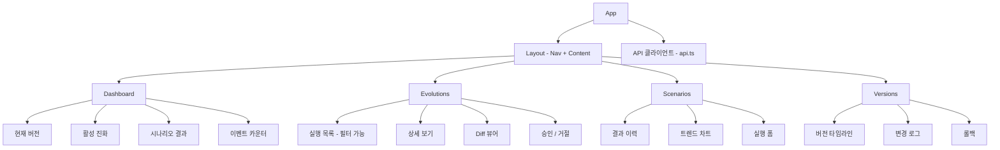

# Evolution Engine UI

> **[English Version](./README.md)**

**자가 진화 웹 자동화 엔진**의 대시보드입니다. 진화 사이클, 시나리오 실행, 버전 관리, 실시간 시스템 이벤트를 한눈에 모니터링할 수 있습니다.

**React 19.2.0 + TypeScript 5.9.3 + Vite 7.3.1 + Tailwind CSS 4.2.1**로 구축되었으며, FastAPI 백엔드(포트 8000)와 통신합니다. 인디고 색상 계열의 다크 테마를 사용하고, Server-Sent Events(SSE)를 통해 실시간 업데이트를 제공합니다.

---

## 컴포넌트 / 페이지 트리



---

## 사전 요구사항 및 설정

### 사전 요구사항

- Node.js 18+
- npm 9+

### 백엔드 실행

UI를 사용하려면 FastAPI 백엔드가 실행 중이어야 합니다.

```bash
cd /path/to/web-agentic
pip install -e ".[server]"
python scripts/start_server.py  # localhost:8000
```

### UI 설치 및 실행

```bash
cd evolution-ui
npm install

# 개발 서버 실행
npm run dev  # localhost:5173
```

Vite 개발 서버가 `/api/*` 요청을 백엔드로 자동 프록시합니다.

---

## 페이지

### Dashboard (`src/pages/Dashboard.tsx`)

시스템 현황을 한눈에 파악할 수 있는 개요 페이지로, 네 개의 통계 카드를 제공합니다.

- **현재 버전** 배지: 최신 배포 버전 표시
- **활성 진화** 수: 색상별 상태 배지 (pending, analyzing, generating, testing, awaiting_approval, merged, rejected, failed)
- **최근 시나리오 결과**: 단계별 진행률과 비용 포함 성공/실패 비율
- **평균 비용**: 전체 시나리오 트렌드에서 산출한 평균 비용

추가 섹션:

- 활성 진화 실행 목록 (트리거 사유, 상태 표시). Evolutions 상세 페이지로의 빠른 네비게이션 링크 포함
- 최근 시나리오 결과 (시나리오명, 단계 진행률, 비용, 성공/실패 상태)
- 시나리오 트렌드 개요 (성공률 진행 바)
- 네비게이션 바의 실시간 SSE 이벤트 카운터 및 이벤트 로그 (이벤트 타입, 타임스탬프, 페이로드)

새로운 SSE 이벤트 수신 시 데이터가 자동으로 갱신됩니다.

### Evolutions (`src/pages/Evolutions.tsx`)

진화 실행의 전체 생애주기를 관리하는 페이지입니다.

- 좌측 패널에 **진화 실행 목록** (클릭하여 상세 보기)
- **상태 배지** (색상 구분):
  - `pending` (회색), `analyzing` (파랑), `generating` (보라), `testing` (노랑)
  - `awaiting_approval` (주황), `approved` (초록), `merged` (초록), `rejected` (빨강), `failed` (빨강)
- **Trigger Evolution** 버튼으로 수동 진화 사이클 시작
- 우측 **상세 패널**:
  - 실행 ID, 상태, 트리거 사유
  - 분석 요약 (있는 경우)
  - 에러 메시지 (빨간색 강조)
  - 브랜치 이름
  - 변경사항 목록: 파일 경로, 변경 타입 배지 (create/modify/delete), 설명, 인라인 diff 내용
- **Approve & Merge** / **Reject** 버튼: `awaiting_approval` 상태일 때만 표시

### Scenarios (`src/pages/Scenarios.tsx`)

시나리오 실행 및 트렌드 분석 페이지입니다.

- **Run Scenarios** 버튼: 기본 설정(헤드리스 모드, 최대 비용 $0.50)으로 시나리오 실행
- **성공 트렌드** 섹션 (시나리오별 카드):
  - 성공률 (색상별 진행 바: 초록 >= 80%, 노랑 >= 50%, 빨강 < 50%)
  - 총 실행 횟수
  - 평균 비용 (USD)
  - 평균 실행 시간 (초)
- **결과 이력** 테이블 컬럼:
  - 시나리오명, 성공/실패 상태, 완료 단계 수, 비용, 실행 시간, 버전, 타임스탬프
- SSE를 통한 실행 중 실시간 진행 업데이트

### Versions (`src/pages/Versions.tsx`)

버전 타임라인 및 롤백 관리 페이지입니다.

- 좌측 패널의 **버전 타임라인**:
  - 버전 번호 (활성 버전에 "(current)" 표시)
  - 생성 타임스탬프
  - 이전 버전 참조
- 우측 **상세 패널**:
  - 버전 번호 및 Git 태그
  - 이전 버전, Git 커밋 해시, 원본 진화 실행 ID, 생성 일시
  - 전체 변경 로그 내용
- **롤백** 버튼 (확인 다이얼로그 포함, 현재 버전이 아닌 경우에만 표시)
- 페이지 헤더에 현재 버전 표시

---

## API 클라이언트 (`src/api.ts`)

모든 백엔드 엔드포인트에 대한 타입 안전 래퍼로, 중앙 집중식 에러 처리를 제공합니다.

### 주요 인터페이스

| 인터페이스 | 설명 |
|-----------|------|
| `EvolutionRun` | 진화 실행 요약 (id, status, trigger_reason, branch_name, 타임스탬프) |
| `EvolutionDetail` | 확장된 실행 데이터 (trigger_data, base_commit, changes 배열 포함) |
| `EvolutionChange` | 개별 파일 변경 (file_path, change_type, diff_content, description) |
| `ScenarioResult` | 시나리오 실행 결과 (success, steps, cost, tokens, wall_time) |
| `ScenarioTrend` | 시나리오 집계 통계 (success_rate, avg_cost, avg_time) |
| `VersionRecord` | 버전 항목 (version, changelog, git_tag, git_commit, evolution_run_id) |
| `StatusResponse` | 범용 API 응답 (status, message, data) |

### 엔드포인트 그룹

- **`evolution.*`** -- trigger, list, get, getDiff, approve, reject
- **`scenarios.*`** -- run, results, trends
- **`versions.*`** -- list, current, get, rollback

### SSE 구독

`subscribeSSE(handler)` 함수는 `/api/progress/stream`에 연결하여 세 가지 이벤트 타입을 수신합니다:
- `evolution_status` -- 진화 실행 상태 변경
- `scenario_progress` -- 시나리오 실행 업데이트
- `version_created` -- 새 버전 생성 알림

브라우저 네이티브 `EventSource` API가 연결 끊김 시 자동 재연결을 처리합니다.

---

## 개발 명령어

| 명령어 | 설명 |
|--------|------|
| `npm run dev` | 개발 서버 실행 (localhost:5173) |
| `npm run build` | 프로덕션 빌드 (`tsc -b && vite build`) |
| `npm run lint` | ESLint 실행 |
| `npm run preview` | 프로덕션 빌드 미리보기 |

---

## 설정

### Vite 프록시

`vite.config.ts`에 정의:

- `/api/*` 및 `/health` 요청이 `http://localhost:${VITE_API_PORT || 8000}`으로 프록시됨

### 환경 변수

| 변수 | 기본값 | 설명 |
|------|--------|------|
| `VITE_API_PORT` | `8000` | Vite 개발 서버 프록시의 백엔드 API 포트 |

### 스타일링

Tailwind CSS v4를 `@tailwindcss/vite` 플러그인과 함께 사용합니다. 다크 테마(`bg-gray-950` 기반)에 인디고 계열 색상을 네비게이션과 인터랙티브 요소에 적용합니다.

### 라우팅

React Router DOM v7을 사용한 클라이언트 사이드 라우팅 (4개 라우트):

| 경로 | 컴포넌트 |
|------|----------|
| `/` | Dashboard |
| `/evolutions` | Evolutions |
| `/scenarios` | Scenarios |
| `/versions` | Versions |

---

## 기술 스택

| 기술 | 버전 | 용도 |
|------|------|------|
| React | 19.2.0 | UI 프레임워크 |
| TypeScript | ~5.9.3 | 타입 안전성 |
| Vite | 7.3.1 | 빌드 도구 및 개발 서버 |
| Tailwind CSS | 4.2.1 | 유틸리티 기반 스타일링 |
| React Router DOM | 7.13.1 | 클라이언트 사이드 라우팅 |
| react-diff-viewer-continued | 4.1.2 | 진화 변경사항의 코드 diff 표시 |
