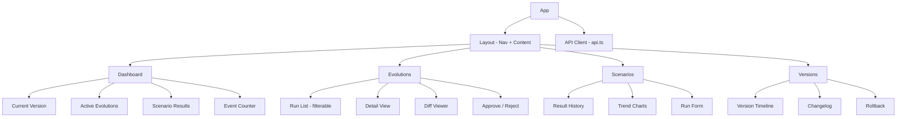

# Evolution Engine UI

> **[한국어 버전 (Korean)](./README.ko.md)**

Dashboard for the **Self-Evolving Web Automation Engine**. Provides real-time visibility into evolution cycles, scenario execution, version management, and live system events.

Built with **React 19.2.0 + TypeScript 5.9.3 + Vite 7.3.1 + Tailwind CSS 4.2.1**. Communicates with the FastAPI backend on port 8000. Features a dark theme with indigo accents and real-time updates via Server-Sent Events (SSE).

---

## Component / Page Tree



---

## Prerequisites and Setup

### Prerequisites

- Node.js 18+
- npm 9+

### Start the Backend

The UI requires the FastAPI backend to be running.

```bash
cd /path/to/web-agentic
pip install -e ".[server]"
python scripts/start_server.py  # localhost:8000
```

### Install and Run the UI

```bash
cd evolution-ui
npm install

# Start dev server
npm run dev  # localhost:5173
```

The Vite dev server proxies all `/api/*` requests to the backend automatically.

---

## Pages

### Dashboard (`src/pages/Dashboard.tsx`)

At-a-glance system overview providing four stat cards:

- **Current Version** badge showing the latest deployed version
- **Active Evolutions** count with color-coded status badges (pending, analyzing, generating, testing, awaiting_approval, merged, rejected, failed)
- **Recent Scenario Results** showing pass/fail ratio with per-step breakdowns and cost
- **Average Cost** computed across all scenario trends

Additional sections include:

- Active evolution runs with trigger reason and status, with quick navigation links to the Evolutions detail page
- Recent scenario results showing scenario name, step progress, cost, and pass/fail status
- Scenario trend overview with success rate progress bars
- Real-time SSE event counter in the navbar, with a live event log showing event type, timestamp, and payload

Data auto-refreshes whenever a new SSE event is received.

### Evolutions (`src/pages/Evolutions.tsx`)

Full lifecycle management for evolution runs.

- **Run list** on the left panel with all evolution runs, clickable to view details
- **Status badges** with distinct colors:
  - `pending` (gray), `analyzing` (blue), `generating` (purple), `testing` (yellow)
  - `awaiting_approval` (orange), `approved` (green), `merged` (green), `rejected` (red), `failed` (red)
- **Trigger Evolution** button to manually start a new evolution cycle
- **Detail panel** on the right showing:
  - Run ID, status, and trigger reason
  - Analysis summary (when available)
  - Error messages (highlighted in red)
  - Branch name
  - List of changes with file path, change type badge (create/modify/delete), description, and inline diff content
- **Approve & Merge** / **Reject** buttons visible only when status is `awaiting_approval`

### Scenarios (`src/pages/Scenarios.tsx`)

Scenario execution and trend analysis.

- **Run Scenarios** button to trigger scenario execution with default settings (headless mode, $0.50 max cost)
- **Success Trends** section with cards per scenario showing:
  - Success rate (percentage with color-coded progress bar: green >= 80%, yellow >= 50%, red < 50%)
  - Total run count
  - Average cost (USD)
  - Average execution time (seconds)
- **Results History** table with columns:
  - Scenario name, pass/fail status, steps completed, cost, wall time, version, and timestamp
- Real-time progress updates during execution via SSE

### Versions (`src/pages/Versions.tsx`)

Version timeline and rollback management.

- **Version timeline** on the left panel showing all recorded versions with:
  - Version number with "(current)" indicator for the active version
  - Creation timestamp
  - Previous version reference
- **Detail panel** on the right showing:
  - Version number and git tag
  - Previous version, git commit hash, originating evolution run ID, and creation date
  - Full changelog content
- **Rollback** button with confirmation dialog (visible for non-current versions)
- Current version displayed in the page header

---

## API Client (`src/api.ts`)

Type-safe wrapper for all backend endpoints with centralized error handling.

### Key Interfaces

| Interface | Description |
|-----------|-------------|
| `EvolutionRun` | Evolution run summary (id, status, trigger_reason, branch_name, timestamps) |
| `EvolutionDetail` | Extended run data including trigger_data, base_commit, and changes array |
| `EvolutionChange` | Individual file change (file_path, change_type, diff_content, description) |
| `ScenarioResult` | Scenario execution result (success, steps, cost, tokens, wall_time) |
| `ScenarioTrend` | Aggregated scenario statistics (success_rate, avg_cost, avg_time) |
| `VersionRecord` | Version entry (version, changelog, git_tag, git_commit, evolution_run_id) |
| `StatusResponse` | Generic API response (status, message, data) |

### Endpoint Groups

- **`evolution.*`** -- trigger, list, get, getDiff, approve, reject
- **`scenarios.*`** -- run, results, trends
- **`versions.*`** -- list, current, get, rollback

### SSE Subscription

`subscribeSSE(handler)` connects to `/api/progress/stream` and listens for three event types:
- `evolution_status` -- evolution run state changes
- `scenario_progress` -- scenario execution updates
- `version_created` -- new version notifications

The browser-native `EventSource` API handles automatic reconnection on connection loss.

---

## Development Commands

| Command | Description |
|---------|-------------|
| `npm run dev` | Start dev server (localhost:5173) |
| `npm run build` | Build for production (`tsc -b && vite build`) |
| `npm run lint` | Run ESLint |
| `npm run preview` | Preview production build |

---

## Configuration

### Vite Proxy

Defined in `vite.config.ts`:

- `/api/*` and `/health` are proxied to `http://localhost:${VITE_API_PORT || 8000}`

### Environment Variables

| Variable | Default | Description |
|----------|---------|-------------|
| `VITE_API_PORT` | `8000` | Backend API port for the Vite dev server proxy |

### Styling

Tailwind CSS v4 with the `@tailwindcss/vite` plugin. The UI uses a dark theme (`bg-gray-950` base) with indigo accent colors for navigation and interactive elements.

### Routing

React Router DOM v7 provides client-side routing with four routes:

| Path | Component |
|------|-----------|
| `/` | Dashboard |
| `/evolutions` | Evolutions |
| `/scenarios` | Scenarios |
| `/versions` | Versions |

---

## Tech Stack

| Technology | Version | Purpose |
|-----------|---------|---------|
| React | 19.2.0 | UI framework |
| TypeScript | ~5.9.3 | Type safety |
| Vite | 7.3.1 | Build tool and dev server |
| Tailwind CSS | 4.2.1 | Utility-first styling |
| React Router DOM | 7.13.1 | Client-side routing |
| react-diff-viewer-continued | 4.1.2 | Code diff display for evolution changes |
